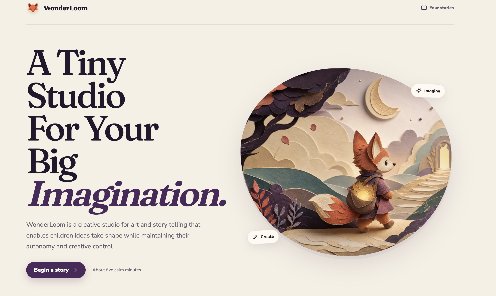
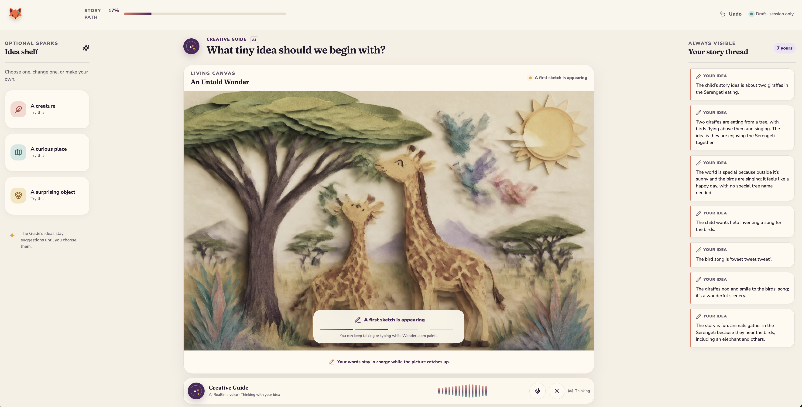
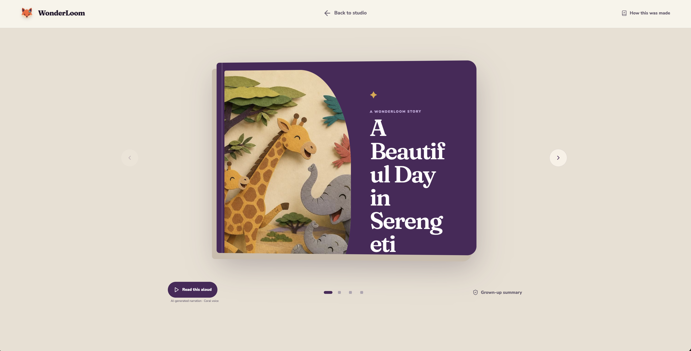
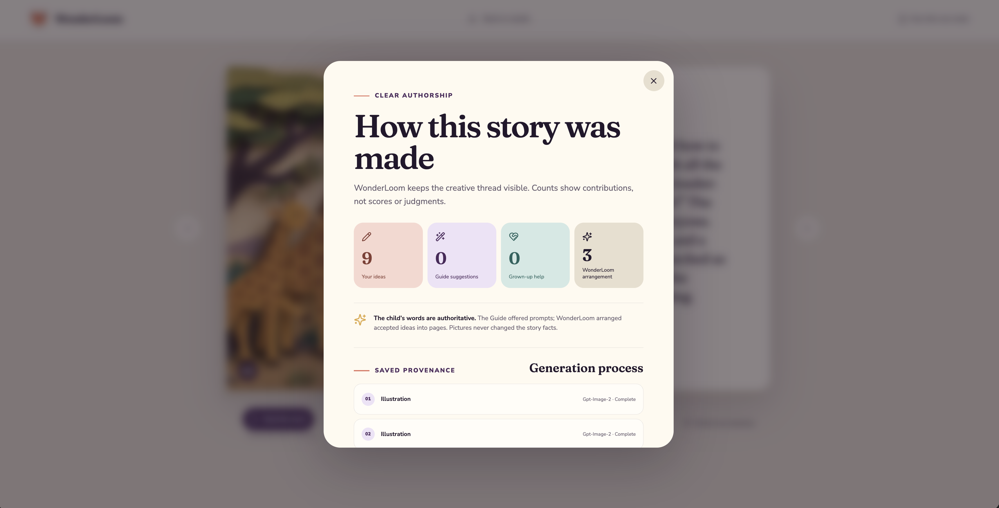
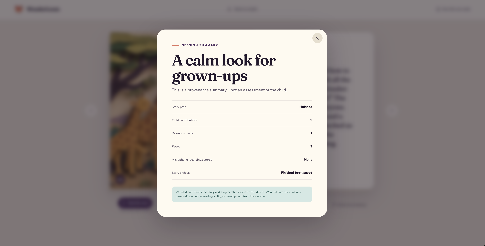
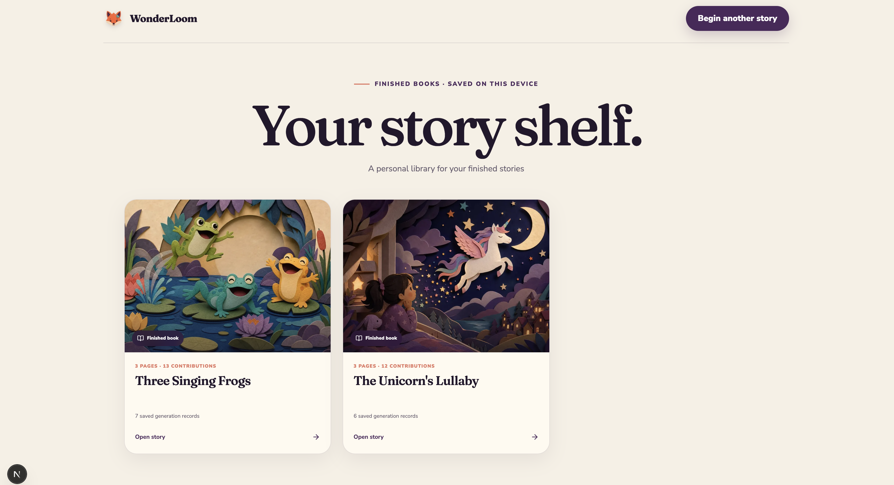

# **WonderLoom: A tiny studio for big imagination**

[](https://youtu.be/dgalteGw8Es)
[](https://nextjs.org/)
[](https://developers.openai.com/)
[](reports/README.md)
[](LICENSE)

WonderLoom is a child-led creative studio for making a short illustrated and
narrated story with an AI Creative Guide. Children speak or type an idea, watch
it take shape, change what they see, decide what happens next, name the book,
and keep the finished story on their own device.

The AI reflects, asks, arranges, illustrates, and narrates. The child remains
the author.

> **What if AI could help children express their imagination without taking
> authorship away from them?**



**Video walkthrough:** [https://youtu.be/dgalteGw8Es](https://youtu.be/dgalteGw8Es)

This repository is intentionally documented as a **local application**. It
contains no hosted deployment configuration, committed credentials, child
profiles, analytics integration, or generated story data.

## What This Repository Contains

- [`src`](src): the Next.js application, typed story state, OpenAI routes,
  Realtime voice client, creative tools, safety checks, illustration pipeline,
  narration, local archive, and user interface.
- [`public/images`](public/images): the fox identity, paper-cut interface art,
  and static application assets.
- [`image-assets`](image-assets): six product screenshots showing the experience
  from the welcome page to the finished-story library.
- [`docs`](docs): the product specification, architecture, local setup, safety
  model, research translation, image pipeline, archive contract, animation
  review, and verification record.
- [`research`](research): the 13 research PDFs reviewed before implementation.
- [`reports`](reports): 26 serial paper, repository, and OpenAI documentation
  reports, plus their source and coverage indexes.
- [`e2e`](e2e): Playwright journeys for responsive layout, reduced motion,
  Realtime voice, and saved-book behavior.
- [`src/**/*.test.ts`](src): Vitest coverage for story state, persistence,
  safety routing, streaming events, and client behavior.
- [`brand.md`](brand.md): WonderLoom's visual language, identity, typography,
  palette, materials, and motion principles.

## Inspiration

Children are naturally creative, full of imagination and wonder. Yet many
digital products designed for children are optimized for consumption. They
compete for attention through endless feeds, passive entertainment, and highly
stimulating experiences.

Many generative AI products unintentionally reproduce the same pattern: a child
provides a short prompt, the system generates the finished result, and the child
becomes a spectator to the AI's creativity.

WonderLoom explores another relationship:

> **An agentic canvas for creative expression that preserves autonomy and
> self-direction.**

It is a multimodal creative canvas where children can imagine, develop,
illustrate, narrate, and revise their own stories. The Creative Guide asks
questions, remembers accepted ideas, organizes the narrative, illustrates the
child's decisions, and helps turn imagination into something visible. It does
not decide what the story should become.

## Our Thesis

WonderLoom is not an AI story generator. It is an experiment in designing
creative interfaces for an intelligence-augmentation future.

As models become capable of producing polished text, images, music, software,
and video, the important question is not only:

> What can AI create?

It is also:

> What can AI help a person become capable of creating?

The most valuable creative systems should help people develop ideas, make
decisions, exercise judgment, revise their work, and build confidence in their
own creative abilities. This matters especially in childhood, while
imagination, taste, curiosity, confidence, and creative identity are still
forming.

WonderLoom therefore treats AI as a **creative material and collaborator**, not
an autonomous author. The child's contributions are canonical. Suggestions
remain optional. Established facts cannot be silently rewritten. Every
meaningful decision remains visible, attributable, editable, and undoable.

## The Experience

A grown-up begins with a lightweight setup: age band, reading mode, and whether
the microphone may be used. The setup creates no child account or profile.

The child then meets the Creative Guide, which introduces one playful question
at a time:

- Who should the hero be?
- What makes them different?
- Where do they live?
- What do they want?
- What problem do they face?
- What should happen next?

The child can answer through voice or text, choose an optional spark, reject a
suggestion, revise a detail, or invent a different direction. Every accepted
contribution appears in the story thread.

The creative loop is deliberately small:

1. **Imagine** — contribute an idea.
2. **See** — watch the idea appear on the living canvas.
3. **Respond** — answer one focused follow-up question.
4. **Revise** — change, expand, reject, or undo part of the story.
5. **Create** — arrange the accepted decisions into three editable pages.
6. **Finish** — give the book a title and save the completed story locally.

The result is not generated from a single prompt. It is constructed through a
sequence of decisions made by the child.

### A living canvas, not a spinner

Image generation is slower than voice and text, so WonderLoom makes the waiting
state part of the creative experience. The canvas warms, a rough image appears,
color arrives, details sharpen, and the final illustration settles into place.
Voice and text remain usable while the image develops.



The illustration remains subordinate to the story state. If a picture disagrees
with the child's words, the words win.

### A book the child can still change

Once enough story decisions exist, WonderLoom arranges exactly three editable
pages. The child chooses the title after the pages are ready. The title and page
text can still be revised before or after finishing.



The **Read this aloud** control uses a separate narration model and Coral voice.
This keeps live conversation interruptible while finished-book narration stays
consistent and repeatable.

### Authorship stays visible

WonderLoom keeps a provenance record rather than presenting the finished output
as if it appeared from nowhere. The summary distinguishes child ideas, optional
guide suggestions, grown-up assistance, system arrangement, revisions, model
calls, images, and narration.

<table>
  <tr>
    <td width="50%"></td>
    <td width="50%"></td>
  </tr>
</table>

Only a titled, complete, explicitly finished three-page book appears in the
local library. Drafts never masquerade as finished work.



## The Agency Contract

The agency contract is implemented as application behavior, not only prompt
language:

- Every contribution has an author, kind, timestamp, and acceptance state.
- The Creative Guide asks one focused question at a time.
- Suggestions remain provisional until the child chooses or revises them.
- Story tools make narrow, typed changes instead of replacing the whole story.
- The canonical story state outranks generated prose and image details.
- Reject, skip, revise, interrupt, and undo are normal creative actions.
- Major plot facts must originate with the child.
- The model cannot assign a final title; the child supplies it directly.
- A stale illustration cannot overwrite a newer creative decision.
- A story enters the library only after explicit finalization and a completeness
  check.

These rules turn the philosophical goal—creative autonomy—into constraints that
can be inspected and tested.

## Technical Architecture

WonderLoom is a Next.js 16 App Router application written in React and
TypeScript. It uses Zod at model and API boundaries, the OpenAI JavaScript SDK
for text, images, narration, and moderation, and the OpenAI Agents SDK for the
browser Realtime session.

```mermaid
flowchart LR
    Child["Child: voice or text"] --> UI["WonderLoom studio"]
    Adult["Adult setup"] --> UI

    UI -->|typed contribution| Turn["Turn API"]
    Turn --> Safety["PII rules + moderation"]
    Safety --> Planner["Structured story planner"]
    Planner --> State["Canonical WonderSession"]

    UI -->|request ephemeral credential| Token["Realtime token route"]
    Token --> Voice["Realtime Creative Guide over WebRTC"]
    Voice -->|typed tools| State

    State --> Director["Visual intent: wait / reveal / transform / advance"]
    Director --> Image["Streaming image generation or edit"]
    Image -->|sketch / color / details / final| Canvas["Living canvas"]

    State --> Pages["Three-page composition"]
    Pages --> Title["Child-selected title"]
    Title --> Finish["Completeness gate"]
    Finish --> Archive["Local finished-story archive"]
    Archive --> TTS["Coral story narration"]
```



The [architecture document](docs/architecture.md) traces these paths at route,
state, storage, and failure-boundary level.

### Typed story state

The application moves through six phases:

```text
seed → reveal → edit → transform → pages → finished
```

`StoryState` records the title, hero, defining detail, world, goal, challenge,
next beat, ending, contributions, pages, illustration status, guide question,
suggestions, story revision, and image revision. `WonderSession` adds setup,
bounded undo history, generation records, safety identifier, timestamps, and an
explicit completion timestamp.

Every model call produces or consumes a narrow part of this state. The model
does not receive permission to rewrite the complete project.

### Structured story planning

The story planner does not receive an unrestricted “write a story” request. For
each contribution it returns a typed plan containing:

- a short reflection of the child's contribution;
- one focused next question;
- up to three optional sparks;
- one narrow story-state patch;
- the next valid phase;
- a visual intent and prompt when an image update is justified; and
- a boolean indicating whether enough child-authored material exists to arrange
  pages.

Only after the canonical state contains sufficient child decisions does the
composer arrange the material into three pages.

### Realtime voice

Live voice uses the OpenAI Agents SDK and WebRTC. The browser requests a
short-lived Realtime client credential from a server route; the long-lived
OpenAI key never enters browser code.

The Realtime Creative Guide supports:

- speech-to-speech interaction;
- semantic voice activity detection;
- interruption while the guide is speaking;
- microphone transcription without retaining raw audio;
- explicit connecting, listening, thinking, speaking, muted, and blocked states;
- live multiband audio visualization; and
- typed tools for contributions, narrow state updates, illustration requests,
  page composition, finalization, and undo.

Spoken and typed contributions therefore pass through the same canonical state
and authorship rules.

### Progressive illustration

The image endpoint returns newline-delimited JSON rather than waiting for one
large response. It can emit:

```text
started → partial:sketch → partial:color → partial:details → complete
```

The final image enters canonical story state. Partial images remain attached to
the generation record so the emergence of the illustration is inspectable.

Each image job receives a job revision. When a slower, older request finishes,
its revision is compared with the current job. A stale result is discarded
instead of overwriting the child's newer direction.

See [Progressive image pipeline](docs/progressive-image-pipeline.md).

### Finished-story archive

Local runtime storage has two separate roles:

- `public/generated/<session-id>/` stores generated images and MP3 narration.
- `data/wonderloom/sessions/<session-id>.json` stores verified finished books.

Active drafts remain in server memory and are not library entries. A finished
book must have a child-confirmed non-placeholder title, exactly three ready
pages with non-empty text, the `finished` phase, and an explicit successful
finalization action.

Writes use a same-directory temporary file and atomic rename. Narration cache
keys include the model, voice, exact text, and scene instructions, so revised
text receives fresh audio while unchanged text reuses its MP3.

See [Story archive and generation provenance](docs/story-archive.md).

## OpenAI Models Used

| Model | Role | Product decision |
|---|---|---|
| `gpt-5.6-luna` | Structured story planning and three-page composition | Produces constrained creative plans instead of an unrestricted finished story. |
| `gpt-realtime-2.1-mini` with `marin` | Live Creative Guide | Provides low-latency speech, interruption, semantic turn detection, transcription coordination, and tool use. |
| `gpt-4o-mini-transcribe` | Microphone transcription | Creates contribution text while raw microphone audio is not stored. |
| `gpt-image-2` | Illustration generation and editing | Streams partial images and revises an existing scene instead of replacing it with an unrelated result. |
| `gpt-4o-mini-tts` with `coral` | Finished-book narration | Produces energetic, sympathetic, scene-aware narration cached by exact story revision. |
| `omni-moderation-latest` | Safety boundary | Screens child input, visual prompts, and model output at important boundaries. |

Model identifiers and API surfaces evolve. Check the current official OpenAI
documentation before adapting this prototype.

## Safety, Privacy, and Child-Centered Boundaries

WonderLoom is a research-informed prototype, not a claim of regulatory
certification. Its implementation nevertheless treats child safety and privacy
as system boundaries:

- Adult confirmation is required before opening the studio.
- The guide identifies itself as an AI creative tool, not a friend, therapist,
  teacher, parent, or authority.
- Prompts prohibit requests for real names, schools, addresses, locations,
  contact details, and secrets.
- Deterministic checks catch common private-information and immediate-danger
  patterns before model processing.
- OpenAI moderation checks important child-input and model-output boundaries.
- Immediate-danger language pauses the creative flow and directs the child to a
  trusted adult or local emergency services.
- The system does not infer personality, reading ability, emotional state, or
  development from a session.
- Raw microphone recordings are not stored.
- There are no child accounts, social features, analytics, engagement streaks,
  or recommendation feeds.
- Only explicitly finished stories are saved locally.
- Real credentials and generated stories are excluded from Git.

Read [Safety and privacy](docs/safety-and-privacy.md) for the trust boundaries,
data lifecycle, limitations, and production gaps.

## Local Development

### Prerequisites

- Node.js 22 or newer
- npm
- An OpenAI API key with access to the models listed above
- A modern browser with WebRTC and Web Audio support
- A microphone if you want to test voice; typing remains available without one

API calls for story planning, moderation, Realtime voice, images, and narration
can incur usage charges.

### 1. Clone and install

```bash
git clone https://github.com/Alfaxad/WonderLoom.git
cd WonderLoom
npm install
```

### 2. Configure the server-side key

```bash
cp .env.example .env.local
```

Edit `.env.local`:

```dotenv
OPENAI_API_KEY=your-openai-api-key
```

Never use a `NEXT_PUBLIC_` prefix for this key. Next.js exposes variables with
that prefix to browser code.

### 3. Start WonderLoom

```bash
npm run dev -- --hostname 127.0.0.1 --port 3000
```

Open [http://127.0.0.1:3000](http://127.0.0.1:3000).

The first screen is adult setup. Enable the microphone only when the browser is
allowed to use it. If voice is unavailable, the complete story path remains
usable through typing.

### 4. Run the checks

```bash
npm run typecheck
npm run lint
npm test
npm run build
```

For browser tests, install Chromium once, keep the development server running,
and execute:

```bash
npx playwright install chromium
npm run test:e2e
```

The detailed setup, data-reset, troubleshooting, and test instructions live in
[Local development](docs/local-development.md).

## Local Data and Resetting the Prototype

WonderLoom creates local runtime artifacts only after it runs:

```text
data/wonderloom/sessions/   # finished story JSON
public/generated/          # generated illustrations and narration
```

Both paths are gitignored. To begin with an empty local library, stop the server
and remove the contents of those two directories. Do not remove `public/images`,
which contains application artwork.

Because the prototype has no user accounts, anyone using the same local server
process and filesystem can access its finished-story shelf. Do not expose the
development server to an untrusted network.

## Project Structure

```text
WonderLoom/
├── docs/                    # Product, architecture, safety, and engineering docs
├── e2e/                     # Playwright user journeys
├── image-assets/            # README product screenshots
├── public/
│   └── images/              # Static brand and interface artwork
├── reports/                 # 26 comprehensive research/source reports
├── research/                # 13 source research PDFs
├── src/
│   ├── app/                 # Pages and server API routes
│   ├── client/              # API client, local UI store, Realtime hook
│   ├── components/          # Studio, canvas, storybook, voice, and provenance UI
│   ├── lib/                 # Types, schemas, model constants, story-state rules
│   └── server/              # OpenAI, prompts, safety, media, and session state
├── .env.example             # Safe environment template
├── brand.md                 # Visual design system
├── package.json             # Scripts and dependencies
└── README.md
```

## Research and Design Foundations

Before implementation, the project used Codex and GPT-5.6 to conduct a focused
review of child–AI co-creativity, collaborative storytelling, child-computer
interaction, parental trust, multimodal interfaces, safe conversational design,
and relevant open-source systems.

The repository contains the full evidence trail:

- **13 source PDFs** in [`research`](research)
- **13 paper analyses** in [`reports/01…13`](reports/README.md#paper-to-report-index)
- **7 source-level repository studies** in
  [`reports/14…20`](reports/README.md#requested-repository-analyses)
- **6 official OpenAI guide analyses** in
  [`reports/21…26`](reports/README.md#official-openai-developer-guide-analyses)
- **107,917 words of report body** across the 26 reports

The research most strongly supported five product choices:

1. Bound the AI's role and scaffold specific child contributions.
2. Separate ideation, story construction, visual creation, and narration.
3. Keep child decisions visible and correctable.
4. Treat parents as configurable guardians rather than invisible background
   users or mandatory co-authors.
5. Avoid treating attractive output or short-term engagement as evidence of
   learning, creativity, resilience, or safety.

[Research to product](docs/research-to-product.md) explains how these findings
became concrete interaction rules and technical constraints. The
[reports index](reports/README.md) distinguishes paper evidence from author
claims and records source-level validation for each reviewed repository.

### Selected foundations

- [Tinker Tales: Interactive Storytelling Framework for Early Childhood Narrative Development and AI Literacy](https://arxiv.org/abs/2504.13969)
- [Tinker Tales: Supporting Child–AI Collaboration through Co-Creative Storytelling with Educational Scaffolding](https://arxiv.org/abs/2602.04109)
- [StoryPrompt: Exploring the Design Space of an AI-Empowered Creative Storytelling System for Elementary Children](https://dl.acm.org/doi/10.1145/3613905.3651118)
- [Connection Is All You Need: A Multimodal Human–AI Co-Creation Storytelling System](https://arxiv.org/abs/2405.06495)
- [StoryBuddy: Parent–Child Interactive Storytelling with Flexible Parental Involvement](https://arxiv.org/abs/2202.06205)
- [OpenAI Under-18 API Guidance](https://developers.openai.com/api/docs/guides/safety-checks/under-18-api-guidance)

## How We Collaborated With Codex

Codex accelerated research, product definition, engineering, design iteration,
testing, and debugging. It did not determine the product thesis.

The human decisions remained central:

- prioritize creative autonomy over maximum generation;
- use storytelling as the first expression of a broader creative canvas;
- avoid companion-like and attention-maximizing behavior;
- keep the interface calm and non-overstimulating;
- make child contributions and AI assistance visibly distinct;
- delay page composition until enough child-authored information exists;
- treat image latency as part of the experience;
- separate live conversation from final narration; and
- minimize retained data.

Codex helped convert those decisions into a typed state machine, constrained
model outputs, Realtime tools, image-job revisions, safety boundaries, local
persistence, responsive UI, reduced-motion behavior, tests, and documentation.

The most useful collaboration loop was concrete and inspectable:

1. observe a product or technical failure;
2. trace it across UI, API, model output, state, storage, and runtime;
3. implement the narrow correction;
4. verify with static checks, tests, browser interaction, and live model calls;
5. document the resulting contract.

## Challenges and Lessons

### Preserving agency while using powerful models

A model can generate a polished story from a single sentence. That capability
is useful, but using it immediately would defeat WonderLoom's purpose. Agency
had to be encoded through structured outputs, narrow tools, visible
contributions, optional suggestions, explicit title selection, and a finished
book gate.

### Synchronizing systems that run at different speeds

Voice must feel immediate. Structured text planning takes longer. Images are
slow and asynchronous. Narration belongs to the completed artifact. Canonical
state, explicit generation statuses, abortable streams, and revision checks let
these systems behave as one creative material.

### Making latency feel intentional

A spinner communicates that the application is blocked. Progressive image
stages communicate that the child's idea is taking shape while leaving the
studio usable.

### Designing for children without paternalization

The interface needed to be immediately understandable and playful without
becoming noisy, patronizing, or reward-driven. The final motion system is sparse,
state-bound, interruptible, and reduced-motion safe.

### Treating trust as a system property

Privacy copy is not enough. Raw audio is not archived, child profiles are not
created, secrets remain server-side, suggestions are attributable, and finished
work exposes how it was made. Important production gaps remain documented rather
than hidden.

The central lesson is simple:

> **Creative autonomy must be a conscious systems-design choice.**

## Future Direction

WonderLoom begins with storytelling, but the idea is larger: a child should be
able to describe a world, draw part of it, move its characters, change its
rules, give it sound, and transform it into a story, comic, animation, game, or
a form that does not yet have a familiar name.

The child should not need to understand prompting or professional creative
software. They should need imagination, judgment, and the freedom to change
their mind.

As AI becomes abundant, the future of creativity should not be full automation.
It should be augmentation: AI helping more people, starting with children,
discover what they are capable of creating.

## Documentation

Start with the [documentation index](docs/README.md), or open a specific record:

- [Product experience and technical specification](docs/Wonderloom_Product_Experience_and_Technical_Spec.md)
- [Technical architecture](docs/architecture.md)
- [Local development](docs/local-development.md)
- [Safety and privacy](docs/safety-and-privacy.md)
- [Research to product](docs/research-to-product.md)
- [Build-week product contract](docs/build-brief.md)
- [Progressive image pipeline](docs/progressive-image-pipeline.md)
- [Story archive and generation provenance](docs/story-archive.md)
- [Animation review](docs/animation-review.md)
- [Verification record](docs/verification.md)
- [Brand system](brand.md)

## Project Status

WonderLoom is a completed build-week prototype and research artifact. It is
suitable for local exploration and further development, not unsupervised public
deployment. Before production use with children, complete jurisdiction-specific
legal review, identity and consent design, abuse monitoring, retention controls,
access control, incident response, evaluation with children and caregivers, and
ongoing safety testing.

## License and Research Materials

WonderLoom source code is released under the [MIT License](LICENSE).

The papers in [`research`](research) and any third-party names, diagrams, or
linked projects retain their original copyrights and licenses. Their inclusion
does not relicense them under MIT. The analytical reports are provided as
research notes; consult the original sources before relying on a claim.

## Citation

If you reference the software or its design thesis, cite the repository:

```bibtex
@software{wonderloom2026,
  author = {Alfaxad Eyembe},
  title = {WonderLoom: A Tiny Studio for Big Imagination},
  year = {2026},
  url = {https://github.com/Alfaxad/WonderLoom},
  note = {A child-led multimodal creative studio for human-AI co-creation}
}
```
