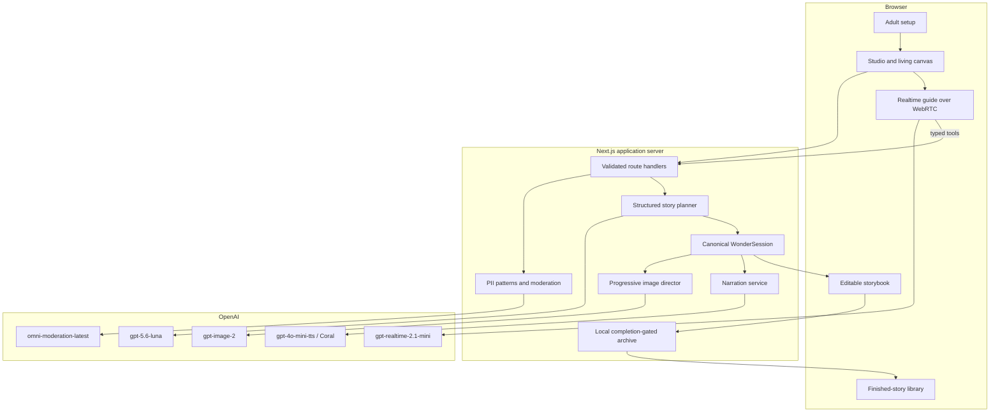

# WonderLoom Architecture

## Purpose and system boundary

WonderLoom is a local-first Next.js web application for child-led, multimodal
story creation. Its architecture is designed around one invariant: model output
may assist, reflect, arrange, illustrate, or narrate, but it may not silently
replace the child's canonical decisions.

The repository contains one application process and no separate database,
queue, account service, analytics service, or remote object store. The browser
hosts the creative interface and Realtime media connection. Next.js route
handlers own OpenAI credentials, validate requests, apply safety checks, mutate
canonical state, and persist only completed books and generated assets locally.

## Component map



## Canonical state and invariants

`WonderSession` combines setup preferences, `StoryState`, bounded undo history,
generation records, timestamps, a non-identifying safety identifier, and an
explicit `completedAt` value. `StoryState` contains the child's story facts,
contributions, guide question and optional suggestions, three pages, current
illustration state, and independent story/image revision counters.

The phase machine is:

```text
seed → reveal → edit → transform → pages → finished
```

The important invariants are:

1. Contributions retain author, kind, timestamp, acceptance, and text.
2. Suggestions are not story facts until accepted or rewritten.
3. Mutations are narrow typed patches; a model cannot replace the session.
4. History is captured before meaningful edits, enabling bounded undo.
5. Image work carries a job revision; stale work cannot overwrite newer ideas.
6. Page composition creates exactly three child-editable pages.
7. The title is child-confirmed rather than assigned by the model.
8. Persistence requires three ready pages, a confirmed non-placeholder title,
   the `finished` phase, and explicit finalization.

## Request flows

### 1. Session setup

The browser submits age band, reading mode, voice preference, and adult
confirmation to `POST /api/session`. The server validates the payload, creates a
random session ID and a stable hashed safety identifier, and returns the initial
session. Active drafts live in process memory so an unfinished story does not
appear in the library or survive as a misleading completed artifact.

### 2. Typed creative turn

`POST /api/session/:id/turn` validates the contribution, performs deterministic
private-information and immediate-danger checks, calls OpenAI moderation, then
requests a structured plan from `gpt-5.6-luna`. The plan contains a reflection,
one question, optional sparks, a narrow state patch, a next phase, and a visual
intent. Zod validates the model result before the server applies it.

The route records the child or adult contribution separately from the guide's
reflection. If visual work is justified, the response tells the client to begin
that slower task without blocking the conversational loop.

### 3. Realtime voice interaction

`POST /api/realtime/session` mints a short-lived browser credential for
`gpt-realtime-2.1-mini` with the `marin` conversational voice and
`gpt-4o-mini-transcribe` input transcription. The permanent API key never
enters the browser. The browser connects to OpenAI using WebRTC and exposes a
small set of typed story tools; tool calls return to the local application API,
where normal validation and state rules still apply.

The client supports connecting, listening, thinking, speaking, muted, blocked,
and off states. A compact bar visualizer uses the microphone's frequency data
when available and a restrained state animation otherwise. Voice is optional;
the typed path remains complete.

### 4. Progressive illustration

`POST /api/session/:id/visual` starts an NDJSON stream. The server increments the
visual job revision, records a generation attempt, and requests up to three
partial images followed by a final from `gpt-image-2`. For edits, it supplies the
current locally generated scene as a reference. Each frame is written beneath
`public/generated/<session>/` and emitted as a same-origin URL.

The browser interprets the sequence as sketch, color, details, and final. Before
committing any frame, the server compares the job revision with the session's
current revision. A superseded job resolves as stale instead of painting an old
idea over a newer one. Errors change the visual status to a retryable blocked
state while preserving story text and decisions.

### 5. Page composition, title, and finalization

`POST /api/session/:id/compose` arranges accepted story facts into three pages
using a structured model response. It does not finish the book. Page text may be
changed through the page route. The child then supplies and confirms the title
through the state route. `POST /api/session/:id/finalize` runs the completeness
gate, enters `finished`, adds the completion timestamp, and atomically writes
the session JSON to `data/wonderloom/`.

Only this finalization path creates a library entry. Incomplete sessions and
abandoned drafts remain transient.

### 6. Narration

`POST /api/session/:id/speech` accepts a constrained target such as the cover or
a numbered page. It hashes the source text and checks the generation log for a
matching completed asset. A cache miss calls `gpt-4o-mini-tts` with the Coral
voice and scene-sensitive instructions for energetic, sympathetic story
narration. Audio is stored locally and the response carries an explicit
AI-generated narration disclosure.

## API surface

| Route | Method | Responsibility |
|---|---|---|
| `/api/session` | `POST` | Create a validated local session |
| `/api/session/:id` | `GET`, `DELETE` | Read a session or remove its archive and assets |
| `/api/session/:id/turn` | `POST` | Safety-check and plan a typed creative contribution |
| `/api/session/:id/contribution` | `POST` | Record a narrow contribution from a typed tool |
| `/api/session/:id/state` | `PATCH` | Apply a validated child-directed state change, including title |
| `/api/session/:id/undo` | `POST` | Restore the previous canonical story state |
| `/api/session/:id/visual` | `POST` | Stream progressive image frames and commit the current job |
| `/api/session/:id/compose` | `POST` | Arrange accepted material into three editable pages |
| `/api/session/:id/page` | `PATCH` | Revise a single page without replacing the book |
| `/api/session/:id/finalize` | `POST` | Enforce completion and save the finished book |
| `/api/session/:id/speech` | `POST` | Generate or reuse Coral narration for a constrained target |
| `/api/realtime/session` | `POST` | Mint a short-lived Realtime browser credential |
| `/api/safety/text` | `POST` | Run reusable text safety checks |
| `/api/library` | `GET` | List summaries of completed local books |

## Model responsibilities

| Capability | Model | Boundary |
|---|---|---|
| Structured planning and page composition | `gpt-5.6-luna` | Returns schema-validated plans/pages, never unrestricted state |
| Live voice collaboration | `gpt-realtime-2.1-mini` | Browser WebRTC with ephemeral credentials and typed tools |
| Voice transcription | `gpt-4o-mini-transcribe` | Realtime input transcription |
| Illustration and edits | `gpt-image-2` | Progressive, revision-checked, locally persisted assets |
| Finished-book narration | `gpt-4o-mini-tts`, `coral` | Targeted, cached audio with disclosure |
| Content classification | `omni-moderation-latest` | One layer in a larger input-safety path |

Model identifiers reflect the build's configured environment and may require a
project with access to those models.

## Storage and data lifecycle

| Data | Location | Lifetime | Git status |
|---|---|---|---|
| Active draft | Server process memory | Until process exit or deletion | Never tracked |
| Completed session | `data/wonderloom/sessions/<id>.json` | Until local deletion/reset | Ignored |
| Image partials/finals | `public/generated/<id>/` | Until local deletion/reset | Ignored |
| Narration audio | `public/generated/<id>/audio/` | Until local deletion/reset | Ignored |
| API credential | `.env.local` | Developer managed | Ignored |
| Research and documentation | Repository | Versioned | Tracked |

JSON persistence uses a write-then-rename operation so an interrupted save does
not expose a half-written book. The library revalidates stored sessions and
filters against the same completeness predicate used by finalization.

## Trust boundaries and failure behavior

- **Browser to application:** every route revalidates untrusted JSON; browser
  state is not authoritative.
- **Application to model:** schemas constrain structured output and application
  rules decide whether a patch can be applied.
- **Application to filesystem:** generated paths are normalized and checked to
  remain under the generated-media root.
- **Long-running image work:** revision comparison prevents out-of-order writes.
- **Network/model errors:** story state remains available; illustration and
  narration expose retryable states rather than deleting authored work.
- **Realtime failure:** voice can disconnect without disabling typed creation.
- **Process restart:** drafts disappear by design; only explicitly completed
  books are restored.

## Verification strategy

Vitest covers canonical transitions, completion-gated persistence, stale image
jobs, narration records, safety routing, and streamed client events. Playwright
covers the primary product journey, responsive layouts, reduced motion,
finished-story recall, and voice configuration. TypeScript, ESLint, and the
production build provide static and integration checks. See
[`verification.md`](verification.md) for the recorded validation pass.
