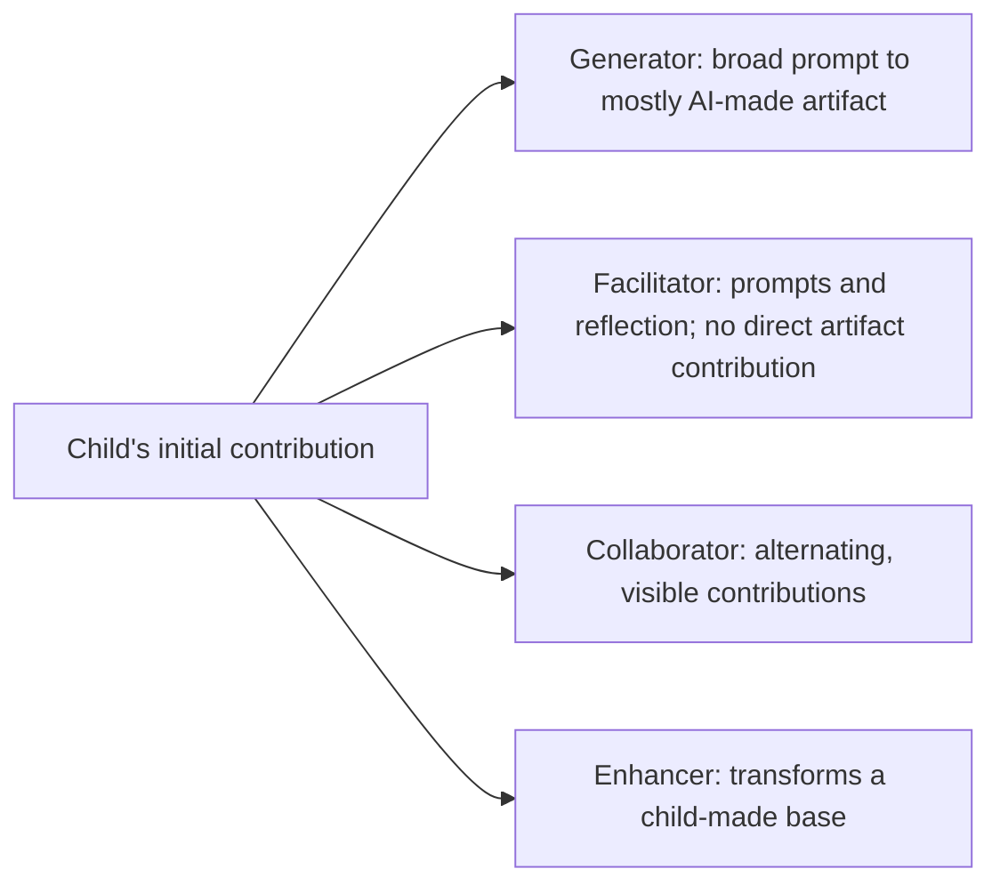

# Child–AI Co-Creation: A Review of the Current Research Landscape and a Proposal for Six Design Considerations

## Report scope

This report analyzes the complete seven-page paper by Zhenyao Cai, Ariel Han, Xiaofei Zhou, Eva Durall Gazulla, and Kylie Peppler. The paper is a work-in-progress scoping review, not a new system evaluation. It maps 20 empirical studies of children creating with AI, classifies the roles AI plays, and proposes six design considerations for responsible child–AI co-creation.

## Bibliographic record

- **Authors:** Zhenyao Cai, Ariel Han, Xiaofei Zhou, Eva Durall Gazulla, and Kylie Peppler
- **Venue:** Interaction Design and Children 2025 (IDC ’25), Reykjavik, Iceland
- **Pages:** 916–922
- **Publication year:** 2025
- **DOI:** [10.1145/3713043.3731506](https://doi.org/10.1145/3713043.3731506)
- **Paper type:** Work-in-progress scoping review and preliminary design framework
- **Primary domains:** Child–computer interaction, creativity-support tools, child-centered AI, generative AI, education

## Executive summary

The paper asks how designers can occupy a defensible middle ground between unrestricted generative-AI use by children and complete prohibition. Its answer is not a single prescribed interaction model. Instead, it argues that child–AI creative systems should be designed around six recurring concerns: privacy, harmful or inaccurate output, overreliance, constraints on creativity, human collaboration, and transparency.

The authors searched Web of Science and the ACM Digital Library, screened 127 records, and supplemented 14 database-derived papers with six found through backward and forward snowballing. All 20 included studies were published in 2019 or later. Most involved children in middle childhood and focused on storytelling or visual creation. GPT-family models were the most common technical foundation.

The review’s clearest conceptual contribution is a four-role taxonomy:

1. **Generator:** AI produces most of an artifact from a broad child prompt.
2. **Facilitator:** AI supports ideation or reflection without directly contributing to the final artifact.
3. **Collaborator:** child and AI visibly build on one another’s contributions.
4. **Enhancer:** AI transforms or elaborates a child-created base artifact.

The authors then translate recurring problems into six design considerations. The framework is useful as an early product and research checklist, especially because it ties creative agency to developmental concerns. Its evidence base is preliminary, however: the review uses only two databases, the first screening stage was conducted by one author, the analysis is mostly descriptive, study quality is not assessed, and the path from specific evidence to each recommendation is not fully traceable. The paper itself acknowledges several of these limitations.

For CreativeOS, the strongest implication is architectural: a child-focused storytelling system should not expose an unconstrained general-purpose generator as the core experience. It should make the child act first, use AI in bounded and legible roles, preserve a record of authorship and revisions, support adult and peer participation, and treat privacy and moderation as product invariants rather than post-processing features.

## Research problem and objectives

The motivating tension is that generative AI can broaden children’s access to expressive media while also introducing developmental, cognitive, privacy, and safety risks. The paper frames this as two linked questions:

- What challenges arise when children co-create with AI?
- What design considerations can mitigate those challenges while preserving meaningful creative participation?

The authors position the work at the intersection of two HCI traditions:

- **Creativity-support tools,** which assist people during ideation, composition, refinement, and sharing.
- **Child-centered AI,** which emphasizes age appropriateness, fairness, transparency, privacy, rights, and developmental alignment.

Their definition of co-creation is important: the child and AI both influence the process or artifact. The AI is therefore treated as more than a passive instrument, although the strength and visibility of its contribution differ across systems.

## Methodology

### Review design

The authors describe the study as a scoping review and report following PRISMA screening and selection guidance. The search ran from March 7 through March 31, 2025. The database query combined three concept groups:

- children or adolescents;
- creation, co-creation, writing, drawing, or storytelling;
- AI, LLMs, or generative AI.

The search was deliberately broadened beyond explicit uses of “co-creation” because relevant systems often describe their activities by medium rather than by the theoretical construct.

### Sources and screening

- **Databases:** Web of Science and ACM Digital Library
- **Initial records:** 127 (113 Web of Science; 14 ACM Digital Library)
- **Duplicates removed:** 11
- **Unique records screened:** 116
- **Full texts assessed:** 24
- **Included after full-text assessment:** 14
- **Added through backward/forward snowballing:** 6
- **Final corpus:** 20 studies

The first author screened titles and abstracts. Two authors conducted full-text screening and resolved disagreements through discussion.

### Inclusion criteria

Studies had to:

1. involve participants under 18;
2. center children’s participation in a creative practice; and
3. involve AI technology.

The authors excluded work where adults were the actual AI co-creators and children only consumed the resulting material. They also excluded system descriptions that provided neither empirical findings nor a discussion of limitations.

### Analysis

The synthesis maps:

- participant age;
- creative activity;
- model or technical approach;
- AI’s role in the creative process; and
- challenges stated explicitly or implied by study design, findings, and discussion.

Those challenges are the basis for the six design considerations.

## Findings: the research landscape

### Participants and activities

The corpus is concentrated in middle childhood. The body text reports 13 of 20 studies involving children aged 7–12, eight involving younger children, and two involving teens. The appendix uses somewhat different group boundaries—early childhood at 3–8 and middle childhood at 9–12—and also includes an “unspecified” category. This mismatch matters because age banding affects claims about developmental appropriateness.

Storytelling and visual creation dominate:

- **Story writing or storytelling:** 9 studies
- **Visual creation:** 9 studies
- **Other writing:** poetry, theater, and video scripts
- **Additional activities:** music, character creation, programming, and family creation

The concentration suggests that the literature knows more about AI-supported narrative and image-making than about music, embodied craft, performance, animation, or sustained project-based creativity.

### Technical foundations

GPT-family language models appeared in nine papers, making them the most common model class. Other systems used DALL·E, Stable Diffusion, Midjourney, latent consistency models, GANs, RNNs, rule-based approaches, Quick, Draw!, Magenta, and ChatGLM. One rule-based writing system was perceived by children as “dumb,” illustrating that constrained behavior may improve predictability while reducing perceived competence or engagement.

The paper treats “model used” as a descriptive category rather than analyzing system architecture, prompting strategy, safety configuration, training data, or deployment model. Consequently, systems built on the same foundation model may be grouped together despite materially different child-facing behavior.

## The four AI roles

The four roles are not mutually exclusive. Several reviewed systems shift roles within the same activity—for example, facilitating when a child is stuck and later collaborating by continuing the story. This is one of the taxonomy’s most useful properties: it can describe an interaction over time rather than branding an entire product with one fixed role.

The roles also imply different distributions of agency and risk:

- A **generator** lowers the effort required to produce polished content but creates the greatest risk of substitution and weak authorship.
- A **facilitator** can preserve child ownership, though leading prompts may still constrain the idea space.
- A **collaborator** makes reciprocal contribution visible but raises questions about credit, control, and narrative coherence.
- An **enhancer** requires an initial child artifact and therefore supplies a natural cognitive-forcing step, but a visually impressive transformation may overshadow the source work.

## The six design considerations

### 1. Protect child data privacy

Only two of the 20 reviewed papers directly addressed privacy. The authors highlight risks from collecting, retaining, repurposing, or using children’s creative inputs for model training without meaningful consent. They note that model/API choice changes the privacy posture: local models can provide greater storage control, while hosted APIs require careful review of retention, training, age, and regulatory policies.

The recommendation is to make model choice, platform terms, applicable law, guardian controls, and data retention explicit design concerns. A child-facing system should let guardians access and manage data associated with creative activity.

**Interpretation:** privacy is underrepresented in the empirical literature despite being foundational. The paper correctly treats it as an architecture and governance problem, not merely a consent-screen problem.

### 2. Minimize bias, harmful content, and hallucinations

The review identifies stereotyped image outputs, misinformation, irrelevant additions, and fabricated story-world relationships. These failures can confuse children, derail their creative flow, reinforce harmful representations, or be accepted as authoritative.

The proposed response is to moderate content before it reaches the child using measures such as automatic filtering, adult controls, or predefined dialogue structures.

**Interpretation:** moderation is necessary but the suggested mechanisms are only a starting point. A robust system also needs age-calibrated output policies, input and output checks, constrained tools, refusal recovery, audit logs, and a way for children to question or reject suspicious suggestions.

### 3. Foster appropriate reliance and cognitive engagement

Some studies observed children accepting AI-generated output with minimal engagement. The review connects this behavior to children’s tendency to avoid effortful tasks and to broader research on automation overreliance.

Many systems in the corpus limit direct generation by using AI as a facilitator or enhancer. Asking the child to create before receiving AI assistance is analogous to a cognitive-forcing intervention: it protects a period of independent thinking.

The authors avoid imposing one universal definition of “appropriate” use. They suggest involving children in defining acceptable reliance and rewarding thoughtful engagement rather than passive acceptance.

**Interpretation:** the most actionable pattern is **child-first sequencing**. AI should respond to evidence of the child’s intent—an idea, sketch, choice, narration, or revision—rather than making a complete artifact the default.

### 4. Balance support with creative freedom

AI can constrain creativity deliberately through prompts and templates or unintentionally through model limitations. A cited example describes a child abandoning an original idea after an image model failed to realize it.

The authors connect this problem to divergent-thinking dimensions—fluency, flexibility, originality, and elaboration—and to stages of creative work. They ask designers to specify:

- which creative stage AI is supporting;
- which creativity theory informs the intervention;
- whether the constraint helps or narrows the current activity; and
- whether repeated use supports or weakens long-term creative development.

**Interpretation:** output quality is not an adequate success metric. A system that produces a polished story while narrowing the child’s idea space may be a product success and a developmental failure.

### 5. Support peer and family creativity

Human collaborators contribute nonverbal cues, emotional support, negotiation, shared meaning, metacognitive prompts, and role modeling. Children in one reviewed study described something as missing when writing with AI rather than peers.

The recommendation is to use AI to facilitate human-to-human creativity rather than optimizing only for isolated child–AI interaction. Several reviewed systems already explore family or intergenerational creation.

**Interpretation:** collaboration should be a first-class workflow. Examples include turn-taking, co-located controls, shared prompts, adult reflection questions, attribution by contributor, and activities that require people to negotiate choices.

### 6. Make AI’s creative process understandable

The paper defines transparency in child-appropriate terms: children should understand where an output may come from, why it was produced, what the system can and cannot do, and how AI’s contribution compares with human input.

Only a few reviewed papers explicitly addressed opacity, and most did not offer concrete strategies. The authors point to AI-literacy learning experiences as a source of design ideas.

**Interpretation:** generic disclaimers are insufficient. Transparency should be interactive and local to the creative act—for example, labeling AI-created passages, showing which child input influenced a result, explaining uncertainty, and preserving a readable transformation history.

## Contributions

1. A compact map of 20 recent child–AI co-creation studies.
2. A medium-, age-, model-, and role-based characterization of the field.
3. A four-role taxonomy that can describe AI behavior within a creative workflow.
4. Six design considerations connecting system design to child rights, cognition, creativity, and social development.
5. A research agenda calling for stronger theoretical grounding, traceable evidence, participatory definitions of appropriate reliance, and concrete implementation guidance.

## Strengths

- The paper frames AI support as a developmental and relational design problem, not merely a generation-quality problem.
- It broadens the search vocabulary after recognizing that relevant papers do not consistently use “co-creation.”
- It distinguishes multiple AI roles and acknowledges that a system can change roles over time.
- It links product choices to both short-term artifact production and long-term creativity development.
- It explicitly preserves the importance of peers and family rather than assuming an AI partner is a human substitute.
- It is unusually candid about the preliminary and speculative status of the recommendations.

## Limitations and critical assessment

### Review coverage

Only two bibliographic databases were searched. The ACM Digital Library is highly relevant to HCI, but the search may miss education, developmental psychology, learning sciences, communication, design research, and robotics work indexed elsewhere. The snowballing step partially mitigates this but is not reported in enough detail to reproduce.

### Screening reliability

One author screened titles and abstracts. Dual full-text screening is stronger, but there is no inter-rater agreement statistic or independent quality-control sample for the initial stage.

### Search precision and conceptual boundaries

Terms such as “creation” and “young” are broad. The paper does not report database-specific query syntax, field differences, language restrictions, document-type restrictions, or a complete exclusion table. Its inclusion definition also blends systems in which AI materially authors content with systems that only facilitate, which makes the corpus conceptually diverse.

### No quality or risk-of-bias assessment

The 20 studies are counted and mapped without weighting their methodological strength. A design concern observed in a small exploratory workshop and one demonstrated in a stronger controlled study therefore contribute similarly to the synthesis.

### Weak traceability from evidence to recommendations

The authors explicitly acknowledge that they do not map each challenge to the exact studies and evidence that produced each recommendation. This makes it difficult to determine how recurrent or strongly supported each consideration is. Privacy, for instance, was directly discussed in only two papers but is rightly elevated because of external policy and ethical importance.

### Descriptive rather than causal synthesis

The paper shows what systems and concerns exist; it does not establish which designs improve creativity, learning, agency, safety, or long-term development. The six considerations are reasoned hypotheses for design, not validated requirements with known effect sizes.

### Internal reporting inconsistencies

The age ranges differ between the results prose and appendix, and the prose refers to “teens (13–20)” despite the stated inclusion criterion of participants under 18. These may be labeling or mixed-sample issues, but they reduce confidence in precise age-distribution claims.

### Time-sensitive policy claims

The paper cites model-provider policies and retention practices as of its writing. Such claims should be rechecked during implementation because provider terms, age restrictions, and retention options change.

## Implications for CreativeOS

### Product principles

- **Make the child’s intent the scarce resource.** Require a child-created seed before substantial AI generation.
- **Treat AI roles as modes with explicit transitions.** The interface should communicate when AI is facilitating, collaborating, or enhancing.
- **Optimize for process evidence, not just artifact polish.** Track ideas tried, revisions made, choices rejected, and contributions by each participant.
- **Preserve human collaboration.** Support siblings, peers, caregivers, educators, or facilitators in the same creative session.
- **Design recovery from AI failure.** If the model cannot realize an idea, encourage alternatives without implying the child’s idea is invalid.
- **Build transparency into the artifact.** Attribute AI-generated text, imagery, audio, and transformations at the component level.

### Safety and data requirements

- Collect the minimum child data needed for the activity.
- Avoid entering direct identifiers into model prompts.
- Define retention and deletion behavior before choosing a model provider.
- Provide guardian-accessible consent, export, and deletion controls.
- Moderate both child input and model output with age-appropriate policies.
- Log safety interventions without retaining unnecessary raw child content.
- Use bounded generation, retrieval, and tool permissions rather than a single unrestricted chatbot.

### Evaluation requirements

CreativeOS evaluations should measure more than enjoyment and output quality:

- proportion and type of child-authored content;
- diversity and originality before and after AI suggestions;
- revision and rejection behavior;
- comprehension of AI capabilities and limitations;
- reliance when AI gives an incorrect or irrelevant suggestion;
- perceived ownership and creative self-efficacy;
- quality of peer or family interaction;
- differences by age and developmental stage; and
- effects across repeated sessions, not only a one-time workshop.

## Open-source repository assessment

The PDF contains no GitHub, GitLab, code-repository, data-release, or project-source URL for this review. A title/DOI search and the lead author’s publication page surfaced the paper but no official open-source repository. No repository was cloned for this item. The external tools and systems cited in the review are prior work and should not be treated as this paper’s repository.

## Bottom line

This paper is best used as an early-stage design and risk checklist. Its four AI roles provide a useful language for designing a creative workflow, and its six considerations identify the right categories of concern. It does not yet tell a product team exactly how to implement or validate those concerns, nor does it provide strong comparative evidence that one role is superior. CreativeOS should adopt the framework as a set of hypotheses and guardrails, then operationalize each item through explicit architecture, interaction, and evaluation requirements.

