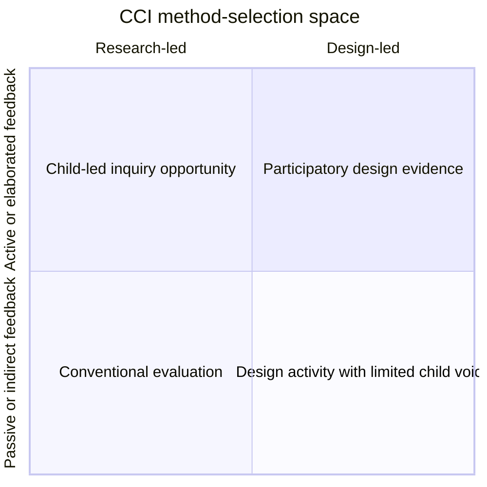

# Child–Computer Interaction: From a Systematic Review Towards an Integrated Understanding of Interaction Design Methods for Children

## Report scope

This report covers the full 19-page article by Florence Kristin Lehnert, Jasmin Niess, Carine Lallemand, Panos Markopoulos, Antoine Fischbach, and Vincent Koenig. The paper systematically reviews 272 empirical Child–Computer Interaction (CCI) papers published from 2005 to mid-2020. It focuses on method choice, triangulation, child and adult roles, developmental diversity, study duration and setting, and ethics reporting.

## Bibliographic record

- **Authors:** Florence Kristin Lehnert, Jasmin Niess, Carine Lallemand, Panos Markopoulos, Antoine Fischbach, and Vincent Koenig
- **Journal:** *International Journal of Child-Computer Interaction*
- **Volume/article:** 32 (2022), 100398
- **DOI:** [10.1016/j.ijcci.2021.100398](https://doi.org/10.1016/j.ijcci.2021.100398)
- **Article history:** Received November 15, 2020; revised August 19, 2021; accepted August 29, 2021; available online September 11, 2021
- **License:** CC BY 4.0
- **Paper type:** Systematic literature review with quantitative coding and conceptual synthesis

## Executive summary

This paper asks how the CCI field actually involves children in the design and evaluation of interactive technology. Its distinctive contribution is not another catalog of child-friendly methods. Instead, it connects method choice to four broader concerns: the kind of feedback children are permitted to provide, whether inquiry is research-led or design-led, the roles adults occupy, and whether researchers combine methods to offset the weaknesses of any one method.

The authors searched Scopus and the ACM Digital Library, narrowed the scope to eight journals and two leading conferences, and retained 272 full empirical papers. These studies represented 18,610 child participants in the 255 papers that reported usable age information. Children aged roughly 7–13 dominated the corpus, with a median estimated age of 9.88 years. Research most often occurred in natural settings, especially schools. Interactive games were the most common product category. Most studies were cross-sectional, although longitudinal work increased over time.

The most frequently reported methods were observation, semi-structured interviews, self-developed questionnaires, and creative workshops. Two-thirds of papers used at least two methods, but common combinations clustered around conventional research-led techniques such as observation plus interview. The authors argue that CCI should triangulate more ambitiously across the divide between research-led and design-led methods—for example, combining participatory co-design with standardized measurement.

The paper’s strongest practical message is that method selection determines children’s power. Creative workshops, cooperative inquiry, and probes generally enable active feedback and design-partner roles; observation, logging, and conventional testing more often position children as users or testers. Adult roles shift with age and developmental context, with experts and proxies appearing more often when children are younger or developmentally diverse. This may sometimes be necessary, but it can also reduce children’s direct voice.

The ethics findings are especially concerning: only 42.7% of papers clearly reported informed consent, only 21% reported ethics approval, and 76.5% did not make ethics approval status clear. The authors appropriately distinguish non-reporting from proof that no ethical process occurred, but insist that the absence of transparent reporting is itself a field-level problem.

For CreativeOS, this article is an evaluation-design blueprint. A credible child-focused study should combine direct observation, age-appropriate child expression, behavioral traces, and carefully validated measures; include children in ideation rather than only usability testing; document adult roles; run repeated sessions; and make assent, guardian consent, data handling, and ethics review explicit.

## Research aims

The review has three stated contributions:

1. examine a broad child population spanning infancy through age 18, including developmentally diverse children;
2. analyze the interplay among methods, children’s roles, and adults’ roles; and
3. identify method- and data-triangulation patterns while considering current ethical debates.

The paper builds on earlier reviews that found persistent age concentration around 6–12, limited long-term evaluation, unequal involvement of developmentally diverse children, and an expert-to-participatory shift in CCI. It adds a large empirical corpus and treats triangulation as a central object of analysis.

## Conceptual framework

### Children’s roles

The review draws from Druin’s four-role model:

- **User:** the child uses a finished or near-finished technology.
- **Tester:** the child evaluates a prototype and reveals usability problems.
- **Informant:** the child contributes knowledge or feedback at selected points.
- **Design partner:** the child works with adults across the design process.

Rather than treating these as rigid categories, the authors map methods on two continua:

- **feedback from children:** indirect → feedback → dialogue → elaboration;
- **orientation of inquiry:** research-led → design-led.

Roles are nested: a design partner may also act as informant, tester, and user. This avoids the misleading assumption that every activity gives a child one fixed status.

### Adults’ roles

Adults are coded as:

- **User:** an adult such as a parent or sibling also uses the technology.
- **Proxy:** an adult speaks for a specific child.
- **Expert:** a professional speaks from domain knowledge about a class of children.
- **Facilitator:** an adult supports access, rapport, and participation without taking over.
- **Support:** a guardian enables participation logistically, such as escorting a child.

The distinction between proxy and expert is valuable: both can displace a child’s voice, but they do so from different relationships and claims to knowledge.

### Triangulation

The paper distinguishes:

- **Concurrent method triangulation:** applying multiple methods in the same study.
- **Sequential/data triangulation:** combining qualitative and quantitative evidence across stages.

The authors’ broader proposition is that CCI should also triangulate across epistemic and power positions: research-led with design-led, passive feedback with active participation.

## Methodology

### Search strategy and scope

The search combined child-related terms in titles with design-method and HCI terms in abstracts. Searches covered January 2005 through July 2020. The authors chose 2005 because an earlier methodological review covered work through 2004.

- **Scopus:** 6,963 potentially relevant records; 2,844 remained after filtering to final journal articles.
- **ACM Digital Library:** 3,750 records; 1,528 remained after filtering to proceedings research articles and excluding shorter formats.
- **Venue-scoped, deduplicated pool:** 829 papers.
- **Final included corpus:** 272 empirical full papers.

The venue scope included eight journals and the IDC and CHI conferences. Education-technology venues and HCII were intentionally excluded on relevance or review-process grounds, and the corpus was limited to English-language publications.

### Eligibility

Included papers had to be full empirical papers that involved children directly and reported a clear evaluation process or results. Case studies with a single child were eligible if they reported user data. Papers based solely on adult reflection, adult opinions about children’s products, or introspection were excluded.

The authors generally excluded adult-only samples, but retained mixed samples where part of the age range exceeded 18. They also excluded papers focused exclusively on perception or psychology without a tangible or interactive artifact.

### Coding

The authors developed an iterative 20-code scheme with feedback from eight HCI researchers. Code groups covered:

- study setting and product;
- temporal stage of use and longitudinal/cross-sectional design;
- developmental group;
- method and data triangulation;
- named method, technique, or tool;
- age and sample size;
- child feedback and research/design orientation;
- adult role; and
- reported informed consent and ethics approval.

All papers were coded by the first author. Ten percent were double-coded by the first and second authors, producing Cohen’s kappa of 0.59, characterized as moderate agreement. Uncertain cases were discussed, and additional authors cross-checked samples.

## Results

### Field growth and publication venues

The number of relevant CCI papers rose from 2007 to 2020. IDC dominated the initial conference pool, and CHI supplied another important share. The apparent drop in 2020 reflects the search cutoff, not a demonstrated decline.

### Participant population

- **Participant count across 255 age-reporting papers:** 18,610
- **Study sample-size range:** 1–1,031 children
- **Mean study sample size:** 71.03, SD 115.85
- **Estimated median child age across papers:** 9.88, SD 3.53
- **Papers with no reported age:** 17
- **Primary age concentration:** 7–13 years

All childhood age groups appeared, but younger children and older adolescents were underrepresented. In 75.3% of papers, no specific developmentally diverse group was named. Autism spectrum disorder was the most frequently represented named group at 7%; mixed typically developing and developmentally diverse groups accounted for 8.1%.

These proportions should not be read as population prevalence. They reflect research attention and reporting practice.

### Context and product categories

Research locations included:

- educational institutions: 37.9%;
- laboratories: 10.7%;
- homes: 7.4%;
- health-care settings: 5.1%;
- museums: 4.0%;
- combinations of locations: 12.1%.

By study-setting category, 55.2% were naturalistic, 31.3% artificial/laboratory-based, 13.1% environment-independent, and 0.4% combined. The exact category could not be determined for 13 papers.

Interactive games were the largest single product category at 25.4%, followed by professional software (12.1%) and mobile applications/phones (11.8%). VR/AR accounted for 4.0% and appeared more recently. “Other” was the largest aggregate category at 34.7%, reflecting the field’s heterogeneous artifacts, including robots, collaborative music environments, tabletops, and digital fabrication interfaces.

### Study duration

- **Cross-sectional:** 58.1%
- **Longitudinal/repeated evaluation:** 41.9%

The field still favored one-time evaluation, although the number of longitudinal papers increased sharply over time. The result supports a trend toward repeated study, not a present-day majority of longitudinal evidence.

### Method frequencies

The main method shares were:

| Method | Share |
|---|---:|
| User observation | 23.9% |
| Semi-structured interview | 16.0% |
| Self-developed questionnaire | 11.7% |
| Creative session/workshop | 11.2% |
| Activity logging | 9.9% |
| Standardized questionnaire | 5.4% |
| User testing | 4.7% |
| Diary study | 2.3% |
| Focus group | 2.3% |
| Cooperative inquiry | 2.1% |
| Free interview | 2.1% |
| Prototyping | 2.0% |
| Brainstorming | 1.0% |
| Physiological measurement | 0.8% |
| Probe | 0.7% |
| Card sorting | 0.5% |

The coding intentionally merges “methods,” “techniques,” and “tools” because reviewed papers used these labels inconsistently. This supports broad comparison but sacrifices conceptual precision.

### Triangulation patterns

Of 272 papers:

- 66.9% used at least two methods;
- 34.1% used at least three;
- 15.8% used at least four;
- 6.2% used at least five; and
- 2.5% used six or more.

The most common concurrent combinations were:

- observation + semi-structured interview: 17.0%;
- observation + activity logging: 12.6%;
- observation + self-developed questionnaire: 7.1%;
- semi-structured interview + self-developed questionnaire: 5.4%.

By data orientation, 50.7% used qualitative evidence only, 37.9% used mixed qualitative and quantitative methods, and 9.2% used quantitative methods only. The central critique is that multiple methods often came from the same conventional, research-led family. Method count alone therefore overstates epistemic diversity.

### Developmental diversity

Typically developing children were associated with the broadest method variety, partly because this category contained far more studies. ASD work used varied qualitative and participatory methods, including observation and creative sessions. Cerebral-palsy studies more often relied on indirect evidence such as logs and tests. Visual-impairment studies were an exception to the overall mixed-method trend, but their small count limits interpretation.

The authors argue against a universal method kit. They instead recommend documenting the skills a method assumes—speech, writing, sustained attention, motor action, abstraction—and the role of caregivers or experts. This reframes inclusion from diagnosis alone to person, task, environment, and support needs.

### Adult roles and child voice

Mixed adult roles were most frequent at 22.8%, followed by facilitator (12.1%), expert (10.7%), user (9.9%), proxy (3.3%), and support (1.5%). Adult role could not be identified in 28 papers.

Facilitators were associated most strongly with active child feedback; expert roles appeared more often alongside passive or verbal feedback. Experts were especially visible in studies involving dyslexia, visual impairment, or Down syndrome. The proxy role was associated with younger median child ages.

A statistically significant but small correlation was reported between child median age and adult role coding (point-biserial r = .138, n = 272, p = .028). The small effect and unclear directionality are important: the data cannot establish whether adult roles drive method choice or method choice produces adult roles.

### Ethics reporting

- Informed consent reported: 42.7%
- Parent-only consent: 19.5%
- Child-only consent: 3.3%
- Child and parent consent: 19.9%
- Consent unclear or unreported: 56.6%
- Ethics approval reported: 21.0%
- Explicitly no ethics approval: 1.8%
- Ethics approval unclear or unreported: 76.5%

The finding concerns reporting, not necessarily researcher conduct. Nevertheless, absent reporting prevents readers from assessing assent, recruitment, burden, data use, privacy, or a child’s ability to refuse.

## Main arguments in the discussion

### Combine unlike methods, not just more methods

Observation plus interview is useful but conventional. The authors encourage combinations that cross methodological positions, such as cooperative inquiry plus a standardized questionnaire. A participatory activity can expose what matters to children; a complementary research-led measure can test whether the resulting claim generalizes or merely confirms the design team’s expectations.

### Expand participation across ages and abilities

The field’s concentration around ages 7–13 creates blind spots. Methods designed for fluent speech, writing, or sustained group work may systematically exclude younger children or children with different communication and sensory needs. The review calls for adaptable method families with explicit rationales and alternatives.

### Treat roles as power relations

“User,” “tester,” and “design partner” are not cosmetic labels. They indicate whose knowledge shapes the artifact and when. The authors encourage more work in the underdeveloped combination of research-led inquiry and participatory child involvement.

### Make ethics visible and operational

Ethics should be documented in the paper and designed into the study. The authors highlight recruitment, consent/assent, treatment of participants, data sharing, privacy, risk, and burden. Consent should give children a real ability to agree or refuse, not simply provide information after the design is fixed.

## Strengths

- Large corpus with explicit PRISMA-style selection.
- Focus on empirical use of methods rather than method descriptions alone.
- Inclusion of the entire 0–18 age span and developmentally diverse groups.
- Useful integration of method, child role, adult role, and inquiry orientation.
- Quantitative reporting of method combinations and ethics practices.
- Iterative coding scheme reviewed by external HCI researchers.
- Transparent disclosure of moderate inter-rater reliability and extensive single coding.
- Practical challenge to the assumption that method triangulation is automatically diverse or rigorous.

## Limitations and critical assessment

### Search and venue bias

Scopus and ACM are strong HCI sources, but title-only child terms likely exclude relevant IDC papers whose titles assume the venue’s child focus. Restricting to selected venues omits education, disability studies, developmental psychology, communication, and local-language research. The paper acknowledges these choices.

### Inconsistent age boundary

The target population is described as 0–18, but mixed samples extending above 18 were retained. Three papers had mean ages above 18 and remained in analysis. This is defensible for mixed youth samples but weakens literal claims that every included sample represents childhood alone.

### Coding reliability

Only 10% was double-coded, and kappa of 0.59 indicates meaningful ambiguity. Consensus discussions improve shared interpretation but do not eliminate first-coder bias across the remaining corpus.

### Category ambiguity

Merging method, technique, and tool makes the taxonomy usable across inconsistent reporting, but categories operate at different levels. “Cooperative inquiry” is an approach, “sticky noting” a technique, and “observation” a data-collection method. Frequency comparisons should therefore be interpreted as reporting patterns rather than equivalent design options.

### Presence is not quality

Counting two methods does not reveal whether either was competently conducted or integrated. Similarly, reporting consent does not establish that consent was developmentally meaningful. The review measures visible methodological features, not study quality or risk of bias.

### Descriptive association

Relationships among age, developmental group, adult role, method, and child feedback are observational and potentially confounded. Small category counts make subgroup patterns especially fragile.

### Internal quantitative inconsistency

Table 3 and the abstract report 66.9%—approximately two-thirds—using at least two methods. One discussion passage says “more than three-quarters.” The tabulated count (182 of 272) should be treated as authoritative.

## Implications for CreativeOS research and product design

### Recommended study program

1. **Participatory discovery:** run age-appropriate creative workshops or cooperative inquiry before fixing the storytelling workflow.
2. **Prototype evaluation:** observe complete sessions and capture interaction traces, but do not infer motivation from logs alone.
3. **Child interpretation:** use drawing-telling, concrete choice tasks, short interviews, or artifact walkthroughs so children can explain their own actions.
4. **Validated measurement:** use age-appropriate standardized measures where available; label exploratory custom questionnaires honestly.
5. **Repeated deployment:** study novelty effects, learning, reliance, and creative agency over multiple sessions.
6. **Cross-method synthesis:** explicitly state which question each method answers and how discrepancies are resolved.

### Role documentation

Every CreativeOS study should record:

- the child’s role at each project stage;
- the adult’s role and degree of intervention;
- what kinds of feedback the child could provide;
- which communication or motor skills each method required;
- adaptations offered; and
- whose interpretation controlled design decisions.

### Ethics baseline

- Obtain guardian permission and developmentally meaningful child assent.
- Explain recording, generation, storage, and sharing in child-friendly language.
- Let the child pause, skip, delete, or withdraw without penalty.
- Document compensation and avoid making rewards coercive.
- Minimize raw audio, images, and identifiers sent to external AI services.
- Report ethics review, consent, retention, anonymization, and data-sharing decisions in all publications.
- Include a plan for incidental harmful content, disclosure, distress, and adult escalation.

### Product implications

The review also applies before formal research. CreativeOS should provide multiple expression channels—voice, drawing, selection, movement, and text—because any single input modality privileges a subset of children. Adult controls should support rather than silently replace child decisions. The product should make facilitator actions visible so evaluation can distinguish child agency from adult or AI assistance.

## Open-source repository assessment

The PDF includes a DOI-hosted supplementary-material reference but no GitHub, GitLab, source-code, or open repository URL. Searches by exact title and DOI surfaced the open-access article and institutional records, but no official code repository. No repository was cloned for this paper. Supplementary files at a publisher page should not be assumed to be a version-control repository.

## Bottom line

This is a strong methodological map of CCI and a useful warning against shallow child studies. Its most enduring insight is that rigor is not the number of methods used; rigor comes from deliberately combining different views of the child’s experience while preserving the child’s voice. For CreativeOS, that means participatory design, multimodal and longitudinal evaluation, transparent adult roles, and unusually explicit ethics reporting.

