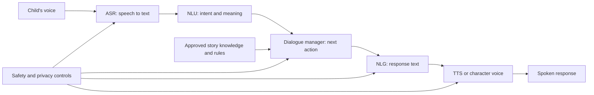

# Interactive Storytelling for Children: A Case Study of Design and Development Considerations for Ethical Conversational AI

## Report scope

This report analyzes the complete paper by Jennifer Chubb, Sondess Missaoui, Shauna Concannon, Liam Maloney, and James Alfred Walker. The PDF is the July 2021 arXiv preprint. The work was later published in the *International Journal of Child-Computer Interaction*. It is an ethics-and-architecture case study of the AI Fan Along R&D project, not a child user study or effectiveness evaluation.

## Bibliographic record

- **Authors:** Jennifer Chubb, Sondess Missaoui, Shauna Concannon, Liam Maloney, and James Alfred Walker
- **Journal publication:** *International Journal of Child-Computer Interaction*, 32 (2022), article 100403
- **DOI:** [10.1016/j.ijcci.2021.100403](https://doi.org/10.1016/j.ijcci.2021.100403)
- **arXiv:** [2107.13076](https://arxiv.org/abs/2107.13076), version 1
- **Paper type:** Industry–academic R&D case study, technical/ethical literature mapping, and design recommendations
- **System:** AI Fan Along, a voice-based “meta-story” concept for children aged 9–14

## Executive summary

The paper examines what responsible development should mean for a voice-based storytelling system that lets children talk with characters from a television program after an episode ends. AI Fan Along was intended to ask children about events, invite predictions and suggestions, and let their input influence a continuing narrative. Its learning aims included social, literary, and empathetic understanding.

The authors’ central argument is that technical architecture and ethics cannot be separated. A rule-based dialogue system is controllable but brittle; an open-ended learned system is flexible but can produce unsafe, biased, misleading, or contextually inappropriate output. Speech recognition that performs poorly on children’s voices is not merely a usability defect—it determines who can participate, whose intent is recognized, and whose frustration is blamed on them. Voice cloning and human-like personas are not merely immersive features—they influence attachment, trust, identity, and deception.

The paper maps the conventional conversational-AI pipeline—automatic speech recognition (ASR), natural-language understanding, dialogue management, natural-language generation, and text-to-speech—and recommends a hybrid design. Learned components could provide flexible, persona-consistent interaction, while rule-based or retrieval constraints limit the domain and enforce safety. Every layer would need iterative child-specific testing.

Four ethical themes guide the recommendations:

1. cognitive and linguistic development;
2. moral care and social behavior;
3. regulation, privacy, security, and safeguarding; and
4. inclusion, fairness, gender, race, disability, accent, and representation.

The authors recommend explicit recording indicators, parent-controlled activation rather than always-on listening, transparent data practices, consent and child assent, participatory design, bot self-identification, explanation of failures, careful persona design, broad speech testing, and reflection on how a system responds to secrets, abuse disclosure, incivility, or off-topic conversation.

The work is unusually concrete for an ethics paper because it ties concerns to architecture and interaction choices. Its evidence remains limited. The three-month project took place during the UK’s 2020 COVID-19 lockdown, forcing cancellation of planned interviews and prototype testing with children and parents. The literature review was explicitly non-systematic, and the paper reports recommendations rather than a deployed implementation or observed outcomes.

For CreativeOS, this paper supplies a strong principle: every “delightful” storytelling capability should be reviewed as a safety, power, and data decision. The best reusable idea is the hybrid, bounded conversation model with visible system identity and explicit handling of child speech, refusal, privacy, out-of-domain talk, and safeguarding events.

## The AI Fan Along concept

AI Fan Along was conceived as a voice interaction following a TV episode. A child aged 9–14 would speak with familiar fictional characters, reflect on what happened, propose what should happen next, and potentially influence later narrative direction. The system was intended to deepen:

- understanding of characters and storylines;
- social and empathetic reasoning;
- prediction and interpretation;
- literacy and narrative engagement; and
- the feeling of participating in a story world.

The system’s core appeal—an apparently present, in-character conversational partner—is also the source of its main risks. A familiar character voice can increase disclosure, emotional attachment, perceived authority, and confusion about who is listening or how much the system understands.

## Project method

The pilot ran for three months in 2020 with academic researchers and a digital agency. It had two parallel workstreams:

- map technical options for conversational AI, speech recognition, synthesis, and voice cloning; and
- map ethical and social evidence concerning children, voice systems, safety, privacy, development, and bias.

The original plan included interviews and prototype testing with children and parents. COVID-19 restrictions prevented that data collection. The team instead conducted a recent, non-exhaustive literature mapping, used thematic analysis to identify ethical themes, and discussed findings with the industry partner through regular co-production meetings.

The authors clearly acknowledge that the method is not a systematic review, contains no user experience evidence, and was constrained by time. The resulting design guidance should therefore be read as a reasoned case analysis, not validated best practice.

## Conversational-AI architecture

### Task-oriented systems

Rule-based and frame/slot systems constrain conversation to predefined flows, intents, and knowledge. Retrieval-based question answering can answer from an approved story corpus and provide externally grounded responses.

**Advantages:**

- inspectable response space;
- clearer domain boundaries;
- easier content review;
- more predictable behavior; and
- stronger control of a character’s canonical knowledge.

**Limitations:**

- brittle when a child speaks unexpectedly;
- high authoring cost as scope grows;
- poor handling of off-topic or ambiguous talk; and
- repetitive or unnatural interaction.

Children are particularly likely to treat the system as a person and produce incomplete, exploratory, or off-domain utterances. A “safe” system that constantly fails to understand them can still cause frustration, exclusion, or misplaced self-blame.

### Open-ended learned systems

Data-driven, end-to-end conversation models can produce more varied social dialogue and require less handcrafted domain logic. Persona conditioning can make a system sound like a fictional character.

**Advantages:** flexibility, novelty, lower dialogue-authoring burden, and more natural response to varied input.

**Risks:** generic replies, moral inconsistency, bias from training data, toxic or inappropriate output, weak instruction control, and unpredictable contextual meaning.

The paper predates modern production LLM patterns, but its critique remains current: filtering profanity from training data or output does not remove representational harm, manipulation, hallucination, or context-sensitive toxicity.

### Recommended hybrid

The authors favor a hybrid that combines learned, persona-aware flexibility with rules, frames, retrieval, and iterative safety testing. This is a product architecture recommendation and an ethical stance: expressive freedom should expand only inside a verified envelope.

## Children’s speech as an inclusion problem

The paper devotes substantial attention to ASR. Children’s voices and language differ from adult training norms because of:

- changing vocal anatomy and age;
- evolving articulation and grammar;
- elongated or omitted syllables;
- incomplete, spontaneous utterances;
- emotion and arousal;
- accent, dialect, multilingual speech, and slang;
- speech differences or disability; and
- gender- and race-correlated acoustic variation.

Physical context also affects recognition. Microphone height, directionality, distance, room reverberation, reflective surfaces, background noise, and device placement can systematically disadvantage a shorter speaker. The paper’s kitchen-counter example is useful: a device may be “working as designed” while being physically inaccessible to a child.

The authors call for child-representative speech data and testing. That solution creates a direct privacy tension because broader child-voice collection increases biometric, identity, consent, and retention risk. The paper identifies the need for careful data governance but does not resolve the tradeoff.

## Voice synthesis, cloning, and persona

Neural TTS and voice cloning can reproduce a character-like voice from limited audio. This preserves immersion, but voice qualities affect perceived gender, race, authority, warmth, intelligence, and trust. A cloned familiar character can blur commercial entertainment, social companionship, and instruction.

The paper argues that inclusion review must cover more than acoustic performance. Teams must examine:

- whose accents and speech styles are recognized;
- which voice is selected as the default helper;
- gendered naming and service roles;
- racial and cultural coding of voice and content;
- whether familiarity is used to induce disclosure or persuasion; and
- how clearly the character identifies itself as artificial.

## Four ethical themes

### 1. Cognitive and linguistic development

Voice systems can lower literacy barriers, support question asking, and give children access to information. They can also encourage immediate-gratification expectations, shape politeness and syntax, or become a substitute for human conversation.

ASR failures and unexplained refusals can distort a child’s understanding of their own competence. The paper recommends explaining why the agent could not answer and helping the child rephrase, rather than silently failing or pretending comprehension.

### 2. Moral care and social behavior

Human-like voice and social cues encourage children to treat agents socially. Children may form attachments, disclose secrets, show distress when agents are mistreated, or transfer commanding speech patterns into human relationships.

Designing an agent to enforce politeness is not straightforward. One cited experiment found that children became more polite when the system rejected impolite demands, but also became dissatisfied with the AI. A system can promote a norm while damaging trust or agency.

The paper recommends evaluating repeated use, not assuming that a friendly character automatically promotes pro-social behavior.

### 3. Regulation, privacy, security, and safeguarding

Voice systems create an intimate surveillance surface. Children may not know recording occurs, while guardians may be unable or unwilling to review large recording histories. Parent monitoring can protect a child but can also violate the child’s privacy or suppress disclosure.

The paper highlights difficult safeguarding questions: what should the system do if a child reveals abuse, danger, or illegal activity? Who receives the disclosure, under which law, with what confidence and audit trail? The authors recommend explicit, legally informed decisions rather than leaving behavior to model improvisation.

### 4. Inclusion and fairness

Fairness cannot be reduced to a metric on model predictions. It includes participation in design, representation in data, speech-recognition performance, voice and persona choices, cultural definitions of appropriate content, and power over product decisions.

The authors call for children and families to participate in design and for technical fairness work to engage scholarship outside computer science.

## Seven baseline questions

The case study distills seven questions for developers:

1. What data will be collected?
2. How will the data be used?
3. Which laws and safeguards protect privacy and safety?
4. What makes the agent child-friendly, engaging, and behaviorally appropriate?
5. How will bias be identified and mitigated?
6. How will development be inclusive and participatory?
7. Which architecture and behaviors support moral care and pro-social interaction?

These questions are a useful design-review agenda because they force a team to connect system behavior with governance.

## Concrete recommendations for AI Fan Along

### Data and activation

- Securely host child voice recordings.
- Obtain parent or caregiver consent and define third-party data sharing.
- Do not operate continuously in the background.
- Let a guardian deliberately activate the experience after the program.
- Make recording status visible.
- State what is collected, where it is stored, and how it is used.
- Test expectations and controls with parents and children.

### Safety and safeguarding

- Protect identity and location information.
- detect harmful content;
- address psychological and physical safety;
- define behavior for abuse or danger disclosures;
- align behavior with child privacy and online-harms law; and
- document the reasoning behind safeguarding decisions.

### Personalization

Ask three questions:

- What is personalized—content, voice, interface, or dialogue?
- For whom, using which context?
- How much is automatic versus chosen or reviewed?

Personalization should account for age, emotion, speech variation, and accessibility without silently inferring sensitive traits.

### Participatory research and consent

- Involve children and parents early.
- Explain research objectives, procedures, risks, and data use accessibly.
- Permit withdrawal without adult pressure.
- Seek child assent as well as guardian permission.
- Provide time and support for family decisions.
- Document verbal consent for participants who cannot use written forms.
- Test error scenarios and unforeseen risk.

The paper discusses possible “Wizard of Oz” testing where researchers select responses while the child believes the prototype is more automated. It argues that deception should be minimized and disclosed in debriefing. For child research, this is a high-risk choice that requires a clear scientific necessity, ethics review, assent-compatible explanation, and careful assessment of trust effects.

### Dialogue safety and identity

- Bound open-ended generation with reviewed rules or corpora.
- Do not rely on profanity filtering as the safety strategy.
- Review context, stereotypes, and representational harms.
- Explicitly identify the agent as a bot.
- Admit when a question or context is not understood.
- Avoid overstating human-like understanding or emotion.

## Strengths

- Integrates architecture, acoustics, interaction design, child development, and ethics.
- Treats ASR quality as fairness and inclusion, not merely accuracy.
- Recognizes the tradeoff between constrained safety and open-ended engagement.
- Examines the physical environment of voice interaction.
- Addresses family privacy conflicts rather than assuming parental monitoring is unambiguously good.
- Raises concrete safeguarding and disclosure scenarios.
- Critiques gender and race across voice, persona, branding, and content.
- Clearly reports the absence of child participants and limits of its literature mapping.

## Limitations and critical assessment

### No empirical evaluation

The planned child/parent research did not occur. The paper cannot show whether children understood recording indicators, accepted bot disclosure, enjoyed the hybrid dialogue, or experienced developmental effects.

### Non-systematic evidence synthesis

Search sources, screening, inclusion criteria, quality assessment, and complete corpus statistics are not reported. The thematic map may reflect the project’s concerns and available literature rather than comprehensive field evidence.

### Prototype status is underspecified

The paper describes a prototype and design decisions but does not provide an implementation architecture, model configuration, interaction transcript, safety evaluation, or production readiness. Some recommendations appear prospective.

### Technology has moved

The technical survey centers on rule-based, retrieval, early end-to-end neural dialogue, BERT-era models, and pre-2021 voice technology. Modern LLMs make open-ended generation more capable, but they intensify the same problems of unpredictable response, persona persuasion, hallucination, and data governance. Specific technology recommendations require updating; the sociotechnical analysis remains relevant.

### Legal claims are time- and jurisdiction-bound

References to UK and EU rules reflect the paper’s 2020–2021 context. Current deployment requires fresh legal review by location, age, service type, data flow, and commercial model.

### Tension between data diversity and minimization

The paper recommends large, diverse child-speech datasets and strong privacy. It does not propose privacy-preserving collection, on-device recognition, federated learning, synthetic data, retention limits, or independent governance to reconcile them.

### Trust language

Some passages describe transparency as a way to build trust and agents as companions. A safer objective is calibrated reliance and clear non-human identity, especially when a fictional character voice is used.

## Implications for CreativeOS

### Architecture

- Use a bounded story domain and approved retrieval sources for factual or canonical content.
- Separate safety policy and story state from free-form generation.
- Validate every child-facing response after generation and before speech synthesis.
- Provide explicit fallback behavior for low ASR confidence, ambiguity, off-topic talk, silence, and refusal.
- Keep “I did not understand” distinct from “your answer is wrong.”
- Permit text, drawing, or choice-based alternatives when voice fails.

### Voice experience

- Test by age, pitch, accent, dialect, multilingual use, speech difference, device height, room noise, and distance.
- Display a persistent recording indicator and a child-controlled stop action.
- Avoid always-on listening.
- Do not clone real people or familiar characters without rights, consent, and a manipulation review.
- Label synthetic voices and prevent the system from claiming human feelings or secrecy.

### Safety and governance

- Predefine handling of personal data, secrets, abuse disclosures, self-harm, violence, and requests for private contact.
- Do not expose full child transcripts to guardians by default without a proportional child-privacy analysis.
- Minimize and expire raw audio; store derived intent only when sufficient.
- Make deletion technically verifiable.
- Audit content and recognition failures across demographic and accessibility groups.

### Evaluation

Conduct participatory design before effectiveness claims, then test comprehension of recording, AI identity, uncertainty, and data use. Compare constrained, hybrid, and open dialogue conditions. Evaluate repeated use, family dynamics, speech adaptation, emotional attachment, reliance, and transfer of conversational habits.

## Open-source repository assessment

The paper does not contain a source-code link. Searches for AI Fan Along found official university, funder, and industry project pages, but no GitHub, GitLab, or other open-source implementation repository. The project pages describe R&D outcomes rather than downloadable source. No repository was cloned.

## Bottom line

This paper remains valuable because it refuses to separate conversational architecture from child safety. Its hybrid-system recommendation, child-specific ASR analysis, visible recording, non-background activation, bot disclosure, and explicit safeguarding questions are directly relevant to CreativeOS. Its recommendations must be updated for modern LLMs and validated with children and families before being treated as proven design guidance.

