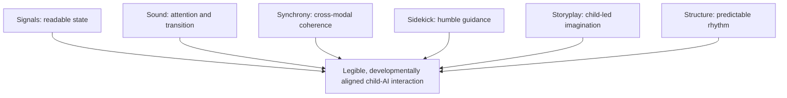

# Once Upon an AI: Six Scaffolds for Child–AI Interaction Design, Inspired by Disney

## Report scope

This report analyzes the full paper by Nomisha Kurian. The paper is a conceptual design study based on thematic coding of approximately 70 hours from 52 animated films. It translates animation techniques into six heuristics for interactive AI used by children approximately 2–11 years old. It does not evaluate a child-facing AI system or recruit children.

## Bibliographic record

- **Author:** Nomisha Kurian, University of Warwick
- **Journal:** *International Journal of Child-Computer Interaction*
- **Volume/article:** 46 (2025), 100788
- **DOI:** [10.1016/j.ijcci.2025.100788](https://doi.org/10.1016/j.ijcci.2025.100788)
- **Access:** Open access
- **Paper type:** Conceptual research paper, qualitative media analysis, and design-framework proposal
- **Target age range:** Approximately 2–11
- **Empirical participation:** No children or other human participants in the reported phase

## Executive summary

The paper asks whether child-facing AI can learn from the mature audiovisual and narrative “grammar” of children’s animation. It argues that animation has spent decades making emotion, attention, transition, danger, safety, character, and plot legible to children. AI design, by contrast, often adds friendly faces, music, or characters superficially without understanding how those elements work together developmentally.

The author analyzes 52 animated films and derives six scaffolds:

1. **Signals:** bold, readable visual expressions and gestures.
2. **Sound:** auditory motifs that mark emotion, success, danger, and transition.
3. **Synchrony:** consistent alignment among voice, movement, visuals, and sound.
4. **Sidekick:** a humble, supportive, visibly fallible helper rather than an omniscient instructor.
5. **Storyplay:** open-ended generative play in which the child can improvise and the system builds on it.
6. **Structure:** stable interaction rhythms and narrative patterns with gradually adaptive challenge.

These are presented as developmental scaffolds rather than decoration. A long gaze or held expression gives a young child processing time. A recurring sound motif externalizes structure. A consistent pairing of expression and voice makes system state legible. A sidekick who admits uncertainty can reduce overreliance. A sandbox can support symbolic play. A repeated interaction arc can free limited working memory for the actual learning or creative task.

The framework’s strength is its cross-modal systems thinking. It explicitly warns that a cheerful face with a cold voice, a success sound at the wrong time, or unpredictable pacing can be more confusing than an interface with fewer cues. It also addresses sensory overload, neurodiversity, cultural variation, privacy-sensitive adaptation, and anthropomorphism.

The evidence is exploratory. The paper reports no frequency counts, complete film corpus, intercoder reliability, child validation, system implementation, or comparative study. It relies heavily on Piagetian stages and a Disney-centered sample. The methods section also contains a notable corpus inconsistency: it says all 52 films are from Walt Disney Animation Studios, while its 15-film pilot list includes several Pixar productions. The six scaffolds are credible hypotheses for design and evaluation, not demonstrated causal mechanisms.

For CreativeOS, the framework is useful for interface and interaction review. The most valuable combination is **stable structure + child-controlled storyplay + transparent sidekick behavior**. Sound, animation, and affect adaptation should be optional, sparse, privacy-preserving, and verified with children rather than assumed from film conventions.

## Research premise and boundaries

The paper defines its scope carefully. It concerns functional, bounded AI interactions—such as educational tutoring or creative activities—not recommendation systems or intentionally intimate companion AI. It explicitly rejects designs that cultivate emotional dependency or unbounded intimacy.

The analogy between animation and AI has limits:

- Animation is fixed and edited; AI responds in real time.
- Animation can perfect pacing and cross-modal alignment; AI must manage latency and uncertain input.
- Animated characters follow authored arcs; an AI must adapt without losing identity, safety, or coherence.
- Film audiences observe; children interacting with AI provide data and can be persuaded or redirected.

The author treats those differences as a design opportunity: AI could preserve animation’s legibility while adapting pacing, cue intensity, and challenge to the child.

## Methodology

### Larger project

The reported work is phase one of a 2023–2025 mixed-method project:

1. media-content analysis;
2. interviews with Child–Computer Interaction professionals and designers; and
3. participatory co-design with educators, children, and early-childhood experts.

Only the first phase is reported here.

### Corpus

The paper reports roughly 70 hours across 52 films dated 1937–2021. It says 37 represent a 1937–1999 “Classic” span and 15 are more contemporary. Films were chosen for historical breadth, commercial/cultural influence, visual style, setting, and character variety.

The paper does not list all 52 titles. The 15-film pilot list includes *Snow White*, *Pinocchio*, *The Lion King*, *Toy Story*, *Mulan*, *Finding Nemo*, *The Incredibles*, *Up*, *Tangled*, *Frozen*, *Big Hero 6*, *Zootopia*, *Moana*, *Coco*, and *Encanto*. Several of these are Pixar films, conflicting with the claim that the corpus consists of Walt Disney Animation Studios films. The broader analytical unit may therefore be “Disney-branded animation” rather than the stated studio boundary.

### Analysis

The author used an inductive–deductive thematic analysis in NVivo. Initial codes were developed from the 15-film subset, Piagetian theory, and six foundational CCI works. Scene-level coding covered:

- expressiveness;
- narrative structure;
- audio and music cues;
- environment and visual style;
- sidekick dynamics; and
- play and agency.

Codes were refined across the full corpus, connected through analytic memos to developmental affordances and AI implications, and grouped through axial coding. An interdisciplinary group reviewed preliminary themes, and a CCI colleague peer-debriefed a coding sample.

No second-coder procedure, agreement statistic, code frequency, negative-case analysis, scene count, sampling protocol, or public codebook/data artifact is reported.

## The six-scaffold framework

### 1. Signals: visual animacy and clarity

Animated films externalize emotion through large expressions, exaggerated posture, held reaction shots, and deliberate pauses. Young children who are still developing theory of mind may interpret a clear face, gesture, or orientation more reliably than subtle implication.

The AI translation is a stable visual vocabulary:

- a visible “thinking” state while processing;
- a clear uncertainty or misunderstanding expression;
- a pause long enough for the child to read the cue;
- high-contrast but not overwhelming posture changes; and
- consistent mappings between state and expression.

The paper suggests an affect-state controller or behavior tree driven by observable signals such as ASR confidence, pauses, gaze away, or repeated requests. It also recommends adjustable expressive intensity.

**Critical interpretation:** displaying system state is valuable; inferring the child’s affect is much riskier. Gaze away may mean thinking, distraction, disability, cultural interaction style, another person in the room, or camera error. CreativeOS should make its own internal state legible without claiming certainty about the child’s emotion.

### 2. Sound: musical and auditory scaffolding

Recurring musical themes and short audio cues help children track character, mood, transition, danger, and resolution. The paper distinguishes meaningful motifs from constant stimulation.

AI could use:

- a consistent sound for listening, thinking, transition, help, and completion;
- prosody changes matched to interaction context;
- a calm prompt after a long pause;
- repeated motifs that reveal session structure; and
- user-adjustable frequency, volume, and intensity.

The paper argues that sound is particularly important for pre-readers and can reduce cognitive load when aligned with visual information.

**Critical interpretation:** auditory cues should communicate interface state, not secretly manipulate arousal. “Brightening” music when a child appears tired could be intrusive and may encourage unwanted persistence. Silence and the option to disable nonessential audio are important accessibility features.

### 3. Synchrony: audiovisual consistency

The framework’s most systems-oriented scaffold is synchrony. Voice, gesture, animation, background, and sound should tell the same story. A friendly face with a harsh voice or a success chime during an error creates perceptual conflict.

AI can use synchronized cue pairs:

- smile + warm affirmation;
- thinking animation + processing sound;
- transition jingle + scene change;
- softened visuals + calmer pacing during recovery; and
- a familiar “home base” state after tension.

**Critical interpretation:** synchrony is testable as timing and semantic consistency. Claims that the system provides a digital “secure base” or co-regulation require much stronger psychological evidence. CreativeOS should describe the feature as predictable feedback, not a substitute for human emotional regulation.

### 4. Sidekick: humble, bounded guidance

Animated sidekicks ask questions, model emotion, offer humor, make mistakes, and support the protagonist without becoming the hero. The paper proposes a non-hierarchical AI that says it can be wrong, invites joint problem solving, and periodically clarifies that it is not alive or sentient.

Useful patterns include:

- “I may have misunderstood—can we try another way?”
- visible separation between knowledge and guesses;
- encouragement after failed attempts;
- questions before directives; and
- reminders of non-human limitations.

The paper calls this selective anthropomorphism and suggests “bounded fallibility.”

**Critical interpretation:** an AI should honestly disclose actual uncertainty and errors. Deliberately injecting false mistakes to appear relatable could mislead children, damage learning, or manipulate attachment. The safe design target is bounded authority, not manufactured incompetence.

### 5. Storyplay: symbolic and imaginative exploration

Symbolic play lets children transform objects, roles, and worlds. Generative AI can respond to a child’s imagined premise with dialogue, images, sound, or scenes, making the child an active contributor rather than a viewer.

Recommended patterns include:

- sandbox modes without a required answer;
- child-created characters and worlds;
- multiple possible continuations;
- tangible or drawing-based input;
- AI elaboration that preserves the child’s premise; and
- personalized but bounded play.

The paper acknowledges safety risks from physically dangerous or emotionally inappropriate suggestions. It recommends hybrid safeguards: age-tuned prompts, filters, prevalidated arcs, constrained activities, and caregiver review for novel or high-risk content.

**Critical interpretation:** storyplay is a strong CreativeOS fit, but open-ended generation should not be the same as unbounded action suggestions. The system needs a distinction between fictional description and real-world instruction.

### 6. Structure: predictable narrative scaffolding

Repeated story arcs, phrases, motifs, and transitions let children anticipate what comes next. Predictability reduces the working-memory burden of interpreting the interface.

AI can retain a stable session frame while changing content:

- greeting → warm-up → creation → reflection → closing;
- preview what will happen and recap what happened;
- reuse button locations and mode sounds;
- adapt difficulty without changing the interaction contract; and
- remember continuity only with proportionate data collection.

**Critical interpretation:** structure should provide orientation without forcing every creative session into one moral or plot arc. Children should be able to skip or reorder nonessential stages.

## Cross-scaffold design principles

The six scaffolds are interdependent:

- signals without synchrony become noise;
- sound without structure becomes stimulation;
- sidekick friendliness without transparency becomes anthropomorphic deception;
- storyplay without safety becomes unbounded generation;
- structure without agency becomes rigid instruction; and
- adaptation without privacy limits becomes surveillance.

The framework is most useful as a review matrix rather than six independent features.

## Contributions

1. Treats children’s animation as a source of interaction-design knowledge.
2. Connects visual, auditory, affective, narrative, and developmental reasoning.
3. Provides a memorable six-part vocabulary.
4. Translates each media technique into implementable AI patterns.
5. Identifies tensions around anthropomorphism, sensory load, privacy, cultural variation, and real-time sensing.
6. Proposes the framework as both a generative tool for design and an evaluative lens.

## Strengths

- Goes beyond “make it friendly” to explain timing and cross-modal consistency.
- Makes predictable error states a developmental design concern.
- Pairs open-ended imagination with stable interaction structure.
- Rejects omniscient-teacher framing and calls for ontological transparency.
- Includes neurodivergent sensory needs and adjustable intensity.
- Prefers in-session adaptation where possible to reduce long-term profiling.
- Explicitly limits the argument to bounded functional AI rather than companion dependency.
- Acknowledges the need for cultural adaptation and participatory validation.

## Limitations and critical assessment

### No child validation

The paper infers developmental usefulness from films, theory, and related studies. It does not show that the proposed cues improve comprehension, reduce anxiety, support creativity, or calibrate trust in an interactive AI.

### Corporate and cultural sample

Disney animation is historically influential but not culturally neutral. Its films contain changing norms and documented stereotypes across gender, race, disability, family, heroism, and morality. Popularity demonstrates exposure, not universal developmental appropriateness.

### Corpus ambiguity

The stated Walt Disney Animation Studios boundary conflicts with the Pixar titles in the pilot set. The full 52-title list and film-selection logic are not available for audit.

### Limited qualitative transparency

No scene counts, code frequencies, full codebook, saturation account, discrepant examples, or inter-rater reliability are reported. Film examples can illustrate a scaffold but do not demonstrate how consistently it emerged.

### Piagetian reduction

Stage theory offers a clear organizing vocabulary, but child development is continuous, culturally situated, task-dependent, and highly variable. Age should not automatically determine interface complexity or safety settings.

### Transfer from film to interaction

Film techniques are authored for passive viewing. In an interactive system, cues respond to uncertain input, influence child behavior, and collect data. The analogy may fail precisely where AI becomes adaptive.

### Affect inference and privacy

Camera, microphone, gaze, EEG, and behavior-based adaptation can misclassify children and normalize surveillance. In-session processing reduces retention but does not remove consent, bias, or inference risk.

### Anthropomorphism tension

A sidekick persona may still encourage attachment even when it occasionally says it is not alive. Relational warmth and ontological transparency must be tested together, not assumed to balance automatically.

## Implications for CreativeOS

### A practical six-scaffold specification

| Scaffold | CreativeOS implementation | Release test |
|---|---|---|
| Signals | Visible listening, thinking, uncertainty, blocked, and complete states | Children correctly identify state without adult explanation |
| Sound | Sparse, optional cues for mode and transition | Recognition test plus sensory-load assessment |
| Synchrony | Voice, animation, text, and result state agree within latency bounds | Automated timing and semantic consistency checks |
| Sidekick | Questions first; admits uncertainty; never claims feelings or authority | Trust-calibration and anthropomorphism interviews |
| Storyplay | Child seed precedes AI expansion; multiple safe paths | Contribution and agency analysis |
| Structure | Stable create–reflect–revise rhythm with skip controls | Navigation, recall, and autonomy testing |

### Design cautions

- Do not use emotional animation to pressure continued interaction.
- Do not infer emotion when low-confidence observable state is sufficient.
- Do not retain affect profiles by default.
- Never make a synthetic character promise secrecy or exclusive friendship.
- Make story audio and animation intensity adjustable during the session.
- Preserve the distinction between fictional play and real-world action.
- Use cultural and neurodiversity review before assigning universal meaning to color, music, gaze, or gesture.

### Evaluation agenda

Each scaffold should be tested as a manipulable design variable. Useful outcomes include state comprehension, task comprehension, cognitive load, recall, creative ownership, error recovery, calibrated reliance, voluntary stopping, sensory comfort, and delayed transfer. Studies should include multiple age and communication profiles without treating age as the sole developmental proxy.

## Open-source repository assessment

This paper reports conceptual media analysis and no software implementation. It contains no repository link. The journal record and exact-title searches identify the open-access article but no author-linked GitHub, GitLab, dataset, or code repository. No repository was cloned.

## Bottom line

The six scaffolds form a thoughtful design vocabulary for CreativeOS, particularly when used as a cross-modal review matrix. Their value lies in making system state, rhythm, and role understandable—not in imitating Disney aesthetics. The framework should guide prototypes and hypotheses, while child participation, cultural review, safety testing, and controlled comparisons determine which techniques actually help.

