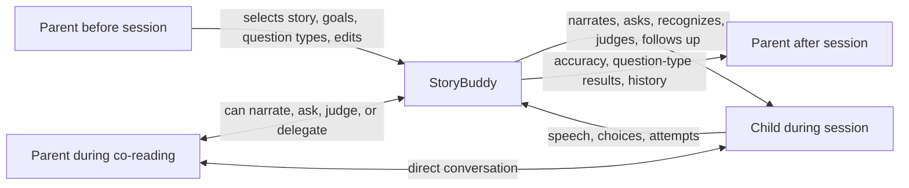

# StoryBuddy: Human–AI Collaborative Storytelling with Flexible Parental Involvement

## Report scope

This report analyzes the full 21-page CHI 2022 paper **“StoryBuddy: A Human-AI Collaborative Chatbot for Parent-Child Interactive Storytelling with Flexible Parental Involvement.”** It covers the formative research, participatory-design process, system architecture, question-generation pipeline, controlled user study, results, validity threats, and implications for CreativeOS. The paper evaluates usability and interaction patterns; it does **not** establish long-term learning gains or comparative educational efficacy.

## Bibliographic record

- **Authors:** Zheng Zhang, Ying Xu, Yanhao Wang, Bingsheng Yao, Daniel Ritchie, Tongshuang Wu, Mo Yu, Dakuo Wang, and Toby Jia-Jun Li
- **Venue:** *Proceedings of the 2022 CHI Conference on Human Factors in Computing Systems* (CHI ’22), Article 218
- **Length:** 21 pages
- **DOI:** [10.1145/3491102.3517479](https://doi.org/10.1145/3491102.3517479)
- **Preprint:** [arXiv:2202.06205](https://arxiv.org/abs/2202.06205)
- **Paper type:** Research-through-design system paper with formative interviews, participatory design, prototype implementation, and a remote user study
- **Primary audience:** Families with children aged 3–8

## Executive summary

StoryBuddy addresses a genuine tension in family reading. Dialogic reading—asking a child questions, listening, and providing responsive feedback—supports comprehension and participation, but parents may be busy, tired, unsure what to ask, or unable to track learning progress. A fully automated question-answering agent can reduce parental effort, but it can also remove the parent from an activity whose emotional value comes partly from parent–child interaction. Automatically generated questions may also be trivial, developmentally inappropriate, disconnected, or pedagogically unhelpful.

The paper responds with a **mixed-initiative, configurable division of labor** rather than a single automated mode. StoryBuddy offers:

1. a **parent–AI co-reading mode**, where the parent remains the storyteller and the system recommends questions, supports follow-ups, optionally narrates, and can judge spoken answers; and
2. an **automated bot-reading mode**, where a parent can configure questions in advance, leave the synchronous session, and review the child’s performance afterward.

This turns parental participation from an all-or-nothing variable into a set of separable responsibilities: selecting content, configuring educational goals, narrating, asking questions, judging answers, conducting follow-ups, and reviewing progress. The system can take over some of those responsibilities without necessarily taking over all of them.

The design was informed by interviews with 10 families and remote storyboard co-design with four parents. The authors then evaluated the prototype with 12 parent–child pairs. All pairs completed both modes. Parents used the flexibility in materially different ways: some narrated emotionally for younger children, some delegated narration, and some let older children read; some used every generated question, while most selected only questions they believed their child could understand. In the automated mode, half used the default question settings and half modified them. Eleven of 12 children interacted with the chatbot, but persistence after a rejected answer was limited: six tried only the first question and moved on, three made one retry, and only two persisted until acceptance.

Parents perceived value for language learning, reading-skill practice and assessment, and workload reduction. Ten said the system could reduce their storytelling burden; nine discussed the value of personalization. They also identified serious weaknesses: child speech recognition errors, buttons too small for children, visually plain presentation, question difficulty mismatched to age, slow guidance for advanced readers, and interruptions to the family’s normal reading rhythm.

The strongest research contribution is not the particular QAG model. It is the model of **partial automation plus asynchronous parental control**. Parents contribute contextual knowledge the system lacks—developmental level, family practice, interests, goals, and current availability—while AI contributes scalable question generation and repetitive execution. For CreativeOS, this suggests designing creation and storytelling as a set of transferable roles, preserving caregiver agency, and allowing “configure before / review after” participation when live participation is impossible.

The evidence remains preliminary. The sample is small, highly educated, and university-connected; the sessions were remote and short; the supposedly parent-absent mode still had the parent physically present; novelty was not controlled; no learning outcomes were measured; and the paper reports no quantitative evaluation of question quality, speech-recognition accuracy, or answer-classification accuracy in the deployed system.

## Problem formulation

### Why interactive storytelling matters

The paper positions interactive storytelling as more than oral narration. In dialogic reading, a child is prompted to recall events, infer motives, predict outcomes, and explain ideas. That active participation can support oral language, narrative comprehension, later literacy, and parent–child bonding.

Children aged 3–8 span at least two developmentally different reading stages:

- **pre-reading children** depend more on spoken narration, pictures, and listening comprehension; and
- **early readers** increasingly decode text and can lead parts of the reading themselves.

StoryBuddy therefore allows narration by a parent, the agent, or the child rather than assuming one fixed reading pattern.

### Why a fully automated agent is insufficient

The authors identify three failures of AI-only question generation:

1. Generated questions can be syntactically and factually valid but educationally trivial, irrelevant, linguistically difficult, or poorly matched to a child.
2. Removing parents sacrifices contextual judgment and the relational value of shared reading.
3. Asking a disconnected list of questions provides weak conversational continuity and little guidance after confusion or an incorrect answer.

The resulting design question is not “parent or AI?” but “which participant should control which part of the activity, under which circumstances?”

## Research program and methodology

The project has three empirical/design phases.

### Phase 1: formative study with 10 families

The authors conducted approximately 60-minute video interviews with 10 families whose children were 3–8 years old. Recruitment covered two Western U.S. communities: a university-connected population described as predominantly White and Asian, and a working-class, Spanish-speaking community. The paper’s participant table lists all formative parent participants as female.

The interviews explored family storytelling practice, technology use, perceived opportunities and risks, and desired forms of AI support. Four key insights emerged:

- **Educational value was salient:** 9 of 10 families valued educational affordances, including language access and lower-cost learning support.
- **Interactivity was preferred:** 8 of 10 preferred interactive rather than passive storytelling technology.
- **Technology could mediate family interaction:** 6 of 10 believed it could promote parent–child interaction rather than merely occupy the child.
- **Parents act as curators:** families wanted control over content, question difficulty, learning goals, and the child’s exposure.

### Phase 2: participatory design with four parents

Four mothers with children aged four or older joined remote, one-hour storyboard sessions and received $25. Three were fluent English-as-a-second-language speakers. The researchers varied two factors across four storyboard concepts:

- whether the parent was present or absent during reading; and
- whether the interface was a screen/tablet or smart speaker.

The sessions produced six design strategies:

1. **DS1 — Alternate roles and interaction patterns** to sustain engagement.
2. **DS2 — Assist parents in generating questions** to reduce cognitive load.
3. **DS3 — Support different goal priorities**, especially engagement versus educational assessment.
4. **DS4 — Provide coherent follow-up questions** organized around a theme or narrative entity.
5. **DS5 — Offer different configuration granularities**, from defaults to fine-grained editing.
6. **DS6 — Combine synchronous co-reading with asynchronous setup and tracking**, accommodating changing parent availability.

These findings are important because they reveal conflicts rather than a uniform preference. Parents wanted to remain emotionally present yet also wanted the system to cover moments when they were busy. Some wanted assessment controls; others wanted a low-friction entertainment experience. The design deliberately makes advanced configuration optional.

### Phase 3: user study with 12 parent–child pairs

The evaluation recruited 12 U.S.-based pairs through university mailing lists and snowball sampling. Children were 3–8 and all participants were fluent in English; eight parents used English as a second language. Each pair received a $50 gift card. The institution’s IRB approved the study.

Each remote Zoom session lasted about one hour. After consent, demographics, an introduction, and a four-minute tutorial, each family read two books—*Three Little Bears* and *Chris P. Bacon: My Life So Far*. Every pair used both system modes, with story order and story-to-mode assignment randomized. In the automated mode, the parent was asked not to intervene, although the parent remained beside and visible to the child.

The study asked:

- whether parents could configure interactive experiences successfully;
- how parents and children behaved in the two modes; and
- whether they considered StoryBuddy usable, useful, and likable.

One researcher coded objective behaviors from all screen recordings. Two researchers independently conducted inductive thematic analysis of interview transcripts, reconciled their codebook, and achieved **Cohen’s κ = 0.81**, indicating strong agreement for the reported coding task.

## System design

### Division of labor

StoryBuddy contains five functional modules:

1. parent preference and question configuration;
2. a co-reading interface;
3. a conversational agent for narration and question-answering;
4. a progress and assessment dashboard; and
5. a back-end question-answer generation model.

### Parent–AI co-reading mode

The interface presents the story page and a panel of AI-generated questions. The parent normally narrates and decides when or whether to ask a suggested question. They can mark the child’s answer correct or incorrect and inspect related follow-ups.

Three responsibilities can change dynamically:

- **narration:** parent, agent, or child;
- **answer handling:** the child answers the parent, who judges, or speaks to the agent, which classifies the answer; and
- **follow-up:** parent asks a suggested or original follow-up, or invokes the chatbot to continue.

The parent retains pacing control, which matters in a real-time mixed-initiative workflow: recommendations can wait for a natural pause instead of forcing the parent to keep up with an automated narrator.

### Automated bot-reading mode

Beforehand, the parent can choose question types, inspect generated question-answer pairs, select which questions will be asked, and edit questions or answers. This step is optional; StoryBuddy otherwise picks the top-ranked question and follow-up for each page.

During the session, the agent greets the child, narrates each page, asks the configured question, records the child’s speech, and classifies the answer. A correct answer receives praise and a choice between the next page or another question. An incorrect answer adds a retry option. This is a constrained dialog tree, not open-ended conversation.

### Seven question types

Parents can request questions about:

- characters;
- setting;
- feelings;
- actions;
- causal relationships;
- outcomes; and
- predictions.

This taxonomy lets a parent shape the cognitive task, but the paper does not validate that a chosen question type reliably measures a distinct reading skill.

### Dashboard

The dashboard supports per-session and weekly views. It shows attempted questions, number of attempts, reference answers, overall accuracy, accuracy by question type, and the distribution of types asked.

This gives absent parents post-session visibility, but the metric should be interpreted carefully. Accuracy is partly an output of speech recognition and a rule-based intent classifier; it is not a direct or validated measure of comprehension. The dashboard can therefore expose system error as though it were child performance.

## Technical implementation

### Application stack

- responsive React front end;
- Python’s built-in HTTP server for hosting;
- storybooks represented as JSON;
- Google Cloud Text-to-Speech for narration;
- `react-simple-chatbot` for the chat UI; and
- Google Dialogflow for intent detection and answer-correctness classification.

The answer classifier is trained from a small rule-based corpus derived from each generated reference answer. Templates expand surface variations such as numeric forms and phrases like “I think …” or “I guess …”. The paper states this Dialogflow preparation takes seconds, enabling a newly generated question to become available during use. It does not report classification benchmarks, child-speech error rates, or confidence handling.

### Question-answer generation

StoryBuddy uses a QAG pipeline trained on **FairytaleQA**, consisting at the time of 922 expert-authored question-answer pairs from 46 children’s storybooks. The pipeline includes:

1. rule-based answer candidate generation;
2. BART-based question generation; and
3. ranking of generated pairs.

The model can condition generation on the seven narrative question types. The paper points to a separate FairytaleQA publication for its human evaluation and state-of-the-art claim; it does not independently evaluate model output in the StoryBuddy deployment.

### Follow-up selection

For each story section, the top three ranked questions become anchors. Remaining generated questions are eligible as follow-ups when:

- their stopword-filtered token overlap with an anchor is greater than three; and
- their answer is not already contained in the anchor text.

This lightweight heuristic creates surface-level topical continuity, but it does not establish pedagogical progression or discourse coherence. User behavior supports that concern: five parents never used the provided follow-ups, and four used them only sometimes, often skipping items that felt irrelevant or when the child became impatient.

## Results

### Completion and duration

All 12 pairs completed both assigned sessions. Parent–AI co-reading averaged approximately **18 minutes** and automated bot-reading approximately **17 minutes**.

### Reading strategies in co-reading mode

Families did not converge on a single workflow:

- Five parents used auto-reading throughout.
- Four parents of children aged five or younger narrated themselves, using more emotion and slower pacing than text-to-speech.
- Three parents of children aged 6–7 let the child lead the reading and helped with unfamiliar words.

This is strong behavioral evidence for role flexibility. It is not evidence that any strategy produced better learning.

### Use of generated questions

- Two parents asked every displayed question in order on every page.
- Seven selected only some questions, relying on their judgment of comprehensibility.
- Five never used provided follow-ups.
- Four used follow-ups occasionally.
- Two delegated follow-up questioning to the chatbot.

The counts are not presented as mutually exhaustive for every behavior, but the broad result is clear: the parent acts as a quality and developmental filter over model output.

### Configuration behavior

Six parents accepted the default question-type configuration; six reviewed and modified it. Optional complexity therefore served two distinct populations in the small sample: users prioritizing immediacy and users wanting control.

### Child behavior in automated mode

One child skipped all chatbot interaction and used only narration. The other 11 answered at least some questions:

- six attempted the first question and moved on regardless of acceptance;
- three retried once after rejection, then moved on if still rejected; and
- two persisted until the system accepted an answer.

The system did not successfully sustain rich multi-turn repair. The authors identify a need for guidance on partially correct answers; the evidence also suggests that forcing repeated recognition attempts could punish a child for ASR or classification failure.

### Perceived usefulness

Interview themes included:

- **Language learning:** four non-native-English-speaking parents saw value in pronunciation, vocabulary, and enabling non-English-speaking caregivers to facilitate English reading.
- **Reading development and assessment:** seven discussed critical reading, identifying main points, attention, and dashboard-based visibility into performance.
- **Reduced parent burden:** ten said flexible involvement and generated questions could save effort or cover moments when the parent was unavailable or tired.
- **Personalization:** nine valued question-type control and editing and requested further age-, interest-, and history-based adaptation.

Parents did not consider AI a complete replacement for shared reading. One explicitly distinguished workload support from the emotional and relational value of reading together.

### Usability and fit problems

Reported problems included:

- Google speech recognition mishearing children or ending recording too early;
- touch targets too small for children on tablets;
- a desire for a more colorful, child-oriented interface;
- questions too trivial for older children or too difficult for younger children;
- narration and guidance too slow for some independent readers;
- fixed questions after every page interrupting a family’s established story rhythm; and
- static preconfigured plans that cannot adapt to child engagement or performance during the session.

The disagreement over question timing is instructive. One parent found page-by-page questioning disruptive and preferred questions after the book; another considered in-place questions the best feature because delayed questions were harder to remember. The correct product response is configurable timing, not a universal cadence.

## Authors’ design implications

### Partial automation based on complementary capability

AI is fast at generating and presenting many candidate questions. A parent knows the child, family goals, current context, preferred pacing, and what is likely to be appropriate. The system should allocate work around those complementary capabilities.

Partial automation also creates coordination costs. A parent cannot comfortably make real-time choices if the agent controls the pace. StoryBuddy reduces that tension by leaving pace with the parent during co-reading and moving detailed configuration before the automated session.

### Asynchronous involvement

The core conceptual move is to separate presence from involvement. A parent who cannot join live can still:

- choose and edit content before the session; and
- inspect the record afterward.

This is a useful pattern beyond reading: **author policy before, delegate bounded execution, review evidence after**.

### AI role as assistant, peer, companion, or mediator

The paper argues that the AI’s role should be defined per subtask and per family goal. In co-reading it assists the parent; when speaking directly with the child it looks more like a peer or companion; it may also mediate a parent–child exchange. The system should not weaken the parent’s central relational role.

### Future directions

The authors propose:

- child-led questions answered by the agent;
- image-based questions connecting illustrations with text;
- smart-speaker support to reduce screen-time concerns;
- learning parent preferences from a few edits;
- real-time difficulty and question-type adaptation;
- age- and developmental-stage-specific pacing and language;
- classroom use and teacher dashboards;
- child-configurable agents and child-created stories;
- longer, more diverse field deployments; and
- eventual public release.

Several proposals increase safety and privacy stakes. Preference learning, performance tracking, voice input, and adaptive child profiles require explicit retention limits, parent visibility, error correction, and careful separation of engagement signals from educational diagnosis.

## Strengths

1. **Triangulated design process:** formative interviews, participatory design, implementation, behavior observation, and interviews connect user need to system feature.
2. **Realistic value conflict:** it takes parent workload and parent–child bonding seriously at the same time.
3. **Role-level flexibility:** narration, questioning, answer judgment, and follow-up are separable rather than bundled into “manual” or “automatic.”
4. **Progressive configuration:** defaults coexist with question-type selection and item-level editing.
5. **Behavioral detail:** the paper reports how users actually mixed roles rather than relying only on preference ratings.
6. **Transparent validity section:** sample and ecological-validity problems are acknowledged explicitly.
7. **Actionable mixed-initiative principles:** especially pace ownership and asynchronous involvement.

## Limitations and critical appraisal

### Evidence and generalizability

- Twelve evaluation families cannot represent the diversity of family structures, literacy practices, languages, developmental needs, or socioeconomic contexts.
- All evaluation parents had at least a bachelor’s degree, and more than half had or were pursuing graduate degrees.
- Underrepresented racial groups, lower-income families, and non-traditional family structures were underrepresented.
- University lists and snowball sampling increase selection bias toward technically comfortable participants.
- The formative phase included a more socioeconomically and linguistically varied community, but the final evaluation did not preserve that breadth.

### Ecological validity

- Sessions were researcher-observed, remote, and roughly one hour.
- The parent-absent condition did not contain an absent parent; the parent remained co-located and visible.
- Each mode was used once with one assigned story.
- Novelty may account for some engagement.
- No longitudinal evidence shows sustained family use, reduced burden over time, or whether setup itself becomes burdensome.

### Outcome validity

- The study evaluates completion, interaction behavior, and perceived value, not learning.
- There is no baseline or comparator such as ordinary co-reading, AI-only reading, or static human-authored questions.
- Session times do not indicate quality or engagement.
- Parent perceptions of reading-skill development are hypotheses, not measured gains.

### Technical validity

- The deployed QAG output is not scored for correctness, relevance, age fit, bias, or educational value.
- Dialogflow answer classification has no reported precision, recall, or child-speech robustness.
- The token-overlap follow-up heuristic is semantically weak.
- Accuracy dashboards conflate comprehension, pronunciation, ASR performance, classifier behavior, and willingness to answer.
- The system’s praise and rejection logic may present uncertain automated judgments as authoritative.

### Child-centered and ethical gaps

- Parents participated in design, but children did not co-design the system.
- The paper reports child behavior but interviews only parents after use.
- Voice and performance data introduce privacy questions not developed in the paper.
- The work predates the current generation of open-ended LLM systems; its bounded question-answering flow limits content risk in ways an LLM implementation would not inherit automatically.

## Implications for CreativeOS

### Product architecture

Model a session as permissions over discrete roles:

| Responsibility | Child | Caregiver | AI | CreativeOS recommendation |
|---|---:|---:|---:|---|
| Choose story/world | yes | yes | recommend | preserve human final choice |
| Narrate/read | yes | yes | yes | switchable at any page or scene |
| Ask a prompt | yes | yes | suggest/deliver | AI suggestions remain skippable |
| Judge an answer | reflect | yes | assist cautiously | avoid hard rejection from low-confidence speech |
| Continue/create plot | lead | co-create | elaborate | preserve the child’s premise and agency |
| Set boundaries | age-limited | yes | enforce | caregiver-visible policy, non-overridable by child chat |
| Review history | own view | yes | summarize | separate activity evidence from developmental claims |

### Interaction principles

1. **Make handoffs reversible and local.** A caregiver should delegate narration for one page without switching the entire session into an opaque automated mode.
2. **Let the human control pace when human judgment is required.** Do not ask a caregiver to approve suggestions while an agent continues speaking.
3. **Support configure-before and review-after participation.** This is especially valuable for busy caregivers, teachers, or therapists.
4. **Use progressive disclosure.** Offer safe defaults, goal-level controls, and item-level editing without requiring every caregiver to inspect every prompt.
5. **Permit question/prompt timing choices.** Per page, at scene boundaries, at the end, or child-initiated should all be possible.
6. **Design repair for system uncertainty.** Prefer “I may not have heard that” and alternative inputs over “wrong.”
7. **Treat dashboards as activity records.** Do not label classifier-derived accuracy as a reading diagnosis.
8. **Segment by developmental capability, not age alone.** Narration speed, vocabulary, question abstraction, reading autonomy, and touch-target design should be independently adaptable.

### Safety requirements for a modern implementation

A generative CreativeOS version should add controls absent from the prototype:

- age-appropriate content constraints before generation;
- clear caregiver preview for externally sourced or open-ended stories;
- uncertainty-aware answer evaluation;
- no persuasive pressure to continue after the child disengages;
- voice-data minimization and explicit retention settings;
- visibility into what was generated, modified, rejected, and shown;
- a non-voice fallback for speech differences or noisy environments; and
- escalation to a caregiver for safety-sensitive child disclosures rather than treating them as story content.

### What not to infer from this paper

StoryBuddy does not show that AI reading is equivalent to a caregiver, that question generation improves literacy, that automated accuracy measures comprehension, or that children should use an agent unsupervised. It supports a narrower conclusion: parents and children in a short study could use a configurable mixed-initiative prototype, adopted diverse divisions of labor, and perceived value in its flexibility.

## Open-source repository assessment

The paper does **not** identify an official open-source StoryBuddy repository. Its only GitHub link is to [`react-simple-chatbot`](https://github.com/LucasBassetti/react-simple-chatbot), a third-party front-end dependency, not the StoryBuddy research artifact. Exact-title, DOI, and author/project searches located the official paper/preprint but no verified first-party source repository. Accordingly, no repository was cloned for this paper.

## Bottom line

StoryBuddy’s enduring idea is configurable, partial automation around a family activity—not autonomous replacement of the caregiver. Its design separates live presence from meaningful participation and shows that families naturally choose different distributions of narration, questioning, judgment, and control. For CreativeOS, that argues for an explicit role-and-handoff architecture, caregiver policy before a session, evidence after a session, and child agency throughout. The prototype’s technical judgments and educational dashboard are much less mature than its interaction model; any modern implementation should preserve the latter while substantially strengthening uncertainty handling, privacy, child participation, and outcome evaluation.
