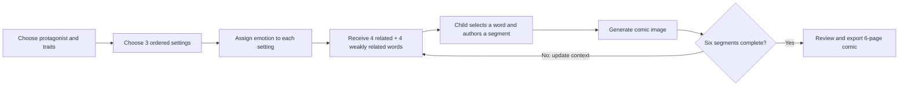

# StoryPrompt: AI-Empowered Creative Storytelling for Elementary Children

## Report scope

This report analyzes the complete CHI 2025 paper **“From Words to Wonder: Designing and Evaluating an AI-Empowered Creative Storytelling System for Elementary Children.”** It covers the formative research, prototype and model pipeline, pilot iteration, counterbalanced within-subject evaluation, quantitative and qualitative results, methodological caveats, and implications for CreativeOS. StoryPrompt uses AI to generate **fragmentary prompts and illustrations**; the children, not the language model, author the story text.

## Bibliographic record

- **Authors:** Min Fan, Xinyue Cui, Wanqing Ma, Haiyan Li, Xin Tong, Lin Yang, and Yonghui Wang
- **Venue:** *Proceedings of the 2025 CHI Conference on Human Factors in Computing Systems* (CHI ’25)
- **Location/date:** Yokohama, Japan, April 26–May 1, 2025
- **Length:** 15 pages
- **DOI:** [10.1145/3706598.3713478](https://doi.org/10.1145/3706598.3713478)
- **License:** Creative Commons Attribution-NonCommercial-ShareAlike 4.0
- **Paper type:** Child-centered design and mixed-methods comparative evaluation
- **Target users:** Elementary-school children, approximately ages 7–12 / Grades 2–6 in the final study

## Executive summary

StoryPrompt is a structured child–AI storytelling tool designed to improve creative story production without asking an AI to write the story for the child. The child first plans a protagonist, personality, three settings, and an emotional trajectory. For each of six story segments, the system supplies eight single-word prompts—four closely related to the current story and four weakly related—and the child must choose and integrate one into their own narration. The system then produces a comic-style illustration from the child-authored segment. Input can be spoken or typed.

The underlying design hypothesis is that creative storytelling needs both **global structure** and **local emergence**. Upfront selection of scenes and emotions gives the child a narrative plan. AI-generated words and occasionally surprising images create constraints and alternatives that can redirect, elaborate, or challenge that plan. The AI therefore operates as a prompt generator and visualizer, not an autonomous co-author of prose.

The project proceeded in three stages:

1. formative interviews with three Chinese-language teachers and focus groups with 18 children;
2. pilot testing with eight new children plus review by three HCI experts, followed by interface changes; and
3. a counterbalanced within-subject study in a Chinese public elementary school with 40 children in Grades 2–6, comparing StoryPrompt with paper storyboards.

Five blind expert judges scored 38 complete paired stories. StoryPrompt stories received higher aggregate quality scores than storyboard stories (**3.446 vs. 3.176 on a 1–5 scale, d = 0.41**), driven by higher creativity (**3.458 vs. 2.874, d = 0.65**) and richness (**3.574 vs. 2.968, d = 0.71**). AI-condition stories were also longer (**249 vs. 180 Chinese words, d = 0.67**). Fluency and narrative structure were slightly higher with storyboards, but not significantly so. The condition-by-order interaction was not significant.

Behavioral findings are more revealing than the overall score. Children used generated keywords in at least three ways: accepting early suggestions when they lacked an idea, repeatedly regenerating until finding a sought concept while remaining open to serendipity, or holding tightly to an original plan until facilitated. Images also played two roles: children revised text to obtain a desired visual, or incorporated unexpected visual details back into the story. In some cases, however, children shortened or changed their story merely to accommodate an inaccurate image—a direct loss of child agency.

The paper’s strongest product principle is **fragmentary AI assistance**. A noun or ambiguous picture leaves creative work for the child; a generated paragraph would perform that work. Its second strong principle is to pair a visible plan with iterative emergence. The existing interface underdelivers on the “visible” part: children could not easily review earlier content until the end, which the authors believe may help explain why storyboard stories retained slightly better fluency and structure.

The causal claim should remain narrow. The conditions differed in more than AI: StoryPrompt required a protagonist, three settings, three emotions, six segments, and repeated prompts, while the paper storyboard was less procedurally constrained. The AI condition also had more facilitator staffing, and the paper acknowledges that no child in the storyboard group had an individual facilitator. StoryPrompt’s longer and richer outputs may therefore reflect a compound package of structured workflow, AI cues, generated images, speech-to-text, novelty, and assistance—not generative AI alone.

## Research question and theoretical framing

The paper asks how to design and evaluate a generative-AI storytelling system that supports literacy and creativity in elementary children.

It draws on two complementary views of creativity:

- creativity as a **product**, assessed through the quality of the finished story; and
- creativity as a **process in an environment**, visible in how children generate, select, reject, and revise alternatives.

For product evaluation, the authors use the Consensual Assessment Technique (CAT): knowledgeable judges rate artifacts rather than applying a purely mechanical creativity formula. For process evaluation, observations and interviews identify strategies around planning, drawing, keyword selection, image regeneration, and revision.

The paper distinguishes three established interactive-storytelling patterns:

- emergent storytelling through selecting narrative elements;
- character-driven storytelling through enacting a role; and
- user-centered plot resolution through choices that alter a story.

StoryPrompt combines planned sequence with emergent detail. It also deliberately combines verbal and visual prompts because visual-only tools may disadvantage children who are less skilled at drawing or may constrain abstract, emotional, and sequential narration.

## Formative research

### Ethics and recruitment

A co-author working in elementary education helped contact a local school. Teachers and guardians received study information; teachers and guardians consented, and children assented after hearing the tasks, recording procedures, right to stop, and data handling. The authors report anonymization and secure storage. The university ethics board approved this and subsequent studies.

### Teacher interviews

Three female teachers, each with ten years of Chinese-language teaching experience, completed 30–60-minute interviews in a quiet classroom and received $30. Two researchers attended: one interviewed and one recorded notes; audio was recorded.

The teachers described developmental differences:

- Grades 1–3 emphasize vocabulary, retelling, and simple stories grounded in personal experience.
- Grades 3–6 increasingly emphasize complex narrative structure.

They endorsed purposeful questions, vocabulary hints, pictures, and references to known stories. They also emphasized forming a broad plan while retaining room for emergent creation and revision.

### Child focus groups

Eighteen children in Grades 2–4—nine boys and nine girls, mean age **8.00 ± 0.84**—participated in three six-child focus groups lasting 30–40 minutes. Sessions explored technology experience, storytelling strategies, and preferences for characters and settings.

The researchers derived four character families:

- talking animals or objects;
- magical or superpowered people;
- science-fiction characters; and
- ordinary children.

Settings were grouped as natural, fantasy, science-fiction, and everyday environments. Higher-grade children reportedly preferred science-fiction and fantasy more often; younger children more often preferred animals, objects, or themselves. Boys in this sample showed more science-fiction preference than girls. These descriptive observations should not be converted into gender defaults.

### Five design implications

1. Support difficulty levels across grades.
2. Combine structural planning with emergent, iterative storytelling.
3. Use both verbal and nonverbal generative prompts.
4. Embed purposeful guidance.
5. Ground characters and settings in genre and child preference.

The authors recommend adult support for children below Grade 3.

## StoryPrompt system

### End-to-end interaction

The application runs on a computer and can be used individually or by two to three children. The final study uses it individually.

The child:

1. selects a protagonist and personality labels;
2. chooses three ordered scenes/settings;
3. assigns an emotion to each scene;
4. receives AI-generated nouns;
5. selects a noun and relates it to the character, place, emotion, and prior plot;
6. narrates by voice or types, then edits the transcription;
7. generates or regenerates an illustration; and
8. repeats for two paragraphs per setting, producing six story segments and six images.

Guiding questions such as why the character arrived or feels an emotion can be read by a teacher for younger children or used independently by older children.

### AI-generated keyword constraints

For each iteration, ChatGPT generates:

- four nouns strongly related to the current context; and
- four weakly related nouns intended to create a harder, more divergent connection.

The two categories were hidden from children. Initial words use the selected character, settings, and emotions; later words incorporate the evolving child-authored text. Children can regenerate the set.

This is a thoughtfully bounded use of language generation. The child performs the causal and narrative integration. However, the paper does not identify the ChatGPT model/version, API parameters, prompt corpus, moderation failure rate, or reproducibility controls.

### AI-generated images

After each segment, ChatGPT extracts and expands characters, setting, and action. A trained Stable Diffusion model generates a cartoon-style image. Prompt materials combine theme words, lens terminology, style references, adjectives, and suffix phrases inspired by Midjourney prompting conventions. Children may regenerate until satisfied.

The paper does not specify the base Stable Diffusion version, fine-tuning method, training-set size or provenance, image-safety classifier, model weights, or whether character identity is explicitly conditioned across pages. Inconsistent protagonist depiction became a major observed problem.

### Other implementation details

- **Client/application:** Unity
- **Language/prompt generation:** ChatGPT API with few-shot or example-based prompt engineering
- **Image generation:** a trained Stable Diffusion model accessed through an API
- **Speech recognition and speech-to-text:** Baidu API

The “child-appropriate” keyword constraint is prompt-based: the model is asked to avoid violence and mature themes. Prompting alone is not a robust safety architecture.

## Preliminary evaluation and iteration

Eight children—four boys and four girls, Grades 1–5, mean age **8.63 ± 2.13**—tested the prototype. Four used it alone and four in pairs. All had app experience; three had prior AI-product experience. Sessions lasted 20–40 minutes in a classroom. Three child/AI HCI experts also reviewed the interface.

The pilot was explicitly diagnostic rather than a rigorous effectiveness test. Findings included:

- children learned the interface quickly but needed the scene–emotion relationship explained;
- attention and apparent engagement remained high;
- the children created six stories totaling 1,830 words and 36 images;
- younger children struggled to manage three scenes and emotions;
- keyword integration was initially difficult but became easier with practice;
- children rated the method and their stories **8.75/10**, images **7.75/10**; and
- experts requested clearer navigation, audio instruction, and sound feedback.

The team redesigned the emotion/scene interface, improved navigation and sound, reduced font size, separated story text from images, and revised facilitation to preview the whole workflow and start some children with one or two scenes/emotions.

## Final evaluation design

### Participants

Forty volunteers from one public elementary school participated:

- 30 boys and 10 girls;
- Grades 2–6;
- mean age **9.64 ± 1.18**;
- all had used computers or tablet apps;
- 31 had tried AI drawing, writing, or voice tools; and
- attitude toward AI averaged **4.50 ± 0.64 / 5**.

Self-rated creativity was excellent/good for 75% of the sample; self-rated storytelling was excellent/good for 65%. Three teachers with 1, 13, and 38 years of experience observed and were interviewed.

### Conditions and counterbalancing

After a 30-minute creative-storytelling lesson, children were randomized to one of two orders:

- StoryPrompt first, then storyboard; or
- storyboard first, then StoryPrompt.

Each task lasted 20–30 minutes. Both offered a fixed menu of protagonists and up to three of seven locations. The storyboard condition provided a six-slot sheet, drawing and writing tools, and printed characters/scenes. Children could draw, note, write, and orally tell the resulting story to a facilitator, who transcribed it. StoryPrompt used voice and text with a nearby technical facilitator.

Eight facilitators were present: four assigned to AI, two to traditional storytelling, and two to logistics and photography. Scripts aimed to standardize support. This staffing asymmetry is a substantial confound, particularly because the authors acknowledge that storyboard children did not receive individual facilitators.

### Artifacts and rating

Children produced 40 complete StoryPrompt stories and 38 complete storyboard stories; two children failed to complete the latter and were excluded from paired quantitative analysis. Their AI-condition qualitative data were retained.

Six experts helped establish the rating process; one creative-writing expert did not participate in final scoring, leaving five raters. The panel represented Chinese-language teaching, creative writing, education, and HCI. They scored mainly the story texts from 1–5 on:

- creativity;
- richness;
- fluency; and
- narrative structure.

The raters were blinded to condition. They jointly calibrated on 14 of 78 stories (18%), reporting **92.86% consistency**, resolved disagreements, and then rated independently. The paper does not define “consistency,” provide an intraclass correlation, or report reliability for the full rating set.

### Analysis

The authors average ordinal ratings across five experts and treat the result as continuous. They use paired-sample t-tests for word count and ratings, paired tests for phase effects, and a two-way ANOVA for time × condition/order. Observations, recordings, and interviews undergo thematic analysis by three researchers, supplemented by behavior counts.

## Quantitative results

| Outcome | StoryPrompt | Storyboard | Mean difference | Test/result |
|---|---:|---:|---:|---|
| Chinese word count | 249.132 ± 100.698 | 180.000 ± 86.332 | +69.132 | *t*(37)=4.153, *p*<.001, *d*=0.67 |
| Overall quality | 3.446 ± 0.454 | 3.176 ± 0.663 | +0.270 | *t*(37)=2.524, *p*<.05, *d*=0.41 |
| Creativity | 3.458 ± 0.546 | 2.874 ± 0.825 | +0.584 | *t*(37)=3.997, *p*<.001, *d*=0.65 |
| Richness | 3.574 ± 0.572 | 2.968 ± 0.805 | +0.605 | *t*(37)=4.349, *p*<.001, *d*=0.71 |
| Fluency | 3.421 ± 0.476 | 3.458 ± 0.636 | −0.037 | not significant |
| Narrative structure | 3.332 ± 0.529 | 3.405 ± 0.660 | −0.073 | not significant |

The condition-by-time/order interaction was not significant: **F(1,72)=0.425, p=.517, η²=.006**. AI remained higher on aggregate quality in both phases, but children who used StoryPrompt first performed especially poorly when they later moved to paper. The authors infer an engagement contrast: after AI, paper felt less motivating. This is plausible but not causally established.

The reported phase comparison contains a likely inconsistency: **t(38)=0.491, p=.627** is paired with **d=.796**, which is implausibly large for that test statistic and the very close means (3.340 vs. 3.283). This should be treated as a reporting error unless corrected elsewhere.

## Storytelling-process results

### Planning

In the storyboard condition:

- 20 of 38 actively or partially planned in advance;
- six began planning while drawing; and
- 12 did not plan.

In StoryPrompt:

- 22 planned or partly planned before authoring; and
- 16 began forming the plan after seeing generated keywords.

Because StoryPrompt requires selections before prose, every child performs some structural setup even if they do not experience it as planning.

### Personal identification and prior media

In paper storytelling, 24 of 38 (63.16%) described treating themselves as the character and using personal experience; some also drew on animation, novels, movies, or news. In StoryPrompt, 33 of 38 reported self-identification and use of personal or media references. The paper does not isolate whether this difference comes from the interface, interview response, or condition order.

### Drawing strategies

Children used three sequences:

- draw, then tell/write;
- tell/write, then draw; or
- alternate.

Younger children more often drew first; older children more often started with language. Children said drawing made abstract content concrete, inspired detail, supplied references, and supported organization. But it demanded skill, consumed time, was hard to revise, and could lock the story to whatever was already drawn. Two children spent enough time drawing/coloring that they did not complete the task.

### Keyword strategies

Three patterns appeared:

1. **Accept and build:** children with few initial ideas accepted early words and let them initiate or expand the story.
2. **Search but stay open:** most regenerated purposefully for a desired concept but adopted an unexpected alternative when it was interesting.
3. **Protect the original plan:** a few repeatedly searched yet resisted changing direction until a facilitator intervened.

Children initially found word integration difficult. A prompt from facilitators—consider how the character obtained the object or arrived at the scene—helped them treat integration as causal reasoning. Most preferred closely associated words, but more than half described wanting words that were both logical and capable of adding something new. Success at integrating a seemingly nonsensical word produced visible satisfaction.

This is a key learning mechanism: difficulty is not necessarily a UX failure if it is legible, bounded, and followed by effective scaffolding.

### Image strategies

All children engaged with image generation. Two creative loops emerged:

- **Text-to-image alignment:** children added details, rephrased ambiguous terms, and regenerated to make the image match the story.
- **Image-to-story elaboration:** children adopted unexpected visual properties or changed character roles based on the image.

Examples include a child adding “heavy footsteps” and “a big shadow” to obtain the intended framing, another resolving Chinese lexical ambiguity after a flower became a calico cat, and a child changing an alien from villain to helper because the generated alien appeared friendly.

The reverse failure also occurred: after repeated generation errors, some children reduced or altered their story so it would match the available image. The optimization target silently shifted from expressing the child’s idea to satisfying the model.

## Preferences and teacher response

All 38 children with completed storyboard interviews named drawing as their favorite aspect, yet 20 said drawing skill, time, or expressiveness limited them.

All 40 said they wanted to use StoryPrompt again, although the authors appropriately flag novelty and an already positive AI attitude. Favorite features were:

- generated images: 33 children;
- generated keywords: 8;
- character/scene selection: 8; and
- speech-to-text: 7.

Children also reported image mismatch or incoherence (eight), wanted more personalized words (six), and requested more characters/settings (three).

All three teachers saw motivational and classroom potential. They valued selectable structure and the ability to vary word constraints. They also worried about inconsistent character images and wanted more direct image control.

## Authors’ interpretation

### Structure plus emergence

The authors argue that a global plan constrains AI uncertainty while generated prompts create local alternatives. StoryPrompt’s higher creativity and richness are consistent with that account, but its weaker—though nonsignificant—fluency and narrative structure reveal a tradeoff. Children could review paper notes and drawings holistically, while StoryPrompt exposed earlier content poorly and AI cues could pull the story off course.

The recommended fix is persistent overview and frequent review, not less creativity: show the complete plan and prior segments, remind the child of goals, and make story elements navigable or tangible.

### Text and image as a cyclic process

Fragmentary words support initiation and elaboration. Images motivate and externalize the current story, but are not just output: unexpected visuals can feed new details into language. The process becomes plan → author → visualize → inspect → revise rather than a one-way pipeline.

### Dynamic allocation of agency

Children wanted control, but some productive creative challenge came precisely from AI-selected constraints. Agency should therefore vary by subtask:

- AI may choose a surprising noun; the child decides whether and how it matters.
- The child should be able to specify visual details and style.
- AI should not force the child to rewrite around model failure.
- Teachers should be able to tune difficulty through semantic distance, emotional trajectory, and number of scenes.

## Strengths

1. Keeps prose authorship with the child rather than outsourcing the central learning activity.
2. Connects formative findings to concrete interface features and then revises from pilot use.
3. Uses within-subject counterbalancing to reduce stable individual differences.
4. Evaluates both artifact quality and process strategy.
5. Reports effect sizes and confidence intervals for primary significant outcomes.
6. Treats image mismatch as both possible inspiration and possible constraint.
7. Recognizes novelty and avoids interpreting preference as effectiveness.
8. Provides actionable guidance on structural planning, fragmentary prompts, multimodality, and agency.

## Limitations and critical appraisal

### Comparison confounds

StoryPrompt is not “paper plus AI.” It differs through mandatory planning, fixed segment count, generated cues, generated images, speech-to-text, editing affordances, and novelty. The study estimates the effect of that package.

Facilitation was unequal: four facilitators supported AI, two supported paper, and the authors explicitly state that storyboard participants lacked individual facilitation. The AI workflow also embedded guiding questions and required six completed segments. These differences may increase completion, word count, and elaboration independently of AI generation.

### Measurement concerns

- Creativity and richness may correlate with word count; the analysis does not control for length.
- Ordinal ratings are averaged and analyzed parametrically without robustness checks.
- Calibration consistency is not defined using a standard inter-rater statistic.
- The final five-rater reliability is not reported.
- Blinding may be imperfect if artifact style or narration structure reveals condition.
- Multiple outcomes are tested without correction for multiplicity.
- The time-effect Cohen’s *d* appears erroneous.
- The two incomplete paper stories create condition-specific attrition.

### Scope and generalizability

- The final study uses one public school and 40 children, with a 3:1 boy–girl imbalance.
- Participants already liked AI and most had used AI products.
- The study does not analyze grade, age, prior ability, AI experience, gender, or literacy as moderators.
- A 20–30-minute task cannot establish learning, transfer, or enduring creativity development.
- Children create Chinese-language stories; results may not transfer directly to languages with different morphology, speech recognition, or educational practice.

### Technical and ethical gaps

- Exact foundation models, versions, prompts, seeds, moderation layers, and fine-tuning data are not disclosed sufficiently for replication.
- Safety relies largely on prompting ChatGPT for nonviolent, non-mature words.
- Image-model data provenance and style rights are not discussed.
- Voice data flows through Baidu; retention and vendor handling are not described.
- No accessibility evaluation covers speech differences, motor needs, reading disability, or neurodivergence.
- Children are research participants but are not reported as design partners in deciding the final AI role.

## Implications for CreativeOS

### Preserve the locus of creative work

The best transferable design is the **prompt granularity ladder**:

| AI assistance level | Child’s remaining work | Recommended use |
|---|---|---|
| Single word / object | invent causal relation and prose | default divergent prompt |
| Question | reflect and decide | scaffolding or repair |
| Image draft | interpret, critique, revise | visualization loop |
| Sentence starter | complete language and idea | literacy support when needed |
| Full paragraph | mainly select/edit | avoid as default for creative learning |

CreativeOS should begin with the least generative assistance likely to unblock the child and allow escalation, with the level visible to caregivers and educators.

### Combine a persistent story map with local play

StoryPrompt’s weakest interaction-design choice was making previous content hard to review. CreativeOS should maintain a continuously visible map:

- protagonist and goals;
- ordered scenes;
- emotional or causal trajectory;
- open plot threads;
- child-authored constraints; and
- generated suggestions accepted, changed, or rejected.

The child should be able to zoom between overview and scene detail without losing work or narrative intent.

### Make surprise tunable

The strong/weak association split is more useful than an opaque “creativity” button. Offer an explicit semantic-distance control with child-friendly labels such as **fits easily**, **small twist**, and **wild card**. Do not infer the child’s ability from grade alone; let a teacher set defaults and let the child adjust within safe bounds.

### Protect intent from image-model failure

When an image mismatches, preserve the story as authoritative. Offer:

- direct editing of character identity, count, pose, setting, and important objects;
- locked character references across scenes;
- a “the picture is wrong” feedback path that does not modify prose;
- partial image editing rather than full regeneration; and
- optional use of the mismatch as a creative prompt, never a forced correction.

### Evaluate the mechanism, not only the package

A stronger CreativeOS experiment should factorially or sequentially compare:

1. structured planning alone;
2. planning + word prompts;
3. planning + images;
4. planning + words + images; and
5. equivalent human-curated prompts.

Use equal facilitation, fixed task time, preregistered primary outcomes, standardized reliability metrics, word-count-adjusted analyses, and delayed transfer tasks without AI. Measure authorship perception, idea diversity, narrative coherence, revision quality, and whether children can reuse the technique independently.

### Safety and privacy requirements

- Use deterministic child-safety filtering in addition to model prompts.
- Minimize and locally process voice where possible.
- Disclose model/provider changes because outputs may drift.
- Log generated suggestions for caregiver review without retaining raw child audio by default.
- Prevent the system from generating adult themes even when a child’s story contains ambiguous terms.
- Avoid profiling creativity or literacy from one session.

## Open-source repository assessment

Neither the CHI 2025 paper nor its cited CHI 2024 StoryPrompt precursor identifies an official open-source implementation. The paper links high-resolution figures through Google Drive, not source code. Exact-title, DOI, author, and project-name searches located the publications but no verified first-party repository or released model weights. No repository was therefore cloned for this paper.

## Bottom line

StoryPrompt provides credible evidence that a carefully structured package of planning, fragmentary AI words, generated images, speech input, and facilitation can produce longer stories judged more creative and rich than a paper-storyboard activity in a short classroom study. It does not prove that generative AI alone improves creativity or literacy. Its most valuable lesson for CreativeOS is architectural: let the child own the story, use AI to introduce small and tunable provocations, keep the global plan visible, and make image generation answer to the child’s intent rather than the reverse.
