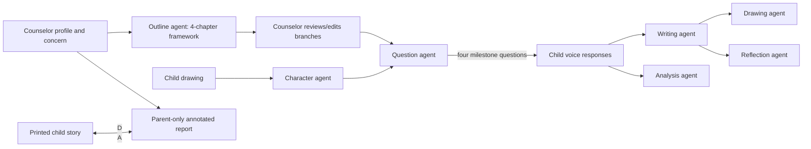

# TaleBot: Tangible AI Storytelling for Children’s Resilience Cultivation

## Report scope

This report analyzes the full 26-page preprint **“TaleBot: A Tangible AI Companion to Support Children in Co-creative Storytelling for Resilience Cultivation,”** including its image-only prompt templates and detailed appendices. Because the system handles children’s personal adversity, diagnoses, emotional disclosure, and AI-generated psychological interpretation, the report distinguishes interaction-design promise from evidence of mental-health benefit and examines the work’s safety, privacy, and validity risks in depth.

## Bibliographic record

- **Authors:** Yonglin Chen, Jingjing Zhang, Kezhuo Wang, Pengcheng An, and Xueliang Li
- **Affiliations:** Southern University of Science and Technology; Picto AITech
- **Publication status:** arXiv preprint, version 1, submitted February 26, 2026
- **Length:** 26 pages
- **Identifier:** [arXiv:2602.23095](https://arxiv.org/abs/2602.23095)
- **DOI:** [10.48550/arXiv.2602.23095](https://doi.org/10.48550/arXiv.2602.23095)
- **Paper type:** Formative stakeholder research, research-through-design prototype, and exploratory school deployment
- **Population:** 12 children aged 7–8 selected through a school counseling context; one school counselor/mental-health teacher; five parents representing six of the children
- **Important status note:** The PDF does not identify a peer-reviewed venue. Its running header repeatedly says “Trovato et al.,” which does not match the authors and appears to be an uncorrected template or production error.

## Executive summary

TaleBot is a teacher-mediated storytelling system intended to help young children discuss everyday adversity indirectly. Before a session, a school counselor creates a child profile from known personality, psychological needs, and recent events, then uses an AI tool to turn those facts into a four-chapter story outline. During the session, the child draws a protagonist and answers four questions about what that protagonist would do. A seven-agent pipeline turns the drawing, outline, and answers into an illustrated story. The child takes a printed version home; parents separately receive a digital version annotated with the counselor’s comments and an AI-generated psychological interpretation and parenting advice.

The system is intentionally not a stand-alone chatbot. A counselor selects the issue, edits the story structure, remains with the child, interprets behavior, guides responses, and reviews the resulting material. The child-facing tablet is placed in a 3D-printed, furry animal enclosure with animated eyes and mouth, giving it the feel of a tangible companion.

The formative study interviewed seven experienced adults: a child psychiatrist, four counselors, and two elementary teachers. They described children’s adversities as embedded in family control, academic pressure, peer relations, teacher conflict, and emotional regulation. They emphasized listening before judging, fictional or projective methods, support during adversity, and collaboration across school and family. They also warned that parent behavior may be a cause of distress and that adults may resist professional feedback.

The deployment involved 12 children, all 7–8 years old, who were already seeking counseling or were referred by teachers. Each story mirrored a known concern: examination anxiety, peer exclusion, teacher misunderstanding, homework conflict, emotional dysregulation, rule-breaking, high parental expectations, ADHD, a tic disorder, or physical aggression. Children’s responses sometimes revealed identification with the character and concrete coping ideas. Direct problem solving dominated the coded responses; avoidance, distraction, positive reframing, and support seeking appeared less often. The single counselor believed the fictional framing made sensitive conversations easier. Five parent interviews suggested that printed stories sometimes initiated conversations and that annotated reports prompted reflection on overcontrol, sibling comparison, praise, and family communication.

The child questionnaire produced a reported mean usability score of **81.09 ± 9.80**, described as excellent. This is a usability result only. The study has no comparison condition, pre/post resilience measure, clinical outcome, behavioral follow-up, or long-term observation. The authors correctly state that no conclusion should be drawn about resilience growth.

The system’s most serious issue is visible in the appendix prompts. The outline agent is told to create a “positive” branch with an ideal outcome from “rational, value-based decisions” and a negative branch with an unfavorable outcome. The writing agent is instructed that when a child’s choice is not positive or aligned with “universal values,” it should gently criticize the choice and redirect the story to the preset framework. Therefore, the children’s answers are not merely elicited and reflected: the system normatively steers them. The dominance of direct problem solving cannot be treated as an unbiased measure of natural coping, and a child’s alternative or short-term protective response may be reframed as wrong.

The AI analysis agent is even higher risk. It is prompted to act as a “child psychology specialist,” identify anxiety, fear, control, and relationship patterns, connect story answers to known real-life circumstances, and give parents actionable advice. A short instruction to avoid heavy clinical terminology does not make this a validated assessment tool. Its output was delivered beside the human counselor’s comments, and at least one parent treated it as accurately capturing a child’s emotional state. Although the authors later call the AI text provocative rather than professional, the prompt, presentation, and parent response can confer clinical authority.

For CreativeOS, TaleBot’s valuable pattern is **professional-authored fictional distance**: use a story character to make difficult topics discussable, while a trained adult owns the goal, monitors the interaction, and follows up. The unsafe pattern is turning sparse story choices into psychological analysis, parent surveillance, or moralized branching. A production system should support expression and conversation, never diagnose, score resilience, or silently funnel a child toward an adult-preferred answer.

## Problem framing

The paper defines resilience as a dynamic capacity to maintain or regain functioning through challenges using internal and external resources. It shifts attention from extraordinary trauma to everyday adversities such as setbacks, performance pressure, peer conflict, and family rules.

Its argument has three parts:

1. Resilience is developed through situated experience and reflection, not only lectures after a crisis.
2. Storytelling offers psychological distance: a child can discuss what a fictional protagonist feels or does before speaking directly about themselves.
3. AI can make these stories responsive and personalized, but responsible use requires teachers, counselors, and parents.

The paper does not study trauma treatment or a clinical intervention. The deployment concerns everyday adversity in a school counseling room, though some participant profiles include diagnosed ADHD, a tic disorder, physical aggression, and significant emotional vulnerability.

## Formative study

### Participants and method

Seven adults were interviewed for 30–60 minutes:

- one child psychiatrist with 26 years of experience;
- three independent child/adolescent counselors with more than ten years each;
- one school counselor; and
- two homeroom teachers with more than 25 years each.

Interviews covered common adversity, adaptive and maladaptive coping, current intervention, and digital resilience education. Audio was recorded with consent. The authors report an iterative thematic process of coding, categorization, and theme formation, but do not give participant demographics, coder count, a codebook, quotations by stable participant ID, reflexivity, saturation, or reliability.

### Five formative findings

1. **Adversity spans family and school.** Examples include strict schedules and phone rules, family conflict, pressure, peer tensions, and being wrongly accused by a teacher.
2. **Support should begin with the child’s perspective.** Adults should help children name and elaborate feelings before interpreting the situation.
3. **Adversity can support growth only with adequate support.** Repeated negative feedback can reinforce helplessness; challenge alone is not resilience education.
4. **Existing roles are fragmented.** Teachers lack time, counselors may enter too late, parents may expect professionals to “fix” family-rooted problems, and communication among adults is weak.
5. **A child-centered system should support voluntary expression, role-play, personalization, and adult participation.**

### Requirements and a reporting inconsistency

The paper says the findings yield **five** design requirements but enumerates only four:

- personalized story structure;
- enjoyable, child-friendly storytelling;
- role-playing for expression; and
- a multi-stakeholder platform.

There is no listed DR#5. This is likely an editorial omission and makes the claimed traceability less precise.

## System architecture

### Human and system workflow

### Interfaces and physical form

The **expert-facing backstage** is a React web application. A counselor enters a short setting/plot description, generates a four-chapter outline, previews branches, edits details, and deploys the task.

The **child-facing frontstage** is a Flutter application with a Python Flask back end. It runs on an iPad housed in a custom 3D-printed PLA shell covered with soft, furry fabric. A split screen shows animated eyes/mouth above the operational area; “thinking” and “speaking” animations cover generation and narration states. The child can place it on the table or hold it.

The paper attributes soothing and stronger social presence to the fuzzy enclosure, but does not compare it with a bare tablet or measure touch, comfort, attachment, disclosure, or social presence. Those effects remain design intentions.

### Seven-agent pipeline

| Agent | Input/function | Output/user |
|---|---|---|
| Outline | counselor’s situation/plot | four-chapter framework and branches |
| Character | child’s drawing and name | picture-book protagonist image and description |
| Question | outline, chapter, protagonist | brief question at each milestone |
| Writing | outline, question, child answer, character | complete chapter prose |
| Drawing | chapter prose and character image | four-panel scene illustration |
| Reflection | full story and purpose | title, abstract, praise, summary |
| Analysis | personal situation, story, questions/answers | emotional interpretation and 2–3 parent tips |

The system uses:

- **DeepSeek V3** for Chinese text generation;
- **OpenAI GPT-Image-1** for character and story illustration;
- **Tencent ASR** for child speech recognition; and
- **Doubao voice synthesis** for narration.

The paper reports 5–10-second average generation delays. It does not describe orchestration code, model parameters, moderation, failure recovery, data routing/retention, provider agreements, logging, or clinical safety review.

## What the prompts actually instruct

The appendix materially changes the interpretation of the system.

### Outline agent

It is told to make a child-friendly narrative with inciting event, conflict, development, and conclusion. At a branch, it constructs a positive choice and a negative choice. The positive branch should represent an ideal outcome from rational and value-based decisions; the negative branch is explicitly unfavorable.

This hard-codes a moral pedagogy into narrative structure. It may be appropriate for a counselor-authored lesson, but it is not neutral exploration.

### Question agent

It recaps prior events and produces brief, vivid, thought-provoking questions. At endings it should generate reflective questions without direct answers. This is broadly aligned with dialogic scaffolding.

### Writing agent

The writer is told to prioritize the child’s direction when it only slightly diverges from the outline. But if a choice is “not positive” or does not align with “universal values,” the generated story should gently criticize the choice, tell children the behavior is wrong, and return to the framework.

This creates three risks:

1. “Universal values” are undefined and culturally/normatively loaded.
2. Avoidance, delay, seeking distance, or refusing an adult may be adaptive in some contexts.
3. The child may learn that disclosure is accepted only when it matches the expected coping script.

### Character and drawing agents

The character prompt classifies a hand-drawn figure as animal, boy, girl, or other, then generates one centered full-body character with a negative prompt for image artifacts. The story illustration prompt produces a borderless four-panel image and asks for no text.

No prompt addresses sensitive visual content, identity preservation, racial/cultural representation, or what happens when a drawing does not fit binary gender assumptions. Children observed missing details, inconsistent glasses, erroneous text, and visual–narrative mismatch.

### Reflection agent

It generates an attractive title, suspenseful abstract, praise, and a short child-oriented evaluation. This is not psychological reflection despite the name; it is a publication/closure layer.

### Analysis agent

The analysis prompt declares the model a child-psychology specialist. It receives the known personal situation, full story, and question-answer history, then must:

- identify emotions and behaviors;
- look for anxiety, fear, happiness, control, and relationship dynamics;
- connect answers to real-life circumstances; and
- provide two or three immediate parenting suggestions.

The only explicit restrictions are concision, limited clinical terminology, and a positive/supportive focus. It is not instructed to express uncertainty, avoid diagnosis, distinguish observation from inference, check for contradictory evidence, detect abuse or imminent risk, defer to a qualified professional, protect child confidentiality, or avoid sharing a disclosure with a potentially implicated caregiver.

## Deployment method

### Participants and selection

The study occurred in a public elementary school serving roughly 1,000 students with two mental-health education teachers. One counselor participated.

Twelve children—six girls and six boys, mean age **7.333 ± 0.492**—were recruited over three weeks from:

- children already seeking counseling; and
- children recommended by homeroom teachers for possible psychological needs.

The counselor spoke with children, confirmed interest, and contacted parents for consent. The paper does not detail a formal child-assent script for this phase, withdrawal handling, mandatory-reporting procedure, or how the power relationship with teachers affected voluntariness.

Five parents participated, representing six children because one parent had twin daughters. Thus the parent analysis covers only half the child sample and only five adult perspectives.

### Personalization

The counselor assembled a profile using personality, current psychological situation, recent adversity, and when necessary the homeroom teacher’s input. The appendix publishes de-identified but sensitive summaries, including “diagnosed tic disorder,” “diagnosed ADHD,” “severe behavioral issues, physical aggression,” “emotionally fragile,” and “rule violation.”

The counselor and researcher converted each profile to an outline, sometimes adding later branches based on possible answers.

### Session procedure

The counselor introduced the device, demonstrated a one-chapter story, and remained alone with the child while the researcher recorded from equipment and waited next door. Recording included iPad screen capture, GoPro video, and audio.

The child had up to 20 minutes to draw and iteratively generate a protagonist. TaleBot then asked one milestone question before each of four chapters. The counselor encouraged, explained, asked follow-up questions about real life, and provided psychological guidance. At the end, the counselor administered a child usability questionnaire verbally and through gestures, asked open-ended questions, praised the child, and ensured a positive departure.

Children received a printed story. Parents received a separate annotated digital report containing exact responses, counselor analysis/advice, and AI analysis/advice. Parent interviews occurred one week later.

## Data and analysis

Collected data included child responses, questionnaire items, screen/audio/video records, counselor interviews, and parent interviews.

Two bilingual researchers open-coded the material in English, jointly affinity-mapped themes, and involved two additional authors in refinement. The first two then applied the framework. They report **164 open codes and 15 themes**. No intercoder reliability, negative-case procedure, translation validation, member checking, or distinction between child, teacher, and parent code counts is reported.

The 48 milestone responses were mapped to an existing child coping framework. Categories were problem-focused coping, positive reframing, distraction, avoidance, and support seeking.

The questionnaire is a 13-item “System Usability Scale for Children,” not the standard ten-item adult SUS wording. The counselor explained items and observed gestures for children who struggled. The paper applies standard usability benchmarks to the resulting aggregate without fully describing scoring or validating equivalence under assisted administration.

## Results

### Story contexts

Stories mainly occurred at school: classrooms, playgrounds, exam rooms, and teacher offices; two bridged school and home. The authors group concerns into:

- academic-performance anxiety;
- emotional dysregulation;
- peer interaction; and
- behavioral compliance/authority conflict.

Ten children drew human avatars; two chose animals. All protagonists were intentionally similar in developmental stage to their child creator.

### Usability and experience

The reported score was **81.09 ± 9.80**. The Shapiro–Wilk test was **W=.973, p=.943**, though normality adds little because the analysis is descriptive and *n*=12.

Some children said they would need adult help or reading skill. One child disliked drawing and forgot what came next; family limits on tablet use reduced intended future use. Images omitted narrative cues, inconsistently portrayed attributes, and sometimes created ambiguous emotional signals. Five named children experienced image inconsistency or visual error.

The study does not report session duration, ASR failures, model refusals, unsafe outputs, number of regenerations, latency distribution, or how much counselor repair was required.

### Expression and identification

Children sometimes directly identified with the protagonist or related the scene to classmates. One said they also would not dare to admit unfinished homework; another recognized their own earlier shyness. Children also rejected protagonist behavior, such as slamming a table.

These moments support the claim that a fictional layer can elicit discussion. They do not establish that AI caused disclosure: the story was already personalized from counselor knowledge, and the counselor actively asked real-life follow-ups in a trusted relationship.

### Coping responses

Across 48 answers:

- direct problem solving was recorded for every child and dominated the codes;
- cognitive decision making and seeking understanding occurred occasionally;
- positive and optimistic thinking were rare;
- deep breathing/physical emotional release appeared twice for one child;
- distraction appeared once;
- avoidant action appeared three times;
- repression appeared once; and
- seeking emotional support appeared once.

Control, wishful thinking, and action-oriented support seeking were not found.

The distribution is descriptive, not a psychological profile. Prompts, counselor facilitation, pre-authored scenarios, binary branch values, and writer redirection all shape what answers are expressed and retained in the story.

### Counselor perspective

The counselor used praise, normalization, small talk, personal analogies, and direct follow-up. She believed the playful scenario reduced the didactic feeling of counseling and sped rapport. She preferred TaleBot’s structured, real-world connection over sand play and saw story responses as potential evidence when parents resisted her assessment.

That last framing is risky. A generated story response is a context-dependent utterance influenced by prompts, story setup, teacher authority, and desire to please. It should initiate inquiry, not serve as objective evidence against a parent.

### Parent communication and reflection

Parents reported that children retold or shared the printed stories. Some saw the artifact as a non-confrontational route into school experiences and child decision making.

Annotated reports prompted reflection on:

- over-controlling parenting and a child’s avoidance;
- distinguishing love from praise/performance among twins;
- doing too much for children;
- comparison and scolding;
- difficulty applying resilience principles in daily life; and
- stigma around “psychological” versus “behavioral” problems.

Some wanted longitudinal AI monitoring. Others emphasized lack of human feeling and preferred counselor advice. These are visions and reactions from five parents, not evidence that monitoring would be accurate, acceptable, or beneficial.

## Authors’ discussion

### Fictional distance as an emotional buffer

The authors describe the story as an “illusory” layer through which a child can react to personally relevant adversity without direct disclosure. This is the most defensible conceptual contribution. It supports a counselor in moving between character, hypothetical action, and lived experience.

### Adaptive versus avoidant coping

The paper recognizes that avoidance can protect a child from immediate uncontrollable stress even when chronic avoidance correlates with later difficulty. It proposes gentle, dynamic alternatives rather than dismissal.

This nuanced discussion conflicts with the current writer prompt, which can criticize non-positive choices and route the plot back to the approved framework. Future design should implement the discussion’s nuance, not the appendix’s moral binary.

### Multi-stakeholder meaning-making

Stories persist across contexts: the counselor sets up and witnesses the session; the child takes an artifact home; parents reflect afterward. The authors call for systems that coordinate understanding among professionals and family without replacing human care.

Coordination also creates confidentiality tension. A child may disclose a family conflict precisely because the parent is absent. Automatically sharing exact answers and interpretations with that parent can undermine trust or create danger. The paper does not define child review, consent to each disclosure, or exceptions when a caregiver is implicated.

## Strengths

1. Treats AI as a probe inside professional support rather than a replacement therapist.
2. Begins with experienced mental-health and education stakeholders.
3. Makes story objectives editable by a counselor.
4. Uses fiction and role-play to lower the threshold for sensitive conversation.
5. Includes school and family contexts rather than ending at child–bot interaction.
6. Publishes all seven prompt templates, enabling meaningful scrutiny.
7. Reports contradictory parent attitudes and some child usability barriers.
8. Explicitly disclaims evidence of long-term psychological effect.

## Limitations and critical appraisal

### Study validity

- One counselor at one school guided all sessions and supplied nearly all professional outcome interpretation.
- Twelve selected children and five parents are too few for generalization.
- No control condition separates TaleBot from counselor-led storytelling, drawing, a static personalized book, or ordinary counseling.
- The counselor knew each child, authored the concern, remained present, prompted self-disclosure, and rated/elicited usability, creating expectancy and social-desirability effects.
- There is no pre/post measure, no validated resilience outcome, no clinical endpoint, no behavioral data, and no follow-up.
- Only half the child sample is represented in parent interviews.
- Tangibility is not evaluated separately.
- Thematic analysis has no reported reliability and codes Chinese data using English labels without a translation protocol.

### Construct validity

- Saying what a fictional character should do is not equivalent to the child’s own coping behavior.
- “Direct problem solving” may reflect the question and moral structure more than resilience.
- Story completion and usability are not resilience cultivation.
- Parent reflection is not demonstrated parenting change.
- A counselor’s impression of faster disclosure is not a measured reduction in time to rapport.

### System agency and normative steering

- The system predefines adversity from adult assessment before hearing the child in the interaction.
- Positive/negative branches encode preferred values.
- The writing agent may criticize and overwrite a child’s choice.
- The AI authors full chapters, so the artifact can make adult/model assumptions appear to be the child’s narrative.
- The system risks turning resilience into compliance with teachers, homework rules, apology, and authority.

### Clinical and ethical risk

- The analysis agent impersonates specialist expertise without validation.
- Psychological inference is based on four answers embedded in a prompted fictional story.
- AI advice appears beside counselor advice, inviting authority transfer.
- The model lacks calibrated uncertainty and escalation logic.
- Sensitive profiles and raw voice cross multiple commercial providers.
- No data-minimization, retention, deletion, encryption, access-control, or breach procedure is described.
- Sharing exact child responses with parents can violate contextual confidentiality.
- A plush, animated companion may amplify trust and disclosure without corresponding privacy protection.
- Parents’ desire for longitudinal monitoring could produce surveillance, false labeling, and self-fulfilling expectations.

### Editorial and reproducibility concerns

- The unrelated “Trovato et al.” running header appears throughout.
- Five design requirements are claimed but only four are listed.
- There is no official code, hardware design, deployment package, prompt version, model setting, or data release.
- Safety behavior and failures are not audited.
- The paper uses “physiological” in places where context indicates “psychological,” which is material in a mental-health report.

## Implications for CreativeOS

### A safer professional-mediated pattern

CreativeOS can adopt this bounded flow:

1. a trained adult selects a broad discussion goal, not a diagnosis;
2. the child sees that the story may relate to difficult feelings;
3. the child chooses fictional distance and can refuse personal questions;
4. the system reflects options without judging one as morally correct;
5. the professional conducts any interpretation;
6. the child reviews what may be shared with caregivers; and
7. the artifact records the child’s words separately from generated prose.

### Separate four kinds of content

The interface and exported book should label:

- **child-authored:** exact drawing, words, and choices;
- **AI-generated:** prose and images;
- **professional observation:** qualified counselor notes; and
- **parent reflection:** questions or plans added later.

Never merge them into a single “child story” that obscures authorship.

### Do not build an analysis agent for children

CreativeOS should not infer anxiety, attachment, diagnosis, resilience, family dynamics, or risk from story content. If professional users need notes, provide neutral transcripts and interaction metadata. Summarization should remain extractive and source-linked; interpretation belongs to a qualified human who understands the child’s context and duty of care.

### Preserve adaptive plurality

Replace positive/negative branches with tradeoffs:

- “This might help right now; what could happen later?”
- “Who could the character ask for help?”
- “Would it feel safe to try that?”
- “Is there another option?”

Avoid “universal values,” automatic criticism, and forced return to a lesson. Safety constraints should block harmful instructions, not moralize ordinary coping.

### Confidentiality and safeguarding

A child-facing mental-health story tool needs:

- explicit child assent and a persistent stop/skip control;
- explanation of what the adult can see;
- child review before normal sharing;
- a professionally defined safeguarding pathway for imminent harm or abuse;
- no automatic disclosure to a possibly implicated caregiver;
- no raw audio retention by default;
- first-party or locally hosted processing where feasible;
- role-based access, audit logs, and deletion; and
- strict prohibition on using story behavior for school discipline or automated screening.

### Evaluation standard

Before any wellbeing claim, compare professionally led versions with and without AI and with and without tangibility. Preregister outcomes; use validated age-appropriate measures; audit disclosures, distress, false inference, privacy understanding, child agency, and counselor burden; include independent clinicians and safeguarding experts; and conduct longitudinal follow-up. Usability should remain a secondary implementation outcome.

## Open-source repository assessment

The paper provides prompt templates but no source-code URL, hardware files, model artifact, or official project page with a repository. Exact-title, arXiv-ID, author, institution, and GitHub-domain searches found the official preprint and research-index records but no verified first-party open-source implementation. No repository was cloned for TaleBot.

## Bottom line

TaleBot is a compelling exploratory example of using personalized fiction as a bridge among a child, counselor, and family. It shows that a story character can help a skilled adult begin conversations that might otherwise feel accusatory or clinical. It does not show that the system builds resilience, improves mental health, or accurately interprets children. Its current prompts actively shape “correct” coping and give a language model unwarranted psychological authority. CreativeOS should retain professional mediation, fictional distance, child-created characters, and cross-context artifacts while rejecting automated psychological analysis, moralized branching, opaque authorship, and child-surveillance ambitions.
