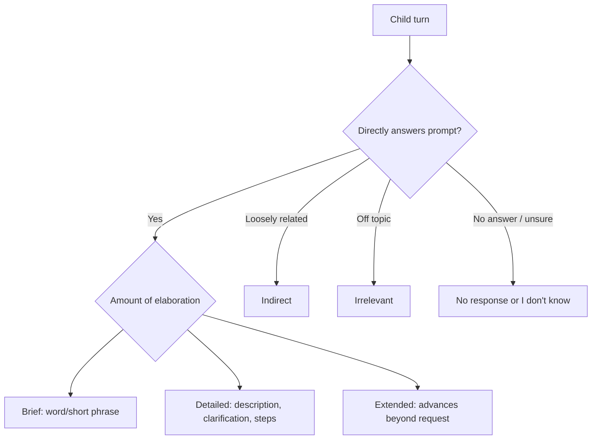

# Children’s Narrative Participation in Story Co-Creation with AI vs. Human Partners

## Report scope

This report analyzes the complete seven-page IDC 2025 work-in-progress paper **“Children’s Narrative Participation in Story Co-Creation with AI vs. Human Partners: Response Styles and Narrative Features.”** It reconstructs the comparison, response-style codebook, quantitative claims, qualitative narrative patterns, and implications for CreativeOS. Because the paper labels its results preliminary and omits key implementation and statistical details, the report separates robust descriptive observations from causal or design claims.

## Bibliographic record

- **Authors:** Xuechen Liu, Yuqing Xing, Youran Chen, Wenfei Pei, Jinshil Choi, and Ying Xu
- **Venue:** *Proceedings of the 24th Interaction Design and Children Conference* (IDC ’25)
- **Location/date:** Reykjavik, Iceland, June 23–26, 2025
- **Pages:** 803–809 / seven pages
- **DOI:** [10.1145/3713043.3731486](https://doi.org/10.1145/3713043.3731486)
- **Paper type:** Work-in-progress, between-group comparative transcript analysis
- **Institutional copy:** [University of Michigan Deep Blue](https://deepblue.lib.umich.edu/items/0df9af9d-be94-4117-8e73-32a63c565c1a)
- **Participants:** 73 English-speaking children aged 4–8 in the method section

## Executive summary

The study compares how young children verbally contribute when co-creating an oral story with either an AI smart speaker or an unfamiliar adult. Both partners establish a protagonist and setting, initiate a story, and take turns asking open-ended questions about what the character should do or what should happen next. Sessions last up to 30 minutes. Children can select a plush toy and act out the story.

The authors code each child turn by whether it answers the prompt and, for direct answers, whether it is:

- **brief:** one word or a short phrase without elaboration;
- **detailed:** a direct answer enriched with description, clarification, or stepwise reasoning; or
- **extended:** a direct answer that adds information beyond what was requested and actively continues the conversation.

Other categories are indirect, irrelevant, or no response/“I don’t know.”

The broad finding is that the human condition elicited much more direct, elaborated narrative participation. The paper’s figure indicates that roughly 61% of all AI turns were direct compared with roughly 89% of human turns; AI sessions also show substantially more no-response/uncertain turns. Among direct answers, brief answers make up a larger share in the AI condition, while detailed and extended answers make up a larger share with humans. Older children speaking with a human produced the richest extended narratives, sometimes adding setting, obstacles, dialogue, creative solutions, and sequenced events. Older children speaking to AI did not display the same degree of complexity.

The paper is useful because it goes beyond correctness and total word count. It identifies what narrative elaboration consists of: sequential action, contextual description, justification, consequence, setting, obstacle, dialogue, and solution. That vocabulary can support adaptive prompting and better evaluation.

However, the numerical presentation is ambiguous. Table 1 prints brief responses as **40.3% of AI turns and 48.9% of human turns**, which superficially contradicts the prose claim that brief answers were more likely with AI. The apparent reconciliation is that the prose compares the distribution **within direct answers**: 188/284 = **66.2%** of direct AI answers were brief versus 183/331 = **55.3%** of direct human answers. The printed percentages instead appear to use **all turns** as denominators (approximately 466 AI turns and 374 human turns). The paper does not explain this denominator change.

More importantly, the chi-square analysis appears to treat hundreds of response turns as independent even though they are clustered within 73 children, and possibly vary in number by session. No child-level or multilevel model, effect size, exact statistic, degrees of freedom, or turn exposure is reported. The stated significance can therefore be overstated by pseudoreplication.

The study also compares more than partner intelligence. The human is physically co-present and can use gaze, timing, gesture, acknowledgment, and contingent repair; the AI is a disembodied smart speaker. The paper says questions were similar but does not publish scripts, model prompts, response policy, latency, ASR performance, or story outputs. The result is best interpreted as evidence that this particular smart-speaker interaction elicited less verbal elaboration than a nearby unfamiliar adult—not that AI necessarily causes brief narration.

For CreativeOS, the design target should be **responsive elaboration without pressure**. An agent should detect a brief or uncertain turn, acknowledge the child’s exact contribution, and offer an optional scaffold matched to the missing narrative function. It should not simply ask “tell me more,” nor should it replace the child’s contribution with generated prose.

## Research questions

The paper asks:

1. Which response styles children use with AI and human partners, and whether the distributions differ.
2. Which narrative features occur inside each response style, and how those features differ by partner.

The motivation is that learning outcomes or answer accuracy can look similar while interaction quality differs. Oral narrative competence involves initiating, sequencing, contextualizing, justifying, and expanding ideas in dialogue.

## Participants and context

### Sample

Seventy-three children participated:

- **AI condition:** 40
- **human condition:** 33
- **age:** 4–8, mean **6.61 ± 1.31**
- **gender:** 54.8% female, 43.8% male by implication, 1.4% declined
- **race:** 71.2% White, 20.6% mixed race, 4.1% Asian, 1.4% Black, 2.7% other/declined
- **ethnicity:** 6.9% Hispanic/Latino

Parental education was high: 48.6% above a bachelor’s degree and 36.1% at bachelor’s level. AI-agent use ranged from daily (29.2%) to never (16.7%).

The conditions did not differ significantly on age, gender, race, ethnicity, parental education, or AI-use history. Demographic balance does not substitute for randomization, and the paper says children were “assigned” without stating how.

The abstract correctly says ages 4–8, while the introduction once says 3–8. The method and demographics support 4–8.

### Recruitment and ethics

Children were recruited from two public libraries in a Midwestern U.S. city between July 2023 and January 2024. The University of Michigan IRB approved the study. The paper says all participants consented and could withdraw; because the participants were minors, the wording should ideally distinguish guardian consent from child assent. Families received a storybook, and parents received a $60 Visa gift card.

## Story co-creation procedure

Both conditions followed the same high-level sequence:

1. establish characters, their names, and location;
2. the partner begins the story;
3. the partner asks an open question, often about the next action;
4. the child answers;
5. the partner acknowledges and incorporates the answer; and
6. the story continues through turn-taking.

The authors say AI and human partners were instructed to ask similar main and follow-up questions about the next action and plot development.

In the human condition, a trained research assistant with no prior relationship to the child sat beside them. In the AI condition, the child spoke with a smart speaker. Children could choose a plush toy and act out the story. Sessions were in English, lasted up to 30 minutes, and were audio/video recorded and transcribed.

### Missing system specification

The related-work section mentions GPT-4, but the method does not identify:

- the LLM or model version actually deployed;
- system/developer prompts;
- whether generation was live or Wizard-of-Oz mediated;
- ASR/TTS provider and settings;
- turn-detection behavior;
- response latency;
- interruption/barge-in handling;
- safety policy;
- context-window or memory design; or
- how the partner acknowledged and incorporated a child’s answer.

The paper’s Figure 1 is a generated illustration explicitly made with ChatGPT on March 28, 2025, not evidence of the actual study setup.

## Response-style codebook

The first author inductively developed the codebook. The team met weekly to refine it and reports “inter-rater reliability” of **89.5%**, after which coding was done independently. The paper does not state:

- the number or percentage of turns double-coded;
- whether 89.5% is simple agreement or a chance-corrected statistic;
- which coders participated;
- disagreement counts; or
- reliability by category.

Two authors then analyzed narrative features within styles, wrote independent memos, compared them, and coded features such as single action, sequential action, contextualization, and justification. Disputes were resolved in weekly meetings. No reliability statistic is reported for this second coding layer.

## Quantitative response-style findings

### Published direct-answer counts

| Direct subtype | AI | Human | Published significance |
|---|---:|---:|---:|
| Brief | 188 (40.3%) | 183 (48.9%) | *p* < .05 |
| Detailed | 73 (15.7%) | 98 (26.1%) | *p* < .001 |
| Extended | 23 (4.9%) | 50 (13.3%) | *p* < .001 |
| Total direct | 284 | 331 | not reported |

The percentages imply approximately **466 total AI turns** and **374 total human turns**, not the direct-answer totals. Therefore:

- direct answers were roughly 60.9% of AI turns versus 88.5% of human turns;
- within direct answers, brief responses were 66.2% for AI versus 55.3% for humans;
- detailed direct answers were 25.7% for AI versus 29.6% for humans; and
- extended direct answers were 8.1% for AI versus 15.1% for humans.

This likely explains the prose: AI direct answers were conditionally more concentrated in the brief category even though humans produced a higher brief-turn percentage across all turns because humans elicited far more direct responses overall.

The paper should have stated both denominators and tested an explicit multinomial or hierarchical model. Its table label “Number of Children’s Direct Response Subtypes” is also inaccurate: the entries are response turns, not children.

### Statistical concern: nested turns

The child is the assignment/participant unit, but the apparent chi-square observations are turns. Responses from one child are correlated through age, language ability, story, mood, and partner relationship. A child who produces more turns contributes more weight. Standard chi-square inference assumes independent observations, so *p*-values may be artificially small.

A stronger analysis would use a mixed-effects multinomial/logistic model with child random intercepts, partner as a fixed effect, age and relevant demographics as covariates, and number/opportunity of prompts explicitly modeled. At minimum it should aggregate each child’s response-style proportions and compare child-level distributions.

## Narrative features by response type

### Direct, brief answers

Brief answers were structurally similar across conditions: normally one goal-oriented action with little context. Examples include going into a forest or getting another hammer. The action-oriented result is partly produced by the prompts themselves, which frequently ask what a character should do next.

### Direct, detailed answers

In the AI condition, about 51% of the detailed responses reportedly consisted of sequential actions without elaboration. The remaining 49% mixed other features, often contextual description and sometimes reasons or anticipated consequences.

In the human condition, both younger and older children more consistently combined one or two actions with descriptive detail. The paper reports added context in 65% of older and 63% of younger children’s relevant responses, though the unit and denominator for those percentages are not fully specified.

The authors infer that physical human presence may encourage the child to supply detail to ensure shared understanding. That is a plausible interpretation, not a directly measured mechanism.

### Direct, extended answers

In the AI condition, 81% of extended responses across ages were goal-oriented actions with justification, such as explaining why many knights were needed to fight multiple dragons.

Younger children in the human condition showed a similar justification pattern. Older children speaking with a human produced the most complex narratives: the paper says 55% included a wider mix of imaginative elaboration, dialogue, multiple events, setting, obstacle, creative problem solving, and closure.

One eight-year-old constructed a long quest involving temporary transformation, a dinosaur, a ten-minute limit, a recovered gem, and a humorous broccoli ending. Another seven-year-old created a cotton-candy forest, failed guide search, magic workaround, and glowing-horn navigation. These examples show what “extended” means qualitatively, but cherry-picked excerpts cannot establish prevalence or superiority without systematic coded counts.

## Interpretation

The study’s most defensible conclusion is:

> In this library study, an unfamiliar adult seated beside the child elicited more direct, detailed, and extended storytelling turns than the deployed smart-speaker interaction, especially among older children.

It does not establish that children cannot tell complex stories with AI. It does not isolate whether the difference comes from:

- physical co-presence;
- eye contact, facial expression, and gesture;
- response timing and latency;
- ASR friction;
- the AI’s acknowledgments and follow-ups;
- story content;
- experimenter repair behavior;
- child beliefs about the partner’s mind; or
- assignment and session-length differences.

## Strengths

1. Compares actual child speech rather than preference alone.
2. Uses an unfamiliar human partner, reducing prior-relationship advantage.
3. Establishes broad demographic equivalence across conditions.
4. Distinguishes relevance from depth instead of reducing engagement to word count.
5. Provides a usable response-style codebook with examples.
6. Connects detailed narrative form to observable features.
7. Includes a wide early-childhood age span and discusses developmental differences.
8. Transparently calls the results preliminary.

## Limitations and critical appraisal

### Design and implementation

- Assignment procedure is not described as random.
- AI and human conditions differ in embodiment, physical presence, and social cues.
- The exact AI system cannot be reconstructed.
- “Similar” prompts are not published or quantitatively checked.
- Human partners can make contingent repairs unavailable to the smart speaker.
- Session duration is capped but actual time, prompt count, and turn count per child are missing.
- ASR failures may be coded as silence or indirect response rather than system error.

### Analysis

- Response turns appear to be treated as independent.
- Exact chi-square statistics, degrees of freedom, effect sizes, and corrections are absent.
- Percentages switch denominators without explanation.
- The prose “more likely to give brief responses” is only true conditional on producing a direct answer, not as a share of all turns.
- Inter-rater “89.5%” is underspecified and may be simple agreement.
- Narrative-feature findings rely heavily on selected examples and percentages with unclear denominators.
- Age is discussed through broad younger/older groupings that are not defined in the reported methods.
- No analysis tests interaction between age and condition.

### Generalizability

- The sample is predominantly White and highly educated.
- All interaction is in English in two libraries in one city.
- Children with speech/language differences, multilingual children, and disabled children are not analyzed.
- The paper studies a single encounter and cannot address adaptation over time.

## Implications for CreativeOS

### Treat response depth as state, not ability

A brief answer may reflect age, conversational style, thinking time, ASR mistrust, fatigue, or preference—not deficient creativity. CreativeOS should respond to the turn rather than label the child.

### Use a narrative-feature scaffold

After acknowledging the child’s words, offer one optional prompt matched to what is missing:

| Observed contribution | Possible scaffold |
|---|---|
| One action | “Where does that happen?” |
| Sequence without detail | “What does it look or sound like?” |
| Detail without causality | “Why does the character choose that?” |
| Goal without obstacle | “What might get in the way?” |
| Obstacle without strategy | “What could they try first?” |
| Complete episode | “Should we keep it, change it, or add a twist?” |

Do not apply every scaffold. Repeated probing can turn playful narration into an interrogation.

### Improve conversational grounding

The human advantage suggests concrete product requirements:

- quote or paraphrase the child’s exact idea before extending it;
- use short acknowledgments with low latency;
- expose listening/thinking states;
- allow interruption and correction;
- ask clarification when ASR confidence is low;
- let a child see or hear what the system understood;
- maintain characters, objects, and unresolved goals across turns; and
- support adult co-presence rather than treating it as failure of autonomy.

### Preserve authorship

When a child gives a brief contribution, AI should not silently generate the missing setting, obstacle, and solution. Offer choices to elaborate, leave it concise, or ask the child to direct an expansion. The transcript should distinguish child language from AI connective prose.

### Evaluate correctly

CreativeOS should preregister child-level outcomes and use multilevel analysis. Record:

- prompt opportunities per child;
- direct/indirect/no-response proportions;
- ASR and repair events;
- latency;
- child-authored words and narrative elements;
- number and type of agent probes;
- interruptions and corrections; and
- age-by-condition interactions.

Compare voice-only AI, embodied AI, remote human, co-present human, and AI with an adult present if the goal is to isolate social presence and intelligence.

## Open-source repository assessment

The paper contains no code, data, model, or project-repository link. Exact-title, DOI, author, institutional-repository, and GitHub-domain searches located the official ACM/University of Michigan publication records but no verified first-party source repository. No repository was cloned for this paper.

## Bottom line

This paper gives CreativeOS a valuable diagnostic language for children’s oral narrative participation. The strongest evidence is not simply that AI gets “shorter answers,” but that human co-presence was associated with a much higher rate of direct participation and richer forms of extension. The study does not identify the responsible mechanism, and its turn-level statistics and denominator presentation require caution. The practical lesson is to design for grounding, repair, and optional feature-specific scaffolding while treating human participation as a complementary resource rather than a benchmark to automate away.
