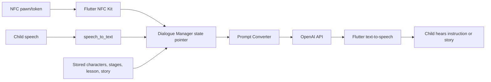

# Tinker Tales: Tangible Storytelling for Narrative Development and AI Literacy

## Report scope

This report analyzes the complete 11-page preprint **“Tinker Tales: Interactive Storytelling Framework for Early Childhood Narrative Development and AI Literacy.”** It covers the tangible board-game concept, NFC and mobile architecture, dialogue state machine, story-generation prompts, synthetic evaluation, quality and safety results, and implications for CreativeOS. The paper presents a functioning prototype but does **not** study children; all 30 evaluation sessions use GPT-4o to role-play a child.

## Bibliographic record

- **Authors:** Nayoung Choi, Peace Cyebukayire, and Jinho D. Choi
- **Affiliation:** Department of Computer Science, Emory University
- **Publication status:** arXiv preprint, version 2, April 22, 2025
- **Length:** 11 pages
- **Identifier:** [arXiv:2504.13969](https://arxiv.org/abs/2504.13969)
- **DOI:** [10.48550/arXiv.2504.13969](https://doi.org/10.48550/arXiv.2504.13969)
- **Paper type:** System/prototype paper with model-simulated evaluation
- **Target users:** Children aged 4–6
- **Demonstrations:** [edited video](https://www.youtube.com/watch?v=DdfhTg7QlVU) and [uncut video](https://www.youtube.com/watch?v=zW54TSVsEFE)

## Executive summary

Tinker Tales combines a physical four-stage story board, NFC-tagged character pawns and story-element tokens, and a speech-based mobile AI. A child chooses three characters, then at each of four stages—Start, Journey, Climax, and End—selects a place, item, and emotion token. After every selection, the agent asks the child to define it in more detail. The system turns those choices into four generated passages connected into a complete story and optionally weaves in a one-line lesson supplied by a parent.

The design has a strong interaction principle: **tangible selection gives a young child a concrete prompt, while speech supplies the child’s personal meaning**. A generic “hat” token becomes a specific magical hat because the child explains who found it, what it looks like, and what it does. The AI’s intended role is to connect child-defined ingredients into prose rather than invent all ingredients itself.

The implementation is a Flutter mobile application using NFC, device speech-to-text, text-to-speech, and the OpenAI API. A deterministic dialogue manager tracks the current step, while a prompt converter builds stage-specific instructions. The fixed state machine gives the LLM procedural boundaries and provides recovery points that a free-form chatbot would lack.

The paper reports high output scores from 30 simulated sessions: human/LLM ratings of **5.00/4.53** for element relevance, **4.77/4.80** for coherence, and **4.97/4.53** for educational value. Automated safety classifiers also assign low toxicity and harm probabilities, lower than 30 stories from a public-domain children’s corpus.

Those numbers do not validate the system for children. GPT-4o role-plays the child and produces unusually rich, adult-like descriptions; the same model family appears to generate the stories, producing highly compatible inputs and outputs. No four-to-six-year-old attempts the multi-step workflow, handles NFC scanning, uses speech recognition, waits for generation, understands the AI, learns narrative structure, or develops AI literacy. The number and qualifications of human evaluators are not disclosed; the LLM judge is not identified; there is no inter-rater reliability; and the safety comparison uses ordinary generated stories rather than adversarial or child-realistic inputs.

The claimed educational outcomes are therefore hypotheses. The evaluation demonstrates that the prompting pipeline can produce polished, internally coherent prose from synthetic, highly descriptive inputs. It does not show that the tangible experience is usable, engaging, safe in open use, or instructionally effective.

For CreativeOS, the most reusable contribution is the **state-machine/tangible-token architecture**, especially the separation between fixed activity progression and generative content. The main change should be to keep more narrative language with the child. Tinker Tales generates five-to-ten sentences after every stage, so the final artifact is predominantly AI-authored. A child may learn ingredient selection and descriptive prompting, but not necessarily sequencing or composing prose.

## Design motivation

The paper combines three arguments:

1. Interactive storytelling can support narrative development and creativity.
2. Young children benefit from physical and multisensory interaction rather than screen-only instruction.
3. AI literacy should include practical experience specifying goals, refining inputs, and observing how AI transforms those inputs.

The project therefore frames prompting as a child-accessible activity: select a physical concept, define it verbally, listen to how AI uses it, and proceed through a visible narrative arc.

## Physical system

### Board

The board is a four-sided accordion organized as:

- **Start** — introduction;
- **Journey** — development;
- **Climax** — crisis; and
- **End** — conclusion.

Children move the same three character pawns from panel to panel and add place, item, and emotion tokens at each stage. The folded board makes progression spatially visible and allows earlier selections to remain physically present.

### Pawns and tokens

There is one pawn class—character—and three token classes:

- place;
- item; and
- emotion.

Each uses an NTAG215 NFC tag with 540 bytes of writable memory. The phone reads a simple type/value pair, while physical pieces are handmade from commercially ordered components and stickers. DALL·E 3 generated board and token illustrations.

The available library contains:

- **21 characters**, including prince, princess, child, nanny, knight, sheriff, mythical beings, and animals;
- **15 places**, such as forest, island, castle, market, mountain, and temple;
- **25 objects**, such as wand, sword, matches, coins, violin, ladder, ship, and crown; and
- **23 emotion labels**, such as happy, sad, lonely, anxious, suspicious, reflective, and thankful.

GPT-4o extracted these options from the first 30 public-domain stories in a Kaggle “Children Stories Text Corpus,” originally sourced from Project Gutenberg. The list consequently inherits a narrow European fairy-tale vocabulary and traditional roles. It is not a developmentally validated ontology. Several labels mix emotions with evaluations or states (“painful,” “passionate,” “reflective,” “satisfied”), and some potentially sensitive combinations—matches, sword, fear, painful—require contextual safety handling.

### Phone

The phone provides NFC scanning, microphone, speaker, speech recognition, generation, and narration. This keeps hardware affordable, though it means the child still interacts through a screen/device and must repeatedly press a speaker button and scan in a prescribed order.

## Software architecture

### Dialogue manager

The dialogue manager uses explicit pointers such as:

- `Character:1:Select`
- `Character:1:Define`
- `Introduction:Place:Select`
- `Introduction:Place:Define`
- `Introduction:Item:Select`
- `Introduction:Emotion:Define`
- `Introduction:Complete`

The pattern repeats for Development, Crisis, and Conclusion, followed by Finish and Replay.

This is a useful hybrid architecture. Code determines what step is legal and which data are required; the model determines how to phrase instructions and connect narrative content. It reduces the chance that an LLM skips steps or forgets the activity contract.

### Prompt conversion and memory

Prompts incorporate four dynamic inputs:

- parent-entered lessons;
- the NFC value;
- the speech transcript; and
- the generated story so far.

The system remembers characters, places, items, emotions, the selected lesson, and prior prose. It repeatedly reminds the model that the listener is aged 4–6 and requests simple words and sentences.

### Full interaction burden

The nominal flow asks the child to:

1. scan and verbally define three characters;
2. unfold and position pawns;
3. for each of four stages, place three tokens;
4. scan place, item, and emotion in order;
5. verbally define each;
6. confirm readiness to hear generated prose;
7. listen to five-to-ten sentences; and
8. say whether they liked it before continuing.

That is at least 15 selection/definition pairs plus confirmations and four long narration segments. The workflow may be too lengthy or instruction-heavy for some preschoolers; the paper contains no child observation to evaluate cognitive load, attention, motor execution, speech recognition, interruption, or recovery from incorrect scanning order.

## Story-generation approach

The child selects and defines story elements; the LLM writes the connective narrative. Each stage receives a local mini-arc, and the prompt tells the model to conclude events before transitioning to a potentially unrelated next place. It must:

- include the chosen place, item, and emotion;
- integrate them naturally;
- connect with prior stages;
- use child-appropriate language;
- explain location transitions;
- retain the three characters; and
- weave in one selected parent lesson without stating it overtly.

This architecture handles random selection by converting every stage into a self-contained problem and bridge. The paper’s example moves from a magical bridge to a market street, snowy mountain, and island while repeatedly using friendship and emotional support as connective themes.

### Authorship implications

The generated example is polished and lengthy. The synthetic child supplies vivid definitions, but the model creates plot events, causal links, moral interpretation, emotion resolution, and prose. Calling the result “the child’s narrative” overstates child authorship. A better characterization is a **model-authored story conditioned on child-selected and child-described elements**.

### Parent lessons

Parents can pre-enter lines such as “Do not lie” or “Get along with friends.” One becomes the central theme. The feature allows family relevance, but it can also make the system an invisible moralizing channel. Children are not told how the lesson was selected, cannot contest it, and may experience AI-generated consequences as objective confirmation of adult rules.

CreativeOS should label caregiver constraints and distinguish non-negotiable safety boundaries from debatable values.

## Evaluation design

### Synthetic child sessions

Thirty sessions were simulated with GPT-4o acting as a four-to-six-year-old. At scanning turns the synthetic agent randomly returns an allowed option. At speech turns it provides “natural conversational language.” The prompt does not constrain vocabulary, response length, developmental grammar, hesitation, misunderstanding, off-topic play, speech errors, or incomplete descriptions.

The published example is not preschool-like. It supplies elaborate descriptions such as a magical bridge with twisting vines, colorful flowers, sparkling lights, and a whispering stream; a cake whose rainbow sprinkles cause laughter; and a character who transforms raindrops into fish. These are near-ideal prompts for the story model.

Because GPT-4o also extracts the vocabulary and is apparently used within the story-generation pipeline, the evaluation has strong model self-compatibility. A model is effectively testing a conversational partner from its own distribution.

### Quality criteria

The authors define:

1. **element relevance** — whether child-defined elements appear and matter;
2. **narrative coherence** — logical progression and consistency;
3. **educational value** — how well a predefined lesson is conveyed; and
4. **safety** — absence of harmful or inappropriate language.

The questionnaire first asks yes/no, then a 1–5 rating if yes. Human and LLM-as-judge results are reported, but the paper does not identify:

- number or qualifications of human evaluators;
- allocation of stories to evaluators;
- blinding;
- inter-rater reliability;
- LLM judge model, prompt, temperature, or repetitions; or
- whether the judge knew the system goals/lesson.

### Reported quality

| Metric | Human | LLM judge |
|---|---:|---:|
| Element relevance | 5.00 ± 0.00 | 4.53 ± 0.50 |
| Narrative coherence | 4.77 ± 0.43 | 4.80 ± 0.40 |
| Educational value | 4.97 ± 0.18 | 4.53 ± 0.50 |

These scores show that outputs usually satisfy the authors’ own prompt-aligned rubric under synthetic input. The perfect human relevance score is unsurprising because prompts explicitly require every selected element.

No baseline tests whether the four-stage prompt is better than a simpler prompt, whether tangibility contributes, or whether a child’s actual sparse input produces equivalent quality.

## Safety evaluation

The 30 Tinker Tales stories are compared with the first 30 corpus stories using two automated classifiers:

- Moderation API categories: harassment, hate, illicit, self-harm, sexual, violence;
- Perspective API categories: toxicity, identity attack, severe toxicity, profanity, threat, insult.

Tinker Tales scores are lower in every category. The largest generated-story means are violence **0.0519 ± 0.0765** and toxicity **0.0695 ± 0.0399**, still low on a 0–1 scale.

This does not establish child safety:

- The comparator includes older fairy tales that naturally contain violence and threat.
- No statistical tests or uncertainty beyond sample SD are reported.
- Classifier calibration for child-directed narrative is unknown.
- Classifiers do not measure age-appropriateness, frightening imagery, stereotyping, manipulation, moral shame, developmental language, dangerous imitation, or privacy.
- Synthetic children do not attempt unsafe, adversarial, sexual, violent, self-harm, abusive, or identifying inputs.
- The system does not report pre-generation filters, runtime blocking, fallback responses, or adult escalation.
- Low average harm can conceal one unacceptable story.

The evidence supports “ordinary simulated outputs received low automated classifier scores,” not the paper’s stronger implication of a safe child-facing system.

## Claimed AI-literacy mechanism

The activity may make several ideas concrete:

- AI output depends on supplied inputs;
- adding detail changes what the AI can generate;
- a story can be decomposed into elements and stages; and
- AI can connect ideas but does not select every idea.

Yet the system does not explicitly expose uncertainty, model limitations, data sources, why outputs vary, who authored the prose, or how to critique an error. No child is tested for conceptual understanding or transfer. “AI literacy” remains an intended affordance, not an evaluated outcome.

## Strengths

1. Makes an abstract prompt structure physical and spatial.
2. Preserves child choice at the ingredient level.
3. Requires verbal definition rather than token selection alone.
4. Separates deterministic progression from generative language.
5. Publishes a detailed dialogue-state table and prompt variables.
6. Uses an inexpensive phone/NFC hardware path.
7. Makes the four-part narrative arc visible throughout the activity.
8. Evaluates multiple dimensions rather than reporting only examples.

## Limitations and critical appraisal

### No child evidence

- No target user touches the prototype.
- Usability, engagement, accessibility, collaboration, learning, narrative development, and AI literacy are not measured.
- The synthetic child is far more articulate and compliant than many four-to-six-year-olds.
- Speech-recognition performance on child speech is untested.
- Physical affordances are not evaluated because the simulated agent cannot manipulate them.

### Evaluation validity

- Sample size is 30 model-generated sessions without repeated seeds or model variance analysis.
- Human evaluation procedure is underreported.
- LLM judge identity and settings are omitted.
- The same model ecosystem generates inputs and outputs.
- Criteria closely mirror prompt instructions, inflating apparent success.
- No comparator prompt or system exists.
- Safety is average classifier output on benign sessions.

### Educational design

- Story prose and causal structure are largely AI-generated.
- Parent lessons can be didactic and invisible.
- Token vocabulary reflects old Western fairy-tale corpora.
- The fixed requirement of three characters and twelve stage tokens may create excessive cognitive and temporal load.
- The system says “respond with empathy” at nearly every state without defining meaningful conversational grounding.
- No multilingual, disability, neurodivergence, or cultural adaptation is considered.

### Reproducibility and privacy

- No source repository or build instructions are released.
- The specific story-generation model/version and generation parameters are not stated clearly.
- Child voice data would go through speech and model APIs; consent, retention, deletion, and provider processing are not discussed.
- The system stores full stories, but storage security and caregiver access are unspecified.

## Implications for CreativeOS

### Use the hybrid control pattern

CreativeOS should adopt an explicit activity graph where code owns:

- stage order;
- required/optional inputs;
- turn and retry limits;
- save/delete behavior;
- safety gates; and
- handoff to a caregiver.

The model should own only language variation, connective suggestions, and bounded transformations.

### Reduce the loop for young children

Offer one or two characters and three narrative phases by default. Let a child choose whether to add an item or emotion rather than requiring all fields. Narration should be one or two sentences, followed by a visible “keep / change / add” choice. Expand complexity only when the child demonstrates interest.

### Preserve more child language

Instead of generating ten sentences, the system can:

- replay the child’s recorded sentence;
- offer one connective sentence;
- ask the child for the next event;
- display who supplied each line; and
- let the child reorder or remove AI text.

This shifts the learning target from describing tokens for an AI ghostwriter to constructing a narrative with assistance.

### Teach AI literacy explicitly

After generation, ask age-appropriate reflection:

- “Which ideas came from you?”
- “Which words did Tinker add?”
- “Did it misunderstand anything?”
- “What detail could help it try again?”
- “Could it make a different story from the same pieces?”

An adult dashboard can show the original child input and resulting model transformation without grading the child’s “prompt quality.”

### Build real safety evaluation

Test a child-realistic suite containing incomplete speech, ambiguous names, family disclosures, dangerous objects, fear, violence, body topics, personal information, and adversarial combinations. Use expert child-development review and per-output pass/fail criteria in addition to classifier scores. Document model refusal and caregiver-escalation behavior.

## Open-source repository assessment

The paper explicitly says it cannot provide a live website because the experience requires custom hardware and supplies two videos instead. It contains no code, design-file, dataset, or GitHub link. Exact-title, arXiv-ID, author, institution, and GitHub-domain searches found the preprint and demonstration material but no verified first-party open-source repository. No repository was cloned for this paper.

## Bottom line

Tinker Tales is an inventive and reasonably well-specified tangible interface concept. Its deterministic dialogue manager and visible four-stage board are strong foundations for CreativeOS. Its empirical claims are far ahead of its evidence: GPT-4o simulations cannot demonstrate early-childhood usability, narrative growth, AI literacy, engagement, or real-world safety. The next meaningful step is not a larger synthetic benchmark; it is a carefully safeguarded, developmentally appropriate child study that preserves child authorship, measures actual learning, and tests the many places where speech, attention, safety, and physical interaction can fail.
