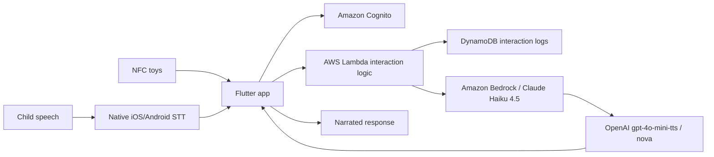

# Tinker Tales: A Tangible Dialogue System for Child–AI Co-Creative Storytelling

## Report scope

This report analyzes the complete 26-page paper **“Tinker Tales: A Tangible Dialogue System for Child–AI Co-Creative Storytelling,”** including its system architecture, physical materials, conversation graphs, full prompts, home study, coding scheme, reported interaction patterns, AI-literacy questionnaire, optional post-study survey, examples, limitations, and implications for CreativeOS. It also distinguishes this June 2026 paper from the authors’ preliminary April 2025 Tinker Tales paper, which used simulated child sessions rather than a child study.

## Bibliographic record

- **Authors:** Nayoung Choi, Jiseung Hong, Peace Cyebukayire, Ikseon Choi, and Jinho D. Choi
- **Affiliations:** Emory University and Carnegie Mellon University
- **Publication status:** arXiv preprint, version 2, June 23, 2026; listed by the authors for SIGDIAL 2026
- **Length:** 26 pages, including appendices
- **Identifier:** [arXiv:2602.04109](https://arxiv.org/abs/2602.04109)
- **DOI:** [10.48550/arXiv.2602.04109](https://doi.org/10.48550/arXiv.2602.04109)
- **Official publication page:** [Emory NLP](https://emorynlp.org/papers/2026-sigdial-choi/)
- **Paper type:** Tangible conversational-system paper with an exploratory, home-based, within-participant child study
- **Target age in the system prompt:** 5–8
- **Study sample stated in the abstract and participants section:** 10 children aged 6–8

## Executive summary

Tinker Tales is a tangible, voice-mediated storytelling system intended to make a child the source of story choices while an AI turns those choices into narrated prose. A child selects three NFC-equipped character pawns and advances them through a physical four-part board—Start, Journey, Climax, and End. At every stage, the child scans a place, item, and emotion token. The AI creates an approximately seven-sentence draft, asks one or two elaboration questions, then rebuilds the passage at approximately ten sentences using the child’s answer.

The central research contribution is not the hardware alone but the attempt to encode two educational frameworks directly into conversational moves. Applebee’s narrative-development model supplies prompts for adding events, explaining causality, retelling a complete plot, and imagining an alternate ending. CASEL’s social-emotional learning framework supplies prompts about characters’ feelings, relationships, and responsible choices. The authors argue that prompt framing is an interaction-design mechanism: a specific question such as “Why did the characters do that?” creates a more usable participation slot than the generic “Would you like to add something to the story?”

The system is considerably more mature than the authors’ preliminary Tinker Tales prototype. It uses a Flutter mobile application, native NFC and speech-to-text, an AWS serverless backend, Claude Haiku 4.5 through Amazon Bedrock, and OpenAI `gpt-4o-mini-tts` with the `nova` voice. A phase-level dialogue graph constrains progression, while the language model can still clarify ambiguity or respond to relevant side talk. Completed stories, transcripts, and AI-generated activity summaries are accessible through a caregiver mode.

The study gives 10 children aged 6–8 one Structured session and one Generic session in counterbalanced order. The paper reports that targeted Primitive prompts elicited an event contribution in 90% of responses, Chain prompts elicited causal content in 100%, Social-awareness prompts elicited narrative input in 62%, and generic invitations elicited narrative input in 37%. When children did contribute, the AI incorporated all key changes in 90% of cases and a subset in 10%. Transcript examples also show children correcting speech-recognition errors, rejecting invented details, clarifying character state, and repairing accidental token input.

These results are useful descriptive evidence that **question specificity changes what children say in the next turn**. They are not evidence of developmental growth, learning, or comparative efficacy. The Structured session asks two targeted questions at each narrative stage—one narrative and one emotional—whereas the Generic session asks only one general question. The targeted prompts explicitly request the response category later used to score them. The study has 10 participants, no inferential analysis, no independently replicated coding or inter-rater reliability, no pre/post narrative assessment, and no learning or transfer measure. The first author coded all sessions after team discussion. Consequently, the paper supports interaction-design observations, not claims that Tinker Tales improves narrative ability or SEL.

For CreativeOS, the paper’s strongest contribution is the combination of a deterministic activity graph, tangible state, short targeted prompts, visible uptake, and repairable interaction. Its most important warning is that procedural child choice does not automatically equal authorship: the AI speaks roughly twice as many words per turn as the child and writes every seven-to-ten-sentence passage. A stronger CreativeOS design would preserve child language verbatim, visibly attribute each contribution, generate less connective prose, and measure whether children independently construct more coherent narratives after support is removed.

## Research problem and positioning

The paper identifies a gap between two bodies of work:

1. Child-facing conversational agents often lead instructional or reading activities.
2. Adult co-creative AI systems increasingly support iterative, mixed-initiative development of a shared artifact.

Tinker Tales asks how an AI can participate in child-led co-creation without becoming a free-form generator or instructor. It treats conversation design—what the agent asks, when it asks, and how it takes up an answer—as the key mechanism that distributes initiative.

The project also addresses modality. Tangible objects make abstract story components physically selectable and persistent; voice avoids requiring early readers to type; the phone mediates scanning and speech without serving as the main visual workspace. The intended design equation is:

```text
physical selection + spoken elaboration + bounded AI transformation
                         =
an iterative, inspectable co-creative loop
```

The study is framed as exploratory. The paper explicitly says its purpose is not a formal condition comparison, although the results repeatedly contrast response percentages across conditions.

## Educational frameworks translated into interaction

### Applebee’s narrative-development model

The authors map five narrative forms onto different system activities:

| Narrative form | Meaning in the paper | Tinker Tales mechanism |
|---|---|---|
| Heap | Isolated actions without organization | Selecting individual story elements |
| Sequence | Thematically related events without a clear plot | Placing elements in four ordered stages |
| Primitive narrative | A central character/event with subsequent action but little causality | Questions asking for another event or action |
| Chain narrative | Simple cause-and-effect and motivation | “Why?” or “How did that happen?” questions |
| True narrative | Coherent beginning, middle, resolution, and central characters | Post-story retelling and alternate-ending questions |

The four board stages alternate the two active scaffolds:

- **Start:** Primitive narrative prompt;
- **Journey:** Chain narrative prompt;
- **Climax:** Primitive narrative prompt; and
- **End:** Chain narrative prompt.

The post-story phase asks the child to retell the whole story and imagine a different ending. This mapping is conceptually clean, but it should not be mistaken for measuring progression through Applebee’s developmental stages. The system elicits forms of response associated with the framework during one activity; it does not establish a child’s developmental stage or demonstrate movement between stages.

### CASEL social-emotional learning

The paper selects three socially oriented CASEL competencies:

- **Social awareness:** infer fictional characters’ emotions and perspectives during each story stage;
- **Relationship skills:** judge helping, sharing, waiting, comforting, or related social behavior after the story; and
- **Responsible decision-making:** suggest constructive alternative actions and consequences after the story.

It intentionally omits self-awareness and self-management because the activity concerns fictional characters rather than the child’s own feelings. This is a defensible scope choice, though discussing a character’s emotion is at most an opportunity to exercise perspective-taking; it is not by itself evidence that SEL competence changed.

### Why the prompt framing works

The structured questions provide a semantic slot:

- “What else might they do?” invites an event.
- “Why did they decide to use the boat?” invites causality.
- “How might one friend feel differently?” invites differentiated emotion.

The generic question—“Would you like to add something to the story?”—asks the child both to decide whether to contribute and to invent the kind of contribution. The observed difference therefore has a plausible interactional explanation: targeted prompts reduce the search space and communicate what kind of answer will be usable.

The result is important but partly built into the operationalization. A response to “Why?” is coded for causality; a response to “What else happens?” is coded for an added event. The percentages demonstrate successful elicitation and immediate alignment with prompt affordances, not spontaneous narrative competence or learning.

## Physical interaction design

### Four-stage board

The foldable board externalizes a narrative sequence:

1. Start;
2. Journey;
3. Climax; and
4. End.

At each stage the child places three character pawns and scans one token in each category. This gives the child repeated points of control and leaves a physical trace of the narrative structure.

### Available pieces

The revised system uses a deliberately smaller vocabulary than the preliminary version:

- **Characters:** Rabbit, Bear, Bird, Frog, Lion;
- **Places:** Playground, River, Island, Forest, School, Cave, Hut;
- **Items:** Boat, Bag, Map, Hat, Honey, Key, Lantern; and
- **Emotions:** Scared, Proud, Excited, Sad, Happy, Curious, Angry.

Every pawn/token has a pre-programmed NFC chip and a reverse-side word label. The limited set lowers choice and recognition burden, though it also constrains cultural variety and can make stories converge on similar fairy-tale patterns.

### Interaction loop


In the Generic condition, the emotion-question step is absent, and the stage can advance without a rewrite if the child declines to add anything.

## Software and AI architecture



### Mobile client

The Flutter application runs on Android and iOS. During play, the screen mainly shows listening and scan status so attention can remain on the toys and board. Native OS services handle speech recognition and NFC. A four-second sustained pause ends a child’s turn. While the AI speaks, microphone input and NFC scanning are disabled to avoid overlapping state changes.

Completed stories are saved under **My Stories** and can be replayed as audio. **Parent Mode** exposes previous session transcripts and AI-generated summaries of narrative and social-emotional activity.

### Backend and models

- Cognito handles authentication.
- Lambda orchestrates the interaction workflow.
- DynamoDB stores interaction logs.
- Claude Haiku 4.5, accessed through Amazon Bedrock, generates dialogue and stories.
- OpenAI `gpt-4o-mini-tts`, using the `nova` voice, speaks the output under an instruction to sound “soft and lively” for children.

This architecture is understandable and deployable, but it creates a multi-provider data path involving the device platform, AWS, Anthropic through Bedrock, and OpenAI TTS. The paper states that caregiver-created accounts use caregiver email addresses and that no audio/video was collected for the study; it does not provide a full production privacy model covering transcript retention, deletion, provider data handling, summary generation, access controls, security testing, or child-data jurisdiction.

### Dialogue control

The experience is divided into eight phases:

1. session opening;
2. character selection;
3. Start;
4. Journey;
5. Climax;
6. End;
7. post-story activity; and
8. closing.

Each phase has a prompt-defined dialogue graph with lettered nodes, conditional transitions, type-checked scan events such as `Character:value`, and an exact `##NEXT##` transition marker. The model must follow the graph but may answer relevant unsolicited questions or engage in brief side talk.

This is a useful middle ground between a rigid finite-state UI and an unconstrained chatbot. It provides recovery anchors, yet it still trusts a generative model to obey exact control tokens and procedural instructions. A production system should parse structured tool output or schema-constrained state transitions rather than letting a visible sentinel string control advancement.

### Prompt quality and defects

The appendix publishes unusually detailed prompts, which improves reproducibility. It also exposes small implementation risks:

- The character-selection script asks about the “first character” in both steps D and E; step E almost certainly should say **second character**.
- Several scripts require exact scan-event string forms and exact redirection language. Speech/scan errors may therefore produce repetitive, inflexible repair.
- The Start prompt says the model must follow the graph “exactly” while also allowing unscripted dialogue, leaving priority ambiguous.
- “Child-safe,” bias avoidance, empathy, and balanced reactions are high-level instructions rather than a documented safety policy or tested guardrail.
- Seven- and ten-sentence outputs are long for repeated voice-only listening, particularly across four drafts and four revisions.

## Study design

### Participants

The study includes 10 early-elementary children:

- ages 6–8, mean age 7.5;
- five girls and five boys;
- spoken-English proficiency required;
- recruited through online flyers distributed by a local U.S. community organization; and
- access provisioned through caregiver accounts and email addresses.

The university IRB approved the protocol. The paper’s limitations section inconsistently describes participants as aged **5–8**, whereas the abstract and participant section say **6–8**. The target system prompt also says 5–8; the report should not silently merge those distinct statements.

### Within-participant conditions

Every child completed two home sessions:

- **Structured:** one Applebee-aligned narrative question plus one CASEL social-awareness question at each stage;
- **Generic:** one open invitation at each stage.

Half received Structured first and half Generic first. Both conditions use the same post-story prompts: two True-narrative questions, one relationship-skills question, and one responsible-decision-making question.

The authors say conditions differ “only in the form” of elaboration questions. In practice, they also differ in **quantity**: two questions per stage in Structured and one in Generic. Structured therefore offers twice as many stage-level response opportunities and explicitly asks about emotions, while Generic does not. This is not fatal for a qualitative study, but it prevents a clean causal interpretation that framework grounding alone produced the contrast.

### Data sources

Primary data are real-time speech-to-text transcripts and interaction logs. The study did not store audio or video, reducing privacy exposure but removing prosody, gesture, gaze, physical arrangement, caregiver intervention, speech-recognition ground truth, and evidence of how children actually manipulated the pieces.

Additional instruments were:

- a pre-study, child-friendly AI-literacy questionnaire for all 10 participants; and
- an optional post-study survey completed by six participants.

There is no post-test matching the AI-literacy baseline, no standardized narrative assessment, no SEL measure, and no delayed or unscaffolded transfer task.

### Session characteristics

The paper reports means across sessions:

| Measure | Mean ± SD |
|---|---:|
| Session duration | 32.3 ± 6.2 minutes |
| Total turns | 53.3 ± 8.7 |
| Child words per turn | 14.9 ± 5.0 |
| AI words per turn | 31.9 ± 3.4 |

The child turn length is substantial and shows that participants could engage verbally. The AI’s turns are still more than twice as long, reinforcing that the system is heavily generative and listening-intensive.

## Analytic procedure

The authors analyze two units:

- **turn level:** individual child and AI utterances; and
- **stage level:** the Start/Journey/Climax/End story-development episodes.

Character selection and post-story activity are excluded from the formal coding. The codebook records:

1. **Agent question framing:** Primitive, Chain, Social awareness, or Open invitation.
2. **Narrative function of child input:** Add event, Add causality, Elaborate emotion, or None. Multiple functions may be assigned to one utterance.
3. **Uptake:** Full, Partial, or No uptake in the rewritten story.

The team open-coded a subset, refined the scheme through discussion, then the first author applied all codes to all sessions. The authors validated coding through discussion. No second coder independently applies the final scheme, and no agreement statistic, adjudication rate, audit sample, or blinded condition coding is reported.

This matters because “key changes,” narrative function, and partial/full uptake require judgment. The percentages should be read as one research team’s structured description of the transcripts, not as a reliability-established measurement instrument.

## Findings

### Multiple points of child initiative

Children could influence the artifact by:

- proposing an initial story premise;
- selecting and describing three characters;
- specifying relationships;
- selecting a place, item, and emotion at each stage;
- answering elaboration questions; and
- correcting content or interaction state.

Examples include a child sustaining an initial monster-defeat idea through the story and another framing a best-friends trip to a candy land. Some initial ideas were too general or did not persist, showing that early agency was possible but not guaranteed to survive model generation.

### Narrative prompt response patterns

The paper reports:

| Question framing | Child response pattern |
|---|---|
| Primitive narrative | Contribution in 90%; all coded as Add Event |
| Chain narrative | Contribution in 100%; Add Causality in 67%, Add Event + Causality in 33% |
| Generic open invitation | Contribution in 37%; Add Event in 25%, Elaborate Emotion in 12% |

These percentages strongly support the narrow conclusion that specific questions elicit more frequent and category-aligned immediate responses than an optional broad invitation. They do not show that children later add events or causes without prompts, that their complete stories become structurally stronger, or that the skill transfers.

The paper does not provide raw counts beside the percentages. The design implies 20 Primitive prompts, 20 Chain prompts, 40 Social-awareness prompts, and 40 Generic prompts if every planned stage occurred for every child, but that denominator reconstruction is an inference rather than a directly published table.

### Social-emotional elaboration

Social-awareness questions elicited narrative input in 62% of responses:

- emotion elaboration in 54%; and
- combined causality and emotion elaboration in 8%.

Children sometimes differentiated character perspectives—for example, two characters being excited and curious while another remains sleepy, or one wanting to befriend a dragon while others are afraid. These are useful examples of richer emotional characterization. Again, the evidence is elicited story content, not a validated increase in empathy, perspective-taking, or SEL competence.

### Uptake

When children supplied an idea, the AI showed:

- **full uptake:** 90%;
- **partial uptake:** 10%; and
- **no uptake:** not observed.

Appendix examples make uptake inspectable. In one partial case, the revised story incorporated Rabbit’s curiosity but omitted the child’s newly introduced bat. This is a valuable analytical move: co-creation quality is evaluated not only by how polished the model sounds but by whether the shared artifact visibly changes in response to the child.

However, uptake says nothing about whether the model adds much more content than the child, changes the idea’s meaning, or preserves the child’s exact words. A ten-sentence AI rewrite can include one child detail and still dominate authorship.

### Breakdown and repair

The paper’s most compelling qualitative evidence concerns repair:

- **Agent-initiated clarification:** the AI rephrases when an answer is ambiguous.
- **Child correction of recognition/interpretation:** children reject “Lion is a liar,” correct it to “friendly and funny,” or say “I didn’t say soda.”
- **Collaborative continuation:** the AI treats an incomplete fragment as an opening rather than a finished answer.
- **Shared-state repair:** children correct “kid turtle” to “baby turtle” or request a token change after an accidental scan.

These cases show that children are not merely compliant respondents; they monitor both story meaning and system state. They also reveal failure modes that aggregate story-quality metrics miss. CreativeOS should treat correction as a first-class interaction, track what changed, and make undo/restate actions easy and non-punitive.

## AI-literacy questionnaire

The pre-study questionnaire covers five dimensions adapted from Long and Magerko: what AI is, what it can do, how it works, how it should be used, and how people see it.

Reported baseline patterns include:

- AI described as a computer by 40%, friend by 30%, and robot by 30%;
- phone-that-talks recognized as AI by 60%, smart speaker by 50%, recommendations by 30%, and game character by 10%;
- 100% believing AI can answer questions, 90% that it can make a fun story, and 90% that it can help with homework;
- 40% attributing happiness/sadness and 40% attributing family-like love to AI;
- 20% selecting a computational “changes words into numbers” explanation, 30% “listens like a person,” and 30% uncertainty;
- 50% believing AI creates stories by itself; and
- safety/normative selections including not believing everything AI says (60%), not letting it be mean (60%), not sharing secrets (50%), and people fixing AI mistakes (70%).

These data contextualize the children’s starting mental models but are not used as an outcome. Because there is no equivalent post-test, the study cannot tell whether Tinker Tales improved AI literacy, increased anthropomorphism, clarified distributed authorship, or changed safety understanding.

## Optional post-study survey

Six of 10 children completed the survey:

- enjoyment mean: 4.67/5, with four ratings of 5 and two of 4;
- talking felt much easier for three, a little easier for two, and the same for one;
- all six selected learning to make fun stories;
- five selected thinking of new ideas;
- two selected talking with the AI; and
- one selected understanding what the AI does.

Three described the AI as a friend, two as a helper/tool, and one as a teacher. Open responses include enjoyment of building the story together and statements emphasizing personal authorship.

The survey suggests high enjoyment among respondents and perceived collaborative activity. It is optional, has 60% response coverage, is purely descriptive, and may be subject to selection, novelty, demand, and social-desirability effects. Importantly, only one respondent selected understanding what the AI does, so the paper offers little empirical support for AI-literacy learning.

## What the paper establishes

The evidence reasonably supports these claims:

1. The prototype can sustain approximately half-hour home interactions with this small group of English-speaking six-to-eight-year-olds.
2. Children can contribute through tangible choices, spoken elaboration, and corrective repair.
3. Targeted event, causality, and emotion questions elicit more category-aligned immediate answers than an optional generic invitation.
4. The model usually incorporates at least some coded child contribution into the next draft.
5. Scripted phase graphs and flexible language generation can coexist in a child-facing activity.

## What the paper does not establish

The study does not demonstrate:

- improvement in narrative ability;
- movement through Applebee’s developmental stages;
- improvement in SEL or perspective-taking;
- improvement in AI literacy;
- learning transfer to unaided storytelling;
- long-term engagement or developmental benefit;
- that tangible interaction is better than a voice-only or screen-only equivalent;
- that Structured scaffolding outperforms Generic under a controlled, equal-dose comparison;
- broad safety under adversarial, sensitive, or personally identifying child input; or
- generalization across language, culture, disability, age, or educational setting.

## Strengths

1. Studies real children after the preliminary paper’s synthetic evaluation.
2. Publishes detailed prompts, dialogue graphs, coding definitions, token inventory, and architecture.
3. Grounds each AI question in an explicit educational rationale.
4. Treats prompt framing as an interaction affordance rather than only a generation setting.
5. Combines tangible, voice, and visible narrative structure without making the screen the main activity.
6. Analyzes child corrections and shared-state repair, not only successful outputs.
7. Makes uptake of child contributions a core co-creativity criterion.
8. Counterbalances condition order.
9. Reports baseline AI mental models and does not claim the optional survey is inferential.
10. Recognizes the limits of a small, English-only, short-term home study.

## Limitations and critical appraisal

### Design and comparison validity

- N=10 is appropriate for exploratory observation but too small for broad percentage claims.
- No inferential analysis, confidence intervals, participant-level distributions, or raw coded counts are supplied.
- Structured and Generic conditions differ in question number as well as framing.
- Targeted prompts directly name the response type later coded, making much of the category alignment expected by design.
- It is unclear how caregiver presence, help, or home distractions varied.
- The post-story prompts are identical across conditions but excluded from coding.

### Coding validity

- The first author codes the complete dataset.
- Team discussion is not a substitute for independent application of the final codebook.
- No inter-rater agreement or blinded audit is reported.
- “Key change” and full/partial uptake can be subjective.
- The analysis focuses on response occurrence, not narrative quality, originality, child ownership, or downstream transfer.

### Educational validity

- Framework alignment is a design rationale, not a learning measure.
- A “Why?” answer can show local causal language without indicating a durable narrative skill.
- Character-emotion talk does not validate SEL competence.
- The baseline AI-literacy instrument has no post-test.
- The final story is predominantly generated prose, potentially teaching selection and prompting more than storytelling.

### Interaction and accessibility

- The child must complete a long, repeated scan/listen/answer/listen cycle.
- The four-second silence threshold may end hesitant children’s turns prematurely.
- Input is disabled during narration, preventing natural interruption and quick correction.
- Native STT performance for child speech is not measured because no source audio is retained.
- Voice-only presentation of repeated ten-sentence passages imposes memory and attention demands.
- English proficiency is required; no multilingual, speech-disability, neurodivergent, visual, hearing, or motor-access path is studied.

### Safety, privacy, and governance

- “Child-safe” and bias avoidance are prompt instructions, not an evaluated safety architecture.
- There is no adversarial or sensitive-input test suite.
- Children’s transcripts and activity summaries are stored and exposed to caregivers, raising questions about child privacy, audience awareness, deletion, and whether reflective content should be automatically summarized.
- The provider chain and production retention policy are underdocumented.
- The app’s anthropomorphic voice and the child’s description of AI as a friend warrant explicit disclosure of system limits.
- The paper does not state how harmful content, personal disclosures, abuse indicators, or requests requiring adult help are handled.

### Reporting inconsistencies

- The main sample is 6–8; the limitations section says 5–8.
- The character-selection prompt repeats “first character” where “second character” is expected.
- The statement that conditions differ only in question “form” obscures the two-versus-one question difference.

## Evolution from the preliminary Tinker Tales paper

| Dimension | Preliminary paper (arXiv:2504.13969) | This paper (arXiv:2602.04109v2) |
|---|---|---|
| Target range | 4–6 | Prompt says 5–8; study sample 6–8 |
| Evaluation | 30 GPT-4o role-played child sessions | Two home sessions with each of 10 children |
| Dialogue control | Rule-based state manager | Prompt-defined phase graphs with flexible repair |
| Educational design | Narrative stages, parent lesson, claimed AI literacy | Explicit Applebee and CASEL question scaffolds |
| Token vocabulary | Large corpus-derived inventory | Smaller fixed set of 5 characters and 7 tokens/category |
| AI stack | Flutter and OpenAI API | Flutter, AWS, Claude Haiku 4.5, OpenAI TTS |
| Primary evidence | Output quality and automated safety ratings | Transcript coding, uptake, repairs, survey |
| Main advance | Technical feasibility concept | Real child interaction and conversational-scaffold analysis |

The newer paper resolves the preliminary paper’s largest weakness by observing actual children. It also narrows its claims: instead of treating polished model outputs as evidence of child development, it studies interaction patterns. It still does not evaluate learning outcomes, and its authorship and privacy questions remain substantial.

## Implications for CreativeOS

### Adopt the interaction pattern, not the output volume

Use tangible or visible state plus one specific question at a time. Keep model contributions to one connective sentence or two options, then return control. Avoid making a child listen to a seven-sentence draft and a ten-sentence revision at every stage.

### Preserve provenance and authorship

Every story unit should retain:

- the child’s original words;
- the recognized transcript and any correction;
- the AI’s proposed transformation;
- whether the child accepted, edited, or rejected it; and
- a visible attribution in the final artifact.

This would turn uptake from a researcher-coded after-the-fact property into an inspectable product feature.

### Make repair a first-class control

Provide child-friendly actions such as:

- “That’s not what I said.”
- “Change the last piece.”
- “Keep my exact words.”
- “Undo.”
- “Tell it shorter.”
- “Ask me again.”

Do not disable all input during long narration; provide stop, replay, and correct controls.

### Separate pedagogical scaffolding from assessment

If CreativeOS claims learning, evaluate it with:

1. an unaided baseline story;
2. scaffolded use;
3. an unaided post-story with new materials;
4. blinded narrative coding with multiple independent raters; and
5. delayed transfer where feasible.

Use equal question counts and matched specificity for comparisons. Measure participant-level change, not only the fraction of turns containing the requested linguistic category.

### Teach AI literacy explicitly

The product should say which content came from the child and which from AI, invite correction, explain that recognition and generation can be wrong, and ask the child to compare alternate outputs. A pre/post measure should distinguish social anthropomorphism, functional understanding, privacy awareness, and ability to critique output.

### Design caregiver visibility with child dignity

Caregiver review should be transparent to the child and configurable. Prefer summaries about session mechanics and creative choices over opaque psychological or SEL judgments. Support deletion, export, retention limits, and clear provider disclosures. Do not present model-generated developmental summaries as assessments.

### Use typed transitions

Keep the paper’s deterministic phase concept, but implement transitions as validated structured events rather than an LLM-emitted `##NEXT##` string. The model can propose language; code should authorize state changes, enforce retry/escape routes, and log correction provenance.

## Open-source repository assessment

The PDF contains no first-party GitHub or source-code URL. Its only GitHub reference is to an unrelated cited project in the preliminary paper’s bibliography; it is not a Tinker Tales implementation. Exact-title, arXiv-ID, author, institutional, GitHub-domain, official Emory NLP publication-page, and Emory NLP organization searches found the paper and lab repositories but no verified public Tinker Tales source repository. The official publication page links the laboratory’s general GitHub organization, which currently does not list a Tinker Tales repository. No repository was cloned for this paper.

## Bottom line

Tinker Tales is one of the strongest papers in this folder as a source of concrete child–AI interaction design. It moves beyond synthetic evaluation, exposes its prompts, demonstrates real child correction and initiative, and offers a persuasive account of why specific questions yield more usable contributions than generic invitations. Its strongest finding is local and interactional: **the form of an AI question shapes the form and likelihood of a child’s next contribution**.

The paper does not demonstrate narrative development, SEL growth, AI-literacy improvement, or a clean treatment effect. Its small sample, unequal condition dose, prompt-aligned coding, single-primary-coder procedure, missing transfer assessment, long AI-authored passages, and underdeveloped privacy/safety model limit stronger claims. CreativeOS should reuse the tangible state, bounded dialogue graph, targeted prompts, visible uptake, and repair model while reducing AI verbosity, preserving child language, validating transitions in code, and evaluating learning with independent, outcome-focused methods.
