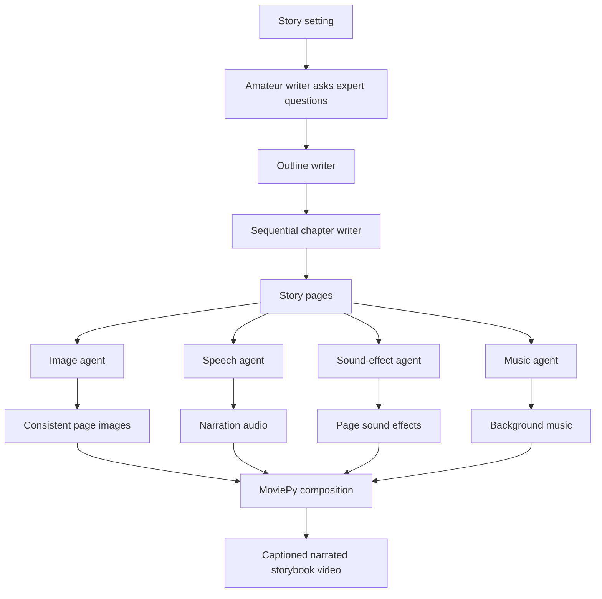

# MM-StoryAgent: Immersive Narrated Storybook Video Generation

## Report scope

This report analyzes the complete 10-page paper **“MM-StoryAgent: Immersive Narrated Storybook Video Generation with a Multi-Agent Paradigm across Text, Image and Audio.”** It covers the story-writing pipeline, image and character-consistency mechanism, speech/sound/music agents, video composition, automatic and human evaluation, appendix prompts, ethical limitations, and implications for CreativeOS. It also audits the paper’s official open-source implementation, which has been cloned into this workspace.

## Bibliographic record

- **Authors:** Xuenan Xu, Jiahao Mei, Chenliang Li, Yuning Wu, Ming Yan, Shaopeng Lai, Ji Zhang, and Mengyue Wu
- **Affiliations:** Shanghai Jiao Tong University, Alibaba Group, and East China Normal University
- **Publication status:** arXiv preprint, version 1, March 7, 2025
- **Length:** 10 pages, including appendix
- **Identifier:** [arXiv:2503.05242](https://arxiv.org/abs/2503.05242)
- **DOI:** [10.48550/arXiv.2503.05242](https://doi.org/10.48550/arXiv.2503.05242)
- **Demo:** [Hugging Face Space](https://huggingface.co/spaces/wsntxxn/MM-StoryAgent) and [YouTube video](https://www.youtube.com/watch?v=2HXGrA8mg90)
- **Official source:** [X-PLUG/MM_StoryAgent](https://github.com/X-PLUG/MM_StoryAgent)
- **Paper type:** Generative-system and evaluation paper; no child or end-user study

## Executive summary

MM-StoryAgent is an automated production pipeline that turns a compact story setting into a narrated storybook video. Its main idea is to decompose a difficult cross-modal generation task into specialist agents with explicit intermediate artifacts. An “amateur writer” and “expert writer” first discuss the brief. An outline writer converts that discussion into a four-chapter plan, and a chapter writer expands the plan sequentially into storybook pages. Separate image, speech, sound-effect, and music agents transform those pages into media assets. A MoviePy-based compositor then aligns images and audio to narration duration and renders a captioned slideshow video.

The paper makes two related contributions. First, it argues that simulated pre-writing discussion plus outline-first, sequential chapter expansion produces more attractive, warm, and educational stories than asking the same LLM to write directly from the setting. Second, it argues that modality-specific prompt revision improves correspondence between the story and generated imagery, sound effects, and music. Reviewer agents can critique and revise each derived prompt up to three times.

The system uses Qwen2-72B-Instruct for language work, StoryDiffusion with an SDXL backbone for consistent illustrations, CosyVoice for narration, AudioLDM 2 or Freesound for effects, MusicGen or Freesound for music, and MoviePy for assembly. Components exchange structured JSON and can theoretically be replaced independently.

On 100 LLM-generated story topics, GPT-4 rubric grading gives the Story Agent modest overall gains over direct prompting: attractiveness rises from 3.80 to 3.94, warmth from 4.18 to 4.21, and education from 3.58 to 3.79. Relevance rises slightly from 4.85 to 4.89, while coherence declines from 4.40 to 4.35. Cross-modal similarity improves for image–text, sound–text, music–text, and image–music, but image–sound declines. The largest objective change is music–text alignment, 0.301 to 0.525.

Three adult raters evaluate 20 videos. Human attractiveness is tied at 3.87, education improves from 3.63 to 3.80, warmth from 3.70 to 3.87, image alignment from 2.77 to 3.47, and music alignment from 2.57 to 2.93. Sound alignment worsens from 2.93 to 2.53. The reported inter-rater agreement is 0.46, though the statistic is not named. No statistical tests, uncertainty estimates, cost comparison, latency analysis, ablation, or child evaluation are provided.

The findings support a practical engineering conclusion: **specialized intermediate prompts are better inputs to specialized generators than raw story prose**, and staged writing can modestly change model-judged story qualities. They do not establish that the result is more engaging or educational for children. The baseline is deliberately simple and receives raw story text rather than a modality-appropriate prompt, the multi-agent system uses substantially more inference, GPT-4 grades LLM-written stories according to prompt-aligned criteria, and no child reads or watches the outputs.

The repository is a genuine first-party Apache-2.0 release and includes the core agents, configuration, 100 topic prompts, and rubric definitions. It is not a push-button reproduction package. Dependencies are unpinned, several runtime packages are omitted, the default pipeline requires CUDA and multiple external credentials, the referenced caption font is absent, no tests or evaluated output corpus are included, and there is no evaluation runner. The repository README’s quality scores also differ materially from the paper’s tables. The code compiles syntactically, but an end-to-end run was not attempted because it requires paid/cloud credentials, large model downloads, and GPU capacity.

For CreativeOS, MM-StoryAgent is most valuable as an **offline media-production architecture**, not as evidence for a child-facing experience. Its intermediate artifact contracts, parallel modality branches, and replaceable generators are reusable. A production adaptation should add provenance, deterministic schemas, asset licensing, safety review, child-development evaluation, budget/latency controls, and explicit approval gates before generated content reaches a child.

## Problem definition

The authors identify three perceived gaps in automatic storybook generation:

1. Direct LLM stories can be flat, linear, or insufficiently dramatic.
2. Existing story systems often emphasize text and images but omit narration, music, and sound effects.
3. There is a shortage of open, modular story-video frameworks and evaluation topic sets.

MM-StoryAgent therefore treats storybook generation as a production workflow rather than one prompt. The input is a story setting containing fields such as:

- topic;
- main role;
- scene; and
- requirements for interest, coherence, educational content, or other qualities.

The output is a slideshow-style video with page illustrations, captions, narration, sound effects, and continuous background music.

## End-to-end architecture



The image, speech, sound, and music branches are independent after story writing and are intended to run in parallel. Data passes between agents in JSON-like structures. This modular split is the paper’s strongest engineering decision: it makes the intermediate prompt and asset of each modality inspectable and allows a generator or retrieval service to be replaced without redesigning the whole pipeline.

## Story Agent

### Simulated question-and-answer discussion

An LLM role-playing an amateur writer asks an LLM role-playing an experienced children’s writer about the story brief. The prompt tells the amateur to ask one non-repetitive question at a time and the expert to offer meaningful ideas. Discussion lasts at most three turns in the experiments.

This stage is intended to simulate human brainstorming and turn underspecified goals into plot decisions. Because both roles use the same underlying Qwen model and the expert has no external knowledge or human judgment, it is better understood as **iterative self-conditioning** than genuinely diverse multi-agent expertise.

### Outline writing

The discussion and story setting are passed to an outline writer. The output must be JSON with a title and a list of chapter titles and summaries. The default implementation requests four chapters.

The system prompt defines six preferred story qualities:

1. concise storybook prose;
2. no dialogue or reader interaction;
3. one coherent overarching plot;
4. logical reasonableness;
5. educational value and “proper values and behaviors”; and
6. warmth, joy, love, and care.

These preferences strongly shape both generation and evaluation. The system is not merely discovering that multi-stage writing is warm and educational; it repeatedly instructs the multi-stage route to produce those traits and later grades those same traits.

### Sequential chapter expansion

The chapter writer expands one outline chapter at a time, receiving all previously completed pages. A chapter can produce up to three pages with no more than two sentences per page. Sequential expansion is chosen because generating all chapters in parallel could lose continuity.

This is a reasonable long-form generation pattern: keep the high-level plan stable, expose prior text, and bound each expansion. Yet the paper provides no ablation separating the value of pre-writing dialogue, outlining, sequential generation, and extra inference. It is therefore impossible to identify which step produces the reported gains.

## Image Agent

### Story-to-image prompt conversion

Raw narrative pages contain dialogue, action, thought, and causal sequence that an image generator cannot render directly. A reviser converts each page into a concise description of static visual content, while a reviewer checks that the result:

- focuses on main visual elements;
- removes non-visual thought and dialogue;
- avoids plot description; and
- retains character names.

The pair can iterate for up to three turns. This is less a mysterious agent effect than an explicit adapter between two data representations—a good architectural pattern that should be implemented with typed outputs and validation.

### Character description and consistency

A separate extractor finds recurring characters and generates appearance descriptions under 20 words. A reviewer removes personality or behavior and keeps only visible attributes. The system replaces each character name in page prompts with the same description.

StoryDiffusion then uses consistent self-attention across frames on an SDXL backbone. The two mechanisms—fixed descriptions and cross-frame attention—are intended to reduce character drift.

The evaluation measures general image–text and image–audio similarity, not identity consistency. No face/character consistency metric, human identity rating, or failure analysis directly validates the claimed role consistency.

## Audio Agents

### Narration

The speech branch directly sends each page to CosyVoice. In the released implementation, “CosyVoice” is accessed through Alibaba Cloud speech synthesis rather than shipped as a local checkpoint. The default voice is `longyuan` at 16 kHz.

### Sound effects

A reviser extracts up to three non-speech, non-musical sound effects per page. A reviewer checks that the description is audible, concise, anonymous with respect to character names, and contains no dialogue or instruments.

The default configuration passes these prompts to AudioLDM 2 and creates 10-second effects. The code also contains an alternative Freesound retrieval agent. Retrieval selects the first result and downloads a preview; the implementation does not preserve creator, license, attribution, source URL, or content-review metadata.

### Background music

The music reviser summarizes desired emotion, instruments, and style for the complete story, excluding character names. MusicGen creates a 30-second track by default, or a Freesound alternative can retrieve music.

One background track serves the entire story. This is simple and coherent but cannot follow scene-level emotional changes. The paper’s music–text metric improves substantially, which may reflect that the Story Agent supplies a purpose-built music prompt while the Direct baseline passes raw story content.

## Video composition

MoviePy assembles one image per page, uses narration length as the page duration, and adds:

- captions;
- page-level sound effects;
- continuous music;
- slow zoom or pan; and
- slide transitions.

If an effect is shorter than the narration, it is looped; if longer, it is truncated. This guarantees temporal coverage but can repeat or cut an event at semantically incorrect moments. The authors explicitly identify sound-event timing as unresolved. A better design would attach timestamped sound cues to clauses or events rather than stretching one page-level effect across the narration.

## Evaluation design

### Baseline

The Direct baseline asks Qwen2-72B-Instruct to write a story from the setting in one step. It then sends generated story text directly to the generative media tools. The Story Agent receives simulated discussion, outline-first expansion, and modality-specific prompt revision/review.

The comparison changes several variables simultaneously:

- number of LLM calls;
- amount of generated planning context;
- writing stages;
- specialized prompt conversion;
- reviewer feedback; and
- total computation and likely latency/cost.

It is a useful system-level contrast but not a controlled test of “multi-agent” architecture. A stronger evaluation would compare equal-budget alternatives and ablate each stage.

### Topic set

The authors ask an LLM to produce 25 topics in each category:

1. self-growing;
2. family and friendship;
3. natural and social environments; and
4. knowledge learning.

The resulting 100-topic JSON file is included in the repository. It is useful as a reusable prompt list but not a validated benchmark: there is no child-development rationale, human topic-quality annotation, demographic analysis, adversarial content, multilingual coverage, or train/test protocol.

### Automatic story evaluation

GPT-4 grades each story from 1 to 5 for attractiveness, warmth, and education. Appendix results also grade relevance and coherence.

| Criterion | Direct | Story Agent | Difference |
|---|---:|---:|---:|
| Attractiveness | 3.80 | 3.94 | +0.14 |
| Warmth | 4.18 | 4.21 | +0.03 |
| Education | 3.58 | 3.79 | +0.21 |
| Relevance | 4.85 | 4.89 | +0.04 |
| Coherence | 4.40 | 4.35 | −0.05 |

The strongest overall story gain is 0.21/5 for education; warmth is effectively flat. Story Agent is not uniformly better by category: on self-growing topics, attractiveness falls from 3.80 to 3.72, and warmth is tied for environment and knowledge topics. The paper calls the improvement substantial, but no repeated-generation variance, confidence interval, effect size, or hypothesis test is reported.

The appendix’s lower coherence score is important. Outline/chapter decomposition may add detail while slightly weakening global flow, which the authors acknowledge as a greater instruction-following burden.

### Automatic cross-modal evaluation

The paper uses:

- CLIP for image–text similarity;
- CLAP for sound–text and music–text similarity; and
- Wav2CLIP for image–sound and image–music similarity.

| Alignment | Direct | Story Agent | Difference |
|---|---:|---:|---:|
| Image–text | 0.297 | 0.316 | +0.019 |
| Sound–text | 0.214 | 0.240 | +0.026 |
| Music–text | 0.301 | 0.525 | +0.224 |
| Image–sound | 0.0540 | 0.0494 | −0.0046 |
| Image–music | 0.0421 | 0.0493 | +0.0072 |

The direction is mostly favorable, especially for music–text, but “significantly outperforms” is not statistically substantiated. The scores also mix two questions:

1. Does prompt conversion make a generator’s input more modality appropriate?
2. Does the final media feel semantically and aesthetically coherent to people?

Contrastive embedding similarity is evidence for the first, not a complete answer to the second.

### Human evaluation

Three “well-educated” adult raters familiar with media and children’s storybooks rate 20 videos on 1–5 scales. The paper reports agreement of 0.46, interpreted as moderate, but does not identify the agreement statistic or give per-item reliability.

| Criterion | Direct | Story Agent | Difference |
|---|---:|---:|---:|
| Text attractiveness | 3.87 | 3.87 | 0.00 |
| Text education | 3.63 | 3.80 | +0.17 |
| Text warmth | 3.70 | 3.87 | +0.17 |
| Sound alignment | 2.93 | 2.53 | −0.40 |
| Music alignment | 2.57 | 2.93 | +0.36 |
| Image alignment | 2.77 | 3.47 | +0.70 |

The paper says Story Agent “consistently outperforms” Direct on textual quality, but attractiveness is tied. Sound performance is materially worse, matching the authors’ concern that LLMs generate effects that are too elaborate for current sound models.

The sample is small, assignment details are unclear, raters are not described as child-development or children’s-media experts, and no statistical analysis is reported. Most importantly, adults rating alignment and “education” cannot establish child comprehension, enjoyment, fear, attention, learning, or developmental appropriateness.

## Example story appraisal

The appendix supplies an 18-page “invention story” about Thomas Edison. It demonstrates the target style: warm, inspirational, overtly educational, and easy to illustrate. It also exposes quality risks:

- the protagonist is called Thomas for most of the story and “Edison” near the end;
- a mouse accidentally stabilizes an electrical circuit, blending fantasy with an educational historical frame;
- the “1001st attempt” repeats a popular perseverance myth rather than careful historical explanation;
- the final moral is explicit and didactic; and
- villagers’ lives improve in a simplified hero-inventor narrative with little social or scientific context.

An LLM judge may reward warmth and educational tone while missing historical distortion or shallow moralization. CreativeOS should distinguish **educational intent** from factual and pedagogical quality.

## What the paper establishes

The evidence reasonably supports the following:

1. A modular agent pipeline can generate text, image, narration, effects, music, and a composed video from one brief.
2. Planning and specialized prompt conversion modestly improve several model-based and adult-rated criteria over a minimal direct baseline.
3. Image and music alignment benefit most in the small human evaluation.
4. Complex sound prompting remains a weak point.
5. Intermediate JSON, prompt, and media artifacts form a useful replaceable-component interface.

## What the paper does not establish

The study does not show:

- that children find the stories attractive, understandable, warm, or educational;
- learning, behavior change, recall, engagement, or repeated-use value;
- age appropriateness for any defined age range;
- safety under sensitive, adversarial, biased, frightening, or personally identifying inputs;
- factual reliability;
- character consistency as a separately validated outcome;
- improvement attributable to any individual agent/stage;
- superiority under equal token, compute, latency, or monetary budgets;
- production scalability or failure recovery; or
- reliable end-to-end reproduction from the released repository.

## Strengths

1. Releases first-party code under a permissive license.
2. Decomposes a cross-modal system into understandable intermediate artifacts.
3. Uses sequential writing to preserve prior context.
4. Converts narrative prose into modality-appropriate prompts instead of treating all generators alike.
5. Includes reviewer loops with bounded turns.
6. Combines generated and retrieval-based audio options.
7. Evaluates both story content and cross-modal alignment.
8. Reports a negative sound result rather than hiding it.
9. Includes 100 evaluation topics and detailed rubric definitions.
10. Acknowledges model bias, illogical output, and sound-timing limitations.

## Limitations and critical appraisal

### Evaluation validity

- The baseline is low-effort and receives poorly adapted media prompts.
- The multi-agent route uses more calls and compute, with no equal-budget comparison.
- There are no ablations for discussion, outlining, sequential expansion, reviser, reviewer, or StoryDiffusion.
- GPT-4 evaluates traits heavily specified in the generation prompt.
- Topic prompts are also LLM-generated.
- “Significant” improvement is claimed without significance testing.
- Human evaluation covers only 20 videos and three raters.
- The agreement statistic is not named.
- No outputs, per-example scores, evaluator instructions beyond the rubric, or randomization/blinding details are released.

### Child-facing validity

- No child participates.
- No target age or reading level is operationalized.
- The rubric’s highest education score rewards “profound and comprehensive” educational content, which may favor didactic prose rather than developmentally useful storytelling.
- The system has no interaction, child agency, caregiver controls, accessibility, or comprehension checks.
- The “accompaniment” framing risks substituting generated media for relational storytelling without studying that use.

### Safety and ethics

- The ethics section merely says biased or illogical stories remain possible and users “may add” detection.
- No moderation, factuality, stereotype, fear, violence, medical, self-harm, privacy, or age-appropriateness evaluation exists.
- Reviewer agents check modality prompts, not child safety.
- Multi-modal output compounds risk: unsafe prose can become persuasive speech, imagery, music, and effects.
- Freesound retrieval lacks recorded licensing and attribution provenance.

### Multimodal quality

- Page-level looping/truncation does not align effects to narrative events.
- One music prompt cannot track a long story’s changing tone.
- Similarity scores do not measure production quality, intelligibility, loudness safety, emotional appropriateness, or continuity.
- Character consistency is asserted but not directly measured.
- Slow pans, zooms, and slide transitions add motion but do not constitute generated video narrative.

## Open-source repository audit

### Clone record

- **Reviewed source:** [`X-PLUG/MM_StoryAgent`](https://github.com/X-PLUG/MM_StoryAgent/tree/e480648ab124f3dcff9ba97fff07c94844c10751)
- **Remote:** `https://github.com/X-PLUG/MM_StoryAgent.git`
- **Branch:** `main`
- **Cloned commit:** `e480648ab124f3dcff9ba97fff07c94844c10751`
- **Latest commit in the clone:** August 23, 2024, “Update framework.png”
- **License:** Apache License 2.0
- **Repository size after clone:** approximately 12 MB
- **Static syntax check:** all tracked Python files passed `python3 -m compileall`

The clone was left on its upstream `main` branch without source modifications.

### What is included

The repository contains roughly 4,100 tracked lines/files as counted by line-oriented tools, including:

- the story-writing agent;
- Qwen/DashScope wrapper;
- StoryDiffusion-derived image generation;
- CosyVoice cloud speech adapter;
- AudioLDM 2 sound generation;
- MusicGen music generation;
- Freesound effect/music alternatives;
- MoviePy video composition;
- an example YAML configuration;
- English prompts;
- 100 story topics;
- evaluation rubric JSON and prompt template; and
- an Apache-2.0 license.

### Reproducibility gaps

The repository is source availability, not a complete experimental reproduction package:

1. Dependencies have no versions or lockfile.
2. `setup.py` comments out `install_requires`, so editable installation alone does not provision runtime requirements.
3. Imported packages such as `torchaudio`, `requests`, and `aliyun-python-sdk-core` are not explicitly listed in `requirements.txt`.
4. The default config expects a caption font at `resources/font/msyh.ttf`, but no `resources` directory or font is included.
5. The default path requires `DASHSCOPE_API_KEY`, `ALIYUN_ACCESS_KEY_ID`, `ALIYUN_ACCESS_KEY_SECRET`, and `ALIYUN_APP_KEY`.
6. Optional Freesound use requires `FREESOUND_API_KEY`.
7. Image, sound, and music generators default to CUDA and may load large models concurrently in separate processes.
8. There is no documented hardware requirement, memory estimate, runtime, token count, cost, or expected artifact size.
9. No tests, CI workflow, generated example directory, checkpoints, or known-good environment are included.
10. The repository supplies evaluation inputs and rubrics but no script that reproduces the paper’s automatic or human tables.

### Reliability and security observations

- The story and Freesound agents use Python `eval()` on LLM-generated strings. Even with simple format checks, `ast.literal_eval()` or strict JSON parsing would be safer.
- Parallel worker failures are not robustly surfaced; the parent joins processes but does not validate exit codes or required asset files before composition.
- The `images` variable can remain undefined if the image worker fails before returning results.
- Several reviewer loops depend on exact text such as `Check passed.`, making capitalization/punctuation drift behaviorally relevant.
- The repository has no schema library, retry budget policy, provider timeout handling, content filter, or safe partial-output recovery.
- Freesound downloads the first match and does not log attribution or license metadata.

### Paper/README score discrepancy

The README’s “Story Content Evaluation” table is not the table published in the PDF. For example:

- the paper reports overall Direct/Story Agent attractiveness of **3.80/3.94**; the README reports **4.02/4.44**;
- the paper reports warmth **4.18/4.21**; the README reports **4.55/4.63**; and
- the paper reports education **3.58/3.79**; the README reports **4.84/4.87**.

The repository provides no explanation, version label, raw outputs, or evaluation script that would reconcile the two sets. The paper’s tables should be treated as the record for paper claims; the README numbers appear to come from a different run, rubric configuration, dataset version, or aggregation.

### Run status

The repository was cloned and statically inspected. An end-to-end generation run was deliberately not performed because it would require external cloud credentials, downloads of multiple large models, CUDA-capable GPU resources, and potentially paid API usage. Static compilation confirms Python syntax, not runtime reproducibility.

## Implications for CreativeOS

### Reuse the artifact graph

CreativeOS can model production as typed artifacts:

```text
brief → outline → pages → modality prompts → assets → timeline → export
```

Every step should be individually inspectable, editable, cached, versioned, and rerunnable. This is more reliable than a single opaque “generate storybook” call.

### Prefer workflows over anthropomorphic agent labels

The useful abstraction is not that an amateur and expert “talk”; it is that the system performs requirements discovery before outlining. CreativeOS can implement this as a structured planning pass with explicit questions, assumptions, and approval rather than two same-model personas producing unverified extra text.

### Add provenance to every asset

Record:

- generating/retrieval model and version;
- prompt and seed;
- source/license/creator for retrieved media;
- safety-review result;
- parent/creator approval;
- relationship to source story text; and
- regeneration history.

Do not use retrieved audio in an exported work without license and attribution data.

### Make safety a mandatory production stage

Safety must operate before and after every modality:

1. validate the brief;
2. review outline and factual claims;
3. review final prose for age appropriateness;
4. review generated imagery;
5. inspect speech, effects, music, and volume;
6. review the composed video in context; and
7. require an accountable adult approval before child delivery.

An LLM reviewer that only checks prompt format is not a safety reviewer.

### Evaluate with children only when the product claim concerns children

Adult/LLM quality scores can screen a media pipeline, but CreativeOS should not call content engaging or educational for children without age-specific observation. Measure comprehension, enjoyment, recall, emotional comfort, agency, accessibility, and learning, with child-development expertise and caregiver consent.

### Compare equal budgets and ablate stages

Before adopting a costly multi-agent flow, compare:

- one strong structured prompt;
- plan-then-write;
- plan/write plus a single revision;
- full multi-agent workflow; and
- human-edited variants.

Report latency, tokens, API cost, GPU time, failure rate, and quality. Retain only stages that create a meaningful marginal gain.

### Build event-level audio timing

Represent sound cues as structured events with start/end anchors tied to narration tokens or sentences. Let music have sections or transitions. Avoid looping an effect through a whole page merely because the narration is longer.

## Bottom line

MM-StoryAgent is a useful open engineering blueprint for multimodal story production. Its strongest idea is the explicit transformation of a story into modality-specific intermediate prompts and independently generated assets. The public code makes that design concrete, and the paper honestly exposes sound effects as a continuing weakness.

The empirical gains are modest and uneven, the baseline is not compute-matched, and several central claims rely on GPT-4 grading prompt-aligned LLM output. Most importantly, the work does not evaluate children, educational impact, factuality, or child safety. The repository is valuable source code but not a reproducible benchmark release or production-ready child system. CreativeOS should borrow the modular artifact pipeline and reject the assumption that higher cross-modal similarity or adult-rated warmth automatically produces a safe, educational, or engaging experience for children.
