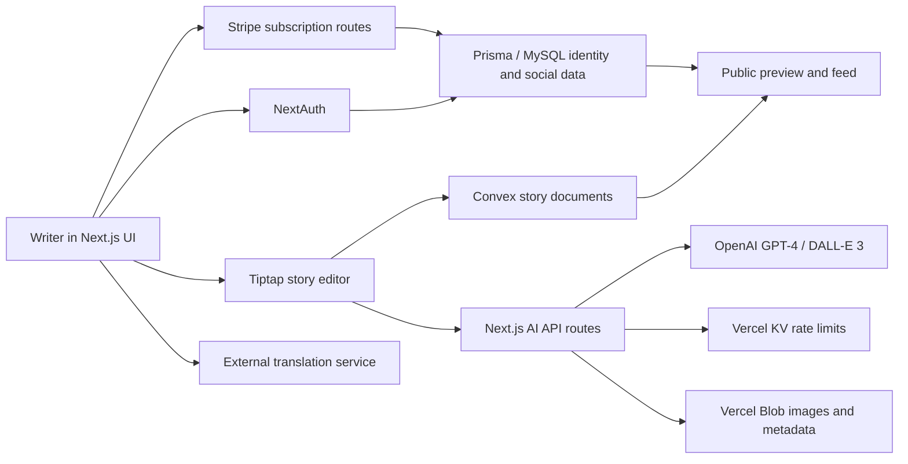
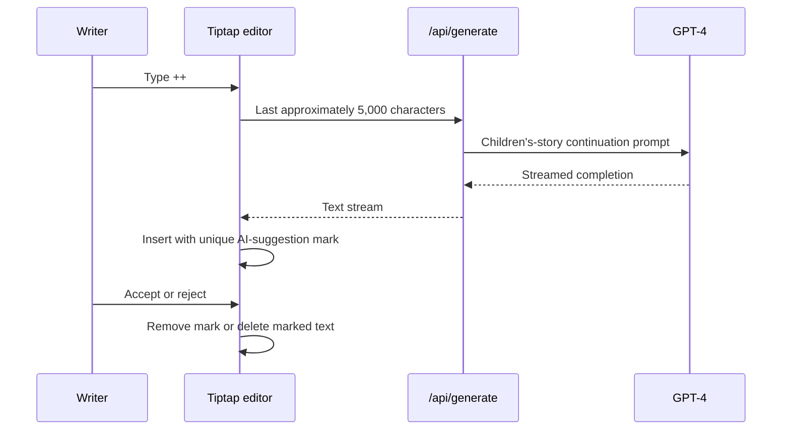

# Reading Club AI Repository Analysis

## Report scope

This report analyzes the complete [`The-Reading-Club/reading-club-ai`](https://github.com/The-Reading-Club/reading-club-ai) repository at the reviewed commit. The review covers its product model, repository history, frontend and backend architecture, AI writing and illustration workflows, persistence, identity, sharing, billing, internationalization, child-facing safety and privacy, security boundaries, maintainability, and reproducibility. Claims in the README were checked against the executable source rather than accepted at face value.

## Repository record

- **Upstream:** [`The-Reading-Club/reading-club-ai`](https://github.com/The-Reading-Club/reading-club-ai)
- **Reviewed source:** [`The-Reading-Club/reading-club-ai`](https://github.com/The-Reading-Club/reading-club-ai/tree/5ffa67d3340a6c79dbe1fd7fcb49e921e2d6b540)
- **Reviewed branch:** `main`
- **Reviewed commit:** `5ffa67d3340a6c79dbe1fd7fcb49e921e2d6b540`
- **Commit date at reviewed HEAD:** August 11, 2025
- **Last substantive application-source commit found:** `3bf1d11a54b9859402b3dc6945cc6b1a1d61d360`, April 26, 2024
- **License:** The Unlicense; the repository places the work in the public domain to the extent legally possible
- **Primary stack:** Next.js 14, React 18, TypeScript, Tiptap/ProseMirror, Convex, Prisma/MySQL, NextAuth, OpenAI, Vercel AI SDK, Vercel Blob/KV, Stripe
- **Automated test suite:** None found

The repository contains roughly 364 tracked files. Its principal application, `my-app`, accounts for approximately 28,000 lines of TypeScript/TSX. Two smaller applications, `nextjs-app` and `my-tiptap-project`, are earlier editor experiments rather than separate production services.

## Executive summary

Reading Club AI is an ambitious, feature-rich web application for writing, illustrating, sharing, and publishing children’s stories. Its strongest interaction idea is not simply “call GPT and insert text.” In the Tiptap editor, typing `++` requests a short continuation, streams it into the document, marks the generated span with a unique provenance identifier, and lets the writer explicitly accept or reject it. That is a concrete, reusable pattern for preserving authorship and agency in AI-assisted writing.

The application also contains a broad product surface: Google or credential authentication, a draft dashboard, story metadata, a rich editor, character extraction and definition, DALL-E illustration, image upload, PDF export, public previews, following and feeds, subscriptions, usage limits, localized UI dictionaries, and basic profile management. Convex stores story documents, Prisma/MySQL stores identity and social or subscription records, Vercel Blob stores images and generation metadata, and Stripe manages paid plans.

The repository should nevertheless be treated as a late prototype rather than production-ready child-facing software. It has three overlapping persistence and identity domains, no automated tests, many stale or incomplete routes, extensive logging of sensitive values, weak safety controls, and build-time reliance on deployment secrets. Most importantly, several public Convex functions trust caller-supplied user identifiers rather than authenticated server identity. `documents.get` can return private drafts for an arbitrary supplied email address, `documents.archive` similarly relies on a supplied user ID, and activity queries expose email-shaped identifiers without an authorization check. These are serious authorization and privacy problems.

The privacy policy also understates the data processed by the source. It says the service collects a parent email, a child’s first name or nickname and age, and usage statistics; the implementation additionally handles complete story manuscripts, prompts, generated images, public sharing state, biography and follow relationships, billing data, OAuth provider data, and in some paths raw tokens or identity claims in logs. The active schema does not clearly implement the child-age record described by the policy. There is no visible child-content moderation, age-adaptive policy, caregiver approval flow, self-harm or abuse escalation, PII redaction, generated-image safety layer, or account-deletion workflow matching the policy’s instructions.

Verification reflects this mixed state. Dependency installation completed, TypeScript type checking passed, and Next.js linting completed with warnings. A production build compiled the application but failed while collecting route data because OpenAI clients are instantiated at module load and `OAI_KEY` was not present. The build also reported Edge Runtime incompatibility involving `bcryptjs`, CSS nesting configuration, missing `sharp`, React hook dependency warnings, and accessibility/image warnings. No `.env.example` or end-to-end setup fixture is provided.

For CreativeOS, this repository is most useful as an interaction-pattern library. The generated-span accept/reject mechanism, editor-integrated media tools, inspectable character attributes, and story-to-publication flow are worth learning from. Its data security, privacy alignment, safety architecture, and multi-store identity model should not be copied.

## Product intent and user experience

The application positions itself as a creative writing environment in which a user can begin with a blank story, draft in a rich-text editor, ask AI for a continuation, create illustrations, and share the result. The source suggests both adult and child users, but does not implement a consistently distinct child account, caregiver account, or age-specific experience.

The main user journey is:

1. Sign in with Google or credentials.
2. Open the drafts dashboard and create a Convex document.
3. Set title, cover, or story metadata.
4. Write in the Tiptap editor and request AI continuations with `++`.
5. Accept or reject generated passages.
6. Upload an image or create illustrations from the story context.
7. Save continuously to Convex.
8. export to PDF, create a public share URL, or publish into the social feed.

This is substantially more than a one-screen generation demo. The editor is the product center, with AI treated as a set of operations inside a human-owned document. That product framing is a better fit for co-creation than a chat interface that hides the evolving artifact.

## Repository topology

| Area | Role | Assessment |
|---|---|---|
| `my-app/` | Main Next.js application | The only full product implementation; contains frontend, API routes, Convex functions, Prisma schema, auth, billing, and editor logic |
| `nextjs-app/` | Minimal Next.js/Tiptap experiment | Small precursor demonstrating the editor, not part of the main runtime |
| `my-tiptap-project/` | Earlier Tiptap playground | Development experiment with toolbar/editor components |
| Root `README.md` | Product and author description | Highly promotional and broader than the operational evidence in source |
| Root `LICENSE` | Unlicense text | Very permissive reuse terms, but dependency and generated-asset terms still apply |

The three application folders and old commented paths reveal an iterative project history. They are useful for seeing how the editor evolved, but make the repository less immediately navigable. A production repository would normally archive prototypes separately and define one canonical setup path.

## System architecture

The application uses Next.js App Router for pages and server routes. The route tree includes localized paths, authenticated draft and settings pages, public story previews, authentication pages, subscription endpoints, AI generation endpoints, and profile/social routes. Middleware provides broad access control, while route handlers implement—or sometimes omit—more granular checks.

The architecture separates operational concerns but not cleanly:

- **Convex** owns story documents and their archive, share, and publication state.
- **Prisma/MySQL** owns users, OAuth accounts, profiles, follow relationships, and subscription-related records.
- **Vercel Blob** stores image files and JSON generation metadata.
- **Vercel KV/Upstash** tracks limits.
- **NextAuth** creates sessions and maps provider identity into Prisma-facing user records.

This creates a distributed identity join across email, OAuth subject, Prisma string ID, Prisma numeric `intID`, Convex `userId`, and Convex `userOauthId`. Some code treats email as ownership, other code uses the OAuth subject, and still other code queries Prisma’s numeric identifier. The result is difficult to reason about and directly contributes to authorization mistakes.

## Story-document model

Convex documents include author and ownership identifiers, title and rich-text content, cover/image references, archive state, share and publication flags, and timestamps. The exact model supports both private drafts and public stories.

The important access states are:

| State | Intended visibility |
|---|---|
| Private, not archived | Owner only |
| Shared | Anyone with the preview route/link |
| Published | Eligible for public feed and discovery |
| Archived | Hidden from ordinary draft views |

The intent is sensible, but enforcement is inconsistent. `getById` checks authenticated identity for private documents and permits non-archived shared documents, while other list and mutation functions accept identity-shaped arguments from the client. Access policy therefore exists as scattered conditional code rather than one reusable authorization layer.

## Editing and AI continuation workflow

The main editor is built on Tiptap and ProseMirror extensions. It supports structured rich text, links, images, slash-command tools, character-related actions, and a floating or bubble interaction surface. Changes are debounced before being written to Convex. Although local-storage support exists, the active draft page disables it, so the principal durability path is the remote document store.

The continuation flow is the repository’s clearest design contribution:

The route requests one or two short paragraphs and uses a hard-coded GPT-4 model. Only recent context is sent, which bounds prompt size but can omit earlier plot facts. The unique mark makes the generated region inspectable after streaming. Acceptance converts it to ordinary authored text; rejection removes it cleanly.

This is superior to silently appending generated prose because it makes the moment of delegation and the writer’s decision explicit. For a child-facing system, the same pattern could be enhanced with a visible AI badge, undo history, age-appropriate explanation, and a caregiver-accessible provenance view.

Technical weaknesses in the flow include:

- reliance on `NEXT_PUBLIC_APP_URL` to construct a same-origin endpoint;
- brittle error handling that assumes an error message is JSON and parses it blindly;
- no output moderation or content classification;
- no structured continuity state beyond the trailing text window;
- no age, reading level, learning objective, or safety profile in the prompt; and
- no evaluation harness for generated continuations.

## Character and illustration workflow

The source contains routes and UI for identifying characters, creating character definitions, choosing existing characters, and generating illustrations. Character definitions model visible attributes so that repeated images can use a stable description. The currently active illustration route receives existing characters, definitions, and selected character context from the client, then constructs a detailed DALL-E prompt.

Illustration generation uses DALL-E 3. The UI can request multiple alternatives, and one path performs four generation calls in parallel. The resulting image can be persisted to public Vercel Blob storage. A companion JSON metadata blob records the original prompt, revised prompt, request body, timestamp, and other generation details.

There are good ideas here:

- character attributes are explicit rather than hidden in one giant prompt;
- the image prompt and model-revised prompt are retained for provenance;
- upload and generation share an editor insertion surface; and
- generated assets can be associated with a story rather than living in a separate gallery.

There are equally important risks:

- the code has no application-level image moderation or child-safety review;
- public metadata may expose story context, child-related text, or character details included in the request body;
- four parallel image calls can create a large, non-transactional cost spike;
- the prompt suggests repeatability through a “seed,” but the DALL-E 3 API invocation does not implement a seed control;
- there is no stable asset-rights, deletion, retention, or attribution record; and
- no evaluation measures whether repeated illustrations actually preserve character identity.

The source also has stale and partially overlapping character routes. OpenAI clients for character identification and creation are constructed at module import, which is why a secret-free build fails during route evaluation.

## Sharing, publication, and social features

Stories can be marked shared or published through Convex mutations. Shared stories are available through a preview experience, while published stories can appear in discovery or feed views. Prisma models support follow relationships and user profiles, creating a small social network around published writing.

The distinction between link sharing and publication is a valuable product concept. A child-oriented implementation, however, needs stronger state transitions:

- explicit caregiver approval before public publication;
- a preview of exactly what data will be public;
- author-name and profile-visibility controls;
- reporting, blocking, takedown, and moderation queues;
- immutable audit events for publication changes; and
- safe defaults that do not expose a child’s story, profile, prompt metadata, or image-generation context.

The current feed implementation also contains a correctness bug: `getFollowed` returns all published documents before reaching its intended filtering logic, so the supplied followed-user IDs are effectively ignored.

## Authentication, accounts, and billing

NextAuth v5 beta is configured with Google and credentials flows. Prisma adapters and callbacks connect provider accounts to the relational user model. The code enables `allowDangerousEmailAccountLinking` for Google. That option can be appropriate only under a carefully validated provider and account-linking policy; here it increases the consequence of ambiguous or unverified email identity.

The application includes Stripe checkout, subscription state, webhook processing, usage or plan checks, and promotional/pricing UI. These features indicate a real SaaS product ambition, but some price and promotion values are hard-coded and the data path is not covered by tests.

Dependency installation reports that `@next-auth/prisma-adapter` expects the NextAuth v4 peer line while the application uses a v5 beta release. That does not prove runtime breakage, but it is an avoidable compatibility risk in the most security-sensitive subsystem.

## Internationalization and accessibility

UI dictionaries cover approximately 20 locales, including Arabic, Bengali, Chinese variants, English, French, German, Hindi, Italian, Japanese, Korean, Polish, Portuguese, Romanian, Russian, Spanish, Turkish, Ukrainian, and Vietnamese. This is unusually broad for an open-source prototype.

The repository also calls an external translation service for some content. The service URL and behavior are environment-driven, with no local implementation or clear data-processing contract. In a child-facing product, story text sent for translation is another privacy boundary requiring disclosure, retention limits, and vendor review.

Lint output includes accessibility-related image warnings and use of raw `` elements. Translation breadth therefore should not be mistaken for complete inclusive design. The source does not demonstrate right-to-left layout validation, child reading-level adaptation, screen-reader testing, keyboard testing, or localization QA.

## PDF and media output

The application uses `react-pdf` to export stories. A playback endpoint exists but returns a fixed hosted MP3 rather than synthesizing or narrating the active story, and an upload endpoint is effectively a stub that returns success without implementing a durable general upload path. These are examples of a recurring repository characteristic: the UI and route surface sometimes imply a complete feature while the implementation remains experimental.

## Security assessment

### Critical: caller-controlled Convex authorization

Several Convex functions use a supplied `userId`—apparently an email address—as if it were proof of identity. `documents.get` can query private documents for the supplied value without deriving the owner from `ctx.auth`. `documents.archive` similarly checks ownership against a client-provided identifier. `documents.create` authenticates the caller but still accepts separate caller-provided ownership fields rather than deriving them from the authenticated token.

Because Convex queries and mutations exposed to the client are network-accessible functions, a user-controlled email is not an authorization boundary. An attacker who knows or guesses another account email could potentially list or archive that person’s work. Every private query and mutation should derive a canonical principal from `ctx.auth.getUserIdentity()`, map that principal server-side, and ignore ownership identifiers supplied by the browser.

### High: privacy exposure through activity queries

The “most active users” queries have no meaningful authentication or audience restriction and return `userId` values that appear to be emails. Even when the underlying stories are public, publishing account email addresses as activity identifiers is unnecessary. Public views should use a deliberately public opaque profile ID and a user-controlled display name.

### High: sensitive logging

The application logs substantially more than ordinary diagnostic metadata. Examples include:

- authentication token objects and linked provider account/user records;
- session, ID token, decoded claims, and refreshed-token responses in the refresh route;
- full Stripe webhook bodies and event or subscription objects;
- chat messages;
- illustration requests, character attributes, full prompts, and provider responses; and
- generated image URLs and metadata.

These values can contain credentials, personal information, private story content, billing identifiers, or child-related creative material. Production logging should use a central redaction policy, an allowlist of safe fields, short retention, access controls, and request correlation IDs. Token contents and raw creative content should never be routine logs.

### Medium: reliance on middleware for API protection

Broad Next.js middleware protects many paths, and the rate-limit helper uses session identity when it can. Route handlers still need their own authorization because middleware matching can change, internal calls can bypass intended paths, and object-level permission checks cannot be expressed as one global gate.

### Medium: public generation metadata

The image metadata record can include the complete request body and prompts and is stored in public Blob storage. Even if the image is meant to be shared, prompt context may reveal more than the final asset. Metadata should be private by default, minimized, linked by an opaque server-side record, and released only through an explicit provenance view.

## Child safety, privacy, and ethics

The product domain makes safety architecture a core requirement, not a later moderation feature. The reviewed source does not contain a systematic child-safety layer around either text or image generation. Its main text prompt calls the model a children’s-book assistant, but that alone does not handle:

- sexual, violent, hateful, self-harm, or exploitative content;
- grooming or inappropriate relationship patterns;
- disclosure of abuse or imminent danger;
- a child entering their real name, school, address, phone number, or photograph;
- requests to depict a real child;
- manipulative engagement or emotional dependency;
- age-inappropriate vocabulary and themes;
- public sharing of sensitive autobiographical stories; or
- generated stereotypes and representational harms.

A production design needs input classification, contextual policy, output checks, image moderation, PII detection, safe refusal and redirection, caregiver escalation rules, reporting, and human review for public content. These controls must apply to both model responses and the user-authored artifact, especially at publication.

The bundled privacy-policy page does not align with observed processing. It describes collecting a parent email, child nickname or first name and age, and usage statistics, while the implementation also processes or stores complete drafts, prompts, images, public story state, profiles, biographies, follow relationships, OAuth information, and subscription records. Conversely, the active data model does not clearly implement the described child-age record. The policy refers to an app and directs deletion through a settings action that is not visibly implemented as a complete deletion workflow.

This mismatch matters beyond documentation quality. Child privacy compliance requires knowing which user is the parent, which is the child, what consent applies, why each field is necessary, how long creative content and provider metadata are retained, which vendors receive it, and how deletion propagates across MySQL, Convex, Blob, KV, Stripe, logs, and model providers. The current multi-store architecture has no demonstrated deletion orchestrator.

## Code quality and maintainability

### Strengths

- TypeScript is used throughout the main application.
- The editor is decomposed into extensions and reusable components.
- AI continuations use streaming rather than blocking the editing surface.
- Generated spans carry explicit provenance and a decision state.
- Convex gives the editor a simple reactive persistence model.
- The route and component surface covers a realistic end-to-end product.
- Internationalization dictionaries are extensive.
- The public-domain license makes source reuse straightforward, subject to third-party dependencies and service terms.

### Weaknesses

- No automated unit, integration, browser, security, or AI-behavior tests were found.
- The source contains more than 200 `console.log` calls across the main application and Convex code.
- Numerous TODO, FIXME, “urgentfix,” commented-out, and legacy paths remain.
- Prototype applications are kept beside the primary product without a clear archival boundary.
- The README overstates robustness relative to the code and provides little precise setup guidance.
- There is no `.env.example`, deployment topology, data-migration guide, threat model, or operational runbook.
- Several API routes are stubs or unfinished experiments.
- Some client components have hook dependency warnings and inconsistent error paths.
- The editor initializes a Yjs `Y.Doc` and Tiptap collaboration extension but no synchronization provider; it is not real multi-user collaborative editing. Enabling the collaboration extension also disables ordinary StarterKit history, adding complexity without delivering network collaboration.
- One modal-close setter ignores the callback it is given and simply closes, indicating insufficient interaction testing.
- A Convex image update reads the first image node without first proving one exists; the exception is caught but the logic is noisy and fragile.
- A route declares a 300-second maximum duration next to a comment describing five seconds, a small sign of documentation drift.

## Reproducibility and verification

Verification was performed in the main `my-app` package on the reviewed checkout. Service-backed end-to-end actions were not invoked because the repository does not provide safe test credentials or local substitutes for its databases, OpenAI, Stripe, Vercel services, and translation provider.

| Check | Result | Interpretation |
|---|---|---|
| `yarn install --frozen-lockfile` | Passed | Dependencies installed from the committed lockfile; emitted peer warnings, including NextAuth adapter/version and Tiptap peers |
| `yarn tsc --noEmit` | Passed | The main TypeScript program type-checks in the installed environment |
| `yarn lint` | Passed with numerous warnings | No fatal lint errors, but React hook, image, and accessibility issues remain |
| `yarn build` | Failed during page-data collection | Compilation succeeded; route import failed because `OAI_KEY` was absent and OpenAI clients are created at module scope |
| Automated tests | Not available | No genuine `*.test.*` or `*.spec.*` suite was found |
| Secret/setup template | Not available | No `.env.example` documenting the many required variables was found |
| Dependency audit | Inconclusive | The Yarn 1 audit endpoint returned HTTP 410, so no current vulnerability result was obtained |

Build warnings additionally identify CSS nesting without corresponding PostCSS configuration, use of Node APIs from `bcryptjs` in an Edge Runtime dependency path, absence of the optimized `sharp` image package, and lint/accessibility warnings. The build failure is avoidable: service clients should be instantiated lazily inside a request or through an injected provider, and the build should not require production secrets merely to analyze route modules.

Required environment references span at least:

- database and authentication secrets;
- Google OAuth credentials;
- Convex deployment URL;
- OpenAI key;
- Vercel KV/Upstash credentials;
- Vercel Blob credentials;
- Stripe product, price, secret, and webhook values;
- application base URL;
- translation-service URL or key; and
- analytics or affiliate integrations.

The absence of a canonical environment contract makes a clean deployment unnecessarily difficult.

## What the README claims versus what the source establishes

The root README describes a polished, highly modular, scalable, multilingual AI story platform. Several underlying capabilities are real: the rich editor, AI continuation, DALL-E generation, Convex persistence, sharing, profile/social features, Stripe integration, and dictionaries all exist in source.

Other impressions require qualification:

- “Collaboration” is primarily collaboration with AI; the Yjs setup has no provider and does not establish simultaneous multi-user editing.
- Some media and upload endpoints are placeholders.
- Clean deployment is not reproducible without undocumented services and secrets.
- “Secure” or production-grade positioning is contradicted by caller-controlled Convex authorization and sensitive logging.
- Child-oriented branding is not matched by a child-safety or caregiver-consent architecture.
- The last HEAD change is to documentation; most application code appears to have stopped changing in April 2024.

This does not erase the project’s engineering work. It changes the correct classification from mature open-source product to substantial founder-built prototype with production aspirations.

## Lessons for CreativeOS

### Patterns worth reusing

1. **Keep AI output provisional.** Insert generated text as a visibly marked suggestion, with explicit accept and reject actions.
2. **Place AI inside the artifact editor.** A story remains the primary object; AI is an operation on it rather than the entire interface.
3. **Persist provenance.** Track model, prompt lineage, timestamps, and human acceptance, but keep sensitive metadata private and minimized.
4. **Model recurring characters explicitly.** Store stable visible attributes separately from plot prose so illustration prompts can reuse them.
5. **Distinguish private, shared-link, and published states.** These are genuinely different consent and audience decisions.
6. **Stream short suggestions.** Small continuations preserve momentum and give the writer frequent control points.

### Patterns to redesign

1. **Use one canonical identity.** Derive authorization from an authenticated immutable user ID, never from an email or browser-provided owner field.
2. **Centralize story access policy.** Every query and mutation should call the same tested ownership/publication rules.
3. **Separate child and caregiver roles.** Public sharing, account consent, payments, and data deletion require an adult authority model.
4. **Create a real safety pipeline.** Moderate inputs and outputs, detect personal information, handle sensitive disclosures, and review public content.
5. **Minimize vendors and data copies.** A story currently crosses several services. Maintain a data inventory, purpose and retention policy, deletion workflow, and vendor boundary for each copy.
6. **Do not expose raw prompt metadata publicly.** Publish an intentionally redacted provenance record, not the generation request body.
7. **Inject providers and support local fakes.** The application should build and test without production secrets.
8. **Test product boundaries first.** Authorization, publish transitions, billing webhooks, suggestion acceptance, and deletion deserve integration tests before additional surface features.

## Recommended remediation order

If this code were to be revived, the responsible order is:

1. Disable or fix all Convex functions that accept caller-supplied ownership identity.
2. Remove token, story, prompt, webhook-body, and personal-data logging; rotate credentials if production logs ever captured secrets.
3. Make image metadata private and audit existing public Blob objects.
4. Define one identity mapping and central authorization helpers.
5. Reconcile the privacy policy with actual data flows and implement verified deletion across every store.
6. Add child-safety input/output gates and caregiver-controlled publication.
7. Add tests for authorization, share/publish state, auth linking, billing, and AI suggestion lifecycle.
8. Introduce `.env.example`, local provider fakes, lazy client initialization, pinned runtime versions, and a secret-free build path.
9. Remove or archive prototypes, stubs, unreachable code, and stale route variants.
10. Only then expand character consistency, narration, collaboration, or social discovery.

## Bottom line

Reading Club AI is a meaningful open-source reference for AI-native story editing. It demonstrates a full creative workflow and, in particular, an excellent generated-text accept/reject pattern that protects visible human agency. It also demonstrates how quickly a broad AI SaaS prototype can accumulate dangerous gaps when identity, creative content, public sharing, billing, and multiple cloud stores are added without a single security and privacy model.

CreativeOS should borrow the interaction grammar—provisional AI suggestions, explicit decisions, structured character context, and artifact-centered creation—while rebuilding the surrounding platform around canonical identity, server-derived authorization, private provenance, caregiver consent, child-safety controls, testable provider boundaries, and verifiable deletion.
