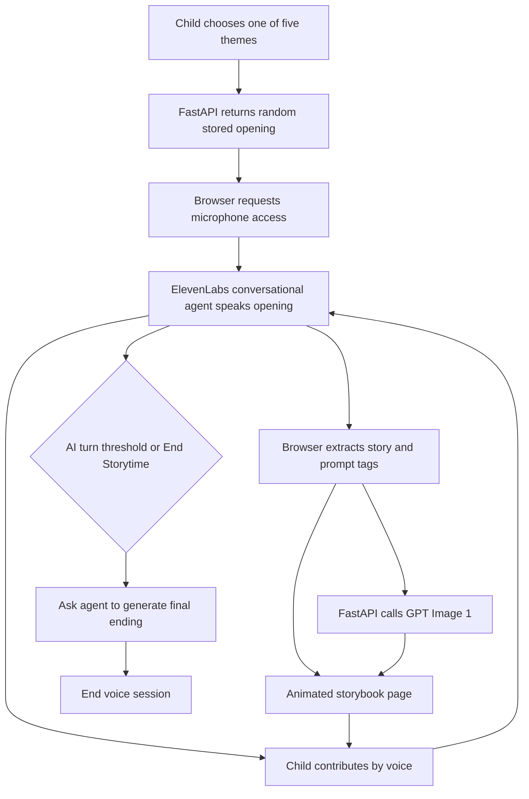

# AI Collaborative Storyteller Repository Analysis

## Report scope

This report analyzes the complete [`Johnxjp/ai-collaborative-storyteller`](https://github.com/Johnxjp/ai-collaborative-storyteller) repository at the reviewed commit. The review covers the intended child–AI interaction, frontend and backend implementation, ElevenLabs and OpenAI boundaries, prompt and story-state design, image generation, termination behavior, deployment, security, child safety and privacy, maintainability, and reproducibility. Active source paths were distinguished from abandoned helpers and externally configured behavior.

## Repository record

- **Upstream:** [`Johnxjp/ai-collaborative-storyteller`](https://github.com/Johnxjp/ai-collaborative-storyteller)
- **Reviewed source:** [`Johnxjp/ai-collaborative-storyteller`](https://github.com/Johnxjp/ai-collaborative-storyteller/tree/655265ebb6e07d86d575963415081fa7128c6160)
- **Reviewed branch:** `main`
- **Reviewed commit:** `655265ebb6e07d86d575963415081fa7128c6160`
- **Reviewed commit date:** June 20, 2025
- **Repository history observed:** June 9–20, 2025; 46 commits from one author identity
- **License:** No license file or license declaration was found; public visibility does not grant a general right to reuse or redistribute the code
- **Source size:** Approximately 1,824 lines across 19 TypeScript/TSX files and 3 Python files
- **Primary stack:** Next.js 15.3.3, React 19, TypeScript, Tailwind CSS 4, ElevenLabs React SDK, FastAPI, OpenAI Python SDK, GPT-4o mini through the externally configured voice agent, and GPT Image 1
- **Automated tests:** None found

## Executive summary

AI Collaborative Storyteller is a focused voice-first prototype for children aged approximately 5–10. A child chooses one of five themes, sees a randomly selected prewritten opening, grants microphone access, and begins a live conversation with an ElevenLabs agent. The agent and child take turns extending the story. The agent is expected to wrap narrative prose in `<story>` tags and its question in `<prompt>` tags. The browser extracts those sections, renders each AI-authored segment as a new animated storybook page, and asks an unauthenticated FastAPI backend to generate a GPT Image 1 illustration. After a small number of AI turns, the frontend sends a hidden instruction asking the agent to produce an ending and end the call.

The prototype’s strongest contribution is experiential clarity. Speech is the input, the evolving illustrated book is the output, and each AI turn ends in a concrete open question. The system does not ask a child to learn a complex editor or continuously read and type. The creator’s README also reports important qualitative difficulties honestly: voice agents interrupt children who pause, background noise causes trouble, and externally hosted realtime conversation is expensive and hard to steer deterministically.

The checked-in repository is not a self-contained reproduction of the storytelling agent. Its central language behavior lives in an ElevenLabs agent configured outside the codebase. `backend/prompts.py` contains the apparent system prompt, including the `<story>`, `<prompt>`, `<end>`, and `end_tool` protocol, but no active code uploads or sends that prompt to ElevenLabs. The app supplies only the agent ID and overrides the first message. A new deployer must recreate the hidden cloud-side prompt, voice, tools, model, turn settings, and authentication policy manually. The ending logic works only if that unseen agent configuration recognizes the contextual instruction and has an `end_tool` defined.

The repository is also a demo rather than a safe child-facing service. It has no account or caregiver model, consent flow, privacy notice, transcript controls, moderation endpoint, rate limit, cost quota, authentication, persistence policy, or deletion workflow. Audio and conversation data go to ElevenLabs; story segments go to OpenAI for image generation; generated images are written indefinitely to local server storage and served publicly. None of these data flows is explained to the child or caregiver in the product.

Security verification found a high-impact file-path vulnerability. The public `/generate-image` endpoint incorporates caller-controlled `story_id` and `page_id` directly into a filesystem path. A controlled test using a fake image client proved that an absolute `story_id` writes the returned image bytes outside the intended `images/` directory. The endpoint is unauthenticated and unmetered, so it can also be abused to spend OpenAI image-generation budget and fill disk. Additional problems include wildcard CORS, debug mode, raw exception details, unlimited prompt length, blocking synchronous OpenAI and disk operations inside an asynchronous route, and no image cleanup.

Reproducibility is mixed. The frontend installed, type-checked, linted with one hook warning, and built successfully. Its committed dependency versions currently audit with three production vulnerabilities, including a critical advisory group affecting the pinned Next.js version. The Python environment installed from its frozen `uv.lock`, compiled, and passed health and valid-opening API checks with a dummy key. Without `OPENAI_API_KEY`, however, importing the application fails even for routes that do not use OpenAI because the client is constructed globally. Docker Compose parses, but its backend health check imports `requests`, which is not declared or installed; the container therefore cannot report healthy as written.

For CreativeOS, the repository is valuable for its voice-to-illustrated-page interaction and for documenting the realities of conversational turn-taking with children. Its externalized agent configuration, XML-like parsing, safety boundary, storage, and API security require a redesign before reuse.

## Product concept

The interface starts with five large visual theme cards:

1. adventure, labeled “Sea Secrets”;
2. space, labeled “Adventurous Astronauts”;
3. fantasy, labeled “Mystical Magic”;
4. cooking, labeled “Curious Cooking”; and
5. sports, labeled “Spectacular Sports.”

Choosing a theme calls `/generate-opening`, although the route does not generate anything at runtime. It selects one stored opening at random from `backend/data.py`. The repository includes 30 openings: 10 cooking and 5 in each other category. Each record has a title, one-sentence preview, and opening of no more than three sentences.

The preview page stores the selected opening and category in `sessionStorage` and navigates to `/story`. The story page immediately requests microphone permission and starts the ElevenLabs session. There is no explicit “start microphone” confirmation on the story page, no explanation of who processes the recording, and no retry or device-selection interface.

The intended interaction loop is:

This is a useful interaction composition: the story is heard, seen as prose, and illustrated, while the child’s next task is expressed as one specific question. The artifact accumulates page by page rather than disappearing into a chat transcript.

## Architecture and responsibility boundaries

### Next.js frontend

The frontend owns:

- theme selection and opening preview;
- transient story state;
- microphone permission and ElevenLabs session lifecycle;
- receiving user and AI conversation events;
- parsing tags from AI messages;
- page navigation and word-by-word text animation;
- background requests for page images; and
- the automatic and manual ending triggers.

All state is in React memory or `sessionStorage`. There is no database, account, durable story record, resume behavior, export, or sharing. Refreshing or leaving the experience loses the composed story, while generated images remain on the server without an associated durable story model.

### ElevenLabs cloud agent

ElevenLabs owns the realtime speech interface, transcription, LLM conversation, text-to-speech, turn detection, and likely the actual conversation history. The browser calls `startSession` with a public agent ID and overrides only the first message. The README says the agent uses GPT-4o mini.

Crucially, the repository does not define this agent as deployable configuration. There is no script or API call that establishes:

- the checked-in `system_prompt`;
- the selected voice and voice settings;
- interruption, silence, or turn-detection policy;
- the `end_tool` named in the prompt;
- language or moderation settings;
- data-retention settings; or
- whether public or signed access is required.

The voice agent is therefore an undocumented remote dependency, not a reproducible component of this repository.

### FastAPI backend

The backend has four useful route families:

- `POST /generate-opening` selects a stored opening;
- `GET /opening-prompt` returns an opening-writing prompt but is unused by the active frontend;
- `POST /generate-image` calls GPT Image 1, writes a JPEG, and returns its local URL; and
- `GET /images/{filename}` serves a stored JPEG.

`GET /health` supports health checks. There is no active story-continuation endpoint even though the frontend hook retains dead code for `POST /generate-story` and SSE parsing.

## Voice-agent prompt and conversational policy

The checked-in prompt gives the assistant the name “Natasha,” defines the audience as ages 5–10, asks for no more than four sentences, and directs the model to use simple language, match the child’s language, stay on story, avoid adult themes, gore, and frightening or inappropriate elements, and return to the story if redirected.

The turn protocol requests:

- story prose inside `<story>...</story>`;
- a question inside `<prompt>...</prompt>`;
- an ending when it sees `<instruction>generate ending and end call</instruction>`;
- an `<end>` marker; and
- a call to `end_tool`.

This is a sensible prototype contract, but it has several limitations:

1. **It is not actually wired into source-controlled runtime configuration.** Its presence in a Python file does not prove the live ElevenLabs agent uses it.
2. **The format is fragile.** The parser uses the first `indexOf` occurrence of each tag, not a structured response schema or streaming parser.
3. **Multiple story tags are truncated.** Only the segment between the first opening and first closing tag is retained.
4. **Malformed output is dropped.** A message with neither expected tag becomes no story page at all.
5. **The child can prompt-inject the agent.** The short instruction hierarchy is the only visible defense.
6. **Safety categories are underspecified.** “Adult,” “frightening,” and “inappropriate” do not cover self-harm, hate, abuse disclosures, PII, real-child imagery, medical content, grooming, or manipulative behavior.
7. **The tool protocol is incomplete.** `end_tool` is named but not defined anywhere in the repository.
8. **The prompt says not to use HTML while requiring tag-like formatting.** The intent is understandable, but the instruction is internally ambiguous.

The model supplies the story text shown in the book. The child’s words affect the next AI segment but are not visibly inserted or attributed as the child’s authored prose. The experience is collaborative in turn-taking and idea influence, not in a precise shared-authorship record.

## Turn-taking and termination

The source increments `narrativeTurnCount` on every AI message, including the opening. `maxTurns` is four, but the automatic trigger fires at `maxTurns - 1`, so after the third AI event the browser sends the contextual instruction asking for an ending. The expected final answer then becomes approximately the fourth AI turn. This differs slightly from the README’s wording that the trigger occurs when the number of turns “exceeds” a threshold.

Manual “End Storytime” sends an ordinary user message, `end story please.`, and sets the flag that prevents the automatic contextual ending instruction. It does not call `endSession` directly. Both ending routes depend on the remote agent cooperating and emitting `<end>`. If it does not, the UI has no hard timeout or force-stop control.

The creator’s README makes a particularly valuable observation: child speech contains long pauses, starts, stops, and reformulations, while conversational agents tend to treat an initial pause as the end of the turn and interrupt. This is not a cosmetic issue. Turn detection changes who controls the story and whether a child feels listened to. A production version should compare push-to-talk, explicit “I’m done” signals, generous endpointing, semantic voice-activity detection, and adult-configured pause thresholds with actual children.

There are also lifecycle bugs in the current browser code:

- the first `getUserMedia` stream is neither saved nor stopped, despite the comment saying it will be stored;
- there is no explicit cleanup effect ending the agent session when navigating home or unmounting;
- development Strict Mode can expose duplicate-effect problems because conversation start is in an unguarded mount effect;
- the end-session effect is driven by several conversational states and can call disconnect before the remote protocol is reliable; and
- failure to acquire the microphone or start the session is logged but not explained or recoverable in the UI.

## Story page construction

Every accepted AI message becomes a `Page` with a UUID, story text, optional image URL, and animation flag. The page is immediately appended and selected. Words fade in at roughly 350 ms each; only after text animation finishes does the illustration appear. Left and right fixed arrows navigate earlier pages.

The progressive reveal can create a calm read-along rhythm, but 350 ms per word means a 60-word four-sentence response takes about 21 seconds before its image can appear. Voice playback, word animation, and image latency are not synchronized. There is no highlighted read-along word, replay, pause, caption size control, reduced-motion mode, or screen-reader announcement.

Image generation begins as soon as the story text arrives. A single global `generatingImage` boolean represents all requests. If two generations overlap, completion of the first sets the flag false even if the second is still running. Per-page request status would avoid incorrect skeleton and error behavior.

Several components and hooks are no longer connected to the active UI: a text `StoryInput`, general `ImageDisplay`, `ImageSkeleton`, `usePageNavigation`, text-based `submitStory` and retry logic, the alternative opening hook, and the prompt-fetch hook. Their presence records earlier development but obscures the actual architecture.

## Image-generation implementation

The active route formats each AI story segment directly into a fixed prompt asking for one main focus, a colorful close-up, soft lighting, claymation, child-friendly presentation, and a “3D illustration in the style of Pixar.” It then calls `gpt-image-1` at 1024×1024, low quality, JPEG output.

Despite comments and an unused `generate_image_prompt` function, there is no active preliminary GPT-4o-mini prompt-rewriting call. The story plus style template goes directly to the image model. The README’s statement that the Responses API is used for both text and image outputs is therefore not accurate for the active path: the backend’s active image call uses the Images API, and text conversation occurs within ElevenLabs.

The server decodes base64, names the file from `story_id` and `page_id`, writes it to local `images/`, and serves it through FastAPI. The active frontend generates a new random “story” UUID on every page rather than preserving one story ID, so filenames do not actually group a session.

Local disk is a poor production store here. Multiple backend replicas would not share images; an ephemeral deployment may discard them; a long-lived instance can fill its disk; and there is no database, retention time, cleanup, or deletion link. A durable implementation should use an authenticated asset service, content-addressed or opaque keys generated by the server, lifecycle expiration, and story-level ownership.

The hard-coded commercial animation-studio style also creates avoidable product and brand risk. CreativeOS should define its own art direction or use licensed style packs with traceable provenance rather than asking for imitation of a named studio.

## Security assessment

### Critical: arbitrary filesystem write path

`/generate-image` accepts arbitrary strings for `story_id` and `page_id`, interpolates them into a filename, and passes the result to `os.path.join("images", image_filename)`. There is no validation, normalization, basename restriction, or containment check. An absolute `story_id` causes `os.path.join` to discard the intended `images` prefix; traversal components can also escape it.

This was verified without calling OpenAI by replacing the image client with a local fake through FastAPI’s test client. A request whose `story_id` began `/tmp/codex-ai-collab-path-test` returned HTTP 200 and wrote the fake bytes to `/tmp/codex-ai-collab-path-test_x.jpeg`, outside `images/`. The temporary proof file was removed after the check.

The fix is to ignore client filenames entirely. Generate a server-side UUID, choose the extension from a trusted enum, resolve the destination, assert it remains under a fixed storage root, write atomically with exclusive creation, and associate it with an authenticated story record.

### Critical operational risk: unauthenticated paid generation

Anyone who can reach the backend can invoke GPT Image 1. There is no authentication, authorization, rate limit, per-user quota, global budget breaker, request-size limit, CAPTCHA, or idempotency key. An attacker can generate images at the operator’s expense, issue concurrent requests, and consume disk.

### High: unrestricted browser access and debug responses

CORS permits all origins, methods, and headers while allowing credentials. The routes do not need credentials at all, so any website can call the paid endpoint from a visitor’s browser and read responses. `FastAPI(debug=True)` and `detail=str(e)` can reveal internal error and provider details.

### Medium: blocking work in asynchronous routes

The asynchronous image route uses the synchronous OpenAI client, base64 decoding, directory creation, and synchronous file writes. One slow generation blocks the event-loop worker. Concurrent cost abuse therefore also degrades availability. `AsyncOpenAI` plus bounded concurrency and nonblocking storage—or a queued worker—is more appropriate.

### Medium: unrestricted content and disk lifecycle

`scene_description` has no length limit, moderation, or policy. Files have no expiry, ownership, access token, or deletion. The image route logs the complete generated prompt, which can contain a child’s spoken idea or personal information.

## Child safety and privacy

The prototype’s prompt-level restriction is not an adequate safety system for ages 5–10. At minimum, a production flow needs:

- verified caregiver consent before microphone capture;
- a clear, spoken and visible explanation that AI and external providers process speech;
- configurable transcript and audio retention, with deletion propagated to ElevenLabs;
- input and output moderation independent of the storytelling model;
- PII detection and a gentle response when a child names their school, address, contact details, or real-world location;
- a policy and escalation path for abuse, self-harm, danger, and other sensitive disclosures;
- image moderation before generation and again before display;
- controls against generating or uploading depictions of real children;
- age-appropriate vocabulary and theme settings more precise than one 5–10 range;
- a caregiver-controlled hard stop and session summary; and
- safety evaluation with children, caregivers, and child-development experts.

The data map is important:

| Data | Recipient/storage | Current control gap |
|---|---|---|
| Microphone audio | Browser and ElevenLabs | No in-product consent record, retention explanation, or deletion UI |
| Transcript and conversation history | ElevenLabs agent | Cloud settings are absent from source; no local policy or audit trail |
| AI story segment | Browser memory and OpenAI image request | No PII minimization or moderation |
| Generated image | OpenAI, then backend disk | Public serving, no ownership, expiry, or deletion |
| Opening choice | Browser `sessionStorage` | Persists within browser session but is not cleared after use |

The absence of login reduces the amount of identity data collected locally but does not make the experience anonymous. Speech, transcript, prompts, IP addresses, and provider telemetry can be identifying, particularly for children.

## Deployment and configuration

The repository includes multi-stage Dockerfiles and `compose.yaml`. The frontend builds a standalone Next.js server under an unprivileged `nextjs` user, a good container practice. The backend uses the official `uv` Python 3.12 slim image and installs from a frozen lock.

Three deployment defects matter:

1. The backend health check runs `import requests`, but `requests` is not in the Python dependencies. Direct verification produced `ModuleNotFoundError`; the health check cannot pass.
2. Compose supplies `NEXT_PUBLIC_BACKEND_URL` only as a runtime environment value, while browser-exposed `NEXT_PUBLIC_*` variables are normally compiled into the Next.js bundle. The Dockerfile accepts a build argument for it, but Compose does not pass that argument. The source therefore falls back to `http://localhost:8000` in the local image.
3. `depends_on` uses only service start, not a healthy condition, so even a repaired health check would not gate frontend startup in the present configuration.

The committed frontend `.env` contains placeholders, not secrets. It defines `NEXT_PUBLIC_ELEVENLABS_API_KEY`, but active source never reads it. More importantly, an actual provider API secret must never be placed in a `NEXT_PUBLIC_*` variable because it will be exposed to every browser. Production ElevenLabs access should use a server-generated signed URL or token with a short lifetime and restricted agent permissions.

## Verification results

| Check | Result | Interpretation |
|---|---|---|
| `npm ci` | Passed | 339 packages installed from the lockfile |
| `npx tsc --noEmit` | Passed | Active frontend type-checks |
| `npm run lint` | Passed with one warning | Story-page mount effect omits `startAgentConversation` from dependencies |
| `npm run build` | Passed | Next.js generated static `/` and `/story` routes; warning remained |
| `npm audit --omit=dev` | 3 production findings | 1 critical and 2 moderate findings; the direct pinned Next.js package carries the critical advisory set, with moderate findings involving `postcss` and direct `uuid` |
| `uv sync --frozen` | Passed | 39 Python packages installed from `uv.lock` under Python 3.12 |
| Python compilation | Passed | All checked-in Python source compiles |
| `/health` | HTTP 200 with dummy key | Route works after module import succeeds |
| Five valid opening categories | HTTP 200 | Each returns one stored opening |
| Invalid opening category | HTTP 500 | Unvalidated category reaches `random.choice(None)` and exposes its error detail |
| Module import without OpenAI key | Failed | Global `OpenAI()` construction prevents even non-AI endpoints from starting |
| Docker Compose config | Parsed | Topology is syntactically valid, but health and public-env problems remain |
| Health-check dependency | Failed | `requests` is not installed |
| Filesystem containment proof | Failed securely | Controlled fake generation wrote outside `images/`, confirming the vulnerability |
| Automated tests | None found | All validation had to be performed manually |

The full frontend install reported 11 vulnerabilities including development dependencies; the production-only audit narrowed this to 3. These counts are a snapshot of the reviewed dependency graph and should be regenerated when dependencies change.

## Maintainability assessment

### Strengths

- The repository is small enough to understand end to end.
- Frontend concerns are separated into pages, display components, hooks, data, and types.
- Python dependencies and Node dependencies both have lockfiles.
- TypeScript strict mode is enabled.
- The UI converts voice-agent output into a visible artifact rather than leaving it as audio only.
- Stored story openings reduce first-turn latency and avoid paying for repeated setup generations.
- The README candidly documents voice latency, interruption, noise, reliability, and cost observations.
- Container definitions are included and the frontend uses an unprivileged runtime user.

### Weaknesses

- The most important agent configuration is not version-controlled.
- No license grants reuse rights.
- No tests exist for tag parsing, turns, route schemas, storage paths, safety, or containers.
- Dead components, hooks, prompt functions, schemas, and route clients remain.
- Frontend and backend opening response contracts have already drifted in the unused hook.
- The backend requires an OpenAI key at import rather than at the one route that needs it.
- Error states are primarily console logs.
- Metadata remains the default “Create Next App” title and description.
- The single `generatingImage` flag cannot represent overlapping page requests.
- The active story ID is regenerated for each page.
- Random openings are unseeded, unweighted, and imbalanced by theme.
- There is no observability beyond raw logs and no cost or latency measurements in code.

## Lessons for CreativeOS

### Patterns worth retaining

1. **Turn voice into a durable visual artifact.** Display the co-created story as pages, not merely a transcript.
2. **End every AI turn with one actionable invitation.** A concrete question reduces the burden of inventing how to participate.
3. **Use prepared openings for low-latency starts.** Curated openings can be safer and faster than generating every first page live.
4. **Design for child pause behavior.** Endpointing and interruption policy should be a first-class interaction parameter.
5. **Let image generation happen behind the story turn.** Parallel media production can hide latency if status is tracked per page.
6. **Bound session length.** A narrative-turn budget can provide a satisfying arc and predictable time, provided ending is reliable and visible.

### Patterns that need redesign

1. **Version the full agent.** Prompt, model, voice, tools, moderation, turn settings, and retention should be a deployable manifest.
2. **Use structured events, not tags in prose.** The agent should emit typed `story_segment`, `child_prompt`, and `session_end` events validated at the server.
3. **Give the child visible authorship.** Preserve or summarize the child’s idea separately, let them correct the AI, and show how their contribution changed the story.
4. **Use signed session credentials.** Never expose provider secrets or permit unlimited public voice sessions.
5. **Queue and meter images.** Authenticate, moderate, rate-limit, deduplicate, set budgets, and store assets under server-generated IDs.
6. **Build caregiver controls before public deployment.** Consent, mute/stop, retention, review, export, and delete belong in the core workflow.
7. **Synchronize modalities.** Voice playback, text reveal, illustration readiness, and the next prompt need one explicit state machine.
8. **Evaluate turn-taking with children.** Adult assumptions about acceptable silence and interruption will not be reliable enough.

## Recommended remediation order

1. Disable public image generation until authentication, rate limits, quotas, and server-generated safe paths are implemented.
2. Patch and re-audit the pinned Next.js and related production dependencies.
3. Move ElevenLabs session creation behind a server-issued signed-session endpoint and ensure no actual secret is browser-visible.
4. Export the complete ElevenLabs agent definition into source-controlled deployment configuration.
5. Add caregiver consent, provider disclosure, retention selection, force-stop, and deletion.
6. Add independent text/image safety checks and sensitive-disclosure handling.
7. Replace tag parsing with typed structured events and a tested session state machine.
8. Use lazy provider initialization, validate categories and field lengths, turn off debug, restrict CORS, and redact errors/logs.
9. Move generated images to controlled object storage with ownership and expiry.
10. Repair container health checks and build-time public URL configuration.
11. Remove dead code and add unit, API, browser, security, and agent-protocol tests.
12. Conduct supervised usability and safety studies before treating the product as suitable for children.

## Bottom line

AI Collaborative Storyteller successfully demonstrates a compelling interaction in very little code: a child speaks an idea, an AI answers aloud, and the shared tale materializes as an illustrated book. Its README’s reflections on interruption, patience, noise, and realtime-agent cost are as useful as the source because they identify the hard problem—respectful child turn-taking—rather than pretending voice is solved.

The implementation is not safe or reproducible enough to deploy. The core agent lives outside version control, the browser trusts fragile tags, provider data flows have no consent model, and the public image backend has both cost-abuse exposure and a confirmed arbitrary-path write. CreativeOS should reuse the multimodal interaction concept and the deliberately bounded turn structure, while rebuilding the agent protocol, provider access, safety, storage, identity, caregiver controls, and evaluation from first principles.
