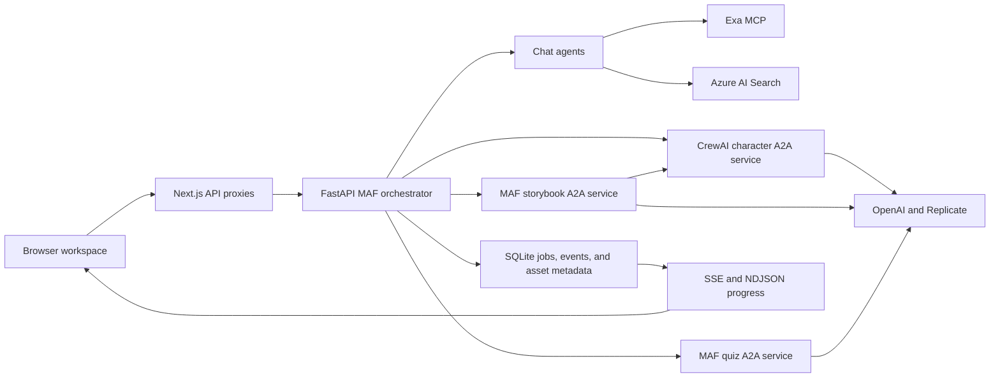
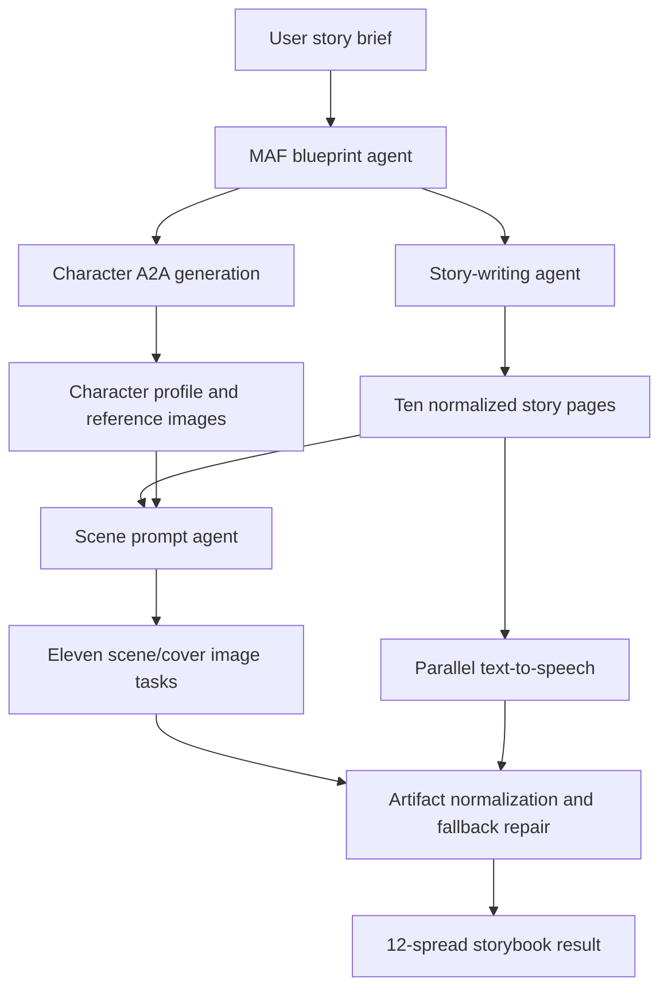

# Dream Repository Analysis

## Report scope

This report analyzes the current source tree of [`yashwanth-3000/dream`](https://github.com/yashwanth-3000/dream) at the reviewed commit. The review covers the complete Next.js interface, Microsoft Agent Framework orchestrator, CrewAI character service, storybook and quiz A2A services, Exa and Azure AI Search integrations, persistence and event-streaming layer, Docker/Azure deployment material, tests, dependency state, privacy, security, child safety, cost behavior, and lessons for CreativeOS.

The source was read service by service and traced from browser action through proxy route, orchestrator, remote agent, model/provider call, normalization, persistence, and final rendering. Static review was supplemented with clean dependency installs, frontend build and lint runs, Python unit tests and compilation, package auditing, module-import checks, FastAPI route/health smoke tests, SQLite inspection, and repository-history/cleanliness checks. No paid model, Replicate, Azure, or Exa generation request was made, and the deployment URLs named in the repository were not probed. References to deployment therefore mean “documented or configured by the repository,” not independently verified live availability.

## Repository record

- **Upstream:** [`yashwanth-3000/dream`](https://github.com/yashwanth-3000/dream)
- **Reviewed source:** [`yashwanth-3000/dream`](https://github.com/yashwanth-3000/dream/tree/5866e67650009610540b375b646396274dfb1b32)
- **Reviewed branch:** `main`
- **Reviewed commit:** `5866e67650009610540b375b646396274dfb1b32`
- **Reviewed commit date:** March 14, 2026
- **History:** 36 commits between February 10 and March 14, 2026; 34 attributed by Git shortlog to Yashwanth Krishna and two to Eesha Belladi
- **License:** No source-code license was found. Public visibility therefore does not by itself grant reuse, modification, or redistribution rights.
- **Tracked files:** 167
- **Tracked checkout size:** Approximately 12 MB after test dependencies and generated caches were removed
- **Source size:** Approximately 40,679 lines across Python, TypeScript, TSX, CSS, and JavaScript-family source: about 26,787 in the website, 7,000 in the orchestrator, 1,528 in the character service, 4,052 in the storybook service, and 1,312 in the quiz service
- **Primary stack:** Next.js 16, React 19, TypeScript, Tailwind, FastAPI, Pydantic, Microsoft Agent Framework prereleases, A2A, CrewAI, OpenAI, Replicate, Azure Content Safety, Azure AI Search, Exa MCP, SQLite, NDJSON, server-sent events, Docker, and Azure Container Apps
- **Automated tests:** Three narrow Python suites; no frontend, orchestrator, API-contract, browser, security, load, or end-to-end tests
- **CI:** No GitHub Actions or other repository CI configuration was found

## Executive summary

Dream is an ambitious multimodal learning and creativity application, not a toy prompt wrapper. Its browser experience brings six connected modes into one visual workspace: ordinary chat, web-assisted answers, study-file question answering, character design, illustrated storybook production, and quizzes. A central FastAPI service routes chat requests, invokes specialist A2A services, stores long-running jobs and generated assets, and streams progress. The character service uses CrewAI to research or interpret a concept, construct a backstory, and produce an image prompt. The storybook service builds a fixed 12-spread book, coordinates character and narrative generation, produces narration and illustrations, and normalizes every artifact into a predictable contract. The quiz service similarly converts a topic into a bounded, typed question set. The frontend turns these outputs into a coherent dashboard with progress, reusable characters, story pages, audio, inline quizzes, job history, and export-oriented presentation.

The strongest engineering idea is the separation between orchestration and bounded specialist services. Long generation flows expose named stages rather than appearing frozen; Pydantic models and repair functions protect the interface from malformed model output; story illustrations can reuse character references; and jobs survive page navigation because they are persisted. The application is visually and conceptually much closer to a product demonstration than most research repositories. A clean frontend production build succeeds, story and quiz services import and expose their A2A routes, most Python tests pass, and the repository documents container deployment in considerable detail.

That coherence masks a release-critical trust-boundary failure: there is no authentication or authorization in the website proxies, orchestrator, study sessions, job API, asset API, or specialist services. A caller able to reach the deployment can trigger paid OpenAI, Replicate, Exa, embedding, speech, image, story, character, and quiz operations; upload documents; select or guess a study-session identifier; enumerate jobs; inspect prompts, results, and events; delete jobs; fetch generated media; or attach generation to an arbitrary job. No tenant, child, caregiver, or administrator identity exists. There is also no rate limit, quota, concurrency budget, request-size policy for several media fields, or provider-spend circuit breaker. This is both a privacy breach and a potentially severe billing-abuse path.

Child-directed use raises additional concerns. Azure Content Safety is disabled by default, defaults to fail-open, and guards only the ordinary chat path. The character, story, quiz, search, study, generated-image, and narration paths do not have an equivalent end-to-end safety boundary. The interface contains no parental consent, age assurance, disclosure, account/data deletion, retention, reporting, or privacy-policy flow. Prompts, drawings, reference images, documents, and generated media can be sent to OpenAI, Replicate, Azure, and Exa without an in-product explanation of which processor receives what. The source demonstrates a creative system, but not a deployable child-safety or data-governance system.

The story workflow also contains unusually important quality and cost defects. It starts 11 scene-image tasks concurrently. Each task begins another Replicate attempt if an earlier attempt lasts more than 70 seconds, with a minimum of three launched attempts under slow-provider conditions. Cancellation of an `asyncio.to_thread` waiter does not cancel the provider-side prediction, so ignored attempts may continue and bill. A single book can therefore produce up to 33 image jobs without a user-approved budget. Narration is embedded as base64 data in the job result and also decoded into stored assets, duplicating large payloads in HTTP, NDJSON, memory, and SQLite. A fallback text normalizer injects cricket-team prose into pages that it judges too short, regardless of the requested subject; another keyword heuristic appends generic “happy ending” language. These mechanisms improve superficial contract compliance at the cost of narrative fidelity.

Reproducibility is mixed. The pinned orchestrator, story, and quiz environments install and compile, though they depend on prerelease Agent Framework versions and a local compatibility monkey patch. Story tests produce 12 passes and one failure because a supposedly expanded page is still shorter than its asserted minimum. Quiz tests pass. In contrast, the character service declares almost every dependency without an upper bound or lockfile. A clean current install resolves `a2a-sdk 1.1.0`, after which importing `app.main` fails with `ModuleNotFoundError: No module named 'a2a.server.apps'`. Its Dockerfile uses the same unbounded install, so the currently published source is not reproducibly startable from a clean contemporary environment. The frontend builds, but lint reports 15 errors and 12 warnings; npm reports four production dependency vulnerability groups, including a critical direct `jspdf` advisory group and a high-severity direct Next.js group at the reviewed lockfile.

Dream is valuable to CreativeOS as a product and orchestration reference: it demonstrates how chat, search, study, authoring, reusable characters, media generation, narration, quizzes, history, and progress feedback can feel like one system. It should not be used as a security, privacy, child-safety, persistence, cost-control, or deployment baseline. Before any public or child-facing release, identity and tenancy, centralized policy enforcement, provider budgets, safe asynchronous workers, durable object storage, data lifecycle controls, dependency locking, and contract/integration tests are foundational—not optional hardening.

## Product surface and user journeys

The landing and application pages present Dream as an all-in-one environment for learning and imagination. The actual implementation supports several distinct journeys:

1. **Chat:** ask a question and receive a direct model response.
2. **Search:** ask a current or factual question and allow Exa-backed web retrieval to enrich the answer.
3. **Study:** upload a document into a session-scoped Azure AI Search collection, then ask questions grounded in that material.
4. **Character:** enter a character idea, optionally attach images or URLs, generate a structured character profile, and create an illustration.
5. **Story:** provide a story brief, invoke character and story agents, generate ten narrated interior pages plus cover/end material, and render the book.
6. **Quiz:** request a topic, difficulty, and question count; answer a normalized multiple-choice quiz with hints and explanations.
7. **Dashboard/history:** browse generation jobs, reopen artifacts, view status/events, and reuse generated character imagery in later work.

This breadth is not only represented in marketing copy. The large chat workspace contains concrete state and rendering logic for files, search/study mode, story generation and page navigation, quiz interaction, character references, job progress, audio, and reusable assets. The dashboard and job pages consume the same backend records rather than presenting static mock data.

The main user flow is:



The boundaries are understandable, but they are service boundaries rather than security boundaries: every arrow is effectively anonymous.

## Frontend architecture and experience

### Next.js composition

The website uses the App Router with server-side API route handlers as a thin same-origin façade over the Python services. This prevents browser code from needing every backend origin and avoids exposing some configuration directly in client bundles. Shared utilities normalize backend base URLs, study uploads, video-generation options, dashboard data, and job records. Visual composition uses React 19, motion, icons, three-dimensional helpers, and a substantial custom CSS layer.

The centerpiece is an approximately 4,353-line chat page. It coordinates modes that have very different contracts and lifecycles in one component tree. This makes the demonstration feel unified, but it also creates high cognitive and regression risk. A durable version should divide the workspace into tested domain controllers or hooks—conversation, document session, character job, story job, quiz session, audio/book reader—and keep visual components mostly declarative.

The server route handlers generally forward JSON or multipart content and surface backend status. Several reliability and privacy choices are weak:

- error payloads can include configured backend origins and raw upstream response details;
- the non-summary job-list route can return HTTP 200 with an empty array after retries, converting an outage into a believable “no jobs” state;
- a dashboard summary cache is global by query for five minutes, with no user or tenant in the key;
- generated assets are proxied with `Cache-Control: public, max-age=31536000, immutable`; and
- one diagnostic route can address the character backend directly.

The global cache and public immutable asset policy are especially dangerous once identity is introduced. They must become tenant-aware and access-controlled rather than merely placing authentication in front of the existing code.

### Usability strengths

The UI does several things well:

- makes distinct modes legible without forcing users to understand the backend topology;
- gives long-running media work named progress stages;
- keeps prior jobs and artifacts discoverable;
- renders a generated story as pages rather than a raw JSON response;
- provides per-page narration controls;
- turns quiz structures into interactive answer, hint, and explanation states;
- supports image upload/reference and reuse of generated characters; and
- has a coherent, polished visual language appropriate for a product concept.

Those strengths are evidence of thoughtful product integration, not evidence that all backend claims are safe or robust.

### Frontend quality results

A clean `npm ci` installed 764 packages. `npm run build` completed successfully under the available Node 26.3.0/npm 11.16.0 environment: Next compiled, TypeScript checked, static data was collected, and 22 routes were emitted. This establishes that the checked-in lockfile and source can currently produce a frontend build in the reviewed environment.

`npm run lint` failed with 27 findings: 15 errors and 12 warnings. The most concentrated failures are in the about page, including state updates inside effects and unescaped entities. Other findings include hook dependency issues, unused expressions, and direct image-element warnings. These are not all runtime blockers, but a repository with no CI lets them accumulate without a release gate.

`npm audit --omit=dev` reported four production vulnerability groups: one critical, one high, and two moderate. The critical group reaches the direct `jspdf 4.2.0` dependency, and the high group reaches the direct `next 16.1.6` dependency; indirect DOMPurify and PostCSS paths are also involved. Advisory status changes over time, so this is a result for the reviewed lockfile and audit date, not a permanent characterization. It nevertheless requires remediation before PDF/export or server exposure is treated as production-ready.

## Central orchestrator

The main FastAPI service is both the conversation backend and the control plane for specialist work. It loads provider and service configuration, exposes health and generation routes, dispatches A2A calls, manages jobs, stores assets and events, handles uploads, provides SSE, and adapts specialist payloads into browser-facing forms.

### Routing and response model

For chat, a Question Reader agent classifies the request into a category and derives safety, reading-level, and response-style hints. A Responder agent then generates the response. Search and study variants enrich the prompt with external or uploaded context. This two-step design is preferable to an undifferentiated system prompt because policy and presentation can evolve independently.

The implementation still trusts model-generated routing decisions. There is no deterministic policy layer that constrains what tools or processors can be used based on identity, consent, age, content classification, or data type. Model classification should advise a policy engine; it should not be the policy engine.

### Health is not readiness

With dummy provider keys and unavailable specialist backends, the orchestrator's health endpoint returned HTTP 200 and overall `status: "ok"` while also reporting `backend_connected: false`. This is acceptable as a liveness response but misleading as readiness. Container orchestration can route traffic to an instance that cannot perform the application’s primary operations. Separate liveness, readiness, and detailed diagnostic endpoints are needed, with the detailed one protected from public disclosure.

### Compatibility and framework maturity

The main, story, and quiz requirements pin `agent-framework-core==1.0.0rc1` and `agent-framework-a2a==1.0.0b260219`. These are release-candidate/beta dependencies, not conservative stable baselines. Each MAF codebase includes an `af_compat.py` patch around OpenTelemetry semantic-convention imports. The patch is practical evidence that the selected dependency set needed local adaptation.

Pinned versions make these three environments more reproducible than the character environment, but the combination remains fragile. A production baseline should lock the full transitive environment, document why the compatibility patch is required, and test removal against a supported stable framework release.

## Chat, search, and study

### Ordinary chat

The chat path is the only workflow with explicit Azure Content Safety checks. When enabled, input is analyzed before the model call and output after it. The configuration, however, defaults the guard off and defaults failure behavior to allow. A service outage, configuration mistake, or credential problem can therefore silently remove the guard. Coverage appears limited to the standard four Azure harm categories and does not replace product-specific policies for child grooming, personal-data solicitation, dangerous challenges, eating/body content, commercial manipulation, copyrighted-character imitation, or age-inappropriate developmental framing.

Safety metadata from the Question Reader influences response construction, but it is still model-generated guidance rather than independent enforcement. Search context, uploaded material, images, stories, quizzes, and specialist agent outputs do not pass through the same input/output gate.

### Exa-backed search

Search is exposed through an MCP configuration for Exa. The architecture demonstrates a clean tool boundary: the main agent can gather external information and then answer in the same workspace. In a child-facing product, web access needs more than answer moderation. Search-query disclosure, source allow/deny policy, retrieval filtering, citation rendering, freshness/provenance, malicious-page prompt injection, and safe-link handling all require explicit controls. The reviewed code does not establish those controls.

### Study upload and retrieval

Study mode accepts PDF, TXT, Markdown, CSV, JSON, XML, HTML, YAML, and log-like text, with a declared maximum of 20 MB. It extracts text, divides it into roughly 1,400-character chunks with 200-character overlap, optionally creates embeddings, and writes the chunks to Azure AI Search with a `study_session_id`. Retrieval can combine search and vector similarity, with lexical and first-document fallbacks if the preferred path cannot return enough context.

This is a useful practical RAG flow, but several details matter:

- the upload is read fully before the size limit is enforced, so the limit does not bound peak request memory;
- the caller can provide the session ID, and no ownership check binds it to a user;
- a known or guessed identifier can be queried or appended to by another caller;
- there is no route to list, expire, or delete a study session and its indexed chunks;
- extracted document text is inserted into model context without a strong untrusted-content boundary, creating prompt-injection risk;
- parser success is not the same as faithful extraction, especially for scanned or layout-heavy PDFs;
- fallback retrieval may return the first session documents based on shallow keyword overlap rather than genuine relevance; and
- confidential schoolwork or personal documents can be sent to Azure/OpenAI services without a consent or retention explanation.

The session identifier is currently a bearer secret, not a tenancy control. CreativeOS should model document collections as owned resources, enforce MIME/magic-byte and decompression limits while streaming, sandbox parsing, record processor/retention consent, and make deletion observable and complete.

## Character-generation service

The character service offers prompt-only and reference-enriched workflows. Uploaded or URL-based references can be analyzed with OpenAI vision. CrewAI then runs a sequential pipeline that researches or interprets the concept, develops a character and backstory, and creates a detailed image prompt. Replicate generates the final image using GPT Image 1.5. The service exposes ordinary REST and A2A interfaces so the orchestrator and story service can both use it.

This decomposition is productively richer than “prompt to picture.” It creates a reusable structured character artifact and can carry identity cues into later story scenes. The workflow decider has unit tests, and its three tests pass.

The service boundary has major operational problems:

- no endpoint authentication, quota, or tenant ownership;
- no limit on the number or encoded size of reference images;
- no reliable upper bound on prompt/reference URL lengths;
- external URLs and data URLs expand the parsing and memory attack surface;
- user images may be sent to OpenAI vision and Replicate without disclosed consent;
- only Replicate's `moderation=auto` option provides an apparent provider-side image check;
- generated descriptions and backstories have no independent content moderation;
- no copyright, public-figure, impersonation, or child-image policy is enforced; and
- paid calls can be triggered directly as well as through the orchestrator.

### Broken clean-install contract

The service’s `pyproject.toml` and `requirements.txt` specify `a2a-sdk[http-server]>=0.3.5` and leave CrewAI, FastAPI, OpenAI, Replicate, Pydantic Settings, and Uvicorn unpinned. There is no application lockfile or constraints file. In the clean test environment, the resolver selected `a2a-sdk 1.1.0`. The three narrow workflow-decider tests still passed because they never import the server. Importing `app.main` failed:

```text
ModuleNotFoundError: No module named 'a2a.server.apps'
```

The source expects the older package layout. The Dockerfile installs the project with the same unbounded metadata, so a contemporary clean container build is exposed to the same runtime failure. This illustrates why leaf-unit success is not a deployment smoke test. Pin a known-compatible A2A release, lock all direct/transitive versions, add an import/startup test, and run it inside the built image.

## Storybook-generation service

### Artifact contract

The story service targets a fixed 12-spread structure: cover/title material, ten illustrated and narrated story pages, and end/blank material. Its schemas and normalization functions work hard to return a stable browser contract even when models produce malformed or incomplete data. Source/fallback labels and warnings allow the caller to see when repair occurred. This typed boundary is one of the repository’s most reusable implementation ideas.

### Pipeline

The broad workflow is:



The blueprint first gives the downstream agents a common plan. Character work and prose work can proceed concurrently. Ten narration calls are launched in parallel. A scene agent builds image instructions and associates character references with scenes. Identity-reference URLs are deduplicated and passed across the illustration sequence. This is a serious attempt to solve cross-page character continuity rather than generating unrelated pictures.

### Cost-amplifying hedged requests

The illustration reliability strategy is unsafe for paid generation. Eleven scene tasks run concurrently. Within each scene, an attempt that has not finished after roughly 70 seconds causes another attempt to launch; the implementation ensures at least three attempts can be in flight under slow conditions. The first acceptable result wins from the caller's perspective.

Replicate calls are executed through `asyncio.to_thread`. Cancelling or no longer awaiting the Python task does not necessarily cancel a provider prediction already submitted by the worker thread. Consequently, “losing” attempts can keep running and billing. Under a merely slow provider, one book may create 33 paid image predictions, in addition to character, language-model, and ten speech calls. Once all attempts exist, the code can also wait without a single authoritative book-level deadline.

Hedging can be valid for cheap idempotent reads; it is dangerous for costly generative writes. The service needs provider job IDs, real cancellation where supported, per-book and per-tenant concurrency, an explicit maximum spend, idempotency, a user-confirmed retry policy, and telemetry that accounts for every submitted—not just returned—prediction.

### Payload and storage amplification

Narration audio is returned as base64 `data:` MP3 content for every page. The orchestrator also decodes media into an asset location while retaining the full result payload in SQLite JSON. The same bytes can therefore exist in model/service response memory, NDJSON, HTTP response bodies, event/job records, and stored files. Base64 itself adds roughly one-third overhead.

For long books or multiple concurrent jobs, this design creates memory pressure, slow database operations, large API records, sluggish dashboard listing, and expensive network retransmission. Specialist services should upload bytes directly to private object storage and return a small typed asset reference, checksum, duration/dimensions, provenance, and access policy. Job summaries should never deserialize full book media.

### Fallbacks that corrupt content

Normalization is intended to preserve page count and minimum content. One expansion fallback is hard-coded around a sports scene involving cricket, a team, and a field. It can append that material to an unrelated story solely because a page is short. The associated test story also uses Ramu/cricket, which may have allowed domain-specific filler to masquerade as general logic.

A separate “happy ending” repair appends generic moral/conclusion prose based on keyword presence rather than semantic narrative evaluation. Both mechanisms can make a contract look complete while damaging voice, plot, age fit, or factual continuity. For child-facing creative work, a visible incomplete state is safer than silent semantic fabrication. Repairs should regenerate the specific page against the original story state, validate character/plot facts, and require review when confidence is low.

### Test result

The story suite produced 12 passes and one failure. `test_story_pages_are_expanded_for_book_space` expected every normalized story page to meet a 520-character minimum; page six was 504 characters. This is a direct failure of the contract the normalizer and test claim to enforce. More importantly, character count is a poor proxy for good page composition. A better contract should use reading level, sentence/word bounds, page layout, continuity, and editorial acceptance rather than padding.

## Quiz-generation service

The quiz service uses one agent to plan and another to write questions. Pydantic schemas and normalization enforce the requested question count, four answer options, two hints, a correct-option index, and explanations. Five unit tests pass, and a FastAPI smoke test exposes both health and A2A routes.

Stable structure makes the frontend easy to render, but correctness is not established:

- the model authors both the question and its “correct” answer, with no independent grounding or verifier;
- no source citations or study-document evidence are attached;
- deduplicating/repairing options can change their positions while preserving the original `correct_option_index`, making the marked answer wrong;
- the generic fallback question is structurally valid but not necessarily instructional or related to the topic;
- the second fallback hint can directly reveal the answer rather than scaffold reasoning;
- difficulty and reading-level labels are prompt instructions, not measured outcomes; and
- generated questions and explanations do not pass through content-safety review.

For study mode, quiz claims should be traceable to document chunk IDs, verified against source text, and rejected when evidence is insufficient. Correct-answer indexes must be recomputed after every option transformation. Hints should be pedagogically staged and evaluated for leakage.

## Jobs, events, and asset persistence

### SQLite job model

The orchestrator stores jobs, events, and asset metadata in SQLite. A job contains type, state, prompt/request details, timestamps, result payload, and error information. Events let the UI show progress. Assets record generated files. This is a sensible prototype step beyond keeping everything in browser memory.

The repository itself tracks `backend/main-maf-chat/data/dream_jobs.db` and a generated WebP asset. The database contains three jobs at review time—one completed character job, one queued character job, and one queued story job—plus ten events and one asset record. The completed job includes prompt/result metadata. Even if these records were only developer demonstrations, runtime databases and generated user-like artifacts should never be committed. If any prompt or image came from a real person, this is a source-history privacy incident. Remove them from the current tree and history as appropriate, add durable ignore rules, rotate any identifiers or URLs that function as access tokens, and seed demo data synthetically through an explicit fixture.

### Event delivery

NDJSON is used for incremental pipeline output, and SSE lets the browser observe stored job events. The in-process event bus is straightforward for one process. It is not a reliable cross-replica transport: an event published in one container will not wake subscribers connected to another. SQLite on an Azure Files-style shared volume is also a weak multi-replica coordination system, especially when `DREAM_DB_NOLOCK` disables locking/journal behavior and increases corruption or lost-update risk.

The deployment material allows scaling beyond one replica. Production jobs need a durable queue, separately scalable workers, a transactional database, and a shared event broker or log. The HTTP request that created a generation should not own its execution lifetime. Idempotent workers should checkpoint stages, recover after restart, and reconcile provider-side jobs.

### Asset ingestion risks

The orchestrator downloads provider-returned asset URLs into local storage. It does not establish a strict provider-host allowlist, private-address/DNS-rebinding defense, response-size ceiling, streaming quota, magic-byte validation, or trustworthy content-type/extension verification. If a compromised provider response or prompt-manipulated agent can influence the URL, this becomes an SSRF and storage-exhaustion boundary.

Generated media should be ingested by a restricted fetcher: HTTPS only, allowlisted provider hosts or signed callbacks, no redirects outside policy, private/link-local IP rejection before and after resolution, byte/time limits, malware/content scanning, media decoding, checksum, and a private object-store destination. Client access should use short-lived authorization, not public year-long caching.

## A2A, deployment, and operations

The character, story, and quiz services expose A2A endpoints, and the orchestrator acts as an A2A client. This makes agent capabilities independently deployable and gives their inputs/outputs typed shapes. The repository includes Dockerfiles, service READMEs, Azure deployment scripts, architecture diagrams, and named Container Apps resources. Operational documentation is more complete than in many small AI repositories.

There are still major gaps:

- A2A endpoints have no service identity, message signature, audience restriction, or authorization;
- public REST and A2A paths duplicate the paid-call surface;
- no ingress policy demonstrates that specialist services are private to the orchestrator;
- no distributed trace/job correlation is tested across all services;
- no circuit breaker, retry budget, or provider-specific idempotency policy is evident;
- environment templates vary, including an oddly named quiz `.en` file;
- health endpoints do not consistently distinguish dependency failure;
- no migration/version strategy exists for the SQLite schema;
- no deployment rollback, backup, disaster-recovery, or data-retention procedure is documented; and
- no CI builds the containers or probes their startup contracts.

Containerization and diagrams improve deployability, but they do not establish a safe production topology.

## Security review

### Critical: anonymous control of the entire platform

No authentication or authorization layer was found in the Next.js proxies, orchestrator, study routes, job and asset APIs, or specialist services. The effective anonymous capabilities include:

- invoke direct chat and web search;
- consume embeddings and Azure AI Search resources;
- upload and query study documents;
- start character, storybook, image, speech, and quiz generation;
- call specialist REST/A2A endpoints directly;
- list jobs and read their prompts, events, errors, and results;
- retrieve generated assets;
- delete jobs;
- choose or attach an arbitrary `job_id`; and
- reuse or query caller-selected study-session identifiers.

Because these operations include personal data and metered providers, the severity is critical. Adding a login screen alone is insufficient. Every persisted and in-flight resource needs a tenant/owner, every route needs a policy decision, services need workload identity, and object access must be checked at query time.

### CORS and error disclosure

The orchestrator permits wildcard origins while enabling credentials. Browser/framework behavior may restrict some combinations, but the intent is still an overbroad cross-origin policy. Allowed origins, methods, and headers should be environment-specific and minimal.

Multiple API paths surface raw exception or backend error text. Next.js proxy errors can reveal configured service origins. Detailed diagnostics belong in access-controlled logs with correlation IDs; clients should receive stable public error codes.

### Denial of wallet and service

There is no rate limit, user/tenant quota, total file/reference count, concurrent-job ceiling, model-token budget, image retry budget, daily provider budget, or emergency disable switch. Slow story illustration multiplies paid requests automatically. Large base64 media expands request and storage costs. An attacker does not need an exploit beyond calling documented routes.

Controls should exist at several layers: authenticated ingress limits, per-operation authorization, cost estimation before acceptance, quota reservation, queue concurrency, provider-side ceilings, anomaly alerts, and a global kill switch. Billing dashboards are detection, not prevention.

### Input and protocol hardening

The system accepts text, files, URLs, data URLs, model output, provider URLs, JSON, A2A messages, and remote search content. These are distinct trust classes but are frequently treated as ordinary strings. Required controls include streaming size limits, schema maxima, URL policies, MIME verification, archive/PDF resource limits, prompt-injection-aware context separation, output encoding, and explicit provenance throughout the artifact graph.

No secret literal was found in the reviewed tracked text scan; environment examples use placeholders. That is positive, but it does not compensate for unauthenticated provider access or committed runtime data.

## Child safety, privacy, and governance

### Safety coverage

The application’s tone and imagery clearly target young learners and story creators. Its safeguards do not match that audience. Content Safety is optional, fail-open, and limited to chat. Story premises, character references, generated backstories, scene prompts, final images, narration, quizzes, search results, and uploaded study content lack a common policy pipeline. Provider auto-moderation is opaque and cannot serve as the product’s only image-safety control.

A child-focused release needs:

- age/development bands and caregiver-controlled capabilities;
- pre-generation and post-generation policy checks for every modality;
- a taxonomy beyond generic violence/sexual/self-harm/hate categories;
- image classifiers and human escalation for ambiguous results;
- personal-data solicitation and disclosure controls;
- filters for unsafe web sources and malicious retrieved instructions;
- abuse reporting, artifact quarantine, review, and recall;
- transparent AI and source disclosures;
- evaluated refusal and recovery language appropriate to age; and
- adversarial testing with child-safety specialists, caregivers, educators, and representative children under ethical protocols.

### Consent and data lifecycle

Character drawings and reference images may contain a child’s face or personally identifying surroundings. Study files may include names, grades, schoolwork, or copyrighted course content. Prompts reveal interests and questions. These inputs can be processed by several third parties. The product shows no verified caregiver-consent flow, processor disclosure, data-region choice, retention setting, export, correction, deletion, or account lifecycle.

Study chunks have no expiry/deletion endpoint. Jobs and assets persist without a policy. Browser assets are marked publicly cacheable for a year. Deleting a job must be defined across database, object storage, search index, provider retention, caches, backups, and logs; a row deletion is not a complete erasure workflow.

### Educational claims

Quiz difficulty, reading level, story quality, and learning value are generated or inferred rather than validated. There is no curriculum mapping, readability calculation, factuality study, learning-outcome experiment, teacher review, accessibility evaluation, or evidence that hints promote learning. Dream should be described as a creative prototype until those claims are separately evaluated.

## Testing and reproducibility

The following checks were run on the reviewed tree:

| Area | Check | Result | Interpretation |
|---|---|---|---|
| Website | `npm ci` | Passed; 764 packages installed | Lockfile is installable in the reviewed environment |
| Website | `npm run build` | Passed; compile, TypeScript, static generation, 22 routes | Frontend can produce a production build |
| Website | `npm run lint` | Failed: 15 errors, 12 warnings | Source does not meet its configured lint gate |
| Website | `npm audit --omit=dev` | Four production vulnerability groups: one critical, one high, two moderate | Direct `jspdf` and Next.js upgrade/remediation work is required |
| Main/story/quiz | Pinned dependency install and `pip check` | Passed | Declared environments resolve without broken metadata |
| Main/story/quiz | `compileall` | Passed | Python syntax/import compilation for source trees succeeds |
| Story | `pytest` | 12 passed, one failed | Page-expansion contract is currently violated |
| Quiz | `pytest` | Five passed | Narrow workflow normalization tests pass |
| Character | Editable clean install and `pip check` | Resolver passed | Metadata is internally resolvable but not runtime-compatible |
| Character | `pytest` | Three passed | Only workflow selection is exercised |
| Character | Import `app.main` | Failed on missing `a2a.server.apps` | Unbounded A2A dependency breaks current clean startup |
| Services | FastAPI TestClient with dummy keys | Story and quiz health/A2A routes passed; orchestrator exposed 22 routes | Basic route registration works without paid calls |
| Orchestrator | Dependency-disconnected health | HTTP 200/`status: ok` despite backend false | Health contract is not a trustworthy readiness gate |
| Repository | Secret-pattern scan | No tracked secret literal identified | Environment placeholders are used; runtime DB remains a privacy issue |
| Repository | Post-test cleanup and `git status --short` | Clean | No test dependency/cache modification remains in clone |

These checks are deliberately scoped. They do not validate paid-provider output, live Azure configuration, browser behavior, concurrent jobs, provider cancellation, security, accessibility, or end-to-end generation.

### Test coverage gaps

The repository particularly needs:

- frontend component and state-controller tests;
- browser tests for every workspace mode;
- API/A2A schema compatibility tests between deployed images;
- container build-and-start smoke tests;
- mocked provider contract and fault-injection tests;
- job retry, restart, cancellation, idempotency, and reconciliation tests;
- cross-replica event and persistence tests;
- authorization tests for every resource/action pair;
- upload fuzzing and SSRF tests;
- cost/concurrency/load tests;
- story continuity, character consistency, narration, and quiz factuality evaluations;
- safety red-team suites covering every modality; and
- accessibility tests, including keyboard, screen reader, contrast, motion, audio alternatives, and responsive layout.

## Maintainability assessment

Dream’s service decomposition, schemas, documentation, architecture diagrams, environment examples, and explicit progress events all aid comprehension. The code shows awareness that generative systems need repair paths and visible asynchronous state.

Maintainability is reduced by:

- a monolithic frontend workspace page;
- duplicated deployment/configuration patterns across services;
- different and partly incompatible dependency strategies;
- prerelease framework coupling and compatibility patches;
- no shared versioned A2A contract package;
- runtime/demo data in source control;
- domain-specific fallback prose hidden in generic normalization;
- direct coupling between HTTP request lifetimes and expensive jobs;
- large serialized media inside relational job records;
- broad exception handling and raw error propagation;
- absence of CI and release gates; and
- no license, contribution guide, changelog, threat model, data-flow inventory, or operational runbook.

The codebase is understandable as a fast-moving product prototype. It is not yet organized around stable ownership and production guarantees.

## What Dream does especially well

Several ideas are worth carrying forward:

1. **One coherent creative workspace.** Chat, research, study, characters, books, narration, quizzes, history, and reuse feel related instead of being disconnected demos.
2. **Visible long-running work.** Jobs and stage events turn multi-minute pipelines into observable progress.
3. **Typed artifact contracts.** Story and quiz models constrain what the frontend must handle.
4. **Specialist-agent boundaries.** Character, story, and quiz capabilities can evolve independently.
5. **Character reuse.** References are treated as assets that can help maintain continuity across scenes and later tasks.
6. **Human-visible fallback provenance.** Source labels and warnings are a foundation for honest degradation, even though some fallback content is unsuitable.
7. **A real product surface.** The repository goes beyond backend scripts and shows how generated material is reviewed and consumed.
8. **Deployment intent.** Dockerfiles, diagrams, scripts, and service-specific documentation make the operating model inspectable.

## Lessons for CreativeOS

CreativeOS can borrow Dream’s interaction architecture while replacing its trust and execution model.

### Adopt

- a unified workspace with clearly named creative modes;
- durable job IDs and stage-level progress;
- specialist services with versioned typed inputs/outputs;
- reusable character/reference assets with provenance;
- separate structured artifacts for story plan, pages, narration, scenes, quiz, and export;
- explicit fallback/warning fields rather than silent raw parsing;
- study collections and source-grounded creative support; and
- a polished artifact viewer rather than returning generation JSON.

### Redesign

- place identity, tenant, role, child/caregiver relationship, and consent at the center of every resource;
- use a durable queue, workers, transactional metadata database, event broker, and private object store;
- represent media as access-controlled asset references, never embedded base64 in job JSON;
- implement cost reservation, idempotency, actual provider cancellation, quotas, and spend caps before generation;
- run every modality through a centrally governed safety/provenance pipeline;
- separate untrusted retrieved/uploaded text from instructions and preserve chunk citations;
- require human approval for child-facing publication and semantic fallback;
- build story repair around the actual narrative state, not generic padding;
- verify quizzes against sources and recompute correctness after normalization;
- stream and sandbox file handling with deletion/retention controls;
- pin and lock dependencies, build containers in CI, and test service contracts; and
- split the frontend monolith into domain state machines with component/browser tests.

### Do not copy

- anonymous paid-provider endpoints;
- caller-controlled bearer-style study sessions;
- global user-agnostic response caches;
- year-long public caching for private generated media;
- SQLite/shared-volume multi-replica coordination;
- `asyncio.to_thread` hedging for costly provider writes;
- base64 media duplication;
- fail-open safety defaults;
- hidden domain-specific prose repair;
- unbounded dependency metadata; or
- committed runtime databases and generated artifacts.

## Recommended remediation order

### Immediate containment

1. Restrict public ingress to all backend and A2A services; disable or firewall paid generation until authentication and quotas exist.
2. Add workload identity between the website, orchestrator, and specialist services.
3. Remove the tracked runtime database and generated asset; determine whether they contain real user data and purge history if necessary.
4. Add per-provider budget caps, per-operation concurrency ceilings, and an emergency generation kill switch.
5. Disable hedged image writes; account for and cancel every outstanding provider job.
6. Stop publicly caching generated assets and prevent unauthenticated job/asset enumeration.
7. Pin a compatible character-service dependency set and prove its container imports/starts in CI.
8. Patch or replace vulnerable frontend dependencies, prioritizing direct critical/high paths.

### Foundational platform work

9. Model users, tenants, caregiver/child roles, resource ownership, consent, and audit events.
10. Enforce authorization in every query and mutation, including job events, assets, study sessions, and direct A2A calls.
11. Move execution to a durable queue/worker architecture with idempotency, checkpointing, cancellation, reconciliation, and spend reservation.
12. Move media to private object storage and return small signed/authorized references.
13. Replace SQLite with a supported transactional database and event transport for the intended replica count.
14. Build a single multimodal safety gateway with fail-closed or explicitly degraded behavior, human escalation, and policy telemetry.
15. Add owned study collections, streaming limits, parser isolation, prompt-injection defenses, expiry, and deletion.
16. Define processor, retention, deletion, export, incident-response, and caregiver-consent policies in product and operations.

### Quality and evidence

17. Replace generic story padding with continuity-aware regeneration and editorial review.
18. Ground quizzes in source evidence and independently validate answers.
19. Add container startup, API contract, end-to-end, failure, security, cost, safety, and accessibility tests to CI.
20. Break the main workspace into bounded state modules and resolve lint debt.
21. Evaluate story quality, child appropriateness, learning outcomes, and usability with qualified reviewers and ethically designed studies.
22. Add a clear license and contribution/release documentation if public reuse is intended.

## Bottom line

Dream is one of the more complete creative-learning prototypes in this repository set. Its value lies in product composition: a single attractive workspace connects conversation, web and document grounding, reusable characters, long-running illustrated story production, narration, quizzes, and persistent progress. Its typed specialist services and visible job stages are strong architectural starting points.

It is not safe to deploy publicly in its reviewed form. Anonymous access reaches private data and costly providers; child safety covers only an optional subset of chat; study and generated assets lack ownership and lifecycle controls; slow image generation can multiply charges; runtime data is committed; the character service fails a clean contemporary import; and the persistence/event design is inconsistent with multi-replica deployment. CreativeOS should treat Dream as an interaction and orchestration reference, then rebuild its identity, policy, data, worker, asset, cost, evaluation, and release foundations before adopting the implementation.
