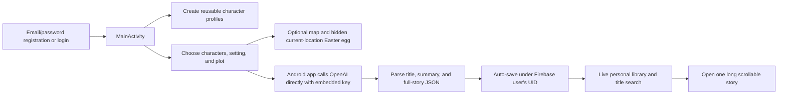

# F(ai)rytales Repository Analysis

## Report scope

This report analyzes the complete current source tree of [`alexandengstrom/fairytales`](https://github.com/alexandengstrom/fairytales) at the reviewed commit. The repository is a compact native Android application, so every tracked Java class, Gradle/configuration file, manifest, layout, menu, string translation, theme, backup rule, test, and documentation file was read. Image assets and repository history were also inventoried.

Static review was supplemented with an isolated Java 17 and Android SDK 33 build environment. Temporary non-secret Firebase/OpenAI/Maps placeholders were used only to test compilation; no live account, Firebase project, Google Maps call, OpenAI call, or generated story was used. The debug app assembled, local tests ran, and Android Lint produced a complete report. All temporary configuration, SDK references, build products, and caches were removed afterward, leaving the clone clean. The instrumentation test was not run because no Android emulator/device was provisioned.

## Repository record

- **Upstream:** [`alexandengstrom/fairytales`](https://github.com/alexandengstrom/fairytales)
- **Reviewed source:** [`alexandengstrom/fairytales`](https://github.com/alexandengstrom/fairytales/tree/a0f34ed400a4d9e4a053b0e9738796a0fe5c4dad)
- **Reviewed branch:** `main`
- **Reviewed commit:** `a0f34ed400a4d9e4a053b0e9738796a0fe5c4dad`
- **Reviewed commit date:** December 10, 2023
- **History:** 12 commits from November 23 to December 10, 2023, all attributed to Alexander Engström; application source arrived in one GitLab-migration commit and the other commits modify the README
- **License:** No source or asset license was found. Public source availability does not grant general reuse, modification, or redistribution rights.
- **Tracked files:** 199
- **Application source:** 24 Java files totaling 2,547 lines, of which 2,506 are main source and 41 are template tests; 51 XML files totaling 1,658 lines
- **Assets:** 111 tracked PNG/JPG/WebP files totaling approximately 25 MB; many are repeated orientation/night/density variants
- **Primary stack:** Java, Android Views/XML, AndroidX, Material, MVVM-style ViewModels and LiveData, Firebase Authentication, Firebase Realtime Database, Firebase Analytics, Volley, OpenAI Chat Completions, Google Maps, device Geocoder, and fused location
- **Android configuration:** `compileSdk 33`, `targetSdk 33`, `minSdk 33`, version 1.0, generic application ID `com.example.app`
- **CI:** No automated CI or release workflow was found

## Executive summary

F(ai)rytales is a 2023 university-course Android prototype for parents and children to create personalized text-only bedtime stories. A user registers with email and password, creates reusable characters with a name, age, occupation, and backstory, chooses a location manually or on Google Maps, adds a plot idea, and asks GPT-4 Turbo Preview for a roughly 1,000-word story. The generated title, summary, and prose are stored per Firebase user and displayed in a searchable personal library. The interface includes day/night artwork and partial English, Swedish, German, French, and Spanish localization.

The product concept is focused and understandable. Character profiles let families externalize ideas before generation; the story brief combines people, place, plot, and language; Firebase keeps a user-specific library; the home view surfaces new stories first and offers title search; and the application preserves form state across rotation in several places. The repository is small enough to comprehend, and its View/ViewModel/Model grouping gives a first-time Java project a recognizable structure. With placeholder configuration, all main Java and resources compile and a 41 MB debug APK is produced.

The central security flaw is architectural: the OpenAI API key is compiled into `BuildConfig.API_KEY` inside every APK, and the Android app calls `https://api.openai.com/v1/chat/completions` directly. APK contents are controlled by the recipient and cannot protect a provider secret. Any installed copy can disclose the key and use it outside Firebase authentication, bypassing application intent, user controls, and cost limits. Release minification is disabled, but obfuscation would not solve secret extraction. OpenAI requests must move behind an authenticated server that owns the credential, authorizes each user, validates/moderates content, applies quotas and spend limits, and records auditable job state.

The child-safety and privacy model is also insufficient for the stated audience. A single system prompt asks for a bedtime story for kids, but there is no input or output moderation, age/reading-level control, caregiver approval, factual/identity policy, refusal handling, or report/recall path. User text can prompt-inject the model through plot, character, location, or backstory fields. The app automatically saves model output before any adult reviews it. Character profiles can explicitly represent children, friends, or historical people and may contain names, ages, backstories, and hometowns; these values are sent to OpenAI and stored in Firebase. There is no privacy/processor disclosure, verified caregiver consent, account/data export or deletion, retention policy, or in-product story deletion.

Location use is especially poorly justified. Opening the story-creation screen requests fine and coarse location. The selected story setting comes from typed text or a separately clicked map; current precise location is not needed for either. Its only application-specific use is a hidden Easter egg: within one kilometer of a fixed Linköping coordinate, the app silently adds the developer as a 30-year-old character who will “always be the smartest person in every story.” This hidden prompt mutation does not warrant precise-location access and violates data minimization and user expectation. The map itself does not use current location to position the camera.

Reliability defects make the happy-path demo more complete than the real workflow. Story creation accepts empty fields and no characters, clears the form immediately, has no cancellable progress or job record, and uses a timeout of 5,000,000 milliseconds—about 83 minutes. Its custom Volley retry policy never throws or advances a retry counter, so it does not create a meaningful retry ceiling. Network errors are printed but never delivered to the ViewModel callback, leaving the UI without failure state. Malformed model JSON throws a runtime exception. Generated stories are saved with a Firebase push key that is never copied into the local object; the “new story” notification therefore opens a null story ID. A setter bug prevents removing an added character from the actual generation list even though its chip disappears visually.

Reproducibility is partial. The README identifies the missing OpenAI, Maps, and `google-services.json` inputs, but omits Java 17 and Android SDK requirements. The Gradle script force-unwraps local properties and fails during configuration if either key is absent. After supplying placeholders and a valid dummy Firebase shape, `test` and `assembleDebug` pass. The only local unit test asserts `2 + 2 = 4` in debug and release; the instrumentation test only checks the package name. Android Lint fails with 65 errors and 122 warnings: 64 errors concern missing base/default drawable variants and one is a duplicate view ID. Warnings cover unused resources, unlocalized/hard-coded text, accessibility, old dependencies, locale handling, overdraw, and other resource issues.

For CreativeOS, the reusable value is the compact character–setting–plot brief and personal library, not the client/provider architecture. A production system should retain the visible user ingredients while moving generation, policy, cost, and persistence behind a server; make adult review explicit; minimize personal data; replace hidden behavior with transparent controls; and treat stories as versioned, deletable, provenance-bearing artifacts.

## Product and user flow

The application has one effective role: an authenticated creator/reader. Although the README frames the users as children and parents, there is no distinct child account, caregiver role, approval permission, or family relationship in the data model.

The end-to-end flow is:



Bottom navigation exposes Home, Stories, Characters, and Logout. Home observes the Firebase story collection, shows most recently returned items first, and filters titles locally. Stories is the creation form. Characters combines character creation and list/removal. Selecting a story opens a dedicated scrollable Activity.

The experience is a text-story generator and library. The README mentions future choose-your-own-adventure and generated illustration ideas, but neither exists in the reviewed source. There is no page-level book model, illustration, narration, text-to-speech, collaborative turn-taking, branching, editing, export, sharing, or publication workflow.

## Architecture

### Claimed MVVM shape

Source is grouped into:

- **Views:** Activities and Fragments for login, registration, navigation, map selection, characters, story creation, library summaries, and story reading;
- **ViewModels:** authentication, character, story-list/generation, map, and individual-story state; and
- **Models/repositories:** `Character`, `Story`, Firebase repositories, and the OpenAI client.

This grouping separates many UI callbacks from Firebase calls and uses LiveData for reactive screens. `StoriesViewModel` is activity-scoped between Home and Stories, which lets a generated result trigger both library state and a notification.

The layering is only partially MVVM. `OpenAI` both invokes the provider and writes successful results directly to `StoriesRepository`. `StoriesViewModel` accepts Android `Context` and `Location` objects and performs language and Easter-egg policy. Repositories expose static Firebase instances and attach listeners without a lifecycle-aware abstraction. Views still manage substantive mutable lists, Firebase Analytics events, permissions, notifications, and fragment composition. There is no dependency injection, interface-bound service layer, domain use case, or test seam.

### Firebase data model

Realtime Database paths are:

```text
characters/{firebaseUid}/{pushId} -> Character
stories/{firebaseUid}/{pushId}    -> Story
```

A `Character` contains ID, name, age, occupation, and story/backstory. A `Story` contains ID, title, short description, and a single content string. IDs are Firebase keys added when reading snapshots; they are not written as model fields.

Using the Firebase UID as the parent path is a reasonable organizational convention, but it is not authorization. The repository contains no Realtime Database security rules, Firebase project configuration, App Check policy, indexes, or emulator tests. It is therefore impossible to verify from source whether one authenticated user can access another user's paths or whether unauthenticated access is rejected. Client-side path selection must be backed by deployed rules that compare `auth.uid`, with rules versioned and tested in the repository.

Both repositories use long-lived `addValueEventListener` listeners and do not retain/remove them. Recreating fragments or ViewModels can accumulate listeners and network work. Save/remove operations have no completion or failure callback. Character creation marks itself successful immediately after issuing `setValue`, before Firebase confirms persistence.

## Authentication and account lifecycle

Login and registration use Firebase email/password methods and expose only a Boolean success result. The implementation has:

- no email format or empty-field validation before the provider call;
- no confirmation-password field;
- no email verification;
- no password-reset/recovery path;
- no reauthentication for sensitive operations;
- no friendly mapping of Firebase error reasons;
- no abuse/rate-limit UI;
- no parental consent or age gate;
- no account deletion;
- no data export; and
- no per-device/session view.

Logout calls Firebase `signOut` and clears navigation history, but it does not delete characters, stories, analytics data, backups, or provider records. The launch Activity always shows login rather than routing an existing valid Firebase session directly to the main screen.

The source includes Firebase Analytics. It logs sign-up, invalid-character attempts, map selection, and story creation. In the merged test manifest, analytics dependencies also contributed Advertising ID and Android AdServices attribution/ID permissions. Presence of a merged permission does not prove every identifier is collected in every environment, but a child-directed application must deliberately configure analytics, consent, advertising-ID behavior, retention, and policy compliance rather than accepting transitive defaults.

## Character creation

Users enter name, signed numeric age, occupation, and free-text backstory. All four only need to be nonempty. Values have no maximum length, age range, name/privacy guidance, prohibited-content checks, or structured relationship. Negative ages are permitted by `numberSigned`. The repository can save arbitrary real children, friends, public figures, or historical persons, consistent with the README.

This character-first interaction is a useful creative scaffold: people can define recurring actors independently of any one story. The model, however, treats every field as untrusted prompt text. A backstory can override system instructions, request unsafe content, disclose private information, or inject text intended to break JSON generation.

The list view uses Firebase LiveData and offers removal. It formats age by concatenating the English phrase “years old,” even in localized interfaces. The detail Fragment repeats assignments outside its null guard and can dereference a missing character. The app has no edit/revision operation; correcting a profile requires remove and recreate.

## Story composition

### Brief

The creation view lets the user:

- type a setting;
- click a map pin and convert a point to a city/country through the device `Geocoder`;
- type a plot;
- select saved characters from a spinner; and
- add multiple characters to the story.

The ViewModel assembles plain text with language, location, plot, and every character's fields. There are no required-field checks at story creation, so an empty location, plot, and character list can still trigger a metered request. The button remains active while generation is underway; repeated taps can create duplicate paid requests.

### Broken visual removal

`AddedCharacter.setOnCharacterRemovedListener` assigns `listener = listener` rather than `this.listener = listener`. The field remains null. Pressing Remove deletes the visible child Fragment, but the parent `addedCharacters` list is not notified. A character the user believes they removed remains in the OpenAI prompt. This is a trust and privacy defect as well as a UI bug.

### Language selection

The app includes resource strings for English, Swedish, German, French, and Spanish. It obtains the device language's localized display name and accepts exact values `svenska`, `français`, `Deutsch`, or `español`; every other value becomes English. The OpenAI system prompt instructs the model to translate values but retain English JSON keys.

The surrounding app is not fully localized. Navigation labels, authentication/error toasts, generation status, notification text, “years old,” and a placeholder character label are hard-coded in English. Android Lint reports five hard-coded text cases and four `setText` internationalization warnings, while Java contains additional user-visible literals.

## Direct OpenAI integration

### Request contract

The app submits `gpt-4-1106-preview` chat-completion requests with JSON response mode. The system instruction requests:

- a child's bedtime story;
- approximately 1,000 words;
- a title;
- a two-to-three-sentence short description;
- a full `content` value;
- a twist or punchline;
- permission to invent additional characters; and
- output containing only the three-key JSON object.

On response, the client reads `choices[0].message.content`, parses that string as another JSON object, creates a `Story`, saves it immediately, and only then tells the ViewModel that generation succeeded.

JSON response mode reduces formatting variance but does not validate length, subject, reading level, continuity, character fidelity, factual accuracy, or safety. There is no schema repair or graceful response when fields are absent. `JSONException` and encoding errors are converted to unchecked runtime exceptions, which can crash the callback path.

### Credential exposure

Gradle reads `API_KEY` from `local.properties` and writes it into `BuildConfig` for default, debug, and release configurations. The generated test BuildConfig confirmed that the supplied placeholder becomes a literal Java constant. The release build also disables minification. Regardless of minification, a shipped app cannot keep a static provider bearer secret.

The Google Maps key is likewise packaged as an Android resource, but Maps keys are designed to be public client identifiers when strongly restricted to the application ID and signing certificate and limited to required APIs. An OpenAI secret is not. These two keys should not be managed as if they have the same trust model.

### Timeout, retry, and error behavior

The custom Volley `RetryPolicy` returns a 5,000,000 ms timeout—83 minutes and 20 seconds—reports a constant retry count of one, and implements `retry` as an empty method. In Volley, `retry` is responsible for updating state or throwing when retries are exhausted. This implementation imposes no real ceiling for retryable failures and can keep a request unresolved across repeated very long attempts.

The response error listener only prints `POST Error`. It never calls `callback.onError`. `StoriesViewModel.onError` is also empty. The UI has already shown “Creating story…,” cleared the brief, removed all visible selected-character chips, and recorded an analytics event. It cannot restore the brief or explain what failed. There is no cancellation, idempotency, queue status, or retry button.

A new Volley `RequestQueue` is created per story request instead of reusing an application-scoped queue. An unused queue field suggests incomplete lifecycle design.

### Character encoding

Volley delivers a Java response string. The code takes its bytes as ISO-8859-1 and decodes them as UTF-8 before parsing. If the string was already correctly decoded, this round trip can corrupt non-ASCII Swedish, French, German, or Spanish text. International-output tests are needed; encoding should follow the HTTP content type once, not be guessed and transformed again.

## Story storage, library, and notification

Generated output is automatically pushed under the current user's Firebase path. There is no preview, approve/reject, edit, regenerate-one-part, provenance, prompt snapshot, model/version field, moderation state, or generation timestamp in the stored model.

The library observes the full user collection, downloads it as one list, reverses display order, and filters locally by lowercased title substring. There is no pagination or query index. Lowercasing uses the implicit device locale, which Android Lint flags; Turkish and other locale-specific casing can make search surprising.

The application has a `StoriesRepository.remove` method but no story-removal control in the UI. A user cannot delete an unwanted, unsafe, or personal story through the application. Characters can be removed; stories cannot.

After generation, Home posts a notification with the title and a PendingIntent for the Story Activity. The new `Story` never receives the Firebase key returned by `push()`, so `story.getId()` is null. The notification therefore carries a null ID and cannot reliably load the new story. The notification is marked `VISIBILITY_PUBLIC`, exposing a generated title on the lock screen. MainActivity opens system notification settings when notifications are disabled rather than requesting the runtime permission in context.

## Location and mapping

The map Activity registers a click listener, reverse-geocodes one point, returns city/country, and immediately closes. It does not add a marker, show a confirmation, initialize the camera from current location, or recover visibly from geocoder failure. Fallbacks are English phrases such as “In the middle of the ocean” and “A place far away.”

Opening the story Fragment requests both fine and coarse location. The current location is not used to populate the setting or map. It is passed only to `storyShouldIncludeEasterEgg`. Within one kilometer of latitude `58.400324`, longitude `15.576291`, the ViewModel silently mutates the selected-character list with:

- name: Alexander Engström;
- age: 30;
- creator/student backstory; and
- the instruction that he will always be the smartest person in every story.

An Easter egg can be harmless when activated explicitly. Here it is hidden prompt manipulation driven by precise location, the most sensitive permission in the app. It can alter a child's story without consent and sends the injected profile to OpenAI. Remove precise-location access entirely unless it supports a disclosed core feature; offer an opt-in “use my city” control if genuinely needed.

The permission callback checks only the first result, so a coarse-only grant is not handled cleanly. The app also declares `ACCESS_NOTIFICATION_POLICY` even though it does not need to manage Do Not Disturb policy.

## Security and privacy

### Critical issues

1. **Provider secret in the APK.** OpenAI authorization is a recoverable client constant.
2. **No server authorization or cost boundary.** Firebase login does not bind or limit OpenAI use; an extracted key bypasses the app entirely.
3. **Unverified Firebase isolation.** Database rules and App Check configuration are absent, so per-UID client paths cannot be treated as enforced access control.
4. **Child/personal data sent to third parties without product disclosure.** Names, ages, backstories, locations, plots, email identity, stories, analytics, and device signals are in scope.

### Data lifecycle gaps

The app offers no privacy policy, terms, processor list, purpose/retention explanation, caregiver consent, age assurance, download/export, correction workflow, account deletion, story deletion, or provider-deletion coordination. Firebase data persists after logout. OpenAI and analytics retention behavior is not explained.

The manifest enables Android backup and uses template backup/data-extraction files with no actual includes or excludes. Auth/session or other application data may therefore be governed by broad platform defaults rather than a deliberate inventory. Backup policy should be explicit and tested.

### Input and output trust

All character, setting, and plot fields are free text with no length maximum. They are concatenated into a model prompt. There is no model-input delimiter/schema that treats each as untrusted data, no injection detection, and no output sanitizer beyond JSON parsing. TextViews safely render text rather than HTML, reducing one class of display injection, but content-policy and cost risks remain.

No tracked real credential was identified in the current tree. The committed `API_KEY="helloworld"` in `gradle.properties` is a placeholder, and the build actually force-reads local properties. History contains the application in one migration commit followed by documentation changes; no deleted tracked credential filename was found. This does not validate credentials held outside Git.

## Child safety and educational design

The product says it is for children and parents, but the code does not establish which person is operating it. There is no caregiver gate before generation or reading. Output is stored and surfaced immediately.

The safety instruction is a single phrase—generate a bedtime story for kids. Missing safeguards include:

- target age and developmental band;
- reading-level and story-length controls appropriate to that band;
- input/output text moderation;
- prompt-injection resistance;
- self-harm, sexual, violent, hateful, bullying, dangerous-behavior, commercial, and personal-data policies;
- public-figure, impersonation, and defamation controls;
- cultural/stereotype review;
- model refusal and child-appropriate recovery language;
- caregiver preview/edit/approval;
- report, quarantine, and deletion;
- audit/provenance for the prompt, model, safety result, and reviewer; and
- empirical evaluation with children/caregivers under ethical protocols.

No educational outcome is modeled or measured. The reader is one long TextView with no page structure, vocabulary help, narration, highlighted reading, comprehension support, reflection prompt, or adult co-reading scaffold. This is a personalized entertainment prototype, not evidence-based literacy software.

## Accessibility and interface quality

The themed backgrounds, rounded cards, large fields, bottom navigation, and automatic night palette create a friendly visual identity. Resource strings cover five languages, and `sp` is used for most prominent text.

Accessibility is not systematically implemented:

- the clickable location ImageView lacks `contentDescription`;
- forms rely on disappearing hints rather than persistent labels;
- several controls are fixed at 300 dp and may not fit narrow windows or large display/font settings;
- the selected-character name uses `16dp` rather than scalable `sp`;
- unlocalized menu and programmatic strings break the advertised language experience;
- the full story is one dense scrolling block with no reading controls;
- notification content is public on the lock screen;
- removal has no confirmation or undo;
- empty lists have no explanation or next action; and
- there are no TalkBack, keyboard/switch, contrast, large-font, or accessibility instrumentation tests.

Lint reports one content-description warning, one `sp`-usage warning, right-to-left hard-coding, five hard-coded text warnings, four set-text internationalization warnings, and six overdraw warnings. Automated lint is not a complete accessibility audit, but these findings align with the source review.

## Build, tests, and reproducibility

### Clean-checkout prerequisites

The repository pins Gradle 8.0 and Android Gradle Plugin 8.1.1. AGP requires Java 17; the README does not mention it. The module also requires Android SDK 33/build tools, an ignored root `local.properties` with both keys, and an ignored module `google-services.json` for package `com.example.app`.

Without `local.properties`, Gradle configuration fails immediately because `gradleLocalProperties(...).getProperty` is treated as non-null. The tracked `API_KEY="helloworld"` in `gradle.properties` is not used as a fallback. Without Firebase configuration, the Google Services processing task cannot produce the required resources.

### Validation results

With Java 17.0.19, an isolated Android SDK 33, and temporary placeholder configuration:

| Check | Result | Meaning |
|---|---|---|
| Gradle configuration under default Java 11 | Failed | AGP correctly requires Java 17; prerequisite is undocumented |
| Gradle configuration under Java 17 without local properties | Failed | Build script force-unwraps missing `API_KEY` |
| `test` with placeholders | Passed | Debug and release local-test tasks execute |
| Local unit tests | One template assertion passed in each variant | No application behavior is tested |
| `assembleDebug` | Passed; approximately 41 MB APK | Main Java/resources compile and package |
| Generated BuildConfig inspection | Placeholder appeared as literal `API_KEY` | Confirms credential is embedded by design |
| Merged manifest inspection | Internet/network, location, notifications, wake lock, Advertising ID, and AdServices permissions present | Transitive manifest surface is broader than source manifest alone |
| Android Lint | Failed: 65 errors, 122 warnings | Repository does not meet its lint release gate |
| Instrumentation test | Not run | Test only checks package name and still needs device/emulator |
| Post-validation Git status | Clean | No placeholder, build output, or cache remains |

Lint's errors are:

- 64 `MissingDefaultResource` errors because `background1` through `background4light` exist in orientation/night-qualified directories without base drawable declarations; and
- one `DuplicateIds` error because two Home TextViews share `created_stories_title`.

The 122 warnings include 38 unused resources, 19 typography ellipsis findings, 11 autofill findings, ten outdated direct dependency findings, icon duplication/location issues, overdraw, hard-coded/unlocalizable text, locale handling, and accessibility/resource-quality problems. Lint also shows that the `minSdk 33` makes several OS-version checks and `v26` resource qualifiers redundant.

No test covers authentication, Firebase rules, repository persistence, input validation, story prompt construction, JSON parsing, provider errors, retries, language output, list filtering, character removal, location behavior, notifications, rotation/process death, accessibility, or safety. There is no dependency verification metadata, CI, emulator setup, or release signing workflow.

## Maintainability assessment

Strengths include small scope, clear package grouping, descriptive method comments, a pinned Gradle wrapper, exact direct dependency versions, LiveData use, and a README with setup steps and a demo.

Debt includes:

- generic package/application identity;
- no license or contribution/release documentation;
- no CI;
- model/network/persistence responsibilities mixed in `OpenAI`;
- Android types inside ViewModels;
- static Firebase dependencies that are hard to mock;
- unmanaged realtime listeners;
- no result/error types for asynchronous work;
- no schema version or migration strategy;
- repeated/unused imports and duplicated view assignments;
- 25 MB of largely repeated raster resources;
- no durable generation state;
- untested manual fragment composition instead of recycler/list components;
- outdated dependencies identified by lint;
- release minification disabled; and
- only template tests.

The source is appropriate to a course prototype and explicitly described by its author as a first Java project. Its simplicity should be preserved while rebuilding the unsafe boundaries.

## What F(ai)rytales does well

1. **Focused brief design.** Characters, setting, plot, and language are understandable creative ingredients.
2. **Reusable characters.** Profiles can support recurring family storytelling rather than one disposable prompt.
3. **Personal library.** Stories persist per user and are searchable.
4. **Responsive basic state.** LiveData updates lists, and several forms survive rotation.
5. **Multilingual intent.** Both interface resources and generated-story language are considered.
6. **Day/night visual identity.** The app has purpose-built child-friendly artwork rather than a generic form.
7. **Honest scope documentation.** The README labels branching and illustrations as future work rather than claiming them as implemented.
8. **Learnable codebase.** The small native application is easy to trace end to end.

## Lessons for CreativeOS

### Adopt

- a visible story brief organized around characters, setting, and plot;
- reusable character entities independent of stories;
- a personal artifact library with title/summary search;
- explicit generated-language selection;
- responsive progress and post-generation notifications, implemented with correct IDs and privacy controls;
- day/night theming and localized product copy; and
- keeping unimplemented ambitions clearly separated from current capability.

### Redesign

- send generation through a server-side job API with authenticated users, quotas, idempotency, cost reservation, moderation, and secret storage;
- represent story generation as a durable state machine, not a single mobile request;
- require a caregiver/editor review state before child-visible publication;
- use structured, length-bounded character/brief fields with privacy guidance;
- store prompt/model/provenance/safety/review metadata with versioned story artifacts;
- make every story editable, rejectable, regenerable, exportable, and deletable;
- version and test Firebase/database authorization rules;
- distinguish child, caregiver, educator, and creator permissions;
- use opt-in coarse city selection rather than hidden precise location;
- provide page-level reading, narration/accessibility, and co-reading scaffolds; and
- design localization around stable language codes, not display-name strings.

### Do not copy

- a provider secret in a mobile binary;
- direct client-to-provider billing;
- auto-saving unreviewed child-directed output;
- hidden location-triggered prompt mutation;
- a retry policy without a real deadline or limit;
- clearing user input before generation succeeds;
- UI removal that does not update the underlying prompt;
- a runtime database policy that exists only as client path conventions;
- public lock-screen notification content by default; or
- template-only tests as evidence of application correctness.

## Recommended remediation order

### Immediate security and privacy

1. Revoke any OpenAI key ever shipped in an APK or shared build and inspect provider usage/billing.
2. Remove OpenAI calls and secrets from the Android client; route them through an authenticated server.
3. Add user/tenant authorization, quotas, per-job cost caps, rate limits, idempotency, and abuse monitoring.
4. Version and test Firebase rules; enable an appropriate App Check strategy without mistaking it for user authorization.
5. Remove precise-location permission and the hidden Easter egg; retain only transparent user-selected setting input.
6. Define child/caregiver roles, consent, processors, retention, export, and complete deletion.
7. Disable or deliberately configure analytics/advertising identifiers for the child-directed context.

### Safety and workflow

8. Add bounded input schemas, age/development controls, and multimodal policy checks before and after generation.
9. Add caregiver preview, edit, approve/reject, report, quarantine, and recall.
10. Preserve prompt/model/safety/provenance metadata and separate drafts from approved stories.
11. Add story deletion and account deletion that propagate across primary storage, providers, analytics, caches, and backups.
12. Replace the synchronous mobile request with an observable, cancellable server job.

### Correctness and release quality

13. Fix `this.listener` assignment so visual removal matches the prompt.
14. Save and return the Firebase push ID before notifications or navigation.
15. Implement bounded timeouts/retries and always surface failures without discarding the brief.
16. Validate story inputs and disable duplicate submission.
17. Handle model schema/encoding failures without crashing.
18. Add base drawable resources, unique IDs, localization, accessibility labels, responsive sizing, and complete empty/loading/error states.
19. Document Java 17/SDK/config prerequisites and make missing configuration errors explicit.
20. Add unit, Firebase-emulator/rules, integration, UI, accessibility, safety, and release-build tests to CI.
21. Update dependencies, lower or justify `minSdk 33`, enable suitable release shrinking, and add dependency verification.
22. Add a source/asset license if public reuse is intended.

## Bottom line

F(ai)rytales communicates a good small product idea: families define reusable characters, choose a place and plot, receive a story in their language, and keep it in a personal library. Its visual care, focused brief, multilingual intention, and compact data model are useful CreativeOS references.

The implementation is a course prototype, not a safe child-facing release. Its OpenAI key is embedded in the APK; output is unmoderated and automatically saved; Firebase authorization cannot be verified; precise location is requested for a hidden prompt mutation; privacy/account lifecycle controls are absent; key failure paths leave the UI stuck; and meaningful automated tests do not exist. The right path is to keep the character–setting–plot interaction and rebuild generation, identity, policy, data lifecycle, reliability, accessibility, and evaluation around trustworthy server-side boundaries.
