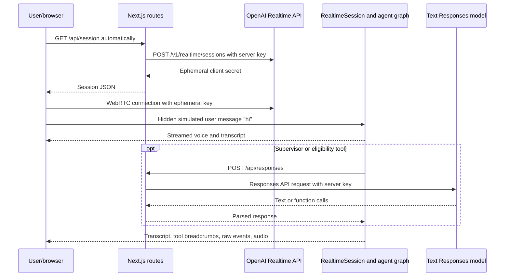

# OpenAI Realtime Agents Repository Analysis

## Report scope

This report analyzes the complete current default-branch source tree of [`openai/openai-realtime-agents`](https://github.com/openai/openai-realtime-agents) at the reviewed commit. All 49 tracked files were inventoried. Every application, configuration, prompt, API-route, hook, context, component, utility, documentation, and license file was read; both repository screenshots were visually inspected; the commit history and branch surface were reviewed; and the installed Agents SDK implementation was traced where necessary to establish actual guardrail timing.

Static review was supplemented with a clean lockfile install, TypeScript checking, a production Next.js build, ESLint, a production-dependency audit, and secret/configuration scanning. No OpenAI credential was supplied and no paid Realtime, Responses, transcription, or reasoning-model request was made. Generated dependencies and build products were removed afterward and the clone was returned to a clean Git state.

The report evaluates what the repository actually implements at reviewed commit, not what a current hosted OpenAI service or later Agents SDK release may support. Model names and SDK behaviors in this source are therefore historical implementation facts, not recommendations about current model availability.

## Repository record

- **Upstream:** [`openai/openai-realtime-agents`](https://github.com/openai/openai-realtime-agents)
- **Reviewed source:** [`openai/openai-realtime-agents`](https://github.com/openai/openai-realtime-agents/tree/94c9e9116b581052655cff7b756cc5e02771cda1)
- **Reviewed branch:** `main`
- **Reviewed commit:** `94c9e9116b581052655cff7b756cc5e02771cda1`
- **Reviewed commit date:** January 7, 2026
- **Latest commit:** `security update (#124)`, a lockfile-only dependency refresh
- **History:** 46 commits; most are attributed to OpenAI contributors, with Noah MacCallum the largest contributor by commit count
- **License:** MIT, copyright OpenAI 2025
- **Tracked files:** 49, approximately 2.82 MiB; 33 TypeScript/TSX files
- **Application/configuration text:** approximately 3,931 lines across TypeScript, TSX, CSS, and the prompt metatemplate; 3,742 lines of TypeScript/TSX under `src/app`
- **Primary stack:** Next.js 15 App Router, React 19, TypeScript 5, Tailwind CSS 3, OpenAI Agents SDK for JavaScript 0.0.5, OpenAI Node SDK, Zod 3, WebRTC, Web Audio, and MediaRecorder
- **CI:** no tracked continuous-integration, deployment, release, or automated security workflow

## Executive summary

OpenAI Realtime Agents is a compact official demonstration of two useful voice-agent orchestration patterns built on the JavaScript Agents SDK. The first is a **chat-supervisor** architecture: a low-latency Realtime agent speaks to the caller, handles only greetings and information collection itself, and delegates substantive decisions and tool use to a more capable text model through a tool. The second is **sequential handoff**: a graph of specialized Realtime agents transfers a live conversation among greeter, authentication, returns, sales, and simulated-human roles. A third minimal haiku scenario makes the handoff mechanism easy to understand.

The repository is especially valuable as executable teaching material. It shows how a Next.js server exchanges a long-lived OpenAI key for a browser-safe ephemeral Realtime credential; how `RealtimeAgent`, `RealtimeSession`, `OpenAIRealtimeWebRTC`, tools, handoffs, and output guardrails are connected; how a browser can expose transcript and raw event history; how server VAD and push-to-talk can be switched at runtime; and how to force Opus, PCMU, or PCMA during WebRTC negotiation to hear telephony-quality degradation. The prompts are unusually detailed and make decision boundaries visible rather than burying all behavior in one monolithic system instruction.

It is not a deployable customer-service application. Both server-side model routes are anonymous. `/api/session` lets any caller spend the account's Realtime capacity by minting an ephemeral session, while `/api/responses` is effectively a public paid OpenAI proxy: it spreads arbitrary caller JSON into `responses.parse` or `responses.create`, forcing only `stream: false`. There is no application authentication, authorization, rate limit, quota, origin policy, body-size constraint, model allowlist, tool restriction, or per-user cost accounting. The server key is not exposed to the browser, which is good, but the account's purchasing authority is exposed through unrestricted endpoints.

The customer-service examples deliberately use simulated data and success responses, yet the interaction language can make them sound real. The authentication agent collects phone number, date of birth, the last four digits of an SSN or credit card, and street address. Tool implementations then return `{ success: true }` without verifying anything. Those sensitive values can appear in the transcript, breadcrumbs, raw event viewer, browser memory, model context, and automatic local recording. The app begins connecting as soon as a scenario is selected, synthesizes a hidden `hi` to trigger a greeting, and automatically starts recording both sides when connected. There is no explicit recording opt-in, disclosure, retention explanation, redaction, or separate recording control.

The output guardrail is educational but not a safety boundary. It asks `gpt-4o-mini` to classify only offensive language, disparaging competitor discussion, explicit violence, or none. It has no input check, no comprehensive safety taxonomy, no deterministic rules, no confidence handling, and no independent moderation endpoint. Classifier failures fail open. Under the installed Agents SDK, classification runs on every 100 characters of streamed audio transcript and again at turn completion; the user may already have heard unsafe audio before interruption. The README's statement that messages are checked before they are shown is therefore too strong for the source and voice path. A guardrail trip sends corrective text back to the same agent, but the UI's temporary parser is brittle and the transcript history helper mutates conversation order with `reverse()`.

Reliability is mixed. The committed lockfile installed reproducibly; TypeScript checking, production build, and ESLint passed. The application has no tests. Connection failure can strand a non-null session reference and prevent retry. Event listeners are not explicitly removed. One history handler captures the first render's transcript state, audio resources are not fully stopped, recording chunks are never reset, and an audio element is appended to the document during render and never removed. API routes normalize provider errors poorly. The current production dependency audit reports 11 vulnerable packages—six moderate and five high—including direct Next.js and UUID findings—despite the latest commit being a security update.

For CreativeOS, the most reusable ideas are the **split-latency supervisor pattern**, **explicit specialist graph**, **observable transcript/event console**, **telephony codec simulator**, and **structured voice-prompt metatemplate**. They should be rebuilt behind authenticated, narrowly typed application APIs with durable sessions, user consent, data minimization, redaction, bounded tools, auditable approvals, and defense-in-depth safety. The demo itself should be treated as a reference laboratory, not a production base.

## Product surface and end-to-end flow

The single-page interface has four principal regions:

- scenario and current-agent selectors;
- a transcript with assistant/user messages, expandable tool breadcrumbs, guardrail status, copy, and audio download;
- an optional raw event log; and
- a bottom toolbar for connection, VAD versus push-to-talk, microphone talk control, audio playback, log visibility, and codec selection.

The current source defaults to `chatSupervisor`. If the URL lacks a recognized `agentConfig`, the browser rewrites it with that default. Once the first agent name has been derived, an effect automatically starts the connection; the Connect button is not the normal first-entry gate. The runtime path is:

Changing the scenario or codec reloads the page. Selecting another agent disconnects and makes that agent the reordered root on the next automatic connection. Automatic SDK handoffs update the selector without forcing the same manual reconnection path.

The two screenshots reflect older names and UI states (`chatSupervisorDemo`, `simpleExample`, and `haiku`) rather than the current source (`chatSupervisor`, `simpleHandoff`, and `haikuWriter`). They accurately communicate the intended observability—message timing, tool calls, agent changes, guardrail chips, and controls—but should not be treated as exact current documentation.

## Architectural decomposition

### Browser application

`App.tsx` owns scenario selection, a duplicate connection status, codec choice, connection lifecycle, PTT/VAD state, playback state, automatic greeting, and recording trigger. `useRealtimeSession` wraps the Agents SDK's `RealtimeSession` and WebRTC transport. Context providers hold transcript items and raw logged events. Separate hooks adapt SDK history and transport events into UI records and create downloadable WAV recordings.

The browser is not a thin presentation layer. It contains:

- agent instructions and the entire handoff graph;
- tool definitions and many tool implementations;
- simulated account, policy, order, sales, and store data;
- the supervisor loop that executes function calls;
- high-stakes return context assembly;
- guardrail invocation and display;
- session history and raw provider event processing; and
- recording and conversion logic.

This is convenient for experimentation but collapses the trust boundary. A caller controls the JavaScript environment and can inspect, invoke, replace, or bypass client tools. Any production action, authentication decision, price, policy, authorization, or side effect must execute on a trusted server and be reauthorized there.

### Next.js server routes

Only three routes exist:

1. `/api/health` returns `{ status: "ok" }` and proves only that the process can answer.
2. `/api/session` uses `OPENAI_API_KEY` to create a Realtime session configured with voice `sage` and returns the upstream JSON.
3. `/api/responses` instantiates the OpenAI Node client and forwards a request to `responses.parse` when `body.text?.format` exists, otherwise `responses.create`.

There is no database, application session, user entity, authorization middleware, queue, cache, durable transcript, audit record, feature flag, billing ledger, or observability backend. State lasts in the browser and provider connection only.

### Provider boundary

The long-lived key correctly remains on the Next.js server. The browser receives an ephemeral Realtime secret and connects directly to OpenAI over WebRTC. This is the appropriate broad credential shape for a browser voice application. Credential confidentiality alone is insufficient: the route that issues the credential must still authenticate the application user and enforce product policy, and any server-side model proxy must expose a narrow application contract rather than the provider's generic contract.

## Orchestration pattern 1: chat-supervisor

### Decision boundary

`chatAgent` is instructed to speak in a concise neutral style and directly handle only greetings, chitchat, repetition, clarification, and collection of parameters needed by supervisor tools. Nearly every factual, account, policy, or process question must invoke `getNextResponseFromSupervisor`. Before invoking it, the Realtime agent must speak a short neutral filler phrase so the voice channel does not feel stalled.

The pattern addresses a real latency–capability tension. A fast streaming model supplies immediate conversational feedback while a text model performs deeper instruction following and function calling. The Realtime model is not asked to reproduce the whole business system; it mediates the turn and speaks the supervisor's final text.

### Supervisor loop

The tool forwards the entire filtered message history plus a concise rendering of the newest user information to a `gpt-4.1` Responses request. The supervisor can call three functions:

- look up a policy document;
- retrieve account information by phone number; and
- find the nearest store by ZIP code.

The browser executes each requested function against static sample data, appends a `function_call` and `function_call_output` to the same input array, and repeats the Responses request until it receives messages rather than function calls. Parallel tool calls are disabled. The final output text becomes the tool result that the voice agent reads.

This is a clear implementation of a bounded supervisor loop, including the critical detail that tool call and result items are sent back for the next model step. Its weaknesses are equally instructive:

- `lookupPolicyDocument` ignores the requested topic and returns every sample policy;
- `getUserAccountInfo` ignores the supplied phone number and returns the same person's full account details;
- `findNearestStore` ignores ZIP code and returns all stores;
- the tools run in an untrusted browser;
- `JSON.parse(toolCall.arguments)` can throw without local recovery;
- there is no maximum supervisor iteration count, deadline, cancellation, or token/cost ceiling;
- the full growing history is resent rather than summarized or minimized; and
- account sample data includes name, phone, email, address, billing, and usage details that are visible in the bundle.

The source demonstrates orchestration, not retrieval correctness or identity enforcement. Reusing the pattern requires server-owned tools, parameter validation, result filtering, explicit loop bounds, timeout/cancellation propagation, and tracing that correlates the Realtime turn with each supervisor request.

### Latency and conversational trade-off

The filler phrase avoids dead air and gives the supervisor time, but it is not a free UX win. Repeated “one moment” turns can feel evasive, and the caller cannot know whether the system is still progressing, failed, or waiting for missing information. The Realtime model is instructed to repeat the supervisor response verbatim, yet the prompt example paraphrases it, making fidelity ambiguous. In high-stakes settings, an intermediate model should not freely transform an approved answer; the system should define whether the returned text is authoritative, whether it can be shortened, and how citations or disclaimers are preserved in speech.

## Orchestration pattern 2: sequential handoffs

### Minimal handoff

The `simpleHandoff` graph has a greeter and haiku writer. The greeter's `handoffs` array contains the writer, so the SDK exposes an appropriate transfer tool. This is the repository's cleanest pedagogical example: agent roles, transfer description, instructions, tools, and allowed next agent are visible in a few lines.

### Retail graph

The retail scenario has four agents—authentication, returns, sales, and simulated human—and then mutates every agent's handoff array to include the other three. This creates a fully connected graph rather than a strict workflow. The SDK's handoff machinery changes the active agent's instructions and tools while preserving shared session history.

The architecture reduces prompt/tool overload for each specialist and makes local agent instructions easier to tune. However, every agent can transfer to every other agent, including back to authentication or away from an incomplete verification flow. Prompt instructions, rather than a deterministic workflow controller, enforce most sequencing. A production graph should encode eligibility predicates and application state outside the model, narrow each allowed transition, and require server verification for protected transitions.

### Authentication agent

The authentication prompt is a detailed conversational state machine. It requests and confirms:

1. first name;
2. phone number, read digit by digit;
3. date of birth;
4. last four digits of an SSN or credit card and which type they are;
5. street address; and
6. a long promotional disclosure and loyalty-program response.

The corresponding tools always return success and do not consult a datastore. `save_or_update_address` does not persist anything. `update_user_offer_response` does not record anything. Calling these functions is therefore a simulation signal, not authentication, mutation, or consent evidence.

This design creates three serious risks if copied casually:

- **false assurance:** the agent can tell a caller that identity was verified when no comparison occurred;
- **unnecessary data collection:** SSN/card digits, DOB, address, and phone are requested for a demo that has no account system; and
- **amplified exposure:** character-by-character readback repeats sensitive information into audio, transcription, logs, model history, and local recording.

The promotional disclosure is also embedded into the mandatory authentication flow before the original request is handled. It is more than ten sentences and must be spoken verbatim at a faster rate. This harms task completion and does not establish legally meaningful consent. Consent records require clear purpose, free choice, accurate identity/session binding, timestamped evidence, withdrawal, and jurisdiction-appropriate design—not a simulated boolean tool.

### Returns agent and reasoning escalation

The returns agent looks up fixed example orders, retrieves a static policy, and calls `checkEligibilityAndPossiblyInitiateReturn`. That tool sends the ten most recent message items, the desired action, and a question to `o4-mini` through `/api/responses`. The requested plain-text structure includes rationale, user request, eligibility, missing information, and return next steps.

Using a second model to critique a consequential recommendation is a valuable pattern, but this implementation does not actually initiate a return and does not create an authoritative decision record. Its “policy” was only returned into the Realtime conversation; the escalation request relies on recent history containing enough of it. The output is not validated with Structured Outputs despite asking for a structured template. There is no deterministic 30-day/defect rule engine, fraud signal, human approval, idempotency key, order ownership check, or side-effect tool. A model-generated eligibility statement should be advisory unless a trusted policy service independently verifies it.

The prompt's date is hard-coded to December 26, 2024. Order dates and promotional policy dates are also historical. Time-sensitive facts in static prompts will silently age and should be injected from trusted runtime services.

### Sales and simulated human

The sales agent returns static promotions, can claim an item was added to a cart without maintaining a cart, and produces an `example.com` checkout URL. Its item IDs are numbers in lookup results but strings in the add/checkout schemas. There is no inventory, pricing authority, payment system, authenticated cart, or checkout session.

The “simulated human” explicitly says it is an AI standing in for a human and responds only in German. The disclosure is commendably honest, but routing an upset user who asked for a person to another AI is not a human escalation. Production design needs a real queue, availability state, handoff packet, user choice, and fallback when no human is available.

## Prompt engineering and metaprompt

The repository includes a 167-line voice-agent metaprompt that asks ChatGPT to generate prompts with identity, task, demeanor, tone, enthusiasm, formality, emotion, filler words, pacing, other details, and an optional JSON-like conversation state machine. It encourages clarification for unspecified personality dimensions, confirmation of spellings and exact values, and explicit transitions.

This is a useful prompt-authoring scaffold because it separates conversational character from workflow and asks for examples and transition conditions. The retail prompts demonstrate the result at high detail.

Important limits remain:

- a textual state machine is not an executable state machine;
- prompts cannot establish authorization, persistence, legal consent, or transactional atomicity;
- highly verbose personality sections consume context and can conflict with concise task behavior;
- examples can overfit or introduce stale facts;
- “always repeat exact values” can be unsafe for secrets;
- no prompt version, evaluation set, acceptance threshold, or migration path is tracked; and
- the metaprompt contains typographical errors and assumes a ChatGPT copy/paste workflow rather than a reproducible generator.

For CreativeOS, prompt templates should be versioned artifacts with typed variables, policy inheritance, test conversations, grader criteria, rollout metadata, and an owner. Deterministic application state should be provided as data, not inferred from prior prose alone.

## Realtime session, audio, and transport

### Session construction

The hook builds `RealtimeSession` with:

- the selected root agent;
- `OpenAIRealtimeWebRTC` and a hidden audio element;
- hard-coded model `gpt-4o-realtime-preview-2025-06-03`;
- input transcription model `gpt-4o-mini-transcribe`;
- optional output guardrails; and
- an extra context object used for transcript breadcrumbs.

The model identifier is a dated preview snapshot. It keeps demo behavior relatively stable but creates an expiry/migration risk. Model, voice, transcription, VAD, guardrail cadence, and scenario settings should be server-controlled configuration with compatibility testing rather than source constants.

### VAD and push-to-talk

In VAD mode the browser sends a session update with server VAD threshold `0.9`, 300 ms prefix padding, 500 ms silence duration, and automatic response creation. In PTT mode it sets turn detection to null, clears the input buffer on press, commits it on release, and creates a response.

This exposes important tuning knobs and lets developers compare false start/stop behavior. The UI only handles mouse/touch down and up; it does not cover pointer cancellation, keyboard activation semantics for press-and-hold, focus loss, or a stuck-speaking state if release occurs outside the button. Network errors are logged but not translated into a recoverable PTT state.

### Codec simulation

The WebRTC `changePeerConnection` hook inspects transceivers and sets one preferred audio codec for `pcmu` or `pcma`; Opus leaves browser negotiation unchanged. Reloading with `?codec=` creates a new session. This is a practical test facility because 8 kHz telephony affects ASR, VAD, pronunciation, and perceived agent quality, not merely playback fidelity.

For production testing, it should be paired with repeatable audio corpora, noisy/accented speech, packet-loss/jitter conditions, objective transcription/turn metrics, and a compatibility fallback if the preferred codec is unavailable. Forcing a single codec narrows negotiation resilience.

### Automatic connection and greeting

The selected-agent effect calls `connectToRealtime` while disconnected. On successful connection, `updateSession` injects a hidden user `hi` and creates a response. Opening or reloading the page can therefore prompt microphone permission, mint a paid credential, and generate a paid turn without the user pressing Connect.

An intentional product should first explain microphone, recording, provider processing, expected cost/limits, and privacy, then connect after a clear user gesture. Autoplay and permission policies also behave more predictably following a gesture.

## Transcript, event observability, and local recording

### Transcript and raw event viewer

TranscriptContext stores timestamped messages and breadcrumbs. EventContext stores complete client/server event payloads. The UI allows expanding tool arguments/results and raw events, copying visible transcript text, and downloading audio. These features are excellent for development: they expose handoffs, model timing, tool selection, guardrail feedback, and protocol state that would otherwise be invisible.

They are hazardous in a real customer workflow. Phone numbers, DOB, SSN/card digits, addresses, account records, tool arguments, policy content, model errors, and provider metadata may all be displayed or copied. There is no redaction layer, role-based visibility, secure export, session expiration, data classification, or warning that logs can contain secrets. The repository's own screenshot displays a phone number and complete account lookup result.

Production observability should separate developer telemetry from end-user transcript, redact before storage/rendering, use allowlisted event fields, and prevent raw provider payloads from becoming a general data-export surface.

### Automatic recording

On connection, `useAudioDownload` asks for another microphone stream, combines it with the remote stream through a Web Audio destination, and starts a `MediaRecorder`. Download concatenates recorded WebM chunks, decodes them, mixes channels to mono, encodes 16-bit WAV, and triggers a local file download.

The feature is technically useful, but the lifecycle and consent design are incomplete:

- recording begins automatically rather than through a labeled opt-in;
- there is no recording indicator or separate stop control;
- no jurisdictional consent or purpose/retention disclosure exists;
- a second `getUserMedia` stream is acquired even though the Realtime transport already uses a microphone;
- microphone tracks, media sources, and the recording `AudioContext` are never stopped/disconnected/closed;
- conversion creates another `AudioContext` and never closes it;
- accumulated chunks are never cleared between sessions, so later downloads can concatenate earlier and later calls;
- the full call remains in browser memory and WAV conversion duplicates large buffers; and
- object URLs are revoked, but the hidden audio element appended to `document.body` is never removed.

The code calls `requestData()` immediately before `stop()`, which may also produce multiple terminal data events depending on browser behavior. Long sessions can exhaust memory because recording starts without a timeslice and the whole encoded/decoded audio is processed in one operation.

## Guardrails and safety behavior

### Classifier contract

The app interpolates the company name and agent output into a user message and asks `gpt-4o-mini` for Zod-constrained output with:

- `OFFENSIVE`;
- `OFF_BRAND` for disparaging competitors;
- `VIOLENCE` for explicit threats/incitement/graphic injury; or
- `NONE`.

A non-`NONE` result trips the SDK guardrail. The SDK interrupts the response and sends a corrective message telling the agent to apologize and redirect.

This narrow taxonomy does not cover sexual content, self-harm, dangerous instructions, privacy disclosure, fraud, financial or medical harm, harassment without an obvious slur, minors, manipulation, policy noncompliance, hallucinated account facts, unauthorized promises, or tool misuse. `OFF_BRAND` is a brand rule, not a general safety class. A single best class also loses multi-label information and severity.

### Timing: detection is not pre-publication blocking

The installed `@openai/agents-realtime` 0.0.5 accumulates streamed audio transcript and, by default, runs output guardrails after every 100 characters. It also runs them on the complete transcript at turn end. If a tripwire fires, the SDK interrupts further output. This can reduce the remainder of a harmful response, but audio and transcript deltas before the classifier returns may already be played and rendered.

Accordingly, the README's “checked before they are shown in the UI” phrasing is not a robust guarantee, and it says to search `App.tsx` for logic that is actually in the hook/SDK. The correct mental model is asynchronous detection with interruption and remediation, not transactional output approval.

### Failure mode and evasion

`createModerationGuardrail` catches every classifier error and returns `tripwireTriggered: false`. Provider outage, malformed output, timeout, proxy error, or parser failure therefore allows the response. That fail-open posture may be acceptable for a low-risk demo but should be an explicit product risk decision.

The classifier prompt places untrusted agent output inside tags but uses no secondary trust mechanism. A model output can contain instructions intended to manipulate its classifier. There is no deterministic normalization, ensemble, confidence threshold, or adversarial evaluation. Reusing the same general model family for generation and adjudication creates correlated weaknesses.

The app has no input guardrail. Spoken or typed abuse, prompt injection, personal data, tool manipulation, or prohibited requests enter the Realtime context first. Tool side effects are not separately authorized. Safety must exist at input, model instruction, tool authorization, output, and human/process layers.

### UI/history implementation defects

The history adapter introduces correctness risks:

- `extractLastAssistantMessage` calls `history.reverse()`, mutating the SDK-provided conversation array and potentially reversing subsequent context order;
- a `useRef` is initialized once with closures from the first render, so transcription completion can read stale initial `transcriptItems` and fail to convert a pending guardrail chip to pass;
- guardrail feedback is detected through a regex literally named `sketchilyDetectGuardrailMessage`;
- its captured JSON is parsed without a try/catch;
- recursive moderation extraction assumes objects and can throw on malformed shapes; and
- the hook is instantiated once inside `useRealtimeSession` and again unused in `App`.

These issues affect observability and possibly the history supplied to tools. They should be replaced with stable callbacks that read current state, non-mutating searches (`findLast` or a reverse index loop), typed SDK events, defensive parsing, and tests covering pass/fail/interruption sequences.

## Security, privacy, and cost boundaries

### Critical: anonymous OpenAI spending proxy

`/api/responses` accepts arbitrary JSON from an anonymous caller. If `text.format` is present it uses `responses.parse`; otherwise it uses `responses.create`. Request properties are spread directly to the SDK and only streaming is disabled. An attacker can choose available models, inputs, tools, reasoning settings, output length, and repeated calls using the server's account.

This endpoint must be replaced by purpose-specific routes such as `POST /api/supervisor/next`, `POST /api/returns/eligibility`, and `POST /api/guardrails/output`. Each route should authenticate the user/session, construct model and instructions server-side, validate a strict schema and maximum size, enforce permitted models/settings, apply rate and spend limits, set timeouts, log a request ID, and return only the minimal application result.

### Critical: anonymous ephemeral-token minting

`/api/session` is an unauthenticated GET. Any web client that can reach it can mint an ephemeral Realtime session backed by the server key. Ephemeral credentials reduce secret theft but do not reduce unauthorized paid use unless issuance is controlled.

Credential issuance should be a non-cacheable authenticated POST with CSRF/origin protection appropriate to the session design, per-user and per-IP limits, a short application session binding, allowed model/voice/modality configuration, abuse checks, and monitoring for concurrent/repeated sessions.

### Error and readiness behavior

The session route does not check `response.ok`. It JSON-decodes the provider result and returns it with a normal framework 200 unless the network call throws. A missing environment variable produces `Authorization: Bearer undefined`. The browser then recognizes only the absence of `client_secret.value` and logs the full returned data.

The Responses route parses arbitrary JSON without a local schema or explicit size bound, logs the exception server-side, and returns a generic 500. It does not forward provider status/retry metadata in a controlled error envelope. `/api/health` reports liveness even if the key is absent or the provider path is unusable.

A production service needs separate liveness/readiness, validated startup configuration, structured errors, safe retry hints, upstream deadlines, and response/request IDs without logging private prompt bodies.

### Sensitive-data lifecycle

The demo has no privacy notice, terms, data map, consent, retention policy, deletion/export, regional processing choice, or incident workflow. Most state is transient, but transient does not mean non-sensitive: data is sent to OpenAI, retained in browser memory, visible in logs, copyable to clipboard, and recordable into a file. Provider-side retention and logging depend on applicable account/API settings and must be documented in a deployed product.

The customer flow requests much more identity data than needed for a pattern demo. Never request complete authentication factors through a model unless a threat model and policy explicitly support it. Prefer secure DTMF or dedicated forms for sensitive digits, tokenize them outside model context, redact transcripts, and pass only an authorization result or opaque account handle to the agent.

### Secret scan

No tracked OpenAI secret or private-key material was found in the current tree. `.env.sample` contains only `OPENAI_API_KEY=your_api_key`. The key remains server-side in source design. That positive result does not mitigate anonymous spending or establish that untracked local files/history are safe.

## Reliability and maintainability findings

### Connection state

The hook assigns `sessionRef.current` before awaiting `connect`. If connection throws, the ref remains non-null. A later `connect` returns immediately because it interprets any ref as already connected; the App resets only its separate status state. Retry can therefore remain blocked until disconnect or reload.

The hook returns its own `status`, but App ignores it and maintains another `sessionStatus` through a callback. Two sources of truth can drift. Callback objects are recreated on render and appear in `updateStatus` dependencies, increasing callback churn.

The event-subscription effect depends on `sessionRef.current`. Ref mutation itself is not reactive; a status update usually happens to produce a render, but the dependency is not a sound lifecycle signal. Listener callbacks are never removed explicitly. Handoff parsing assumes the latest history item has a name containing `transfer_to_` and can throw for an unexpected SDK item.

### Frontend lifecycle and rendering

The hidden audio element is created and appended to the body inside `useMemo`, which is a render-phase side effect. It has no cleanup. Development Strict Mode or remounts can leave or duplicate orphan elements.

`Transcript.tsx` begins with `"use-client"` rather than the recognized `"use client"`. It currently sits below a client component graph, so the build succeeds, but the typo misstates its boundary and can break if the import structure changes.

Transcript scrolling stores the entire prior array in state and runs an element-by-element comparison on every update. Raw event and transcript collections are unbounded, so long calls can consume increasing browser memory and rendering time. Every raw event is retained with arbitrary payload size. There is no virtualization or maximum session length.

### Tool and loop robustness

The supervisor tool loop has no maximum iteration count. Client-side Responses calls and return-eligibility escalation have no explicit timeout or abort signal. Errors are usually converted into `{ error: "Something went wrong." }`, giving the Realtime agent an object rather than a consistent user-safe failure policy.

Provider and SDK schemas are handled with widespread `any`, manual property walking, and ad hoc parsing. `zodTextFormat` gives the moderation result a strong output schema, but the server endpoint itself accepts untyped arbitrary bodies and high-stakes return output is plain text.

### Documentation drift

The README contains several stale references:

- it links to nonexistent `chatSupervisorDemo/supervisorAgent.ts` rather than `chatSupervisor/supervisorAgent.ts`;
- it calls the simple configuration `simpleExample.ts` while source uses `simpleHandoff.ts`;
- screenshots use older scenario and agent names;
- the output-guardrail section attributes logic to `App.tsx`; and
- its retail sequence diagram refers to `/api/chat/completions`, while source uses `/api/responses`.

The custom `envSetup.ts` asks dotenv to load `./env`, although setup directs users to `.env` and Next.js already loads supported environment files. This does not prevent the Next.js path from working, but it is misleading and unused custom configuration.

## Build, tests, dependencies, and reproducibility

### Clean-checkout validation

Validation was performed on July 16, 2026 with Node.js 26.3.0 and npm 11.16.0. `npm ci` installed the committed lockfile graph. The key installed direct versions included Agents SDK 0.0.5, OpenAI Node SDK 4.104.0, Next.js 15.5.9, React/React DOM 19.1.0, UUID 11.1.0, React Markdown 9.1.0, and Zod 3.25.49.

| Check | Result | Meaning |
|---|---|---|
| `npm ci` | Passed; 550 packages added | Lockfile resolves and installs |
| `npx tsc --noEmit` | Passed | Current TypeScript source type-checks |
| `npm run build` | Passed | Optimized Next.js application and five routes/pages compile |
| Production route output | `/` static; three API routes dynamic | Build shape matches source architecture |
| First-load JS | approximately 232 kB for `/` in this build | Reasonable demo scale, not a performance budget |
| `npm run lint` | Passed with no warnings/errors | Current ESLint rules accept source; `next lint` is deprecated |
| Automated tests | None found; no `test` script | Runtime behavior and safety regressions are unprotected |
| Paid/provider smoke test | Not run | No credential was supplied; no cost was incurred |
| Post-validation status | Clean after cleanup | Review did not alter clone source |

The README documents Node package installation, environment key, dev command, browser URL, and scenario selector, but does not pin or state a Node version, explain ephemeral-session security, list production controls, or give a test procedure. Package ranges in `package.json` are broad; the committed lockfile provides the actual reproducible graph.

### Dependency audit snapshot

`npm audit --omit=dev` reported 11 production-graph vulnerabilities: six moderate and five high. The direct findings were:

- **Next.js 15.5.9:** multiple advisories in the audit database, including denial of service, request smuggling, middleware/proxy bypass, cache poisoning, XSS, and SSRF ranges; and
- **UUID 11.1.0:** a bounds-check advisory affecting certain namespace-version APIs.

Transitive findings included `@modelcontextprotocol/sdk`, `ajv`, `body-parser`, `form-data`, `mdast-util-to-hast`, `path-to-regexp`, `postcss`, `qs`, and `ws`. An audit match does not prove that every vulnerable code path is reachable in this application, but anonymous internet-facing routes and raw payload display increase the importance of prompt upgrades and reachability review. The repository should use automated dependency updates, a supported Next patch line, lockfile audit in CI, and explicit exceptions when an advisory is demonstrably unreachable.

The latest reviewed commit was already called “security update,” illustrating that one lockfile refresh is not a durable security program; advisories continue to arrive.

### Missing test matrix

High-value absent tests include:

- authenticated/unauthenticated session issuance and rate limiting;
- strict Responses route schemas and model allowlists;
- provider status/error translation;
- connection failure followed by successful retry;
- cleanup of WebRTC, microphone, AudioContext, audio element, and listeners;
- multiple recordings without cross-session chunk leakage;
- VAD/PTT pointer, keyboard, and network-interruption behavior;
- handoff graph correctness and protected transition predicates;
- supervisor loop bounds, invalid tool arguments, missing tools, and timeouts;
- prompt/version golden conversations;
- moderation fail/pass/fail-open policy and adversarial classifier inputs;
- guardrail timing against spoken output;
- transcript ordering and stale-state behavior;
- redaction of every sensitive field; and
- accessibility, mobile layout, and long-session memory behavior.

## Accessibility and interface quality

The interface is clean, compact, and developer-oriented. The transcript makes speaker roles visually distinct, status timestamps are readable, breadcrumbs are expandable, and core voice controls remain visible. The codec selector and raw event pane are unusually useful debugging affordances.

Accessibility and consent are not production-ready:

- the automatic connect/record behavior lacks an explanatory consent gate;
- the download button is always visible even when no recording exists;
- recording has no visible live indicator;
- expand/collapse regions do not expose their state through ARIA;
- guardrail chips use color plus icon/text, which is better than color alone, but clickable `div`s are not keyboard buttons;
- the press-and-hold Talk control lacks complete keyboard/pointer-cancel behavior;
- the dense raw JSON pane has no filtering, search, or accessible summary;
- the horizontal toolbar can become cramped on narrow screens or large text;
- transcript Markdown permits complex generated formatting even though voice responses are intended to be prose; and
- no automated accessibility or screen-reader test exists.

The system also does not distinguish developer mode from an end-user mode. Production callers should not see provider internals, while developers need richer trace data in protected tooling.

## What the repository does well

1. **Makes orchestration concrete.** Supervisor delegation and handoff graphs are visible in small, traceable implementations.
2. **Uses ephemeral browser credentials.** The long-lived OpenAI key stays server-side for WebRTC connection setup.
3. **Exposes voice timing.** Immediate filler speech demonstrates a practical response to supervisor latency.
4. **Defines explicit agent boundaries.** Prompts state what the Realtime model may handle versus what it must delegate.
5. **Provides specialist prompts and tools.** Authentication, returns, and sales demonstrate why separate contexts can outperform one overloaded agent.
6. **Includes output correction behavior.** The SDK can interrupt and feed policy failure back to the agent, a useful defense-in-depth mechanism when correctly understood.
7. **Offers excellent developer observability.** Transcripts, tool breadcrumbs, agent changes, raw events, guardrail chips, and timings are visible.
8. **Tests telephony conditions.** PCMU/PCMA selection recognizes that voice-agent quality must be validated on the intended channel.
9. **Supports both VAD and PTT.** Developers can compare automatic turn detection with explicit turn control.
10. **Ships a voice prompt metatemplate.** Personality and workflow are separated enough to support systematic authoring.
11. **Builds cleanly.** The lockfile install, type-check, production build, and lint succeed.
12. **States its demo scope.** The README frames the repository as patterns and prototypes rather than a finished platform.

## Production-readiness priorities

### P0: before any public deployment

1. Remove the generic `/api/responses` proxy and create authenticated, purpose-specific model endpoints.
2. Authenticate and rate-limit ephemeral session issuance; add user/account quotas, concurrency limits, and spend controls.
3. Move every meaningful tool and policy decision to a trusted server with strict authorization and schemas.
4. Remove SSN/card/DOB collection from the demo or build a dedicated secure verification channel that keeps secrets out of model context and transcripts.
5. Add explicit microphone and recording consent, a persistent recording indicator, user-controlled start/stop, and complete media cleanup.
6. Upgrade vulnerable dependencies and establish automated audit/update workflows.
7. Define data retention, redaction, deletion/export, incident, and provider-processing policies.

### P1: correctness and safety

1. Replace prompt-only workflow states with an application-owned state machine and authorization predicates.
2. Add input screening, tool approval, narrowly scoped output policies, and a defined fail-open/fail-closed strategy.
3. Treat streamed guardrails as interruption, not pre-publication approval; precompute or buffer truly high-risk messages.
4. Validate high-stakes decisions with deterministic policy services and human approval where appropriate.
5. Fix connection retry, duplicate state, listener/media cleanup, stale closures, history mutation, and recording chunk reset.
6. Bound supervisor/tool loops by iterations, tokens, time, and cost; propagate cancellation.
7. Version prompts/models/configs and add conversation/evaluation regression suites.

### P2: product and operations

1. Separate end-user UI from protected developer trace tooling.
2. Add durable session/job/audit records with correlation IDs and privacy-aware telemetry.
3. Make model, voice, transcription, VAD, codec, and guardrail settings deployment configuration.
4. Implement accessibility and responsive behavior, then test with keyboard, screen readers, mobile, and large text.
5. Update README diagrams, paths, screenshots, security warnings, prerequisites, and test instructions.

## Lessons for CreativeOS

### Adopt

- the Realtime conversational shell plus text-supervisor split for tasks where immediate acknowledgment and slower high-quality reasoning are both valuable;
- a narrow, explicit allowlist of what the fast agent may do without delegation;
- specialist agent graphs with clear handoff descriptions;
- a transparent developer console showing turns, agent identity, tool calls, results, timing, and policy decisions;
- telephony codec simulation and VAD/PTT comparison as first-class voice QA;
- versioned personality plus conversation-state prompt templates; and
- ephemeral client credentials issued by a server rather than embedding a long-lived provider key.

### Redesign

- represent supervisor requests as typed server operations, never a caller-controlled general Responses payload;
- bind every Realtime credential to an authenticated CreativeOS user/session, product policy, quota, and expiration;
- make tools capabilities with server-side authorization, idempotency, input/output schemas, and auditable side effects;
- keep raw identity/payment data outside model context and redact it before all logs/transcripts;
- require explicit audio capture and recording consent and make media lifecycle visible;
- use application state to enforce handoff eligibility rather than relying on model compliance;
- keep high-stakes policy/return/payment decisions deterministic or human-approved, with models assisting explanation rather than authorizing action;
- combine streaming interruption guardrails with pre-generation/input controls and buffered approval for truly sensitive content;
- store prompt, model, policy, tool, trace, and reviewer provenance for each consequential result; and
- test against realistic noisy audio, accents, child speech where relevant, long calls, interruptions, adversarial prompts, provider failures, and cost ceilings.

## Final assessment

`openai-realtime-agents` succeeds at its stated purpose: it is a small, readable laboratory for advanced Realtime Agents SDK patterns. Its most important contribution is architectural, not product-complete code. The chat-supervisor pattern shows how a voice agent can stay responsive while borrowing a text model's intelligence; the sequential-handoff examples show how to control prompt/tool complexity; and the event/codec facilities make voice behavior inspectable.

The same compactness leaves nearly every production concern outside the frame. Anonymous paid endpoints, simulated authentication and transactions, extensive sensitive-data exposure, automatic recording, asynchronous fail-open guardrails, client-owned tools, no durable state, no tests, lifecycle defects, and vulnerable dependencies make unchanged deployment unsafe. CreativeOS should reuse the patterns and rebuild the boundaries: authenticated server control, typed tools, executable workflow, consent, minimized data, durable provenance, rigorous evaluation, and explicit human authority.

## Evidence and references

### Primary repository evidence

- [`README.md`](https://github.com/openai/openai-realtime-agents/blob/94c9e9116b581052655cff7b756cc5e02771cda1/README.md)
- [`package.json`](https://github.com/openai/openai-realtime-agents/blob/94c9e9116b581052655cff7b756cc5e02771cda1/package.json)
- [`LICENSE`](https://github.com/openai/openai-realtime-agents/blob/94c9e9116b581052655cff7b756cc5e02771cda1/LICENSE)
- [`src/app/App.tsx`](https://github.com/openai/openai-realtime-agents/blob/94c9e9116b581052655cff7b756cc5e02771cda1/src/app/App.tsx)
- [`src/app/hooks/useRealtimeSession.ts`](https://github.com/openai/openai-realtime-agents/blob/94c9e9116b581052655cff7b756cc5e02771cda1/src/app/hooks/useRealtimeSession.ts)
- [`src/app/hooks/useHandleSessionHistory.ts`](https://github.com/openai/openai-realtime-agents/blob/94c9e9116b581052655cff7b756cc5e02771cda1/src/app/hooks/useHandleSessionHistory.ts)
- [`src/app/hooks/useAudioDownload.ts`](https://github.com/openai/openai-realtime-agents/blob/94c9e9116b581052655cff7b756cc5e02771cda1/src/app/hooks/useAudioDownload.ts)
- [`src/app/agentConfigs/guardrails.ts`](https://github.com/openai/openai-realtime-agents/blob/94c9e9116b581052655cff7b756cc5e02771cda1/src/app/agentConfigs/guardrails.ts)
- [`src/app/agentConfigs/chatSupervisor`](https://github.com/openai/openai-realtime-agents/tree/94c9e9116b581052655cff7b756cc5e02771cda1/src/app/agentConfigs/chatSupervisor)
- [`src/app/agentConfigs/customerServiceRetail`](https://github.com/openai/openai-realtime-agents/tree/94c9e9116b581052655cff7b756cc5e02771cda1/src/app/agentConfigs/customerServiceRetail)
- [`src/app/agentConfigs/voiceAgentMetaprompt.txt`](https://github.com/openai/openai-realtime-agents/blob/94c9e9116b581052655cff7b756cc5e02771cda1/src/app/agentConfigs/voiceAgentMetaprompt.txt)
- [`src/app/api/session/route.ts`](https://github.com/openai/openai-realtime-agents/blob/94c9e9116b581052655cff7b756cc5e02771cda1/src/app/api/session/route.ts)
- [`src/app/api/responses/route.ts`](https://github.com/openai/openai-realtime-agents/blob/94c9e9116b581052655cff7b756cc5e02771cda1/src/app/api/responses/route.ts)

### Review snapshot

- Repository and dependency state reviewed July 16, 2026.
- Dependency advisory titles/ranges were taken from the local `npm audit --omit=dev` result at review time; audit databases and package reachability change, so this is a dated snapshot rather than a permanent vulnerability claim.
- No live provider behavior was inferred from a paid smoke test. Runtime observations are grounded in repository source, the committed Agents SDK 0.0.5 distribution installed from the lockfile, and successful local build/type/lint checks.
