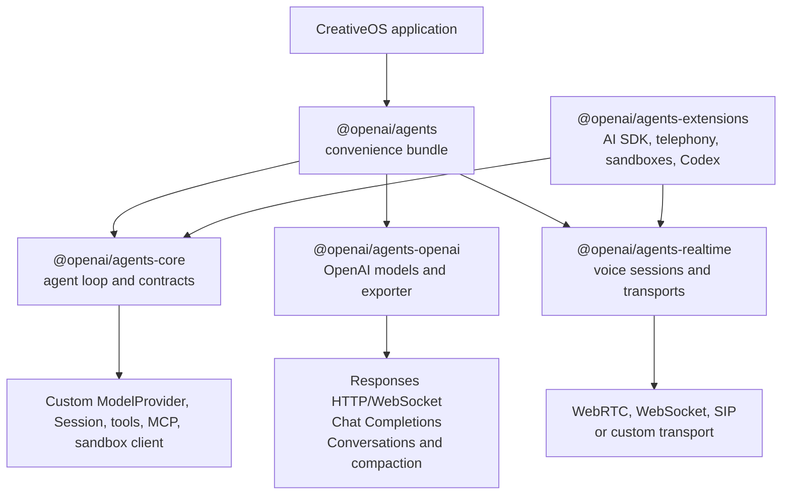
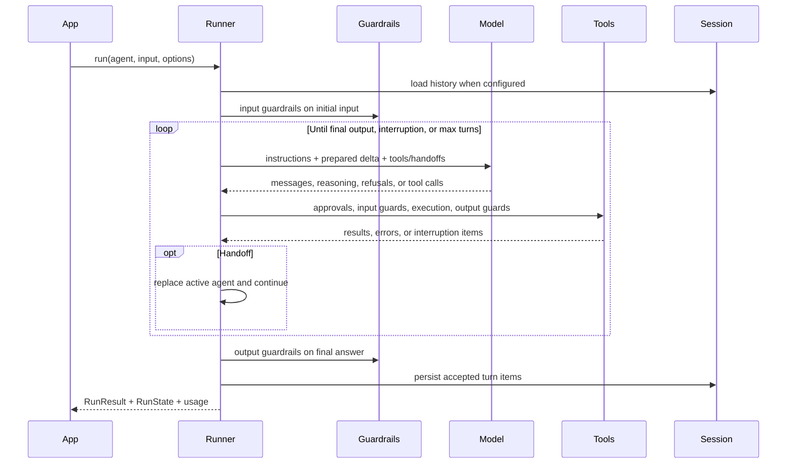
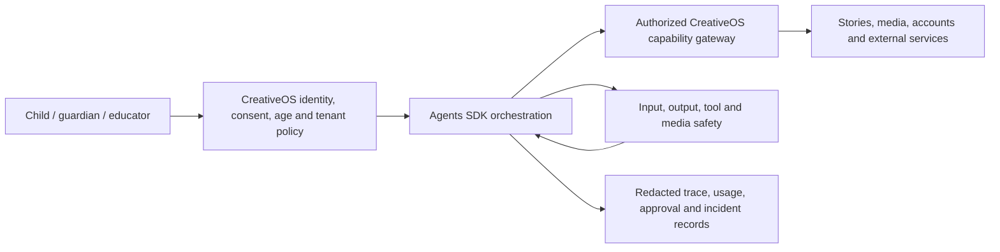

# OpenAI Agents SDK for JavaScript Repository Analysis

## Report scope

This report analyzes the current default-branch source tree of [`openai/openai-agents-js`](https://github.com/openai/openai-agents-js) at the reviewed commit. The review covers the five published packages, their public entry points, the provider-neutral runner, tool and handoff execution, guardrails, resumable run state, session persistence, OpenAI Responses and Chat Completions adapters, Realtime transports, sandbox-agent runtime, optional integrations, examples, documentation, tests, CI, release automation, dependency surface, and security-sensitive defaults.

The repository contains 1,272 tracked files. Rather than treating every generated translation or test fixture as an independent design artifact, the review inventoried the entire tree and then traced all runtime-critical code paths and package boundaries. The repository's own 17 architecture reference notes were read in full and checked against the current implementation. All English guides, public exports, representative examples, package manifests, CI/release workflows, and the major source modules were inspected. Static review was supplemented with a frozen monorepo install, full package build, lint, example/type compilation, the complete unit suite, coverage, documentation generation, a production-dependency audit, and credential-pattern scanning.

No OpenAI API credential or hosted-sandbox credential was supplied. Consequently, no paid model request, hosted MCP call, Realtime session, trace export, remote sandbox, or end-to-end integration suite was executed. The two Docker integration tests were skipped by the repository's default unit-test configuration; Docker behavior was assessed through source, unit tests, and build validation. Generated dependencies, distributions, coverage data, and documentation artifacts were removed after verification, and the clone was returned to a clean Git state.

This is a source snapshot at a specific commit. Model names, beta features, transport behavior, and provider capabilities can change independently of this report.

## Repository record

- **Upstream:** [`openai/openai-agents-js`](https://github.com/openai/openai-agents-js)
- **Reviewed source:** [`openai/openai-agents-js`](https://github.com/openai/openai-agents-js/tree/4e1f842f63673db59018a7fa4a441c64c274caf2)
- **Reviewed branch:** `main`
- **Reviewed commit/tag:** `4e1f842f63673db59018a7fa4a441c64c274caf2` / `v0.13.4`
- **Reviewed commit date:** July 15, 2026
- **Latest change:** `chore: update versions (#1477)`
- **History:** approximately 1,022 commits at review time
- **License:** MIT, copyright OpenAI 2025
- **Tracked tree:** 1,272 files, approximately 10.2 MiB
- **Primary languages:** TypeScript and TSX; 838 TypeScript/TSX source and test files in the analyzed tree
- **Published packages:** five, all version `0.13.4`
- **Package-manager pin:** pnpm `11.10.0`
- **Supported primary runtime:** Node.js 22 or later; documentation also covers Deno, Bun, browsers, and experimental workerd/Cloudflare support
- **Default OpenAI API/model in this snapshot:** Responses API over HTTP with `gpt-5.4-mini`, `reasoning.effort: "none"`, and low verbosity unless overridden

## Executive summary

The OpenAI Agents SDK for JavaScript is a production-oriented orchestration runtime, not merely a convenience wrapper around one model endpoint. Its central abstraction is deliberately small—an `Agent` has instructions, a model, tools, guardrails, and possible handoffs—but the implementation underneath is extensive. The runner resolves dynamic configuration, sends provider-neutral model requests, converts model output into typed run items, executes tools and approvals, transfers control between agents, enforces guardrails, persists or chains conversation state, emits streams and traces, and can serialize an interrupted run for later resumption.

Its strongest architectural decision is the separation between **provider-neutral orchestration** and **provider-specific wire conversion**. `@openai/agents-core` owns the agent loop and does not need to know the OpenAI Responses JSON shape. `@openai/agents-openai` maps that runtime to Responses over HTTP or WebSocket and to Chat Completions. `@openai/agents-realtime` owns a different, long-lived speech session abstraction. `@openai/agents-extensions` contains integrations that would otherwise expand or destabilize the core. `@openai/agents` is the ergonomic aggregate package and intentionally performs side-effectful default-provider and trace-exporter setup when imported.

The ordinary text-agent run loop is carefully engineered around real failure modes. It distinguishes a handoff, which transfers ownership of the conversation, from an agent-as-tool call, which returns a bounded specialist result to the original manager. It supports parallel tool execution, conditional tools and handoffs, strict schemas, hosted and local tools, MCP, deferred tool search, timeouts, input/output tool guardrails, application approvals, cancellation, model retries, refusal detection, maximum-turn limits, and customizable error-to-final-output handling. Streaming is not a cosmetic wrapper: it has its own cancellation reconciliation, partial-tool-call handling, event model, session persistence, and trace lifecycle.

Conversation state has three intentionally different modes: caller-managed history, a local `Session`, or OpenAI server-managed state via `conversationId` / `previousResponseId`. The runner actively prevents these modes from duplicating history. `RunState` makes human-in-the-loop interruptions durable; schema version 1.13 serializes model responses, run items, approvals, active agent identity, conversation identifiers, usage, trace context, pending nested-agent state, tool-search state, and sandbox-session metadata. API keys for tracing are omitted by default from serialization. Duplicate-named agent graphs use stable identity keys in newer schemas, addressing a subtle resume ambiguity.

The Realtime layer is a parallel orchestration system suited to persistent voice conversations. A `RealtimeSession` chooses WebRTC in compatible browsers and WebSocket on servers, owns local history, tools, hosted MCP, approvals, handoffs, output guardrails, interruption behavior, and usage. WebRTC handles browser media; WebSocket exposes audio buffers for application-owned capture/playback; SIP attaches to telephony calls. Twilio and Cloudflare adapters demonstrate the transport interface. Important limitations remain: structured agent output is not supported by `RealtimeAgent`; all handoffs stay on the session's model; a voice generally cannot change after audio has been emitted; function tools execute wherever the session lives; and streaming output guardrails can interrupt but cannot retract speech already heard.

The newest and largest surface is sandbox agents. A `SandboxAgent` binds an agent to an isolated workspace plus capabilities such as shell, filesystem, skills, memory, and compaction. The runtime materializes a manifest, creates or adopts a session, supplies session-bound tools, manages ownership, snapshots and resume state, executes pre-stop hooks, and serializes workspace/session metadata. Core includes Unix-local and Docker clients; extensions provide Blaxel, Cloudflare, Daytona, E2B, Modal, Runloop, and Vercel adapters. This is powerful but high risk: a local sandbox is still code execution on the host under the current user's authority unless the application chooses a stronger isolation boundary. The SDK supplies mechanisms, not a universal trust policy.

Quality is unusually strong for a fast-moving SDK. The frozen install and complete package build passed. ESLint passed. All 27 compilable workspace projects and examples type-checked. The full suite passed 3,130 tests across 152 test files, with two Docker integration tests skipped. Aggregate coverage was 88.41% for statements/lines, 84.51% for branches, and 93.20% for functions, above the CI thresholds. The documentation build produced 4,629 pages successfully. CI tests Node 22 and 24.3, validates package distributions, runs a separate Windows sandbox-path job, and uses immutable commit SHAs for GitHub Actions.

The main qualification is dependency security. A review-time `pnpm audit --prod` reported 27 advisories: 13 high, 11 moderate, and three low. Several high findings lie in example-only chains, but the published core package's optional MCP dependency also reaches vulnerable versions of `@hono/node-server`, `express-rate-limit`, `path-to-regexp`, `fast-uri`, `ajv`, `qs`, and `ip-address`. Applicability depends on whether downstream applications use the affected MCP server components, yet the lockfile is not audit-clean. The SDK's extensive observability is another operational risk: tracing and debug logging can include model input/output and tool arguments/results unless explicitly minimized.

For CreativeOS, the repository is a strong foundation for orchestration, Realtime voice, approvals, structured outputs, and traceable tools. It should be adopted as an SDK, not copied as an application architecture. CreativeOS still needs its own authentication, child and guardian policy, tenant isolation, data minimization, authorization, deterministic workflow state, cost controls, content-safety layers, audit policy, and evaluation suite. The SDK makes those controls possible; it does not choose them for the product.

## Package architecture

### `@openai/agents-core`

Core contains the provider-neutral public vocabulary and most of the repository's complexity:

- `Agent`, dynamic instructions/prompts, agent graphs, cloning, and `asTool()`;
- `Runner`, `run()`, `RunResult`, `StreamedRunResult`, `RunState`, and `RunContext`;
- function, computer, shell, apply-patch, hosted, namespace, and tool-search contracts;
- handoffs, input/output/tool guardrails, approvals, errors, usage, and lifecycle hooks;
- `Session`, in-memory session storage, history mutation, and session persistence;
- MCP client/server adapters, caching, filtering, lifecycle management, approvals, and resource support;
- tracing primitives and processors;
- protocol item schemas and environment shims; and
- sandbox agent, manifest, capability, lifecycle, local/Docker client, memory, and snapshot machinery.

Its published package supports conditional exports for ESM, CommonJS, types, browser, Node, and workerd variants. This makes the public contract portable but raises maintenance cost: environment-specific behavior must be tested independently, especially for streams, WebSockets, AsyncLocalStorage, files, and child processes.

### `@openai/agents-openai`

This package translates the provider-neutral `ModelRequest` into OpenAI APIs. Its `OpenAIProvider` lazily constructs or accepts an OpenAI client and resolves a model name to:

- `OpenAIResponsesModel` for HTTP Responses;
- `OpenAIResponsesWSModel` for persistent WebSocket Responses; or
- `OpenAIChatCompletionsModel` for Chat Completions.

The provider caches model wrappers where reuse is safe and offers `close()` so cached WebSockets can be released. The Responses converter supports messages, reasoning, function and hosted tool calls, file/image content, refusals, structured output, previous response IDs, conversations, context management, deferred tool search, computer/shell/patch calls, and raw provider data. Chat Completions converts the subset it can represent and can either warn or fail on Responses-only features.

The package also exports hosted-tool helpers, OpenAI Conversations-backed sessions, Responses compaction sessions, raw-event type guards, retry advice, and the OpenAI trace exporter. Its default is intentionally Responses, not Chat Completions.

### `@openai/agents-realtime`

Realtime is a separate state machine because a persistent bidirectional speech session does not fit the request/response runner. It exposes:

- `RealtimeAgent` and `RealtimeSession`;
- WebRTC, WebSocket, and SIP transports;
- session/audio/turn-detection configuration normalization;
- typed conversation items and client/server events;
- audio and transcript events, history reconciliation, and interruption controls;
- local function tools, hosted MCP tools, approvals, handoffs, and background results;
- output guardrails and tracing metadata; and
- a custom transport interface.

`RealtimeAgent` intentionally removes text-agent controls that do not map safely to one live session: per-agent model changes, structured outputs, ordinary model settings, and text-run tool-use behavior. This is a sound constraint rather than a missing convenience.

### `@openai/agents-extensions`

Extensions keeps provider/integration churn outside the stable core. The major surfaces are:

- an AI SDK model adapter with v2/v3 compatibility, reasoning/tool conversion, retry advice, and finalized-text transformation;
- AI SDK UI streaming response helpers;
- Twilio Media Streams and Cloudflare workerd Realtime transports;
- remote sandbox clients for Blaxel, Cloudflare, Daytona, E2B, Modal, Runloop, and Vercel, sharing archive, path, PTY, manifest, mount, snapshot, and session utilities; and
- an experimental `codexTool()` that delegates workspace-scoped work to the Codex SDK and can preserve a Codex thread ID across calls.

These modules rely on optional peer dependencies. Consumers should import narrow subpaths and install only the integration they use.

### `@openai/agents`

The bundle re-exports core and OpenAI functionality, plus Realtime and sandbox subpaths. Importing its main index installs the default `OpenAIProvider` and OpenAI tracing exporter. This is convenient but materially side-effectful: applications wanting complete provider or telemetry control should understand the initialization order or import lower-level packages directly.

## Agent definition and composition

An `Agent<TContext, TOutput>` is configuration, not a running actor. Key fields include name, instructions, stored prompt configuration, handoff description, model and model settings, tools, MCP servers/config, input and output guardrails, structured output type, tool-use behavior, and whether tool choice is reset after a call.

Instructions, prompts, tools, and handoffs can be dynamic functions of `RunContext`, enabling tenant-, user-, feature-, or turn-specific behavior. This is useful for CreativeOS, but dynamic configuration must be treated as authorization-sensitive. Hiding a tool from a prompt is not equivalent to denying the underlying action; every execution path still needs server-side authorization.

Structured output accepts Zod 4 or JSON Schema. Zod results are parsed after the model response; raw JSON Schema results are JSON-decoded. This turns a model answer into typed application data, but it guarantees shape rather than factual correctness. A story-plan schema can ensure chapters and characters exist; it cannot prove age appropriateness, originality, or policy compliance.

### Handoff versus agent as tool

The SDK implements two distinct multi-agent semantics:

| Pattern | Control after delegation | Input to specialist | Output ownership | Best use |
|---|---|---|---|---|
| Handoff | Specialist becomes active agent | Ongoing conversation, optionally filtered | Specialist can produce the final user-facing answer | Triage or role transfer |
| `agent.asTool()` | Manager remains active | Generated tool arguments/input mapping | Specialist result returns to manager for synthesis | Bounded research, critique, or private subtask |

A handoff is represented to the model as a transfer function. It can have a custom name/description, structured handoff input, callback, history filter, and dynamic enablement. Only the first requested handoff in a response is honored as the primary transfer; ignored extras are not persisted in a way that biases later turns.

`Agent.asTool()` is substantially richer than a simple nested `run()`. It supports custom schemas and input builders, approval requirements, dynamic enablement, nested runner configuration, streaming callbacks, context reconciliation for resumed nested runs, cancellation linking, structured result extraction, and metadata describing the parent tool invocation. This makes manager-style composition practical without inventing a second orchestration system.

## Runner lifecycle

The ordinary non-streaming flow is:

The default maximum is ten turns. Passing `maxTurns: null` explicitly removes the bound, which should be avoided for autonomous or user-funded workflows unless a different budget controller exists.

Input guardrails run only against the initial input/starting-agent boundary. They can run in parallel with the first model call for latency or block it for strict pre-screening. Output guardrails run only when the runtime has a candidate final output. They do not inspect every intermediate tool result. Tool guardrails are the correct hook for validating tool inputs and outputs. These timing distinctions matter: an application cannot assume that defining one output guardrail protects tool side effects or earlier streamed content.

The runner resolves dynamic tools and handoffs, detects name collisions, chooses a model, merges runner and agent model settings, normalizes GPT-5 defaults, and optionally resets a forced tool choice after a call to prevent loops. It processes function, hosted MCP approval, computer, shell, apply-patch, tool-search, and handoff actions. Multiple independent function calls can execute concurrently.

Tool-not-found behavior and tool errors are configurable. By default, many function-tool failures become model-visible results so the model can recover. Setting `errorFunction: null` or selecting exception behavior makes failures escape. This is a product decision: recovery is user-friendly, but converting authorization or integrity failures into ordinary text can hide a security event unless the application also records and classifies it.

Streaming exposes raw model deltas, high-level run-item events, and active-agent changes. `StreamedRunResult` is an async iterable and can provide a Web or Node text stream. Cancellation closes the consumer stream, propagates an abort signal, reconciles partial calls where possible, ends tracing, and avoids treating cancellation as successful final output. An application that stops reading early must still use the completion/cancellation APIs correctly or it may lose final tool/session state.

## Tool system

### Function tools

The `tool()` helper converts a function plus Zod or JSON Schema into a model-callable definition. Strict schema validation is the default. It supports:

- dynamic enablement;
- per-call or persistent approval decisions;
- input and output tool guardrails;
- model-visible error mapping;
- per-call timeout behavior;
- abort signals;
- SDK-only `customData` for application rendering or IDs; and
- tracing/logging of inputs and outputs.

Timeouts use an abort-aware race. The SDK can stop waiting and abort the supplied signal, but JavaScript cannot forcibly stop arbitrary user code. A tool that ignores `details.signal` may continue its side effect after the runner has declared a timeout. Side-effecting tools therefore need cooperative cancellation, idempotency keys, and durable execution status.

### Hosted and execution tools

The OpenAI package supplies web search, file search, code interpreter, image generation, and tool-search helpers. Core supplies computer, shell, and apply-patch contracts. Shell can be application-local or an OpenAI-hosted container configuration. Computer and apply-patch require application implementations. Approval hooks and safety checks exist, but the SDK cannot decide whether an action is permissible for a particular CreativeOS user.

Deferred tool search reduces prompt size by loading tool definitions only when needed. Function tools and namespaces can be marked deferred, and hosted MCP can defer loading. This is Responses-only and model-dependent. Tool identity is carefully normalized across namespaced, dotted, handoff, and MCP names to avoid ambiguous dispatch.

### MCP

The SDK supports three MCP patterns:

1. OpenAI-hosted MCP or connector tools executed by the Responses/Realtime service;
2. application-managed Streamable HTTP MCP clients; and
3. local stdio MCP processes.

It includes tool caching, filters, server-name prefixes, lifecycle aggregation, reconnect behavior, optional partial-failure tolerance, resources, prompts, logging, timeouts, and approvals. Hosted MCP credentials and allowed-tool filters can be attached to the tool definition. Local MCP names can be prefixed deterministically to prevent cross-server collisions.

MCP expands the trust boundary. A server's tool description, schema, output, resources, and errors are external input. CreativeOS should pin/allowlist MCP servers, minimize headers, use per-user credentials, filter tools, validate outputs, and require approval for consequential actions. The dependency audit findings in the MCP server stack reinforce the need to update and isolate that surface.

## Guardrails, approvals, and safety semantics

There are three guardrail layers:

- **Input guardrails:** assess the initial user input; can block before or alongside the first model request.
- **Output guardrails:** assess the candidate final agent output.
- **Tool guardrails:** run immediately before and after a local tool and can allow, replace with rejection content, or throw.

A tripwire raises a typed exception. Realtime output guardrails differ: they inspect transcript increments, defaulting to every 100 characters, interrupt the response, and send corrective feedback. That is useful for limiting continued speech, but it is not pre-publication moderation. Audio already played cannot be un-heard.

Human approval is modeled as an interruption, not a blocking promise kept in memory. A tool call produces `RunToolApprovalItem`; the caller can inspect `result.interruptions`, approve or reject on the result state, and invoke the runner again with that state. Decisions can apply once or persist for future calls of the tool during the run. Rejection messages can be customized. This design works across long delays and process boundaries when `RunState` is durably stored.

Approval is still only a mechanism. A production UI must display the exact action, target, arguments, data exposure, cost, and user identity; protect against stale or replayed approvals; and bind the decision to the unchanged call ID and policy version.

## Conversation ownership and resumability

The SDK deliberately separates three history strategies:

| Strategy | Owner | What the next call receives |
|---|---|---|
| `result.history` | Application | Complete caller-managed item history |
| `Session` | Application/session store | Stored history merged with the new turn |
| `conversationId` or `previousResponseId` | OpenAI service | Only the unacknowledged delta, with server state referenced |

Mixing these without care would duplicate messages and tool outputs. `ServerConversationTracker` marks items sent to or returned by the provider and sends only the appropriate delta. Session persistence also tracks what a `callModelInputFilter` actually allowed through so redacted or truncated content, rather than the original, can be stored.

The core `Session` interface is intentionally small: get ID/items, add items, pop, clear, and optional history preparation/mutation hooks. `MemorySession` clones values and is explicitly unsuitable for production. OpenAI provides a Conversations-backed implementation and a Responses compaction wrapper. Compaction can replace long history after completed turns; manual compaction is available for latency-sensitive streaming flows.

`RunState` schema 1.13 supports versions 1.0 through 1.13 on read. Newer versions added sandbox state, stable agent identity, nullable max-turn limits, missing-tool-call persistence, and SDK-only custom tool data. Serialization includes approvals and trace state but omits the trace API key unless explicitly requested. `fromStringWithContext()` supports merging live context/approvals into serialized state or replacing it. This is a robust resume surface, but serialized state contains conversation and tool data and must be encrypted, access-controlled, expired, and versioned like other sensitive application records.

## Model layer and retry behavior

`Model` performs one provider request; `ModelProvider` resolves model names. Runner settings override conflicting agent settings, while nested reasoning, text, prompt-cache, and retry fields are merged. The default model can be changed with `OPENAI_DEFAULT_MODEL` or at runner/agent level.

The Responses path is the feature-complete default. The WebSocket Responses model can reuse a persistent connection, while a scoped helper manages provider shutdown. Chat Completions remains available for compatible endpoints but cannot represent every Responses feature. Strict feature validation lets applications fail rather than silently degrade.

Retries are opt-in and runner-managed. Policies can inspect network failures, HTTP status, `Retry-After`, or provider advice, and use bounded exponential backoff with jitter. The runtime refuses unsafe replays when a streaming or stateful request may already have been accepted or visible output has been emitted. That is an important integrity safeguard: retrying a possibly executed tool-producing request can duplicate side effects.

The AI SDK adapter allows other providers through the same `Model` contract. It translates messages, tools, reasoning, usage, and streams and supports a finalized-text transform. It does not support every OpenAI-specific feature, notably deferred Responses tool loading, and documentation labels the adapter beta. Provider parity must be evaluated feature by feature.

## Realtime architecture

`RealtimeSession` is the voice equivalent of the runner but retains a live connection across turns. It prepares the active agent's tools and handoffs, constructs session configuration, selects or accepts a transport, attaches listeners, updates local history, executes local function tools, handles hosted MCP events, runs output guardrails, tracks usage, and changes active agent after handoffs.

### Transport choice

- **WebRTC:** default in compatible browsers; captures microphone and plays remote audio, negotiates a peer connection/data channel, and is designed for ephemeral client credentials.
- **WebSocket:** default on servers; the application supplies/consumes audio buffers and controls playback. A regular server API key is permitted there. Browser WebSocket use rejects non-ephemeral keys unless an explicitly insecure override is enabled.
- **SIP:** attaches to an OpenAI Realtime call ID and supports telephony/provider bridges.
- **Custom transport:** must implement connection, event, audio, mute, interruption, history, and raw-event semantics.

The Twilio adapter forces telephony audio defaults, forwards media, uses mark events to estimate what the caller heard, and clears/truncates on interruption. The Cloudflare adapter uses `fetch()` with `Upgrade: websocket` because workerd does not expose ordinary outbound WebSocket construction.

### Realtime tools and handoffs

Realtime allows function tools and hosted MCP tools. Local functions run in the session process—therefore in the browser if that is where the session exists. Sensitive or privileged actions must call a trusted backend. Tool approvals and input/output guardrails are supported. A `backgroundResult()` lets a long operation return control without forcing the model to wait for a normal result.

Handoffs replace the live agent configuration but do not change the session model. Tool and handoff names must be unique. Session configuration is cached and merged so audio-format choices survive an agent change. The session keeps response-specific dispatch snapshots so a delayed tool call is routed using the agent/tool set active when that response began rather than a later handoff state.

### Realtime risks

- Function tools can accidentally expose secrets or authority to untrusted browser code.
- Automatic VAD and response creation can act before application moderation unless manual response control is configured.
- Transcript timing is asynchronous and may not match audio-response timing exactly.
- Output guardrails are reactive.
- Raw audio is excluded from local history by default, which is privacy-positive; enabling it increases memory and sensitivity.
- The Realtime service's session duration and immutable mid-session settings require reconnection planning.
- Telephony interruption accuracy depends on transport playback accounting, not only model events.

## Sandbox agents

Sandbox agents are the SDK's execution-workspace layer. A `SandboxAgent` extends `Agent` with a default manifest, base instructions, capabilities, optional run-as user, and a runtime manifest. Core capabilities include shell, filesystem, skills, memory, and compaction. Capability code can alter turn context, inject instructions, and expose session-bound tools.

The runtime manager:

1. identifies sandbox agents in the graph and assigns stable keys;
2. requires a `RunConfig.sandbox` source;
3. creates, adopts, resumes, or reuses a sandbox session;
4. applies the manifest and user identity;
5. clones and binds the agent to the live session;
6. processes context through capabilities;
7. serializes session/workspace state into `RunState`; and
8. executes pre-stop hooks and cleans up or preserves owned sessions.

The manifest can describe files, directories, Git repositories, mounts, environment, permissions, and related workspace setup. Snapshot and archive controls enable resume. Paths are normalized and extensively tested for containment across local, remote, and Windows semantics. Remote providers share common protection and materialization utilities but differ in credentials, PTY support, mount implementation, snapshot format, exposed ports, and lifecycle semantics.

### Local versus remote isolation

`UnixLocalSandboxClient` creates a workspace directory and runs shell processes on the local machine. It enforces workspace path policy for SDK file operations and supports PTY, run-as behavior, snapshots, and process output limits. It is not a VM security boundary. A shell command has the operating-system permissions of the spawned user and can potentially access resources outside the workspace unless OS-level sandboxing separately prevents it.

`DockerSandboxClient` improves process/filesystem separation but inherits Docker daemon and container-configuration risks. Remote providers offer stronger administrative boundaries when configured correctly, yet credentials, networks, mounts, snapshot archives, and provider control planes remain in scope.

For CreativeOS, untrusted code or child-authored content should never run in a host-local sandbox carrying developer credentials. Use short-lived remote/container sessions, deny network by default, mount only necessary inputs, separate tenants, cap CPU/memory/time/output, scan produced files, and destroy or explicitly retain workspaces under a documented policy.

### Sandbox memory

The memory capability records conversation segments, generates a phase-one summary/raw extract, and consolidates selected recurring information into `MEMORY.md` and `memory_summary.md`. The workspace layout separates sessions, raw memory, summaries, and consolidated indexes. It supports read-only or generation-only modes and separate layouts for isolation.

This can reduce repeated exploration, but it is not automatically suitable for children. Conversation-derived memory can preserve personal information, mistaken inferences, or sensitive creative content. CreativeOS would need guardian-visible controls, per-child isolation, deletion/export, provenance, expiration, correction, and a strict policy for what may be consolidated.

## Observability and privacy

The SDK traces runs, agent spans, generations, tools, handoffs, guardrails, speech, and custom spans. Server tracing is enabled by default, except in tests; browser tracing is disabled by default. OpenAI export is configured by the aggregate package, and applications can add or replace processors. Voice tracing may also occur service-side.

By default, generation and function spans can include inputs and outputs. Debug logs can include model data, tool arguments, tool results, MCP traffic, and session history. `traceIncludeSensitiveData` and the SDK logging controls reduce capture, while Zero Data Retention organizations cannot use OpenAI tracing. Serverless environments may need an explicit trace flush.

For CreativeOS, tracing should start from data classification rather than dashboard convenience. Child speech, stories, images, identifiers, tool parameters, and moderation decisions may all be sensitive. Use redaction before the trace boundary, pseudonymous group IDs, least-retention processors, tenant access controls, and separate operational metrics from content-bearing diagnostics.

## Testing, build, and release quality

### Verification results

| Check | Result |
|---|---|
| `pnpm install --frozen-lockfile` | Passed with pnpm 11.10.0; 1,555 packages linked after supply-chain policy verification |
| `pnpm build:ci` | Passed; TypeScript ESM/CJS declarations and package bundles built with zero errors |
| `pnpm lint` | Passed with no findings |
| `pnpm test:examples` / recursive `build-check` | Passed for all 27 applicable workspace projects |
| `pnpm test` | 152 test files passed, one skipped; 3,130 tests passed, two Docker integration tests skipped |
| `pnpm test:coverage` | Passed; 88.41% statements/lines, 84.51% branches, 93.20% functions |
| `pnpm docs:build` | Passed; 4,629 static pages plus Pagefind search and sitemap generated |
| credential-pattern scan | No committed private-key or plausible live API-key pattern found outside dependencies/build output |
| production dependency audit | Failed policy-clean criterion: 27 advisories, including 13 high and 11 moderate |

The test distribution is substantial: package source is approximately 97,000 lines, while package tests total approximately 118,000 lines. Runner, RunState, session persistence, tool execution, Realtime transports, Responses conversion, sandbox path/process behavior, remote sandbox adapters, tracing, MCP, and compatibility shims all have direct tests. Aggregate coverage exceeds CI's 85% line/statement/function and 80% branch thresholds.

CI runs on Node 22 and 24.3, checks generated declarations, lints, type-checks docs scripts and examples, and tests. A separate Windows job exercises local and remote sandbox path logic. Workflows use read-only default permissions and pin third-party actions by commit SHA. Release automation uses Changesets and separate tag/publish workflows.

### What validation does not prove

The passing unit suite uses mocks for provider services. It does not demonstrate current OpenAI account entitlements, actual model behavior, network reliability, telephony latency, hosted MCP trust, remote sandbox enforcement, or application-level safety. The integration suite was not run because it requires external credentials and infrastructure. The two Docker integration tests skipped by default should run in an environment with Docker before relying on container lifecycle behavior.

## Dependency and security findings

The review-time production audit counted 1,013 production/optional dependency nodes and 27 advisories. The findings fall into three groups:

1. **Published core/MCP chain:** the optional `@modelcontextprotocol/sdk` path included affected versions of `@hono/node-server`, `express-rate-limit`, `path-to-regexp`, `ajv`, `fast-uri`, `qs`, and `ip-address`. Some advisories concern server middleware that a pure MCP client may not invoke, but the vulnerable code is in the dependency graph and downstream use can make it reachable.
2. **Example applications:** Tailwind's native package brought an affected `tar`; Next.js examples brought an affected `postcss`; AWS credential chains brought affected XML packages; and a Prisma example brought an affected Effect version.
3. **Documentation/development surfaces:** filesystem MCP examples and Astro/esbuild added lower-severity findings.

There were no critical advisories. A clean package build does not neutralize these issues. The repository should update the lockfile/dependency constraints and re-run compatibility tests. CreativeOS should audit the exact installed production subset, not assume the monorepo count maps directly to its deployed bundle.

Other security-sensitive observations:

- model/tool data logging and tracing are content-bearing by default in many server paths;
- aggregate-package imports change global model/tracing configuration;
- tools execute with application authority unless separately isolated and authorized;
- local sandbox is not a security boundary;
- serialized RunState can contain sensitive conversation/tool/sandbox state;
- browser Realtime function tools execute in the browser;
- persistent WebSocket and retry logic correctly avoid some unsafe replays, but application tools still need idempotency; and
- hosted/provider integrations are optional and vary in maturity.

## Strengths

1. **Small public mental model with a rigorous runtime.** Agents, tools, handoffs, guardrails, sessions, and results compose without requiring a proprietary workflow language.
2. **Provider separation.** Core orchestration is reusable with custom models while OpenAI-specific features stay in an adapter.
3. **Explicit multi-agent semantics.** Handoffs and agents-as-tools encode distinct control models.
4. **Durable human-in-the-loop design.** Interruptions and serialized state work across process/time boundaries.
5. **Careful conversation ownership.** Local history, sessions, and server-managed continuation do not blindly duplicate each other.
6. **First-class streaming.** Raw and semantic events, cancellation, partial calls, tracing, and persistence are handled deliberately.
7. **Layered tool controls.** Schemas, approvals, timeouts, enablement, guardrails, cancellation, custom error behavior, and custom application metadata are available.
8. **Broad Realtime support.** WebRTC, WebSocket, SIP, custom transports, Twilio, Cloudflare, tools, MCP, handoffs, and transcript guardrails share one session abstraction.
9. **Serious execution workspace.** Sandbox manifests, sessions, snapshots, capabilities, local/Docker implementations, and remote providers are more than a toy shell wrapper.
10. **Strong validation.** Tests, coverage, cross-runtime/path jobs, immutable CI actions, package build checks, and generated docs are all present.
11. **Good source documentation.** The architecture references describe invariants and ownership, not only tutorials.
12. **Conservative replay behavior.** The retry layer recognizes that possibly accepted stateful requests cannot always be safely retried.

## Limitations and design cautions

1. **Surface area has grown well beyond “few abstractions.”** The beginner API is small, but production use requires understanding many options, provider distinctions, and beta features.
2. **Global setup can surprise embedders.** The convenience bundle installs provider/tracing defaults at import time.
3. **Safety is compositional, not automatic.** Guardrails do not authorize tools, output schemas do not verify truth, and approvals do not design the approval UX.
4. **Realtime and text agents are related but not interchangeable.** Model changes, structured output, history, and guardrail timing differ.
5. **Local sandbox naming can overstate isolation.** Workspace path checks do not constrain arbitrary shell commands at the OS boundary.
6. **Timeouts are cooperative.** A tool ignoring abort can continue after timeout.
7. **Memory can institutionalize errors or sensitive data.** Consolidation needs product-specific governance.
8. **Optional dependency graph is not audit-clean.** MCP and examples include review-time high-severity advisories.
9. **Many integrations are beta or experimental.** AI SDK, hosted multi-agent, Codex, sandbox agents, and some remote providers can change faster than the stable core.
10. **Unit success is not service validation.** External models, transports, credentials, and providers remain untested in this local pass.

## Implications for CreativeOS

### Recommended adoption

- Use `@openai/agents` for the main server orchestration and narrow subpath imports for Realtime/sandbox features.
- Use structured outputs for story plans, scene graphs, moderation decisions, and workflow routing, while validating facts and policy separately.
- Use agents-as-tools for bounded research, educational critique, age adaptation, and media planning where a manager should own the final response.
- Use handoffs only when a specialist truly should become the user-facing active agent.
- Use durable `Session` storage for ordinary child/guardian workflows and encrypted `RunState` for approval interruptions.
- Use function tool schemas, input/output tool guardrails, explicit approval, idempotency keys, and server authorization together.
- Use WebRTC with short-lived credentials for browser voice; keep privileged function tools behind CreativeOS APIs.
- Use trace correlation and usage accounting, but redact content before export and disable sensitive payload capture by default.
- Consider remote/container sandbox agents for advanced creator workflows, never host-local execution for untrusted users.

### Required CreativeOS control plane

The SDK should sit below an application-owned policy layer:

CreativeOS must supply:

- child/guardian/educator roles and consent state;
- tenant and per-child data isolation;
- age-appropriate prompt/policy selection;
- server-side tool authorization and least privilege;
- deterministic workflow state for publishing, sharing, purchasing, deletion, and other consequential actions;
- content and media moderation across input, output, images, audio, files, and retrieved content;
- spend, duration, turn, tool, and concurrency budgets;
- encrypted session/run-state storage with retention and deletion;
- human review for consequential or ambiguous cases;
- evaluation sets for safety, creativity support, hallucination, privacy, latency, interruption, and accessibility; and
- versioned models, prompts, schemas, policies, and migrations.

### Suggested rollout order

1. Start with text agents, typed tools, server-side sessions, structured outputs, redacted tracing, and no sandbox.
2. Add manager/specialist agents as tools for bounded internal subtasks.
3. Add durable approval flows for publishing, sharing, account changes, and high-cost generation.
4. Add browser WebRTC voice with ephemeral credentials and backend-only privileged tools.
5. Add remote sandbox workflows only after isolation, quotas, file scanning, and retention controls are tested.
6. Add memory consolidation only after guardian controls, correction, provenance, and deletion semantics exist.

## Bottom line

At `v0.13.4`, `openai-agents-js` is a sophisticated, well-tested orchestration SDK whose implementation quality is substantially stronger than the average agent framework. It provides credible primitives for text, voice, tools, approvals, sessions, tracing, MCP, and execution workspaces without forcing application logic into a custom graph DSL. Its source demonstrates careful thinking about conversation ownership, state resumption, streaming, cancellation, replay safety, and cross-runtime packaging.

It is not a product safety system. The highest-risk choices—who may act, what data may leave the product, which content is acceptable for a child, whether a tool side effect is lawful, what a guardian approved, how long memory persists, and how much the workflow may spend—remain CreativeOS responsibilities. The repository is a strong engine beneath those controls, provided CreativeOS uses narrow imports, trusted server tools, explicit policy, privacy-aware observability, updated dependencies, and a stronger sandbox boundary than host-local execution.

## Source map

The most important implementation anchors in the clone are:

- [`packages/agents-core/src/agent.ts`](https://github.com/openai/openai-agents-js/blob/4e1f842f63673db59018a7fa4a441c64c274caf2/packages/agents-core/src/agent.ts) — agent definition, dynamic configuration, structured output, and agent-as-tool behavior
- [`packages/agents-core/src/run.ts`](https://github.com/openai/openai-agents-js/blob/4e1f842f63673db59018a7fa4a441c64c274caf2/packages/agents-core/src/run.ts) — runner and streaming/non-streaming lifecycle
- [`packages/agents-core/src/runState.ts`](https://github.com/openai/openai-agents-js/blob/4e1f842f63673db59018a7fa4a441c64c274caf2/packages/agents-core/src/runState.ts) — resumable state schema, approvals, serialization, and agent identity
- [`packages/agents-core/src/tool.ts`](https://github.com/openai/openai-agents-js/blob/4e1f842f63673db59018a7fa4a441c64c274caf2/packages/agents-core/src/tool.ts) — function, computer, shell, patch, hosted, and tool-search definitions
- [`packages/agents-core/src/runner`](https://github.com/openai/openai-agents-js/tree/4e1f842f63673db59018a7fa4a441c64c274caf2/packages/agents-core/src/runner) — model-output processing, tool execution, session persistence, conversation tracking, retries, guardrails, and turn resolution
- [`packages/agents-openai/src/openaiResponsesModel.ts`](https://github.com/openai/openai-agents-js/blob/4e1f842f63673db59018a7fa4a441c64c274caf2/packages/agents-openai/src/openaiResponsesModel.ts) — Responses HTTP/WebSocket wire conversion
- [`packages/agents-openai/src/openaiProvider.ts`](https://github.com/openai/openai-agents-js/blob/4e1f842f63673db59018a7fa4a441c64c274caf2/packages/agents-openai/src/openaiProvider.ts) — OpenAI model resolution and transport lifecycle
- [`packages/agents-realtime/src/realtimeSession.ts`](https://github.com/openai/openai-agents-js/blob/4e1f842f63673db59018a7fa4a441c64c274caf2/packages/agents-realtime/src/realtimeSession.ts) — Realtime agent/session orchestration
- [`packages/agents-realtime/src/openaiRealtimeWebRtc.ts`](https://github.com/openai/openai-agents-js/blob/4e1f842f63673db59018a7fa4a441c64c274caf2/packages/agents-realtime/src/openaiRealtimeWebRtc.ts) and [`openaiRealtimeWebsocket.ts`](https://github.com/openai/openai-agents-js/blob/4e1f842f63673db59018a7fa4a441c64c274caf2/packages/agents-realtime/src/openaiRealtimeWebsocket.ts) — browser/server transports
- [`packages/agents-core/src/sandbox`](https://github.com/openai/openai-agents-js/tree/4e1f842f63673db59018a7fa4a441c64c274caf2/packages/agents-core/src/sandbox) — sandbox agent, capabilities, manifests, memory, runtime, and local clients
- [`packages/agents-extensions/src`](https://github.com/openai/openai-agents-js/tree/4e1f842f63673db59018a7fa4a441c64c274caf2/packages/agents-extensions/src) — AI SDK, telephony/workerd, remote sandboxes, and experimental Codex
- [`docs/src/content/docs`](https://github.com/openai/openai-agents-js/tree/4e1f842f63673db59018a7fa4a441c64c274caf2/docs/src/content/docs) — maintained guides and generated API-doc source
- [`.agents/references`](https://github.com/openai/openai-agents-js/tree/4e1f842f63673db59018a7fa4a441c64c274caf2/.agents/references) — repository-maintainer architecture references
- [`.github/workflows/test.yml`](https://github.com/openai/openai-agents-js/blob/4e1f842f63673db59018a7fa4a441c64c274caf2/.github/workflows/test.yml) — CI, coverage, and Windows path validation
