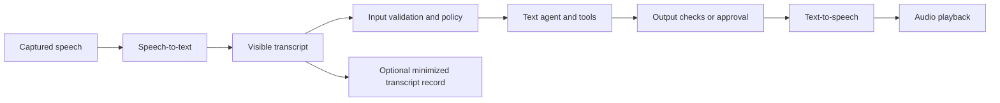
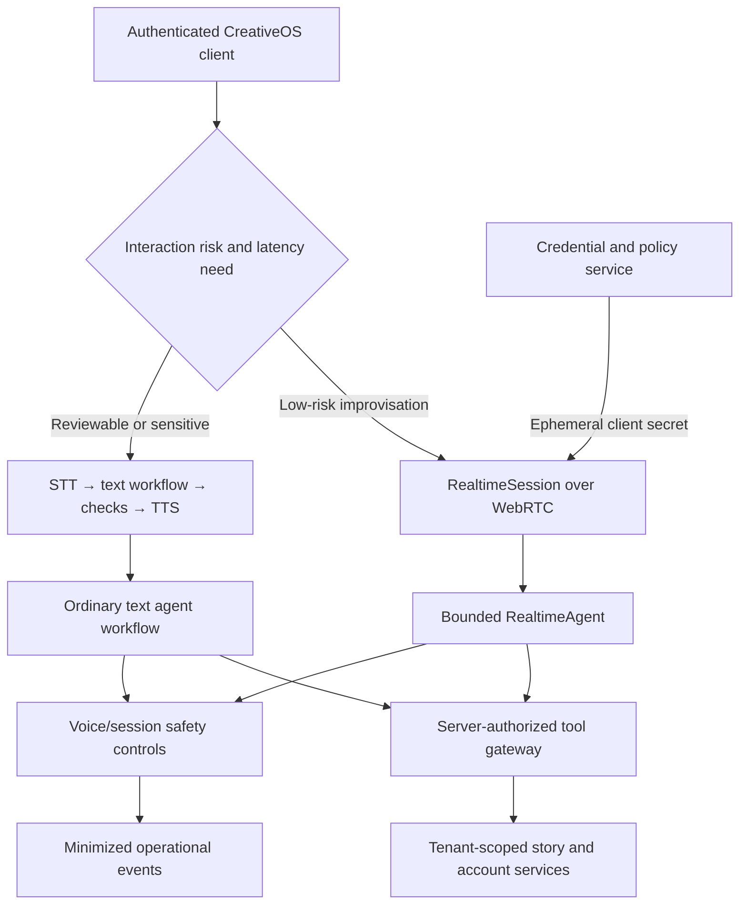

# OpenAI Voice Agents Guide — Comprehensive Analysis

## Report scope

This report analyzes OpenAI's official [Voice agents guide](https://developers.openai.com/api/docs/guides/voice-agents), read on July 16, 2026. The guide is a concise architectural entry point rather than a complete production specification. It explains the fundamental choice between a live speech-to-speech session and a chained speech-to-text → text-agent → text-to-speech pipeline, shows the preferred SDK starting point for each, and connects voice transport to ordinary agent concepts such as tools, handoffs, guardrails, state, and observability.

The report also relates the guide to the reviewed `openai-agents-js` and `openai-realtime-agents` source trees. Those repository observations are clearly identified as implementation context; they are not claims made by the guide itself. Model names, SDK interfaces, and platform capabilities are time-sensitive, so implementers should verify the current official documentation before shipping.

## Executive summary

The guide's central lesson is that “voice agent” describes two materially different systems. In a **speech-to-speech session**, a realtime model consumes and emits live audio directly. This minimizes conversational latency and enables natural turn-taking, interruption, and realtime tool use. In a **chained pipeline**, the application explicitly transcribes speech, passes text through an agent workflow, and synthesizes the resulting text. This exposes the intermediate transcript and gives the application a deliberate policy boundary before speech is produced.

OpenAI recommends choosing the audio architecture before designing the wider workflow. TypeScript's shortest browser path uses `RealtimeAgent` and `RealtimeSession`; Python's simplest path for extending a text workflow uses `VoicePipeline` and `SingleAgentVoiceWorkflow`. This is not a language comparison or a statement that one approach is universally better. The examples intentionally demonstrate different architectures because the two SDKs expose different voice helpers in the reviewed snapshot.

The live path is the stronger fit for fluid character conversation, spoken brainstorming, language practice, or any interaction in which barge-in and low time-to-first-audio matter. The chained path is stronger when CreativeOS must retain a durable transcript, apply approval or child-safety checks between reasoning and speech, reuse an existing text agent, or replace individual speech components. The trade is control and inspectability versus conversational immediacy.

Transport and agent logic should remain separate. In the TypeScript example, `RealtimeSession` owns the audio connection and lifecycle while `RealtimeAgent` owns instructions and later tools, handoffs, and guardrails. This separation gives an application a stable business-logic layer even if the client uses WebRTC and a server or telephony integration uses WebSocket/SIP.

For CreativeOS, the most important consequence is that the product may need both architectures. A low-stakes, improvisational story conversation can use a live session, while account changes, publishing, purchases, personal-data capture, or a final child-facing story release should pass through explicit server-side workflows and policy checks. The guide does not provide a complete child-safety, consent, moderation, identity, storage, or abuse-prevention design. Those remain application responsibilities.

## The architecture decision

| Dimension | Speech-to-speech live session | Chained voice pipeline |
|---|---|---|
| Audio path | Model receives and produces live audio | App runs STT, text workflow, then TTS |
| Primary objective | Natural, low-latency conversation | Predictable and inspectable processing |
| Turn taking | Native live-session behavior | Controlled by the application's stages |
| Barge-in/interruption | First-class design goal | Must be coordinated across pipeline stages |
| Intermediate transcript | May be available through session events, but is not the control plane | Explicit input to the text workflow |
| Policy insertion points | Guardrails and tools around an already-live exchange | Deterministic checks can block or revise text before TTS |
| Component substitution | More coupled to the realtime session/model | STT, agent, and TTS are independently replaceable |
| Existing text-agent reuse | Possible, but requires adaptation to the live surface | Natural extension of an existing text agent |
| Failure behavior | Connection, audio, session, tool, and interruption states interact | Each stage can fail, retry, or be audited separately |
| Best CreativeOS use | Responsive co-creation and spoken character interaction | Publishing, approvals, durable records, sensitive actions |

This distinction is not merely implementation detail. It determines where the application can inspect meaning, apply policy, retry work, record evidence, and stop output. In a chained system, an answer can be evaluated before it becomes audible. In a live system, some generated audio may already have reached the user before a later check fires. A product's risk model must therefore influence the architecture, not be bolted on after the voice experience is designed.

### When to select live speech-to-speech

The guide recommends the live audio path when the experience should feel conversational and immediate. Its named requirements are:

- barge-in, so the user can interrupt without waiting for a complete response;
- low first-audio latency;
- natural turn taking; and
- realtime tool use.

Appropriate CreativeOS scenarios include collaboratively inventing a character, letting a child redirect a scene verbally, playing a bounded fictional role, or conducting a hands-free creative exercise. These scenarios benefit when the system responds to cadence and interruption rather than treating every turn as a file to transcribe and batch-process.

### When to select a chained pipeline

The guide points to the chained design when the app needs stronger control over intermediate text, wants to reuse an established text agent, or needs a simple migration path from a non-voice workflow. It specifically identifies support flows, approval-heavy workflows, durable transcripts, and deterministic logic between stages.

Appropriate CreativeOS scenarios include reviewing a proposed story before narration, applying policy and age-band checks, resolving a child's ambiguous request through a controlled dialog, producing an attributable transcript for a caregiver, or requiring approval before publishing or sharing. Chaining also permits specialized transcription or speech-generation choices without redesigning the reasoning layer.

## Speech-to-speech implementation path

The guide describes a four-step browser flow:

1. The application server creates an ephemeral client secret for a live audio session.
2. The frontend constructs a `RealtimeSession`.
3. The session connects through WebRTC in a browser or WebSocket on a server.
4. The agent and session handle audio turns, tools, interruptions, and handoffs.

Its TypeScript example is structurally:

```ts
import { RealtimeAgent, RealtimeSession } from "@openai/agents/realtime";

const agent = new RealtimeAgent({
  name: "Assistant",
  instructions: "You are a helpful voice assistant.",
});

const session = new RealtimeSession(agent, {
  model: "gpt-realtime-2.1",
});

await session.connect({
  apiKey: "ek_...(ephemeral key from your server)",
});
```

The model name is part of the July 16, 2026 documentation snapshot, not a future-proof default. The durable design pattern is more important than the literal value: keep the long-lived standard API key on the trusted server, mint a narrowly usable ephemeral credential for the client, and let the session own transport state.

### Responsibility boundaries

The guide gives a useful division of concerns:

- **Application server:** authenticates the product user, authorizes the requested experience, creates the ephemeral client credential, and retains privileged business actions.
- **Frontend:** captures/playbacks audio, holds the ephemeral credential, starts or stops the session, exposes interruption and status affordances, and renders session events.
- **`RealtimeSession`:** owns the live connection, transport details, audio turns, interruption behavior, and session lifecycle.
- **`RealtimeAgent`:** defines instructions and is the attachment point for tools, handoffs, and guardrails.
- **Backend tools/services:** perform trusted reads or writes after independent authorization and validation.

The guide explicitly advises keeping transport concerns in the session layer and business logic in the agent definition. CreativeOS should add a third boundary: privileged actions belong behind server-authorized tools, not in either the browser prompt or a client-executed tool merely because the agent requested them.

### WebRTC versus WebSocket

The voice guide only routes readers to the lower-level transport documentation; it does not fully specify each protocol. At this level, its recommendation is:

- WebRTC is the normal browser connection; and
- WebSocket is the server-side connection.

The later WebRTC report in this series analyzes connection establishment in detail. The architectural point here is that transport selection should not change the agent's business role. A browser-native experience can exploit WebRTC media handling, while a server-owned audio pipeline can use WebSocket and application-managed audio buffers.

### Tools and handoffs in a live session

Tools allow the agent to query or act on external systems; handoffs move the conversation to a more suitable specialist. Examples for CreativeOS could include a read-only story-library search, a pronunciation helper, or a handoff from an improvisational character to a neutral help agent.

Tool availability must not equal tool authority. A live voice request can be misheard, induced by background speech, or manipulated through prompt injection. Every side-effectful tool should validate the authenticated user, current project, role, requested resource, argument constraints, and confirmation status at execution time. A handoff should preserve the applicable age band, safety policy, locale, caregiver settings, and session restrictions rather than silently resetting them.

## Chained voice-pipeline implementation path

The guide decomposes the chained architecture into three explicit steps:

1. speech-to-text;
2. the agent workflow; and
3. text-to-speech.

Its Python example creates an ordinary `Agent` with a function tool, wraps it in `SingleAgentVoiceWorkflow`, passes that workflow to `VoicePipeline`, runs the pipeline over an `AudioInput`, and asynchronously consumes audio stream events. In the snapshot, the text agent is configured with `gpt-5.6`; again, the exact model should be verified at implementation time.

The conceptual flow is:



The chain's key advantage is the explicit pre-TTS gate. The application can store or discard the transcript according to policy, normalize uncertain transcription, ask for confirmation, run content checks, invoke internal services, require a human decision, and only then synthesize an approved response. This is particularly important because speech is difficult to retract once played.

### Pipeline state and failure handling

A production chained pipeline should model each stage independently:

- capture state and audio format;
- transcription result, confidence or uncertainty, language, and timestamps;
- agent input version and authorized tool context;
- tool calls, approvals, and result provenance;
- final checked text;
- synthesis request and voice configuration; and
- playback progress and interruption.

Retries should be stage-specific. Repeating TTS should not repeat a purchase tool; retrying transcription should not duplicate an already-committed story save. Side-effectful operations need idempotency keys and durable status separate from the conversational text.

### Latency implications

The guide does not publish a latency budget. Architecturally, chaining creates serial dependencies: audio must be sufficiently captured, transcribed, reasoned over, checked, and synthesized. Streaming within stages can reduce perceived delay, but premature TTS conflicts with the main benefit of post-generation approval. CreativeOS should define separate modes rather than claiming both maximal safety review and minimal speech latency in every interaction.

## Core agent building blocks remain unchanged

The guide emphasizes that voice changes transport and the audio loop, not the fundamental workflow decisions. It directs implementers to the ordinary agent surfaces for:

- **tools**, when speech needs external capabilities;
- **runner and state**, for streaming, continuation, or durable state;
- **orchestration and handoffs**, for specialist branching;
- **guardrails and human review**, for checks and approvals; and
- **integrations and observability**, for MCP capabilities and behavioral inspection.

This principle prevents “voice” from becoming a separate, under-governed product. The same tool authorization, tenant boundaries, workflow state, audit rules, and evaluation criteria should apply regardless of whether the user's input arrived as text or speech. Voice-specific controls are additional: microphone disclosure, listening state, interruption UX, audio retention, speaker ambiguity, and audible-output risk.

## Relationship to the reviewed repositories

### `openai-agents-js`

The source review in [`20-openai-agents-js-repository.md`](20-openai-agents-js-repository.md) confirms the architectural separation described by the guide. `RealtimeAgent` and `RealtimeSession` form a distinct long-lived runtime rather than wrapping the ordinary request/response `Runner`. The session chooses an appropriate transport, holds conversation history, coordinates tools, approvals, handoffs, guardrails, interruption, and usage, and exposes events for application UI and telemetry.

The repository also makes several implementation qualifications visible:

- Realtime agents do not support the ordinary agent's structured final-output contract.
- Handoffs remain within the session's realtime model.
- Voice configuration becomes constrained after audio output starts.
- Browser function tools execute in the browser unless deliberately proxied to a trusted server.
- A streaming output check can interrupt future speech but cannot erase audio already heard.

These are source-snapshot observations and may change. They reinforce the guide's advice to select architecture from the workflow's control needs.

### `openai-realtime-agents`

The example application reviewed in [`19-openai-realtime-agents-repository.md`](19-openai-realtime-agents-repository.md) demonstrates browser WebRTC sessions, scenario selection, client tools, handoffs, guardrails, event inspection, and a server endpoint that mints ephemeral credentials. It is valuable as a reference implementation, but it remains a demo rather than a complete product security architecture. CreativeOS should borrow interaction and session patterns while adding authenticated issuance, server-side authorization, policy enforcement, data governance, rate limits, abuse controls, and product-specific safety.

## Safety, privacy, and child-oriented product considerations

The guide mentions guardrails and approvals but does not define a complete safety program. For a child-facing creative system, the following controls are necessary complements.

### Microphone and listening transparency

The UI should make listening, processing, speaking, muted, disconnected, and error states visually and audibly distinct. Microphone activation must follow platform permission rules and product consent. The product should not imply that muting playback also stops capture, or that closing a visual panel necessarily terminated a backend session.

### Credential boundary

Only an ephemeral live-session credential belongs in the browser. Standard API keys and service credentials remain on trusted infrastructure. Ephemeral issuance should require an authenticated application session and enforce appropriate model, duration, feature, project, and rate constraints. Logs and analytics must redact both permanent and ephemeral secrets.

### Data minimization

Voice can contain names, location, household speech, health information, background conversations, or biometric characteristics. CreativeOS should decide independently for raw audio, transcripts, model events, tool arguments, safety events, and derived analytics:

- whether collection is necessary;
- whether the data is retained;
- how long it is retained;
- who can access it;
- whether it trains or evaluates anything;
- how deletion and export work; and
- what is disclosed to the child and caregiver.

A “transcript off” control is incomplete if raw audio, trace payloads, or tool logs remain stored elsewhere.

### Child agency and anthropomorphism

A natural voice can make a system feel socially authoritative. The agent should identify itself as AI in age-appropriate language, avoid claiming feelings or human relationships, avoid encouraging secrecy or dependency, and keep the child visibly in control of the creative direction. Character role-play needs a clear way to exit to a neutral assistant and obtain help.

### Sensitive actions and confirmation

Speech recognition is probabilistic, and ambient speakers can influence a session. Publishing, deleting, sharing, purchasing, changing privacy, recording personal facts, contacting people, or crossing projects should require an explicit confirmation and often caregiver or account-level authorization. Confirmation should restate the concrete action, not ask only “Are you sure?”

### Output timing

Live output can be partially heard before a check completes. High-risk content should therefore use a pre-output check or chained mode, not rely only on streaming interruption. The app should also stop playback immediately when a user interrupts and visually indicate that an interrupted response is no longer authoritative.

## Operational concerns

### Session lifecycle

Every session needs defined states and cleanup behavior: initializing, awaiting permission, connecting, connected/listening, responding, interrupted, reconnecting, closing, closed, and failed. The application should close media tracks, data channels, timers, and server resources after departure or timeout. Reconnection must not silently create parallel listening sessions or replay side effects.

### Observability without surveillance

Useful measures include connection establishment time, first-audio latency, interruption latency, failed tool calls, handoff frequency, session duration, token/audio usage, policy events, and user-abandoned turns. Raw child audio and full transcripts are not automatically necessary for these metrics. Prefer structured, minimized events and a narrowly controlled diagnostic mode.

### Cost and abuse controls

Long-lived sessions need duration limits, per-account quotas, concurrency limits, inactive-session expiry, restricted tool budgets, and alerting. The UI should make connection state clear so an apparently idle session does not continue consuming resources. The server should reject repeated credential minting and suspicious automation independently of the model.

### Accessibility

Voice should be an input/output option, not the sole route. Provide readable transcripts or captions when appropriate, keyboard controls, non-audio status signals, adjustable playback, and a text fallback. Do not assume a child can speak continuously, hear generated audio, or understand a particular accent or pace.

## Recommended CreativeOS architecture



The recommended split is based on action risk rather than a blanket preference for one API. Keep conversational invention live and bounded. Route high-consequence results through a workflow that exposes text, performs checks, captures approvals, and synthesizes only the accepted output. Both paths should call the same server-side authorization gateway so voice transport cannot bypass product policy.

## Implementation checklist

### Architecture

- Classify each voice experience as live, chained, or deliberately hybrid.
- Document why its latency and control trade-off is acceptable.
- Keep transport/session code separate from agent instructions and tools.
- Keep privileged operations behind an authenticated server boundary.
- Define how interruption, cancellation, retry, and duplicate actions behave.

### Live sessions

- Mint ephemeral credentials only after application authentication and authorization.
- Use WebRTC for browser media unless a documented constraint requires another transport.
- Show explicit listening, speaking, muted, and disconnected states.
- Close media and session resources deterministically.
- Test barge-in during ordinary speech, tool execution, handoff, and network degradation.
- Treat client-executed function tools as untrusted for privileged work.

### Chained pipelines

- Preserve confidence/uncertainty and language information from transcription.
- Validate transcript intent before side effects.
- Run required policy and approval checks before TTS.
- Use idempotency for actions across retries.
- Define transcript/audio retention independently from story retention.
- Permit component-level retry without repeating committed tool calls.

### Safety and privacy

- Provide age-appropriate AI disclosure and caregiver-facing explanations.
- Add pre-output checks where post-output interruption would be too late.
- Require concrete confirmations for sharing, publishing, deletion, purchases, and personal-data use.
- Minimize raw audio, transcript, trace, and tool-result retention.
- Evaluate prompt injection through spoken content and background audio.
- Provide a neutral exit from role-play and a text/accessibility fallback.

### Evaluation

- Measure first-audio and interruption latency separately.
- Test noisy rooms, multiple speakers, accents, silence, long turns, and partial connectivity.
- Evaluate transcription-induced tool errors and recovery dialogs.
- Test policy behavior before, during, and after handoff.
- Run age-appropriate usability studies with consent and safeguarding.
- Audit whether the child meaningfully directs the story rather than merely triggering generation.

## What the guide does not establish

The guide does not specify production authentication, authorization, storage, retention, encryption, regional processing, moderation thresholds, child consent, age assurance, legal compliance, incident response, or accessibility requirements. It does not benchmark model quality, latency, cost, transcription accuracy, or safety. It does not claim that guardrails eliminate harmful audible output, that ephemeral credentials replace product authentication, or that the sample code is a deployable child-facing service.

Its value is architectural clarity: choose direct live audio for natural interaction, choose an explicit chain for control and inspectability, then apply the same agent workflow discipline used for text. Production readiness depends on the application architecture surrounding that choice.

## Source

- OpenAI, [Voice agents](https://developers.openai.com/api/docs/guides/voice-agents), accessed July 16, 2026.

