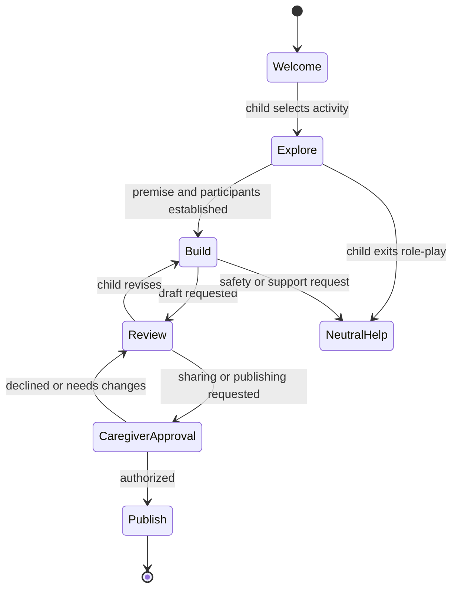

# OpenAI Realtime Models Prompting Guide — Comprehensive Analysis

## Report scope

This report analyzes OpenAI's official [Using realtime models](https://developers.openai.com/api/docs/guides/realtime-models-prompting) guide, read on July 16, 2026. The page contains a current Realtime 2 prompting guide and an extensive Realtime 1.5 section retained for the non-reasoning model. It covers model choice, reasoning effort, spoken preambles, response length, tool policy, silence and unclear audio, exact entity capture, message phases, language and accent, long-session context, prompt migration, conversation-state design, prompt auditing, safety, and escalation.

The report focuses on durable engineering lessons and records snapshot-specific model details separately. Model identifiers, context limits, effort settings, API event shapes, and feature availability can change. They should be checked against the current official documentation before implementation.

## Executive summary

Realtime prompting is workflow design expressed in a form a voice model can follow. The guide rejects broad instructions such as “be helpful,” “be concise,” or “use tools when appropriate.” It recommends explicit trigger/action/exception rules: define when to answer, reason, ask, call, confirm, wait, recover, or escalate. Short labeled prompt sections make those rules findable and maintainable.

The current model choice is between `gpt-realtime-2`, a reasoning voice model intended for stronger instruction following, tool selection, exact entity handling, and long sessions, and `gpt-realtime-1.5`, a fast non-reasoning speech-to-speech model. The guide recommends starting Realtime 2 at `reasoning.effort: "low"`, then changing effort only when evaluation shows a benefit. More reasoning increases latency and cost; unclear audio should trigger clarification, not deeper inference.

Preambles are a first-class spoken behavior. A useful preamble tells the user what action is happening before noticeable reasoning or tool latency. It is normally one short sentence, describes the action rather than private reasoning, and is skipped for direct answers, corrections, unclear audio, background noise, or trivial calls. Realtime 2 can emit commentary and final-answer phases within one response; applications can render or play them differently.

Tools require a risk-calibrated policy. Read-only low-risk lookups can be proactive once intent and arguments are clear. Exact identifiers must be normalized conservatively and confirmed. Writes must state the action and consequence and wait for explicit confirmation. Completion may be claimed only after a successful result. Repeated identical calls after failure are prohibited; recovery should reflect the actual failure type and offer an alternative or escalation.

Voice creates input classes that text prompts rarely model: silence, speech not addressed to the agent, partially heard words, homophones, corrections, accent, and dictated identifiers. The guide recommends a no-op `wait_for_user` tool for non-addressed audio, brief clarification for unintelligible addressed speech, one-at-a-time entity collection, digit/character-level confirmation, and a strict separation between language choice and accent.

Long sessions should not be treated as raw transcript accumulation. Realtime 2's documented 128k-token context is described as roughly one to two hours of dense raw two-way audio, with significant variation. The prompt should distinguish current state, authoritative sources, stale history, relevant policy, and merely useful background. For complex workflows, either encode phases and transitions or dynamically replace the prompt and tool list through `session.update` so the model sees only the current state's responsibilities.

For CreativeOS, the most valuable patterns are: make child agency and safety states explicit; keep story exploration distinct from publishing or sharing; expose only phase-relevant tools; treat names, emails, project IDs, and caregiver actions as exact entities; add a silent wait path; keep role-play escapable; and test prompt changes with recorded behavioral evaluations. Prompt text is not a security boundary: authorization, schemas, state transitions, approvals, and safety enforcement must also exist in application code.

## Model selection and snapshot details

| Model in the July 2026 guide | Architecture | Use when | Prompting emphasis |
|---|---|---|---|
| `gpt-realtime-2` | Reasoning speech-to-speech | Strongest realtime reasoning, tool use, exact capture, instruction following, and long-session state are required | Reasoning effort, preambles, tool policies, source priority, exact entities, state |
| `gpt-realtime-1.5` | Non-reasoning speech-to-speech | Fast and reliable realtime interaction is the priority | Core prompt structure, persona/tone, pronunciation, conversation flow, latency-sensitive behavior |

The guide describes Realtime 2 as able to reason before speaking, follow instructions and tools more reliably, and use an expanded context. It also warns that this greater steerability makes ambiguity, conflict, and overbroad absolute rules more consequential. Realtime 1.5's section remains useful because many basic voice-prompt patterns are model-independent, but its examples should not be copied into Realtime 2 without a migration/evaluation pass.

### Reasoning effort

The guide's effort ladder is:

| Effort | Intended balance | Example class |
|---|---|---|
| `minimal` | Lowest latency for simple actions | timers or simple device commands |
| `low` | Responsiveness with basic reasoning; recommended starting point | support, lookup, straightforward policy questions |
| `medium` | Multi-step reasoning | diagnostics and complex routing |
| `high` | Deeper reasoning where success materially improves | constrained, precision-sensitive work |
| `xhigh` | Maximum reasoning is worth latency and cost | complex planning or critical orchestration |

Effort is a testable operating parameter, not a quality dial that should always be maximized. The prompt should separately tell the model not to reason for direct answers, short confirmations, or simple lookups; to reason before multi-step tool decisions, troubleshooting, or escalation; and never to spend reasoning on audio it cannot confidently understand.

For CreativeOS, `low` is a sensible evaluation baseline for ordinary story collaboration. Higher effort may be useful for reconciling complex story constraints or planning a multi-scene narrative, but high-stakes child-safety decisions should not be delegated to extra model reasoning alone. They need deterministic policy and an appropriate review path.

## Recommended prompt organization

Realtime 2's suggested section vocabulary is:

```text
# Role and Objective
# Personality and Tone
# Language
# Reasoning
# Message Channels
# Preambles
# Verbosity
# Tools
# Unclear Audio
# Entity Capture
# Long Context Behavior
# Escalation
```

Not every prompt needs every heading. The structure is modular: include a section when it governs a real failure mode, not to make the prompt look complete. Realtime 1.5's closely related template also includes `Context`, `Reference Pronunciations`, `Instructions / Rules`, `Conversation Flow`, and `Safety & Escalation`.

### Why labeled sections matter

- They separate role, style, policy, and execution instead of mixing them in prose.
- They expose conflicts during review.
- A failed behavior can be traced to a specific contract.
- State-specific sections can be replaced without rewriting the entire prompt.
- Evaluation cases can map to a section and expected behavior.

The guide advises starting minimal, running evaluations, and adding instructions for observed failures. This creates an evidence-driven prompt rather than a growing accumulation of speculative rules.

## Preambles and response phases

A preamble is a short user-visible update before longer reasoning or tool work, such as saying that the assistant will check a record. It is not hidden chain-of-thought and should never be framed as a disclosure of private reasoning.

### Use a preamble when

- a tool is likely to take noticeable time;
- the request requires multi-step reasoning;
- records, availability, state, or policy must be checked;
- an escalation or handoff is being prepared; or
- silence would appear to be a stalled system.

### Skip a preamble when

- the response is immediate;
- the user is confirming, correcting, or declining;
- audio is unclear and clarification is needed;
- input is silence, noise, hold music, television, side conversation, or speech not directed to the agent; or
- the tool is sufficiently fast and the update adds no value.

### Style contract

The recommended preamble is natural, calm, varied, action-oriented, and normally one short sentence. It should not narrate tool mechanics or say “let me think.” A high-impact action may justify a second short sentence explaining the consequence, but filler makes latency feel worse rather than better.

Realtime 2 can produce multiple output phases within one response. The page shows `response.done` output entries whose `phase` is `commentary` or `final_answer`. Commentary is appropriate for preambles/tool progress; the final phase carries the completed user answer. Applications should use the phase field, not attempt to infer phase from wording. Playback should also handle interruption and avoid replaying stale commentary after the final answer or a new user turn.

## Response length and spoken UX

“Be concise” is underspecified. The guide recommends task-specific length rules, for example:

- direct answer: one or two short sentences;
- clarification: one question at a time;
- tool result: outcome first, then the next useful action;
- comparison: key differences, trade-offs, and audience fit;
- troubleshooting: one step at a time unless the user requests the complete procedure; and
- escalation: brief reason plus what will happen next.

Spoken responses impose a greater memory burden than text. CreativeOS should use short turns during ideation, ask one creative choice at a time, and reserve longer narration for content the child explicitly asked to hear. A visible transcript or story canvas should hold complex structure so the voice does not have to repeat it.

## Tool policy

The guide treats tool behavior as a matrix rather than one global eagerness setting.

| Tool/action class | Recommended default |
|---|---|
| Read-only, low-risk lookup | Call when intent and required fields are clear |
| Read-only lookup using an exact identifier | Confirm the identifier first |
| User-visible communication | Draft or summarize before sending |
| Account/data changes | Describe and confirm before calling |
| Purchase, cancellation, or payment | Confirm amount, target, and consequence |
| Irreversible/high-impact action | Explicit confirmation and an escalation option |

The prompt must name only tools that are actually present, use the exact names, and align its descriptions with the passed schemas. Mentioning unavailable or differently named capabilities encourages invented calls or false claims. The model should only say an action succeeded after a success result.

### Per-tool rules

For larger sets, give every tool:

- purpose and required inputs;
- “use when” conditions;
- “do not use when” conditions;
- whether it is proactive, requires confirmation, or warrants a preamble;
- legal predecessor/successor calls;
- retry rules;
- error behavior; and
- escalation boundary.

The guide's examples distinguish proactive read tools, preamble-bearing checks, and confirmation-first refunds or appointments. This is preferable to a universal command such as “always confirm,” which burdens harmless reads, or “be proactive,” which makes writes too eager.

### Failure recovery

After failure, the assistant should explain the problem in user-friendly terms without exposing raw errors or blaming the user. If an exact identifier may be wrong, read it back. If the failure is likely transient, offer one retry. Repeated failure should lead to an alternate path or escalation. The same tool must not be called repeatedly with unchanged arguments.

Application code should add idempotency, bounded retries, timeout classification, and a durable action ledger. Prompt instructions influence behavior but do not prevent duplicate network delivery or malicious tool arguments.

### Tool output shape

The Realtime 1.5 guidance observes that long raw strings requiring verbatim repetition are brittle. It recommends a small stable JSON envelope such as a `response_text` plus an explicit flag telling the model whether the content must be repeated exactly. Structured named fields are more in-distribution than an untyped string and make the rendering contract machine-visible.

CreativeOS should avoid asking a voice model to faithfully re-speak long policy or story payloads when the UI can render them. When exact wording matters, store and display the authoritative text, and make speech a controlled rendering of that artifact.

## Silence, background audio, and unclear speech

The guide separates two easily conflated cases:

1. **Non-addressed audio:** silence, background noise, television, hold music, side conversation, or speech not intended for the assistant. The recommended action is a no-op `wait_for_user` tool with no spoken follow-up.
2. **Addressed but unclear audio:** the user appears to be speaking to the assistant, but words are ambiguous, clipped, noisy, or unintelligible. The model should ask one brief clarification and must not guess, reason to fill gaps, produce a preamble, capture entities, or call a tool.

This distinction prevents the agent from repeatedly saying “I didn't catch that” into a quiet room while still responding appropriately when the user made a failed request. A CreativeOS listening UI should pair this policy with clear microphone status and a timeout/end-session design; silence should not create an indefinite paid session.

## Exact entity capture

Identifiers are especially error-prone in speech. The guide includes order/tracking/account/claim/ticket numbers, confirmation codes, emails, and phones. CreativeOS equivalents include project IDs, invite codes, child/caregiver account references, share recipients, and possibly character or place names whose spelling matters.

The recommended workflow is:

1. Collect one missing value at a time.
2. Check whether a candidate already exists in current session state.
3. Normalize only clearly spoken digits, characters, and explicit separators.
4. Ask when multiple interpretations exist; never repair or infer missing characters.
5. Read the complete normalized value back—numeric identifiers digit by digit and emails character by character when precision matters.
6. Wait for clear confirmation.
7. Call the tool only after confirmation.
8. After any correction, repeat and reconfirm the full updated value.

Spelled sequences should be compacted (`A B C one two three` → `ABC123`) while preserving explicitly spoken dash, dot, underscore, slash, or plus. Natural numeric phrases can become digits only when their interpretation is unambiguous. The confirmation is part of the data-validation protocol, not conversational politeness.

For child-facing use, reduce the need to dictate identifiers at all. Prefer selecting a visible project or caregiver-approved contact. Voice confirmation should complement, not replace, on-screen identity and authorization.

## Literal instruction traps

Realtime 2's stronger instruction following makes precise scope important. Excessive `always`, `never`, `must`, and `only` can create rigidity or conflicts. A rule about “confirmation codes” may not generalize to “order IDs,” even if a developer sees them as conceptually identical. A rule to “always confirm before doing anything” may insert pointless confirmation before every lookup.

The guide's corrective principles are:

- state explicit behavior rather than implied intent;
- scope rules to the relevant action class;
- define categories and include representative members;
- reserve absolutes for genuine hard constraints;
- remove contradictory or layered priority rules; and
- test small wording changes because their effects can be large.

Hard safety and authorization constraints should exist in code regardless of prompt wording. The prompt should explain expected behavior, while the tool gateway enforces what is possible.

## Language, accent, pacing, and voice identity

Language and accent are separate controls. An English speaker's accent is not evidence that they want a different language. The guide warns against instructions such as “mirror the user” or “adapt to the user's accent,” because filler words, borrowed phrases, names, or pronunciation can cause accidental language switching.

A robust language policy defines:

- the default language;
- what counts as an explicit language request;
- what counts as a substantive utterance in another language;
- what does not trigger switching (accent, name, address, isolated word, backchannel);
- a clarification phrase for low confidence; and
- the rule that preambles, tools, and final speech remain in one language for a turn.

Accent prompting should specify target accent, desired stability, intelligibility, pacing, stress, and whether it affects language choice. The guide notes that prompt steering cannot fully substitute for voice design; Custom Voices were limited to approved customers at the review date.

For Realtime 1.5, a `speed` parameter changes playback rate rather than composition. Prompted pacing and brevity affect how speech is written and delivered. CreativeOS should evaluate comprehensibility with children rather than optimize only for speed or brand expressiveness.

Reference pronunciation lists help with a small set of brand, technical, or place names. They should remain short and be updated from observed errors. Character-by-character reading rules are more appropriate for identifiers than ordinary prose.

## Long-session state and source priority

The guide documents Realtime 2's context increase from 32k to 128k tokens and characterizes this as roughly one to two hours of dense two-way raw audio, depending on tools, reasoning, injected records, and session details. This is capacity, not reliable memory or state management.

Its recommended context layout distinguishes:

- **Current State:** current task, latest known value, next safe step;
- **Authoritative Sources:** current tool result, active policy, or verified record, with retrieval time;
- **Historical/Background Sources:** older conversation or records explicitly marked stale;
- **Relevant Policy/Rules:** decision constraints; and
- **Other Context:** useful but non-authoritative background.

The model should not be expected to infer authority from recency or from a raw transcript dump. CreativeOS needs a durable story/project state outside the model context. At each turn, inject a small current snapshot plus authoritative constraints; retain old narrative ideas as history without letting them overwrite the user's latest choice.

## Conversation flow patterns

For goal-directed interactions, the guide recommends phases with a goal, instructions, and concrete exit criteria. This makes failures attributable and prevents skipping or stalling. Its support example moves through greeting, discovery, verification, diagnosis, resolution, and confirmation/close.

CreativeOS could use:



### Static state machine

A prompt can encode state objects with IDs, descriptions, rules, examples, transitions, and exit conditions. This is versionable and inspectable. The risk is cognitive overload: too many visible states and hard transitions can reduce performance and make dialog robotic.

### Dynamic `session.update`

The alternate pattern holds allowed transitions and state in application code. Each state receives a short prompt and only relevant business tools plus a constrained state-change tool. When exit criteria are satisfied, the application sends `session.update` with the next state's instructions and tool list.

This reduces exposed complexity and makes unavailable actions literally unavailable. It is the stronger CreativeOS default for approval and publication flows. The server, not only the model, must validate that a requested transition is legal and that its exit condition is satisfied.

### Sample phrases

Examples anchor tone, brevity, and transition style but can cause repetition. Label them as inspiration, provide variety, keep mandatory compliance text separate, and evaluate across long conversations. A variety rule should not permit paraphrasing text that legally or operationally must remain exact.

## Prompt auditing and migration

The guide supplies two useful meta-workflows:

- a critique prompt that finds ambiguity, undefined terms, conflicts, omissions, and unstated assumptions, then proposes surgical improvements; and
- an optimization prompt that takes a current prompt plus one observed failure and produces variants aimed at that failure.

LLM critique is a review aid, not an evaluator. Proposed changes must run through behavioral tests, security review, and product judgment.

For migration from earlier models, the guide recommends:

1. restructure around current Realtime guidance rather than merely copying text;
2. start reasoning effort at `low`;
3. audit tool names, schemas, enums, parameters, and settings;
4. remove stale examples and add current happy-path, ambiguity, interruption, tool, and fallback cases;
5. compare representative before/after conversations against an existing evaluation suite;
6. separate hard requirements, defaults, safety, tools, and fallbacks; and
7. iterate from observed failures.

Prompts should be versioned with model, voice, tool schema, session settings, and evaluation results. A prompt cannot be evaluated independently of those surrounding inputs.

## Safety and escalation

The guide's example escalation triggers include safety risk, explicit demand for a human, severe dissatisfaction, repeated tool/no-input failures, and out-of-scope or restricted advice. The assistant should state that it is connecting the user and call the escalation tool, not continue troubleshooting indefinitely.

For CreativeOS, escalation should be broadened beyond human customer support:

- exit character mode to a neutral safety response;
- stop or block publishing/sharing;
- request caregiver review where appropriate;
- offer an age-appropriate support route;
- close the microphone/session when continued interaction is unsafe; and
- record a minimized safety event under the product's incident policy.

The application must decide what happens when no human is available. “Escalate” cannot be a fictional promise. Tool success must be confirmed, queued states shown accurately, and emergency or professional-support language reviewed separately for each locale and age band.

## CreativeOS prompt blueprint

The following is a design skeleton, not a complete production prompt:

```text
# Role and Objective
You are an AI creative partner. Help the child make choices and express ideas;
do not take ownership of the whole story unless explicitly asked for a draft.

# Personality and Tone
Warm, calm, playful, and honest about being AI. Ask one question at a time.

# Language
Use the session language. Do not infer language from accent. Ask if uncertain.

# Reasoning
Answer simple creative questions directly. Reason before reconciling multiple
story constraints. If audio is unclear, do not infer; ask for repetition.

# Preambles and Verbosity
Use one short progress sentence only for noticeable work. Keep normal turns to
one or two short sentences; narrate longer passages only when requested.

# Tools
Search/read-only tools may run when the intent is clear. Saving, deleting,
sharing, publishing, contacting, or changing settings requires exact target,
stated consequence, and the product's confirmation/authorization workflow.

# Unclear Audio and Waiting
Use the silent wait action for non-addressed audio. Ask briefly when addressed
speech is incomplete or unintelligible. Never call a tool from guessed speech.

# Current State and Authority
Follow the current project snapshot and latest child choice. Treat older ideas
as alternatives, not current truth. Server policy overrides story instructions.

# Escalation and Exit
Honor requests to leave role-play immediately. Switch to neutral help for safety,
privacy, account, or caregiver matters. Never pretend escalation succeeded.
```

## Evaluation plan

A comprehensive Realtime prompt evaluation should cover:

- simple versus multi-step turns at every reasoning effort;
- latency, first audio, and preamble frequency;
- direct answers, corrections, refusals, and interruptions;
- silence, noise, television, multiple speakers, and partially clipped speech;
- ambiguous numbers, spelled codes, email addresses, corrections, and homophones;
- each tool's positive, negative, confirmation, retry, timeout, and failure cases;
- invented/unavailable tools and stale prompt/tool mismatches;
- legal and illegal state transitions;
- language switching, accents, names, and isolated foreign words;
- long-session source conflicts and stale-state recovery;
- role-play exit and child-safety escalation;
- repeated phrases, excessive preambles, and overly long speech; and
- model/prompt/tool-schema regression across releases.

Score not just task completion, but unauthorized action rate, false success claims, entity error rate, interruption recovery, child contribution, safety response, and human handoff truthfulness. Keep representative audio, not only transcripts, because acoustic failure is the core medium-specific risk.

## What the guide does not establish

The page provides prompting patterns, examples, and product claims, not independent benchmark evidence. It does not prove a given prompt is safe or reliable, does not replace tool authorization or validation, and does not define child consent, moderation, privacy, retention, legal, or accessibility requirements. The context-window approximation is workload-dependent and should not be treated as a session-duration guarantee. Prompted accents and pronunciations are not guaranteed. More reasoning is not synonymous with better latency, lower risk, or factual correctness.

The guide's strongest general principle is incremental specificity: begin with a clear minimal role, evaluate real behavior, and add narrowly scoped rules, schemas, states, and examples for observed failures. Production control comes from aligning prompt, tool list, application state, enforcement, and evaluation—not from a long system prompt alone.

## Source

- OpenAI, [Using realtime models](https://developers.openai.com/api/docs/guides/realtime-models-prompting), accessed July 16, 2026.

