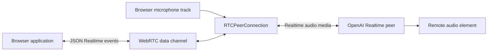
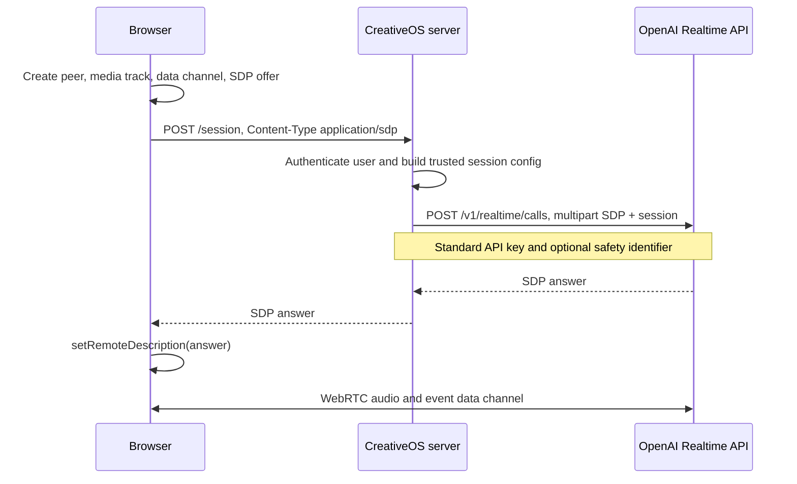
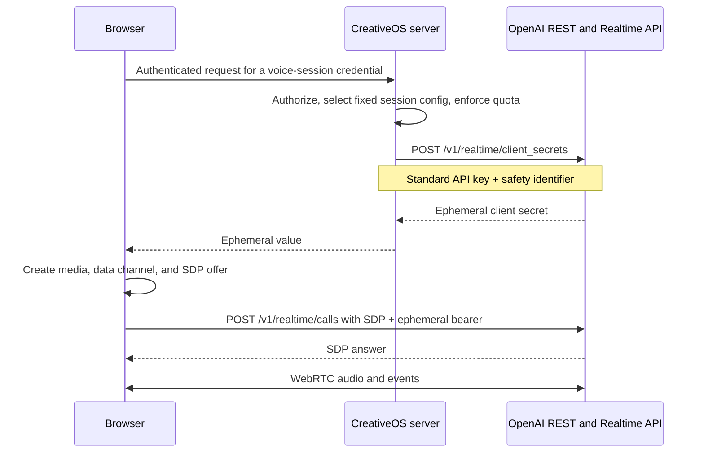
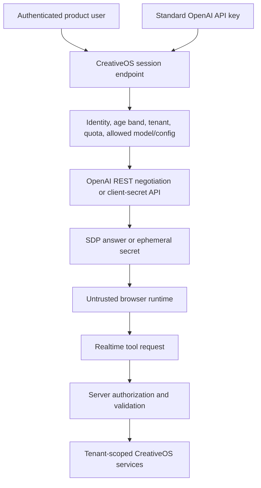
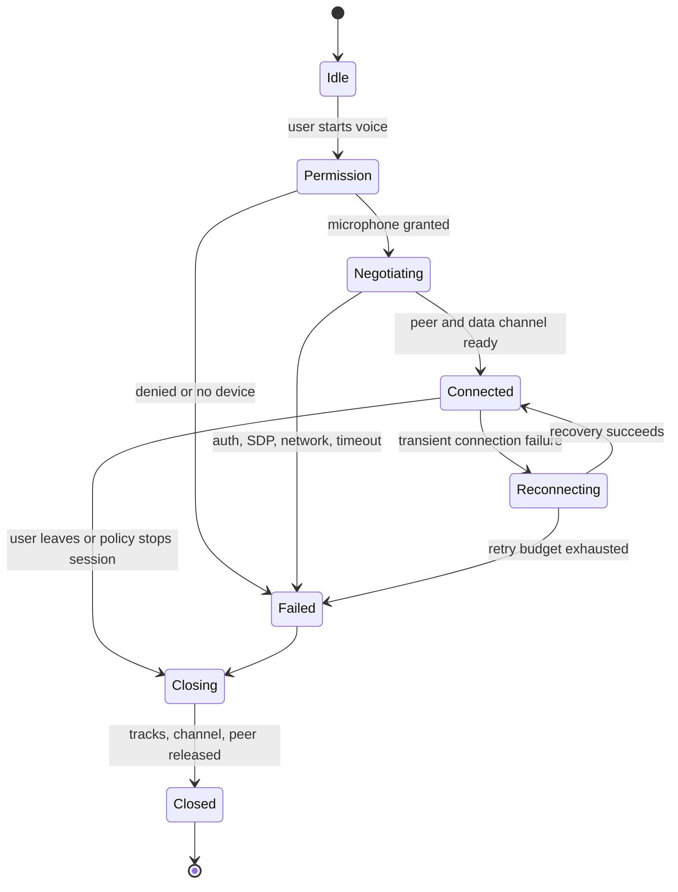

# OpenAI Realtime API with WebRTC — Comprehensive Analysis

## Report scope

This report analyzes OpenAI's official [Realtime API with WebRTC](https://developers.openai.com/api/docs/guides/realtime-webrtc) guide, read on July 16, 2026. The guide explains how a browser or mobile client establishes a Realtime peer connection, compares the unified server-mediated connection flow with client connection using an ephemeral token, and shows how media and Realtime events travel after negotiation.

The page is intentionally low-level. OpenAI recommends beginning with the higher-level Voice Agents/Agents SDK surface for ordinary browser speech applications and using raw WebRTC when direct control is needed. This report covers the documented mechanism, production-hardening requirements that are absent from the samples, and its relationship to the two reviewed repositories. Endpoint shapes, model names, voices, event formats, and credential behavior are time-sensitive.

## Executive summary

WebRTC is the recommended transport when a browser or mobile client connects directly to an OpenAI Realtime model. Compared with a WebSocket implementation, it lets the peer connection manage realtime audio transport while a separate data channel carries JSON client/server events. The browser supplies a microphone media track, receives the model's audio through the remote track, and uses SDP offer/answer negotiation to establish the session.

The guide documents two initialization patterns:

1. **Unified interface:** the browser posts its SDP offer to the application's server. The server combines SDP and a trusted session configuration, authenticates with its standard OpenAI API key, calls `/v1/realtime/calls`, and returns the SDP answer. This is described as generally simpler, but the application server is in the critical path for negotiation.
2. **Ephemeral token:** the browser first asks the application server for a client secret. The server calls `/v1/realtime/client_secrets` with its standard key and approved session configuration. The browser then sends its SDP directly to `/v1/realtime/calls` using the ephemeral value.

Both patterns require a trusted backend. A standard OpenAI API key must never be exposed in browser code. The backend must authenticate the CreativeOS user, authorize voice-session creation, choose or constrain the model/session configuration, apply quotas, and optionally set `OpenAI-Safety-Identifier`. The official sample demonstrates protocol shape, not a secure public endpoint; it omits application authentication, request validation, rate limiting, response-status checks, timeouts, cleanup, and abuse controls.

The unified route keeps the session secret out of the browser and centralizes configuration. The ephemeral route removes the application server from the SDP exchange after minting, but exposes a short-lived credential to the client by design. Neither route makes client-side tools trustworthy or turns a safety identifier into authentication.

For CreativeOS, the higher-level `RealtimeSession` in `@openai/agents/realtime` is the preferred starting abstraction. Raw WebRTC remains useful for custom media UI, device routing, connection telemetry, mobile integration, or features the SDK does not expose. Whichever layer is used, microphone state, session lifecycle, credential issuance, tool authorization, child privacy, cancellation, and resource cleanup remain product responsibilities.

## Transport architecture

WebRTC separates media from control:

The browser calls `getUserMedia({ audio: true })`, adds the captured track to an `RTCPeerConnection`, and sets an `ontrack` handler that attaches the remote stream to an autoplay audio element. It also creates a data channel named `oai-events`. SDP negotiates the peer connection; after negotiation, WebRTC handles audio packets without requiring application code to process granular audio-delta events as a WebSocket client normally would.

This is the main reason WebRTC is preferred for client-side live audio: it uses the browser's native media stack. The application still has to manage permission UX, device errors, mute/unmute, audio playback policy, interruption, connection state, and teardown.

## Choosing the API layer

| Layer | Best use | Application burden |
|---|---|---|
| Agents SDK `RealtimeSession` | Normal browser voice agent with tools, handoffs, guardrails, and session lifecycle | Lower; SDK owns transport abstraction and agent behavior |
| Raw WebRTC guide | Custom transport/media behavior or direct Realtime event control | Higher; application owns peer connection, SDP, media, events, and lifecycle |
| WebSocket | Server-side audio capture/playback or environments where the app owns audio buffers | Highest audio handling; app processes audio/event stream directly |

The raw guide is not a competing agent framework. It describes how bytes and events connect. Prompt policy, tool semantics, state, and product safety sit above that connection.

## Connection method 1: unified interface

### Sequence

The server accepts the browser's raw SDP offer, constructs multipart form fields `sdp` and `session`, and sends them to `https://api.openai.com/v1/realtime/calls`. In the documentation snapshot, the example session is type `realtime`, uses `gpt-realtime-2.1`, and selects the `marin` output voice. Those literals are snapshot examples, not an instruction to let clients choose unrestricted models or voices.

### Benefits

- The standard key and session configuration stay on the server.
- The browser does not need an OpenAI client secret.
- The server can enforce one authoritative configuration at connection time.
- A stable privacy-preserving safety identifier can be injected from trusted identity context.
- The protocol flow is short: browser SDP to application server, application server to OpenAI, SDP answer back.

### Costs

- The application server is on the latency-critical session-negotiation path.
- It must correctly proxy SDP and content types.
- Scaling and availability of the session endpoint directly affect connection success.
- The server needs upstream timeouts, cancellation, error mapping, and capacity controls.
- Large or malformed SDP bodies need strict request limits and validation.

The server is only in the initialization path shown; media subsequently flows through the WebRTC peer connection rather than being application-proxied. This reduces ongoing server bandwidth but also means server-side product policy should not assume it sees every audio packet.

## Connection method 2: ephemeral client secret

### Sequence

The backend creates the client secret with a trusted session body and returns the resulting `value`. The browser authenticates the SDP request with that ephemeral bearer. The guide states that when the server attaches `OpenAI-Safety-Identifier` while creating the secret, the identifier is bound to the token and the browser does not need to send it during connection.

### Benefits

- After minting, SDP negotiation no longer passes through the application server.
- Session establishment can avoid an extra proxy hop for the SDP payload.
- The browser still never receives the standard OpenAI key.
- The trusted server defines the credential's session configuration.

### Costs

- A usable credential exists in an untrusted client environment, even if ephemeral.
- The token endpoint becomes a high-value abuse target.
- Client logging, analytics, browser extensions, or error reporters can leak the value.
- The application needs clear retry semantics so token minting does not become unbounded.
- Revocation, expiry, and partial-failure behavior must be understood and tested against the current API.

Ephemeral does not mean harmless. Treat the value as a secret for its lifetime: never put it in URLs, local storage, telemetry, screenshots, or error messages.

## Browser negotiation in detail

The sample browser flow performs these operations in order:

1. Construct `RTCPeerConnection`.
2. Create an audio element, enable autoplay, and attach the first received remote stream in `ontrack`.
3. Request microphone access with `navigator.mediaDevices.getUserMedia({ audio: true })`.
4. Add the first local audio track to the peer connection.
5. Create the `oai-events` data channel.
6. Create an SDP offer and call `setLocalDescription(offer)`.
7. Submit `offer.sdp` through the selected initialization flow.
8. Construct an SDP answer object from the response.
9. Call `setRemoteDescription(answer)`.

The example is deliberately compact. Production code should wait for the appropriate description/ICE state required by its supported browser matrix, detect non-2xx negotiation responses before treating their body as SDP, handle missing tracks/devices, and subscribe to peer/data-channel connection-state events.

### Media handling

WebRTC owns encoded media transport. This does not eliminate product media logic:

- enumerate and select input/output devices where supported;
- distinguish mute (track disabled) from session termination;
- stop every local `MediaStreamTrack` on exit;
- remove remote media and release audio elements;
- respond to device removal and permission revocation;
- handle browser autoplay restrictions;
- surface echo, feedback, poor network, and no-audio states; and
- avoid creating duplicate peer connections during retries.

### Data channel

The data channel carries Realtime client and server JSON events. The guide parses incoming `message` payloads and sends a `conversation.item.create` event containing user text. In a voice application, the same event channel coordinates session updates, conversation items, response state, tools, errors, and other lifecycle events described by the broader Realtime reference.

Applications should:

- wait for the channel to be open before sending;
- validate parsed event types and required fields;
- handle unknown forward-compatible events;
- bound message size and diagnostic retention;
- avoid logging complete payloads by default;
- correlate events with the active peer/session; and
- ignore late events from a closed/replaced connection.

The data channel is not an authorization boundary. Any model-requested or client-originated action must still pass a trusted server tool gateway.

## Credential and trust boundaries

### Standard key

The standard API key belongs only on trusted backend infrastructure. It should be loaded from a secret manager, scoped to the intended project, rotated, excluded from logs, and never interpolated into shipped JavaScript.

### Session endpoint

Before proxying SDP or minting a token, the server should verify:

- authenticated application session and CSRF/origin policy where relevant;
- account/guardian/product entitlement to use voice;
- tenant and project context;
- allowed model, voice, tools, and instructions;
- per-user/session concurrency and rate budgets;
- requested locale/age-band policy; and
- whether any safety block or cooldown is active.

Configuration should be selected by the server. Accepting arbitrary client-supplied instructions, model, tools, or safety identifiers can turn the endpoint into an OpenAI API relay.

### Safety identifier

The guide recommends a stable, privacy-preserving value such as a hashed internal user ID and says it should be set by the trusted backend. It is used for OpenAI safety attribution; it is not a login credential, a replacement for authorization, an age-verification mechanism, or permission to send raw personal data. Use a deliberate pseudonymous derivation rather than a plain email/name or an unsalted predictable public identifier.

## Production hardening omitted from the sample

The examples teach the handshake. A production endpoint additionally needs:

- authentication and authorization;
- strict method, content type, and body-size validation;
- rate, concurrency, and session-duration limits;
- origin/CSRF strategy appropriate to the auth mechanism;
- upstream abort timeout and client-disconnect cancellation;
- non-2xx handling before returning SDP/JSON;
- safe error mapping without upstream bodies or secrets;
- structured, redacted observability;
- retry/idempotency policy;
- abuse/anomaly monitoring;
- session and cost accounting; and
- secret-management and key-rotation procedures.

The sample's `try/catch` does not treat an upstream HTTP error as an exception because `fetch` resolves on non-2xx responses. Blindly relaying that text as SDP can turn an API error into a confusing browser negotiation failure. The implementation must inspect `r.ok`, validate returned content, and set the correct response content type/status.

## Lifecycle and failure model

A robust connection state machine should include:

Important failure cases include denied microphone permission, no input track, autoplay block, token expiry before SDP exchange, upstream error returned as text, peer failure after data channel opens, remote audio without expected events, events without audio, session replaced during retry, tool completion after disconnect, and reconnection that duplicates a prior action.

Cleanup should be safe to call repeatedly. It must close the data channel and peer connection, stop all media tracks, clear UI state/timers, cancel pending network requests, invalidate the active session correlation ID, and prevent late callbacks from mutating a new session.

## Privacy and child-facing UX

WebRTC's direct media path does not remove privacy duties. Voice may capture a child, household members, names, background television, school details, or location. CreativeOS should clearly disclose when audio is captured and sent, show a persistent listening indicator, provide a hardware/software mute path, and define separate retention rules for raw audio, transcripts, events, tool inputs, and diagnostic recordings.

For child-facing use:

- require the applicable user/caregiver setup before session issuance;
- do not begin capture merely because a page loaded;
- make stop/mute controls obvious and immediately effective;
- distinguish “muted,” “not listening,” and “disconnected” truthfully;
- offer text/caption alternatives;
- prevent background audio from triggering sensitive tools;
- obtain explicit confirmation for sharing, publishing, purchases, or account changes; and
- keep safety and help routes available even inside role-play.

## Relationship to the reviewed repositories

The reviewed [`openai-agents-js`](https://github.com/openai/openai-agents-js/tree/4e1f842f63673db59018a7fa4a441c64c274caf2) source implements WebRTC behind `RealtimeSession` for compatible browser environments. The session adds normalized configuration, audio/event handling, history, tools, approvals, handoffs, interruption, guardrails, and tracing above the low-level peer. See [`20-openai-agents-js-repository.md`](20-openai-agents-js-repository.md).

The reviewed [`openai-realtime-agents`](https://github.com/openai/openai-realtime-agents/tree/94c9e9116b581052655cff7b756cc5e02771cda1) demo uses the same browser-oriented architecture and demonstrates an ephemeral-key endpoint plus Realtime agent scenarios. It is useful for seeing the flow in a complete UI but, like the documentation snippets, is not a substitute for CreativeOS authentication, authorization, data governance, child safeguards, or abuse controls. See [`19-openai-realtime-agents-repository.md`](19-openai-realtime-agents-repository.md).

The two official repository reviews also show why starting at the SDK layer is usually preferable: raw WebRTC solves connectivity, while `RealtimeSession` solves a larger portion of the agent-session lifecycle. Raw transport access remains an escape hatch, not the default product architecture.

## CreativeOS implementation recommendation

1. Use `RealtimeAgent`/`RealtimeSession` for the first browser implementation.
2. Put an authenticated, rate-limited session-issuance route on the backend.
3. Prefer the unified interface when central negotiation/configuration simplicity outweighs the extra server hop; evaluate ephemeral tokens if direct client negotiation produces a material latency or scaling benefit.
4. Generate session configuration exclusively from server-approved product modes.
5. Bind a pseudonymous safety identifier on the server when applicable.
6. Keep every privileged tool behind a separate trusted authorization gateway.
7. Implement an explicit peer/media/data-channel state machine and idempotent cleanup.
8. Instrument negotiation success, connection time, first audio, data-channel readiness, interruption, disconnect cause, duration, and cost without retaining raw child content by default.
9. Test across browsers, mobile devices, permissions, networks, audio devices, and lifecycle races.
10. Re-evaluate raw WebRTC only when SDK limitations are concretely identified.

## Verification checklist

### Server

- Standard API key never enters browser bundles, responses, logs, or error bodies.
- Session endpoint requires a valid product session and checks entitlement.
- Client cannot choose arbitrary model, prompt, tool list, or safety identifier.
- SDP/token requests have body, rate, concurrency, and timeout limits.
- Upstream non-2xx responses are mapped safely.
- Safety identifier is stable, pseudonymous, and server-generated.
- Telemetry excludes secrets and minimizes child content.

### Browser

- Microphone starts only after a clear user action and permission.
- UI reflects peer, media, and data-channel state accurately.
- Data is sent only after the channel opens.
- Incoming events are parsed defensively.
- Mute, interruption, stop, page navigation, and retry release resources.
- Credentials are never persisted or placed in URLs.
- Old connection callbacks cannot affect a replacement session.

### Network and failure tests

- permission denied/no device;
- slow or failed token/SDP request;
- malformed or non-SDP upstream response;
- token expiry between mint and negotiation;
- offline transition and packet loss;
- data channel failure with media alive, and vice versa;
- repeated start/stop and duplicate-click races;
- browser backgrounding or mobile audio-route change; and
- session teardown during a pending tool call.

## What the guide does not establish

The guide does not provide a full production server, authentication design, TURN/network-support matrix, browser compatibility table, reconnect protocol, session revocation procedure, retention policy, child-safety architecture, tool authorization model, cost limits, or comprehensive event handling. It does not state that ephemeral tokens are safe to log or that WebRTC encrypts away all application privacy responsibilities. It does not benchmark unified versus ephemeral latency or availability.

Its durable contribution is the connection boundary: use a trusted backend for standard credentials and approved session configuration, use SDP to establish the peer, let WebRTC carry audio, and use the data channel for Realtime events. Production reliability and governance must be built around that mechanism.

## Source

- OpenAI, [Realtime API with WebRTC](https://developers.openai.com/api/docs/guides/realtime-webrtc), accessed July 16, 2026.
