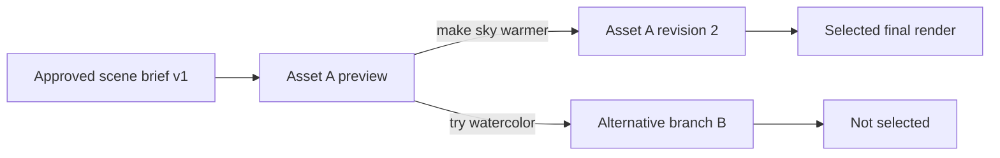
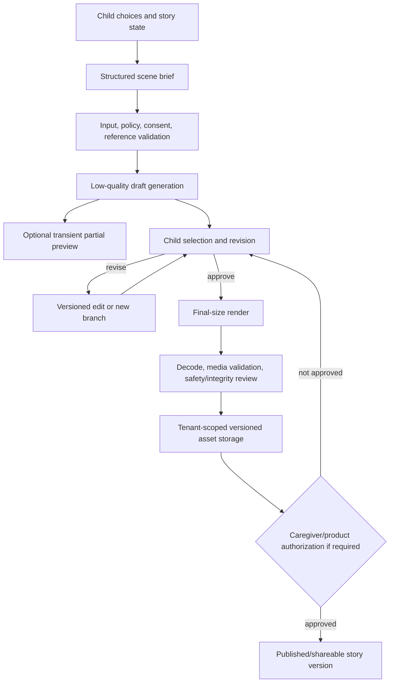

# OpenAI Image Generation Guide — Comprehensive Analysis

## Report scope

This report analyzes OpenAI's official [Image generation](https://developers.openai.com/api/docs/guides/image-generation) guide, read on July 16, 2026. It covers the Image API and Responses API, generation and editing, multi-turn workflows, streaming partial images, reference inputs, masks, fidelity, output controls, moderation/error handling, supported models, and cost/latency.

The guide's current examples center on `gpt-image-2` for direct image calls and `gpt-5.6` as a mainline model invoking the Responses API image-generation tool. These model names, prices, limits, and feature constraints are a dated snapshot. Product code should not hard-code assumptions from this report without checking the current model and pricing pages.

## Executive summary

OpenAI exposes GPT Image through two complementary interfaces. The **Image API** is the direct route for one-shot generation and edits: the caller selects the image model, sends a prompt and optional images/mask, and receives base64 image data. The **Responses API** embeds image generation as a built-in tool inside a mainline model conversation. It is the stronger fit for conversational creation, multi-turn refinement, stored response/image references, and workflows where the model decides whether to create or edit.

The API choice should follow workflow shape. CreativeOS can use the Image API for a deterministic “render this approved scene brief” job and use Responses for an interactive visual workshop in which a child refines a character or setting across turns. Responses has additional mainline-model token usage and greater orchestration complexity, so it should not be used merely to wrap a one-shot image endpoint.

The current GPT Image generation output is base64-encoded. Applications must decode it, validate the resulting media, save it to controlled storage, and attach product metadata. The API response is not a finished asset-management system. CreativeOS needs versioning, ownership, project/tenant boundaries, provenance, consent for reference images, retention and deletion, post-generation safety review, and a clear distinction between preview and published artwork.

Editing supports one or multiple reference images and optional masks. Responses accepts fully qualified image URLs, base64 data URLs, and Files API IDs; direct edits accept uploaded image bytes. A mask guides the model rather than providing pixel-perfect clipping. It applies to the first image when multiple inputs are sent, must match the editable image's format and dimensions, must be under 50 MB, and needs an alpha channel. `gpt-image-2` always processes inputs at high fidelity, so `input_fidelity` is omitted and reference-heavy edits can cost more input image tokens.

Output can be tuned by size, quality, format, compression, and background subject to model support. `gpt-image-2` allows many custom resolutions within explicit pixel, ratio, and divisibility constraints, but does not support transparent backgrounds in the reviewed snapshot. Low quality is the recommended draft mode; JPEG is faster than PNG. Large 2K-class outputs are labeled experimental. Complex requests may take up to two minutes.

All prompts and outputs are filtered. GPT Image supports `moderation: "auto"` or a less restrictive `low`. A child-facing CreativeOS deployment should retain `auto` and layer its own age-appropriate input/output controls; the availability of `low` is not an endorsement for child use. `moderation_blocked` is a non-retryable user-correctable class unless the prompt/input changes. Optional coarse moderation details indicate input/output/unknown stage and public categories; end-user messaging should stay generic while developers log minimized diagnostic context.

The core product recommendation is a draft-first, reviewable asset pipeline: build a structured scene brief from the child's choices, generate low-cost previews, let the child select or revise, render a final image at the needed dimensions, run product safety and integrity checks, and only then attach it to a shareable/published story version.

## API choice

| Dimension | Image API | Responses API image tool |
|---|---|---|
| Primary use | Single prompt generation or edit | Conversational/multi-step image workflow |
| Model selection | Caller selects GPT Image model directly | Caller selects a compatible mainline model; tool selects its GPT Image model |
| Generation endpoint | `/v1/images/generations` | `responses.create` with `{type: "image_generation"}` |
| Editing | Images/optional mask sent to edit endpoint | Images can be in conversation context; tool can generate/edit |
| Multi-turn | Application manually carries assets/state | Native through `previous_response_id`, image generation call/image ID, or supplied context |
| Input forms shown | Uploaded bytes for direct edits | URL, base64 data URL, Files API ID |
| Costs | Prompt/image-input/image-output tokens | Mainline model tokens plus image-generation costs |
| Best CreativeOS role | Approved scene render, batch asset job | Interactive child-led visual refinement |

The Image API also has a variations endpoint for models that support it, such as DALL·E 2, but the guide focuses on GPT Image. Organization verification may be required before using GPT Image models.

## Direct generation with the Image API

The fundamental request selects `gpt-image-2`, passes a prompt, and reads `result.data[0].b64_json`. The caller decodes base64 into image bytes. The `n` parameter can request multiple images in one call; the default is one.

Conceptually:

```ts
const result = await openai.images.generate({
  model: "gpt-image-2",
  prompt: approvedSceneBrief,
  quality: "low",
  size: "1024x1024",
});

const bytes = Buffer.from(result.data[0].b64_json, "base64");
```

Production code should additionally:

- set a request timeout appropriate to the documented worst case;
- validate that `data` and `b64_json` exist;
- base64-decode with size limits;
- verify actual file signature, format, pixel dimensions, and decodability;
- derive the storage filename rather than trusting prompt text;
- store model, prompt/brief version, output settings, request ID, creator/project, and safety status;
- scan/validate the asset under CreativeOS policy before exposing it; and
- make retries idempotent at the job layer so a timeout does not create untracked duplicate assets.

One request yielding `n` images is not equivalent to independent jobs for lineage. Each output should receive its own asset/version ID and review state.

## Image generation inside Responses

The caller chooses a mainline model and provides `tools: [{ type: "image_generation" }]`. Completed images appear as `image_generation_call` output items whose `result` is base64 image data. Other output items may exist, so code must filter by type instead of assuming the first output is the image.

The optional `action` field controls intent:

- `auto`: the tool-capable model chooses generation versus edit;
- `generate`: always create a new image; and
- `edit`: edit an in-context image and fail if no image exists.

Use explicit action when product state already determines the operation. For example, a “Create another option” button should use generation, while “Change only the scarf color” should use edit. `auto` is useful for open-ended conversation, but the UI should make the resulting lineage visible so the user knows whether an existing asset changed or a new branch was created.

### Revised prompt

In Responses tool calls, the mainline model can automatically revise the user's prompt for image-generation performance. The resulting `image_generation_call` includes `revised_prompt`. This is important for auditability and user trust: the image may reflect the model's transformed brief rather than the child's literal wording.

CreativeOS should store:

- the child's original contribution;
- the application-built structured scene brief;
- the prompt submitted to Responses;
- the returned `revised_prompt` when present;
- the reference asset IDs; and
- the generated asset and safety/review status.

The revised prompt should be treated as model output, not authoritative product policy. It must not be allowed to reintroduce disallowed elements or silently override explicit child/caregiver constraints.

## Multi-turn image generation

Responses supports iterative image work in two documented ways:

1. provide `previous_response_id` so the next response continues the prior context; or
2. include the prior image generation call/image ID in the next input.

This enables instructions such as changing style, adding an object, or making an image more realistic without re-uploading the whole workflow manually. The tool model can use an existing in-context image as an edit target.

### State and lineage implications

Conversation continuity is not sufficient asset lineage. CreativeOS should create an explicit directed graph:



Every edit should identify its parent asset and describe the requested delta. Do not overwrite files in place. `previous_response_id` may help model context, but the product database should remain the source of truth for which asset is current, published, superseded, or deleted.

Long conversational histories can also increase cost and make stale instructions compete. Periodically rebuild a concise current visual specification from authoritative state rather than assuming the full conversation expresses the current design.

## Streaming and partial images

Both APIs can stream partial generations. `partial_images` requests zero to three partial images:

- `0` means only the final image;
- positive values request intermediate previews; and
- fewer partials may arrive if generation completes quickly.

Responses emits `response.image_generation_call.partial_image` with an index and partial base64, followed by `response.completed` containing the final call result. The Image API emits `image_generation.partial_image` events. Event and field names differ, so the client should use separate typed handlers.

Every partial image incurs an additional 100 image-output tokens in the reviewed pricing model. Partial output is therefore a UX/cost trade, not free progress telemetry.

### Product semantics for partials

Partials are provisional. They should be labeled “generating,” not saved as final, published, indexed, or offered for download/share before output moderation and completion. A partial may contain transient visual defects or unsafe content that the final pipeline would not expose. CreativeOS should render it in an isolated preview surface and remove it on failure, cancellation, replacement, or final completion.

Stream processing needs:

- monotonically handled partial indices;
- session/job correlation;
- cancellation and late-event rejection;
- decoded-size limits;
- placeholder/failure UI;
- no persistent caching unless explicitly required; and
- a final-state transition only after the completion event and validation.

## Reference-image generation and edits

The edit surface supports:

- modifying an existing image;
- generating a new image using one or more references; and
- editing a selected region using a mask.

The Responses API accepts image references as:

- a fully qualified URL;
- a base64-encoded data URL; or
- a Files API ID created with purpose `vision`.

Direct Image API edits upload one or more image files. The guide demonstrates four product images combined into one gift-basket render.

### Reference security and privacy

Before an image becomes a model input, CreativeOS should verify:

- authenticated user access and tenant/project ownership;
- supported media type and real content signature;
- decoded dimensions, file size, decompression-bomb limits, and malware pipeline where appropriate;
- whether the image contains a child, another person, private location, document, face, or identifying information;
- whether the user has the right/consent to transform it;
- input and derived-output retention/deletion expectations; and
- whether a remote URL is fetched under a safe allowlist/proxy policy rather than enabling server-side request forgery or leaking signed URLs.

For Files API inputs, store the OpenAI file ID as sensitive external state and define deletion/retention synchronization. A CreativeOS asset deletion is incomplete if an uploaded provider-side file persists contrary to the product's stated policy.

### Fidelity

The `input_fidelity` parameter ordinarily controls how strongly input detail is preserved. In the reviewed snapshot, `gpt-image-2` always processes reference inputs at high fidelity and rejects attempts to change this parameter, so it should be omitted. High-fidelity processing can increase input-image token usage.

High fidelity does not guarantee exact identity, logo, layout, facial likeness, or recurring-character consistency. It describes processing detail, not a deterministic preservation contract.

## Masked editing

A mask indicates the region to replace, but GPT Image masking is prompt-guided. The model may not honor the mask boundary with pixel precision. With multiple input images, the mask applies to the first.

The documented requirements are:

- editable image and mask use the same format;
- they have identical size/dimensions;
- each is less than 50 MB; and
- the mask contains an alpha channel.

A black-and-white mask can be converted to RGBA and its grayscale values placed into alpha. Applications should validate this before upload and give an actionable error rather than sending an invalid mask.

### CreativeOS mask UX

The UI should preserve the original image, visualize the editable region, and explain that changes may extend beyond the exact boundary. After generation, present a before/after comparison. If the request is “change only this area,” automated visual-difference checks can flag large out-of-mask changes, but human/user review remains necessary.

Masked editing is suitable for replacing an object or revising a local story detail. It is not a reliable method for compliance-sensitive redaction, removing personal information, or guaranteeing that a logo/face outside the mask is unchanged. Those tasks require deterministic image processing or verification.

## Output customization

The documented controls are:

- `size`;
- `quality` (`low`, `medium`, `high`, or `auto`);
- output format;
- JPEG/WebP compression; and
- background (`opaque`/`auto`, subject to model support).

`size`, `quality`, and `background` support `auto`. `gpt-image-2` does not support transparent background in this snapshot; `background: "transparent"` is unsupported.

### `gpt-image-2` size rules

Any resolution is accepted if all constraints are met:

- maximum edge ≤ 3,840 px;
- both edges are multiples of 16 px;
- long:short ratio ≤ 3:1;
- total pixels between 655,360 and 8,294,400 inclusive.

Examples include 1,024×1,024, 1,536×1,024, 1,024×1,536, 2,048×2,048, 2,048×1,152, 3,840×2,160, and 2,160×3,840. Square images are typically fastest. Outputs above 2,560×1,440 total pixels are described as experimental.

CreativeOS should centralize valid presets by use: square character card, portrait page, landscape spread, thumbnail, and final export. Arbitrary user dimensions should be normalized and validated server-side.

### Quality strategy

- `low`: fast drafts, thumbnails, and iterative exploration;
- `medium`: review candidate when detail matters;
- `high`: final asset when the quality gain justifies latency/cost; and
- `auto`: model-selected trade-off, useful only when nondeterministic cost/quality is acceptable.

A draft-first flow prevents expensive final renders of unselected ideas and preserves child agency by making selection/revision a deliberate step.

### Format and compression

The Image API returns base64 data. PNG is the default; JPEG and WebP are available. JPEG/WebP support `output_compression` from 0–100%. The guide says JPEG is faster and should be preferred when latency matters.

Format should follow content:

- PNG for lossless artwork where supported and size is acceptable;
- JPEG for opaque photographic/painted scenes and low latency;
- WebP for efficient web delivery where client compatibility and processing are controlled.

Keep an archival generation asset separately from delivery renditions. Do not repeatedly recompress the only master copy.

## Limitations

The guide lists four material limitations:

1. complex prompts may take up to two minutes;
2. exact text placement and clarity can still fail;
3. recurring characters or brand elements may drift between generations; and
4. structured/layout-sensitive composition may be imprecise.

These limitations are central for a storybook product. The model should not typeset final page text directly into illustrations when accessibility, proofreading, translation, or layout consistency matter. Generate art and render text with deterministic layout tools. Recurring characters should use reference sheets, stored visual specifications, and acceptance review, while acknowledging that consistency remains probabilistic.

For exact grids, UI mockups, diagrams, or print templates, use ordinary graphics/layout systems and treat the generated image as an asset, not the layout engine.

## Moderation and error handling

All prompts and generated images are filtered under OpenAI's content policy. GPT Image's `moderation` setting supports:

- `auto` — default standard filtering intended to limit certain potentially age-inappropriate categories; and
- `low` — less restrictive filtering.

CreativeOS should not expose this control to children or lower filtering dynamically. `auto` is only one layer; apply product-specific age-band rules before generation and review returned assets before sharing/publishing.

### Error taxonomy

Handle authentication, quota, rate-limit, and server errors through HTTP status/SDK exceptions and record the provider request ID. Retry `429` and `5xx` only with bounded exponential backoff/jitter and job-level idempotency. Do not blindly retry user-correctable image-generation errors.

`error.type = "image_generation_user_error"` may use stable `error.code` values. For `moderation_blocked`, an optional `moderation_details` can include:

- `moderation_stage`: `input`, `output`, or rare `unknown`; and
- coarse public categories such as harassment, self-harm, sexual, or violence.

Branch on the stable code first because details are optional. Keep the primary user message generic; details can support developer logs, analytics, support, or a safe remediation hint. An input-stage block can invite revision of the prompt/reference; an output-stage block means the generated result was rejected and must never be displayed. Do not echo unsafe prompt text or sensitive reference metadata into logs.

### Child-oriented remediation

Remediation should not teach evasion. Offer a positive creative redirect such as changing the conflict, setting, mood, clothing, or non-graphic action. Repeated blocks can trigger a cooldown or caregiver/review path. The system must not preserve blocked partials or thumbnails in user galleries.

## Supported models and cost snapshot

The guide states that in Responses, `gpt-5` and newer models should support the image-generation tool, while directing developers to each model detail page for confirmation. “Should” is not a runtime capability check; test the exact model and handle unavailable-tool errors.

Total GPT Image cost combines:

- input text tokens;
- input image tokens for edits/references; and
- image output tokens.

Responses additionally incurs mainline-model token usage. High-fidelity reference inputs may materially raise input-image tokens.

For models before `gpt-image-2`, the guide lists output token counts by quality and common dimensions: low about 272–408, medium 1,056–1,584, and high 4,160–6,240. It provides the following July 16, 2026 output-price examples, excluding text/image inputs and Responses-model usage:

| Model | Quality | 1024×1024 | 1024×1536 | 1536×1024 |
|---|---:|---:|---:|---:|
| GPT Image 2 | Low | $0.006 | $0.005 | $0.005 |
| GPT Image 2 | Medium | $0.053 | $0.041 | $0.041 |
| GPT Image 2 | High | $0.211 | $0.165 | $0.165 |
| GPT Image 1.5 | Low/Medium/High | $0.009 / $0.034 / $0.133 | $0.013 / $0.050 / $0.200 | same portrait figures |
| GPT Image 1 | Low/Medium/High | $0.011 / $0.042 / $0.167 | $0.016 / $0.063 / $0.250 | same portrait figures |
| GPT Image 1 Mini | Low/Medium/High | $0.005 / $0.011 / $0.036 | $0.006 / $0.015 / $0.052 | same portrait figures |

These numbers can change and are not a budget forecast. Notably, a larger non-square size can sometimes use fewer output tokens than a square size at the same quality. Use the current calculator/pricing endpoint rather than a simplistic pixel multiplier.

## Recommended CreativeOS image pipeline



### Structured scene brief

Separate durable fields—characters, current appearance, action, setting, mood, composition, color, style, continuity constraints, prohibited elements, and output role—from conversational prose. This makes intent reviewable, lets the child edit one dimension, and allows deterministic prompt construction.

### Two-stage rendering

Use low quality and a practical preview size for exploration. Render medium/high or larger output only after selection. Limit `n` and partial images by product tier/budget. Cache completed assets by immutable job ID, not prompt text alone, because policy/model/version/context matter.

### Asset record

Each generated output should record:

- internal asset and parent asset/version IDs;
- project/tenant/user and creation role;
- provider/model/API/action;
- original input and structured/revised prompts under an appropriate privacy policy;
- reference/mask asset IDs and consent basis;
- size, quality, format, compression, background;
- request ID, usage/cost, timestamps, and status;
- moderation and product-review status; and
- publish/share status and deletion lifecycle.

## Security, privacy, rights, and provenance

The guide is about API mechanics and does not supply a complete rights/governance layer. CreativeOS should address:

- access control for all input and derived images;
- informed consent for photos or artwork involving children/other people;
- prohibition or review of identity impersonation and sensitive transformations;
- copyright/trademark and style/character requests under product policy;
- removal of metadata where appropriate and preservation of necessary provenance;
- deletion propagation to stored references/provider files;
- disclosure that images are AI-generated or edited where appropriate;
- immutable audit for published assets without excessive retention of child content; and
- rate limits against bulk generation and abuse.

Never assume an appealing output is factually accurate, unique, rights-cleared, age-appropriate, or compositionally faithful. Human/product review is particularly important before public publishing.

## Evaluation checklist

### Functional

- direct generation and all required edit paths;
- Responses output filtering and missing-image/tool-result handling;
- `action` auto/generate/edit behavior with and without context;
- previous response versus image-ID continuation;
- multiple references and first-image mask semantics;
- every approved size/quality/format preset;
- partial-stream completion, cancellation, and late events;
- base64/media validation and storage failure recovery; and
- prompt/revised-prompt/asset lineage.

### Quality

- recurring character attributes across pages;
- exact count of objects/characters;
- spatial and scene constraints;
- text rendering (while planning deterministic typesetting fallback);
- masked-region adherence and out-of-mask drift;
- reference preservation;
- accessibility/contrast at target display size; and
- child perception of agency and satisfaction.

### Safety and abuse

- input and output moderation blocks;
- unsafe partial never shown or persisted;
- reference image containing a child or personal information;
- cross-tenant file/image ID access attempts;
- malicious remote URL and oversized/decompression input;
- repeated block/evasion behavior;
- publish/share without required review; and
- deletion of source, provider file, derivatives, and cached renditions.

### Performance and cost

- latency distributions by quality/size/edit complexity;
- timeout around the documented two-minute upper case;
- partial-image UX versus added token cost;
- reference-image input token growth;
- Responses mainline usage overhead;
- duplicate job/race prevention; and
- quota exhaustion and rate-limit backoff.

## What the guide does not establish

The guide does not guarantee exact visual consistency, text correctness, mask boundaries, character identity, rights clearance, child appropriateness, uniqueness, or fixed latency/cost. It does not define asset storage, privacy, consent, deletion, publishing approval, tenant isolation, or application-side moderation. `moderation: "auto"` does not certify a child-facing product. High input fidelity does not mean deterministic pixel preservation. A successful API call does not mean an output is ready to publish.

The guide's durable design lesson is to choose the API from the workflow, maintain explicit image lineage, treat generation as an asynchronous untrusted-media job, and build review/safety/asset management around it.

## Source

- OpenAI, [Image generation](https://developers.openai.com/api/docs/guides/image-generation), accessed July 16, 2026.

