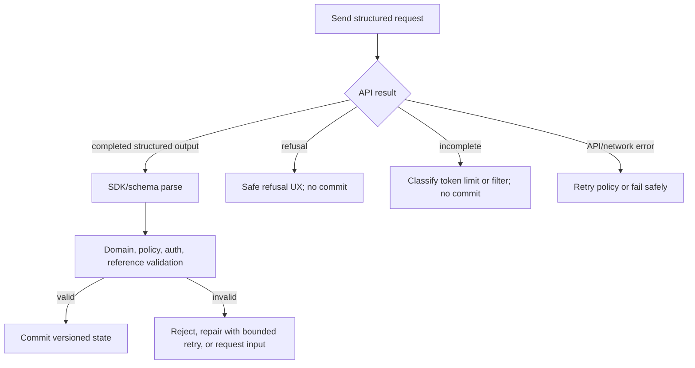
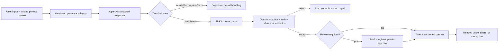

# OpenAI Structured Outputs Guide — Comprehensive Analysis

## Report scope

This report analyzes OpenAI's official [Structured model outputs](https://developers.openai.com/api/docs/guides/structured-outputs) guide, read on July 16, 2026. It covers the purpose of Structured Outputs, API and SDK integration, the distinction between structured response text and function calling, the supported JSON Schema subset, refusals and incomplete responses, streaming, JSON mode, operational failure handling, and implications for CreativeOS.

The documentation is a dated snapshot. Model availability, SDK helper names, limits, fine-tuning support, and the exact JSON Schema subset can change. The guide's examples currently use models including `gpt-5.6`, while Structured Outputs support begins with compatible GPT-4o-era and later models. A production integration should check the current model page and run a schema-compatibility test before deployment.

## Executive summary

Structured Outputs constrains a successful model response to a developer-supplied JSON Schema. This turns the model/application boundary from “ask for JSON and hope the shape is right” into an explicit contract: required fields are present, types and supported constraints conform, undeclared keys are excluded, and the result can be parsed into application types. The official JavaScript and Python SDKs integrate this contract with Zod and Pydantic respectively.

The feature has two distinct uses. Use **function calling** when the model needs to request an application action, query a tool, or interact with application data. Use a structured **text format** when the model's final answer itself must be an object consumed by the application. The schemas may look alike, but their trust implications differ: tool arguments are a proposed action that still needs authorization and business validation; structured response text is data that still needs semantic validation before it becomes durable state.

Structured Outputs guarantees structure only for the successful structured-output branch. The application must separately handle a model refusal, an incomplete response caused by token limits or content filtering, API/network errors, and SDK parsing failures. A refusal is intentionally outside the requested schema. Streaming consumers must not commit partial objects as completed business state.

The supported schema language is a subset of JSON Schema. The root must be an object and cannot be a top-level `anyOf`; every declared property must be required; optionality is represented by a union with `null`; every object must set `additionalProperties: false`; and several composition keywords are unsupported. There are also depth, property-count, string-size, and enum limits. Definitions, references, nested `anyOf`, and recursive schemas are supported when every participating schema obeys the subset.

The strongest architectural benefit is not saving a call to `JSON.parse`. It is establishing a versioned boundary shared by prompts, generated outputs, validators, tests, telemetry, and downstream code. The strongest warning is that syntactic validity is not factual validity. A perfectly conforming `SceneSpec` can still contain a nonexistent asset ID, an age-inappropriate theme, an unsupported camera instruction, or contradictory timing. CreativeOS must combine schema validation with policy, authorization, referential-integrity, range, and domain checks.

For CreativeOS, good uses include story plans, scene specifications, safety-classification decisions, asset-generation briefs, revision operations, and explicitly allowlisted UI descriptors. Schema-constrained generation should feed a staged workflow—candidate, validated, authorized, approved, committed—rather than writing model output directly into canonical project state.

## What Structured Outputs changes

Without Structured Outputs, asking for JSON can fail in several ways:

- the response is prose or Markdown around the JSON;
- a key is missing, renamed, or supplied at an unexpected level;
- a value has the wrong primitive type;
- an enum contains a novel spelling;
- extra fields appear and are accidentally trusted;
- the output is truncated and therefore unparsable; or
- a refusal is mistaken for the requested record.

JSON mode addresses only part of this problem: it generally produces syntactically valid JSON, not a value that matches a particular schema. Structured Outputs uses constrained generation to make the successful response conform to the supplied supported schema. The guide highlights three direct benefits:

1. **Type safety:** fewer validation-driven retries and clearer downstream types.
2. **Programmatic refusals:** the application can distinguish a refusal from the structured result.
3. **Simpler prompting:** the schema carries format requirements that otherwise have to be described and maintained in prose.

This is a boundary guarantee, not an application-completeness guarantee. The feature does not establish:

- whether a claim is factual;
- whether a selected entity exists in CreativeOS;
- whether the current user may access that entity;
- whether a proposed tool call should execute;
- whether two fields are mutually consistent unless supported constraints fully encode that rule;
- whether the content is appropriate for a particular child;
- whether a generated UI tree is safe to render; or
- whether committing the result preserves transactional invariants.

The correct mental model is **well-formed untrusted data**.

## Selecting the integration surface

### Function calling

Function calling is for model-to-application interaction. A function definition names an operation, describes it, and supplies a schema for arguments. With strict schema adherence, the model can produce conforming arguments, but the application owns execution.

Examples for CreativeOS include:

- `get_project_context(project_id)`;
- `list_approved_character_assets(story_id)`;
- `create_story_draft(input)`;
- `request_image_preview(scene_id, brief)`; and
- `save_revision(parent_version_id, operations)`.

Strict arguments do not make these calls trustworthy. Before executing, the server must authenticate the caller, resolve tenant/project scope from trusted context, authorize the operation, validate referenced IDs, enforce quotas and child-safety policy, make mutations idempotent, and record an auditable result.

The model should not be allowed to choose authoritative tenant IDs, owner IDs, permission levels, billing plans, or publication status. Bind those values on the server.

### Structured final responses

Use a structured response format when the model's answer itself should be data. In the Responses API this is supplied under `text.format`; in Chat Completions it is supplied as `response_format`. SDK parsing helpers return a typed/parsed value.

Examples include:

- a `StoryPlan` containing title, themes, characters, acts, and open questions;
- a `SceneSpec` consumed by image, animation, or voice pipelines;
- a `SafetyDecision` with category, disposition, confidence band, and safe user message;
- a `RevisionPlan` describing requested and preserved elements; and
- a content-extraction record from a parent-provided brief.

The model returns a candidate record. The application should not treat receipt of the parsed value as a database commit.

### Decision table

| Need | Appropriate surface | Result to validate |
|---|---|---|
| Ask the application to do something | Strict function calling | Proposed tool name and arguments, followed by authorization |
| Return typed data as the answer | Structured `text.format` / `response_format` | Parsed candidate object plus domain rules |
| Only ensure parseable JSON on an older/incompatible path | JSON mode | JSON syntax and full application schema |
| Return prose for a human | Ordinary text | Content/safety and presentation rules |

Do not use a final-response schema to disguise side effects. Conversely, do not define a fake function solely to obtain a typed final answer when the structured text surface is the natural fit.

## SDK integration

### JavaScript and Zod

The JavaScript SDK provides helpers that derive the API schema and parse results from a Zod schema. The guide shows `zodResponseFormat` for Chat Completions and `zodTextFormat` for Responses.

Conceptually, the Responses pattern is:

```ts
import OpenAI from "openai";
import { z } from "zod";
import { zodTextFormat } from "openai/helpers/zod";

const SceneSpec = z.object({
  sceneId: z.string(),
  summary: z.string(),
  characters: z.array(z.string()),
  requiresReview: z.boolean(),
});

const response = await new OpenAI().responses.parse({
  model: configuredModel,
  input: [
    { role: "system", content: scenePlanningInstructions },
    { role: "user", content: approvedStoryContext },
  ],
  text: { format: zodTextFormat(SceneSpec, "scene_spec") },
});

const candidate = response.output_parsed;
```

Chat Completions uses `chat.completions.parse(...)` and reads the parsed value from the message. Prefer native helpers because they reduce divergence between the runtime type and the schema sent to the API.

### Python and Pydantic

The Python SDK accepts Pydantic models in its parsing helpers. A Responses call uses `responses.parse(..., text_format=ModelClass)` and exposes `response.output_parsed`; Chat Completions parses into the message's parsed field.

The same design rule applies: one source of truth should generate both the schema sent to the model and the validator/type used by application code. If the JSON Schema is maintained manually, add code generation or a continuous-integration check that proves it matches the runtime model.

### REST and manual schemas

Raw REST callers supply a JSON Schema object, a schema name, and strict behavior in the appropriate request field. Manual schema construction is valid, but it creates more opportunities for drift. Validate schemas in CI, keep them as versioned source files, and test them against the exact model/API surface used in production.

### First-use schema processing

The guide notes that the first request using a new schema can incur extra processing latency. It specifically calls out a limitation for fine-tuned models in the `response_format` discussion; reuse of the same schema avoids repeated setup. Operationally:

- keep schema names and definitions stable for a released version;
- avoid generating a unique schema per request;
- warm critical schemas before a latency-sensitive launch if the current API permits it;
- measure cold and warm latency separately; and
- deploy a new schema version intentionally rather than silently mutating an existing contract.

## Supported JSON Schema subset

Structured Outputs supports a defined subset rather than arbitrary JSON Schema. The reviewed guide lists these base types and constructs:

- string;
- number;
- integer;
- boolean;
- object;
- array;
- enum;
- `anyOf` in allowed nested positions;
- definitions and `$ref`; and
- recursive schemas.

Supported constraints in the current general-model path include:

| Type | Documented constraints |
|---|---|
| String | `pattern`; formats including `date-time`, `time`, `date`, `duration`, `email`, `hostname`, `ipv4`, `ipv6`, and `uuid` |
| Number/integer | `multipleOf`, `maximum`, `exclusiveMaximum`, `minimum`, `exclusiveMinimum` |
| Array | `minItems`, `maxItems` |
| Object | Declared `properties`, required fields, and `additionalProperties: false` |

The guide says the string, numeric, and array constraint support described there is not yet available for fine-tuned models. Fine-tuned models additionally do not support the listed string length/pattern/format, numeric, object `patternProperties`, and array item-count keywords. Treat model family as part of schema compatibility.

### Root object rule

The root must be an object. It cannot be a top-level `anyOf`. This matters for Zod discriminated unions, which can emit a root `anyOf` and therefore produce an invalid Structured Outputs schema.

Instead of a top-level union such as success versus failure, define one root object with a discriminant and nullable payload fields, or place an `anyOf` under a required property. Application-level failure states such as refusals should still use the API's explicit refusal branch rather than being forced into the business schema.

### All fields are required

Every field and function parameter must appear in `required`. A field that is logically optional should still be required but allow `null`, for example:

```json
{
  "type": "object",
  "properties": {
    "subtitle": { "type": ["string", "null"] }
  },
  "required": ["subtitle"],
  "additionalProperties": false
}
```

This distinguishes an explicit “no subtitle” value from a missing field. Application code should preserve that distinction rather than stripping nulls before validation.

### Closed objects

Every object must set `additionalProperties: false`. The model can generate only declared keys. This should be applied recursively, including objects inside arrays and definitions.

Closed objects improve compatibility and prevent accidental trust in novel fields, but do not provide authorization. An allowed key such as `projectId` can still contain a project the caller is not allowed to access.

### Size and complexity limits

The current guide states:

- at most **5,000 object properties** across the schema;
- at most **10 levels of nesting**;
- at most **120,000 characters** total across property names, definition names, enum values, and const values;
- at most **1,000 enum values** across all enum properties; and
- when one string enum has more than 250 values, at most **15,000 characters** across that enum's values.

Large domain vocabularies usually should not become enormous enums. Retrieve a scoped set of valid choices, pass human-readable context, and resolve/validate stable IDs server-side. A giant schema increases latency, maintenance cost, and the chance that a model-selected identifier is treated too authoritatively.

### Key ordering

Output keys follow the ordering in the schema. This can make snapshots and streams easier to read, but consumers should not depend on object-key order for business semantics. JSON objects remain named records; order-sensitive data belongs in arrays.

### Unsupported composition

The documented unsupported composition keywords include:

- `allOf`;
- `not`;
- `dependentRequired`;
- `dependentSchemas`;
- `if`, `then`, and `else`.

Supplying an unsupported schema with strict behavior results in an API error. This is a deployment/configuration failure, not a model-quality failure; detect it in automated tests before production.

### `anyOf`, definitions, and recursion

Nested `anyOf` is supported only when every branch is itself valid under the subset. Definitions under `$defs` and references are supported, which lets shared records be defined once. The guide also demonstrates both root recursion with `$ref: "#"` and explicit recursive definitions—for example, a recursive UI component or linked-list node.

Recursion should be bounded in the product even when the schema supports it. A recursive UI or story tree needs application limits for actual node count, rendered depth, string length, and resource cost. The schema's maximum definition depth is not a substitute for validating the generated instance.

## Schema design practices

### Use names and descriptions as instructions

The guide recommends clear key names, useful titles, and descriptions. Schema metadata is part of the model's task specification. Prefer domain-specific names:

- `preserved_story_facts` instead of `items`;
- `requires_caregiver_review` instead of `flag`;
- `source_asset_id` instead of `id`; and
- `safe_user_message` instead of `message`.

Descriptions should say what a value means, its units, whether it is copied or inferred, and what to do when the information is unavailable. Do not hide critical policy only in a field description; repeat important behavioral constraints in developer instructions and enforce them in code.

### Encode absence explicitly

Because every field is required, choose an explicit absence representation:

- `null` when “not present/not applicable” is meaningful;
- an empty array when the result is a known empty collection;
- a status enum plus nullable value when provenance matters; or
- an explicit incompatibility/result state when the user request does not fit the schema.

Avoid magic strings such as `"N/A"` unless they are a deliberate enum value. They blur the distinction between real text and absence.

### Define behavior for incompatible input

The guide warns that if user input is unrelated to the schema, the model may hallucinate values simply to satisfy required fields. The prompt should explicitly say how to represent incompatible, missing, or unanswerable input—for example, a root `status` of `insufficient_context` with nullable content and a list of missing fields.

This design is particularly important for extraction. A schema can compel a syntactically complete record even when the source never states the requested facts.

### Version the contract

Treat schemas as API contracts:

- assign a stable schema name and application version;
- store the schema version with every generated artifact;
- make additive and breaking changes explicit;
- retain readers/migrations for durable old data;
- pin SDK/model versions where reproducibility matters;
- compare generated schema to a checked-in snapshot in CI; and
- monitor unknown refusal/incomplete/error variants defensively.

Changing a field description can change behavior even if the JSON shape stays the same. Prompt/schema versioning should therefore cover semantic changes, not only type changes.

## Refusals, incomplete output, and errors

### Refusals are outside the schema

For safety reasons, a model may refuse a request. A refusal does not have to match the supplied business schema. The SDK/API exposes a separate refusal field or refusal content item so the application can render or route it explicitly.

Do not:

- parse refusal prose as the requested object;
- retry the same unsafe request automatically;
- hide the refusal inside a generic parser error;
- fabricate an empty business object; or
- commit partial state before the refusal is known.

A user-facing product can display a concise safe explanation and offer an allowed next step. Developer telemetry should distinguish model refusal from content-filter interruption, schema/configuration error, timeout, and application validation failure.

### Incomplete responses

Responses can be incomplete because maximum output tokens were reached or content filtering interrupted generation. Chat Completions exposes corresponding finish reasons such as length or content filtering. These branches are not successful structured objects even if some bytes happen to parse.

The safe state machine is:



A token-limit response may justify a bounded retry with a smaller task or larger configured output budget. A content-filter interruption should not be blindly retried. API errors should follow status-specific retry and idempotency rules. Schema-configuration errors should alert developers rather than consume a model retry loop.

### Semantic mistakes

The guide explicitly notes that Structured Outputs can still contain mistakes. When values are consistently wrong:

- strengthen developer instructions;
- add focused examples;
- clarify schema names/descriptions;
- reduce task ambiguity;
- supply authoritative context;
- split a complex task into inspect, propose, and validate stages; and
- build evals for the actual error mode.

Do not respond to semantic errors by merely adding more syntactic constraints if the constraint language cannot express the relevant business rule.

## Streaming structured output

The SDK can stream structured responses and expose events for output text, refusals, errors, and completion. It can also help parse structured response fields or tool arguments incrementally.

Streaming improves perceived latency and can power previews such as a scene outline appearing step by step. It creates a crucial state distinction:

- **provisional:** bytes or fields observed during the stream;
- **complete:** the response reached its successful terminal state;
- **validated:** the complete object passed schema and domain validation; and
- **committed:** the application persisted it as canonical state.

Only the last two states should drive irreversible work. Do not start image generation, send notifications, publish a story, or execute a tool because an early streamed field appeared valid. A later refusal, filter interruption, truncation, or changed value can invalidate the partial object.

For UI previews, clearly mark streaming content as being generated, render it defensively, and replace or discard it on terminal status. Buffer tool arguments until the complete tool call has been received and authorized.

## Structured Outputs versus JSON mode

| Property | Structured Outputs | JSON mode |
|---|---|---|
| Produces valid JSON on successful branch | Yes | Yes, subject to documented edge cases |
| Enforces a supplied schema | Yes, supported subset | No |
| Typed SDK helpers | Yes | Application parses/validates |
| Recommended when supported | Yes | Fallback/legacy use |
| Explicit JSON instruction required | Schema supplies intent | Yes; context must explicitly mention JSON |
| Application domain validation | Still required | Required, plus complete schema validation |

Chat Completions enables JSON mode with `response_format: { type: "json_object" }`; Responses uses `text.format: { type: "json_object" }`. Function calling turns JSON mode on for function arguments, but strict Structured Outputs behavior depends on the function schema/configuration.

The guide warns that JSON mode requires an explicit instruction to produce JSON. Without it, the model can emit whitespace until the token limit; the API checks for “JSON” in the context to reduce this mistake. Applications must still detect truncated output, refusals, content-filter stops, stop-token interactions, and network/API errors.

If JSON mode is unavoidable, parse and validate against a local schema, classify errors, and apply only a bounded repair retry. Never use “it parsed” as the criterion for accepting a record.

## Security and integrity model

### Schema validation is not authorization

A strict tool schema such as:

```json
{
  "project_id": "project-owned-by-someone-else",
  "action": "publish"
}
```

can be perfectly valid. Resolve the authenticated principal independently and authorize every object reference/action. Prefer tool definitions where the model supplies intent-level parameters while trusted server context supplies ownership and permission fields.

### Prevent indirect prompt injection

Text placed in model context—uploaded documents, retrieved story notes, webpage content, or prior model output—can contain instructions. Structured Outputs may make maliciously influenced output well-formed; it does not make the influence benign.

- separate trusted developer instructions from untrusted content;
- mark retrieved data as data, not commands;
- minimize tool authority;
- allowlist tool names and argument values;
- require confirmation for consequential actions;
- validate references against the current user's scope; and
- keep credentials/secrets out of model-visible context.

### Generated UI is code-adjacent data

The guide uses recursive UI generation as an example. A schema-conforming UI tree must not map arbitrary tags, properties, URLs, event handlers, HTML, or styles directly to a browser DOM. CreativeOS should:

- allowlist inert component types;
- map symbolic action IDs to predefined handlers;
- reject raw event-handler source;
- sanitize and constrain text/URLs;
- cap depth, nodes, and payload size;
- enforce accessible labels and keyboard behavior; and
- render through controlled components, never `innerHTML`.

The schema reduces shape ambiguity but does not make generated interface definitions executable-trustworthy.

### Privacy and logging

Structured records are easy to log, which increases the risk of retaining child data, story content, names, or model-derived sensitive classifications. Define per-field data classification, redact telemetry, minimize prompts and outputs retained in general logs, separate safety/audit records by access policy, and honor deletion/retention requirements. Schema names and versions are often sufficient for operational metrics; full content usually is not.

## Evaluation and testing strategy

### Schema-level tests

For every production schema:

- verify it is accepted by the exact endpoint/model;
- snapshot the JSON Schema produced by Zod/Pydantic;
- assert the root object rule;
- assert every property is required;
- assert every object closes additional properties;
- count nesting, properties, enum entries, and total schema strings;
- test nullable optional fields;
- test nested union and recursive cases if used; and
- ensure fine-tuned-model constraints are compatible.

### Response-state tests

Exercise the application handlers for:

- completed and parsed output;
- refusal;
- max-output-token truncation;
- content-filter interruption;
- invalid/unsupported schema;
- rate limits and transient server errors;
- client timeout after the server may have completed;
- malformed/unexpected SDK data; and
- stream disconnect before completion.

Each non-success path should prove that no partial mutation occurred.

### Semantic evals

Build a labeled corpus from actual CreativeOS workflows. Useful metrics include:

- source-grounded field accuracy;
- contradiction rate between fields;
- entity/reference resolution rate;
- preservation of user-requested story facts;
- age-appropriateness classification performance;
- correct abstention/insufficient-context rate;
- tool-selection and argument correctness;
- unauthorized-reference rejection rate;
- valid repair rate after domain rejection; and
- end-to-end task success, latency, and cost.

Schema compliance is expected to be near-binary on the successful branch and therefore is not an adequate product-quality score by itself.

### Compatibility tests

Run a small contract suite whenever changing:

- model snapshot or alias;
- OpenAI SDK version;
- Zod/Pydantic version;
- endpoint surface;
- prompt/developer instructions;
- schema structure or descriptions; or
- streaming/event handling.

Keep recorded fixtures for application parsing, but do not rely only on mocks. A pre-release live canary should verify that the provider accepts the actual schema.

## Recommended CreativeOS contracts

### Story plan

A useful `StoryPlanV1` might contain:

- `title`;
- `audience_age_band` as an application-approved enum;
- `themes`;
- `characters` with temporary planning IDs;
- `acts` and scene summaries;
- `preserved_user_facts`;
- `open_questions`;
- `safety_review_topics`; and
- `status`, such as `ready` or `needs_input`.

Do not let the model determine verified age, account status, or publication permission. Those come from trusted product state.

### Scene specification

A `SceneSpecV1` can coordinate image, voice, and animation pipelines:

- stable application-issued scene ID;
- narrative purpose and visible action;
- referenced character/setting asset IDs;
- dialogue lines and speaker IDs;
- visual composition and style tokens from allowlists;
- duration target with application range validation;
- continuity facts that must be preserved;
- negative constraints;
- provenance/source revision; and
- review requirements.

The server must verify that every referenced asset belongs to the project and that the selected style, duration, and output mode are supported.

### Safety decision

A safety classifier result could contain:

- disposition enum such as allow, transform, escalate, or block;
- policy category enum;
- age-context band from trusted input, not inferred identity;
- short evidence spans or reasons;
- safe user-facing response;
- recommended product action; and
- `needs_human_review`.

This record should support—not replace—the application's safety stack. Do not expose internal policy reasoning unnecessarily, and do not use model-generated confidence as calibrated probability without evaluation.

### Revision plan

For editing a story or image, return operations rather than a fully overwritten artifact:

- target version ID;
- requested change summary;
- elements to preserve;
- ordered operations;
- affected scene IDs;
- whether a new asset render is required; and
- unresolved ambiguities.

The application can validate the plan, show it to the user where appropriate, and apply it transactionally to a new version.

## Recommended end-to-end workflow



Important implementation properties:

1. **Trusted context is assembled server-side.** The client does not decide ownership or policy.
2. **The contract is versioned.** Prompt, schema, model, and validator versions travel with the artifact.
3. **Terminal state precedes effects.** Streaming previews never trigger durable mutations.
4. **Validation is layered.** Schema, domain, authorization, reference, safety, and cost checks are distinct.
5. **Retries are bounded and classified.** Unsafe or configuration failures are not blindly retried.
6. **Commits are atomic and idempotent.** A retry cannot duplicate a story version or asset job.
7. **Observability avoids sensitive payloads.** Record state, latency, tokens, schema/model version, validation result, and request IDs with minimized content.

## What the guide does not establish

The official guide explains the Structured Outputs mechanism and supported schema behavior. It does not provide a full production architecture for:

- authentication or tenant isolation;
- tool authorization and approval;
- domain/referential validation;
- database transactions or idempotency;
- schema registry and data migrations;
- child-specific privacy and consent;
- UI sanitization;
- factuality/grounding;
- semantic evaluation thresholds;
- application incident response; or
- retention/deletion policy.

These omissions are not defects in the API guide; they mark the responsibilities CreativeOS must add around the API boundary.

## Practical implementation checklist

### Before development

- Decide whether each result is a tool request or a structured final response.
- Define the smallest useful domain contract.
- Choose a stable model/endpoint/SDK combination.
- Decide explicit null, empty, incompatible-input, and refusal behavior.
- Identify all fields requiring trusted server binding or secondary validation.

### Schema and prompt

- Use an object root; avoid root `anyOf`.
- Mark all fields required and represent optionality with `null`.
- Set `additionalProperties: false` on every object.
- Stay inside documented limits and supported keywords.
- Give fields precise names/descriptions.
- Tell the model what to do with insufficient or incompatible input.
- Keep prompts and schemas versioned together.

### Runtime

- Use native Zod/Pydantic helpers where possible.
- Branch explicitly on refusal, incomplete, filter, and API errors.
- Buffer streams until completion for consequential actions.
- Revalidate parsed output with domain and policy rules.
- Authorize every tool call and object reference.
- Use idempotency/transaction controls for mutations.
- Bound retry count and repair scope.

### Release and operations

- Test schema acceptance against the real target model.
- Run semantic evals, not only parse tests.
- Measure cold/warm latency and token cost.
- Monitor state distribution, refusal, incompletion, validation failure, and retry rate.
- Redact sensitive child/story data from telemetry.
- Revalidate after any model, SDK, prompt, or schema change.

## Conclusion

Structured Outputs is the right default whenever CreativeOS needs model-produced data to cross into typed application code. It substantially improves reliability by making shape explicit and by providing first-class parsing and refusal handling. Its value is greatest when schemas are treated as versioned interfaces rather than disposable formatting instructions.

The safe production boundary remains broader than the JSON Schema. Successful output must be complete, parsed, semantically valid, policy-compliant, authorized, referentially sound, and intentionally committed. With that layered design, Structured Outputs can serve as the contract fabric between story planning, scene rendering, voice workflows, safety systems, asset management, and reviewable user experiences without turning model output into unexamined authority.

## Primary source

- OpenAI, [Structured model outputs](https://developers.openai.com/api/docs/guides/structured-outputs), accessed July 16, 2026.
