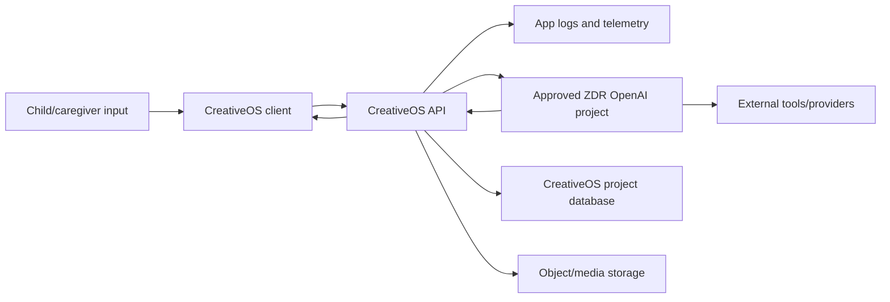
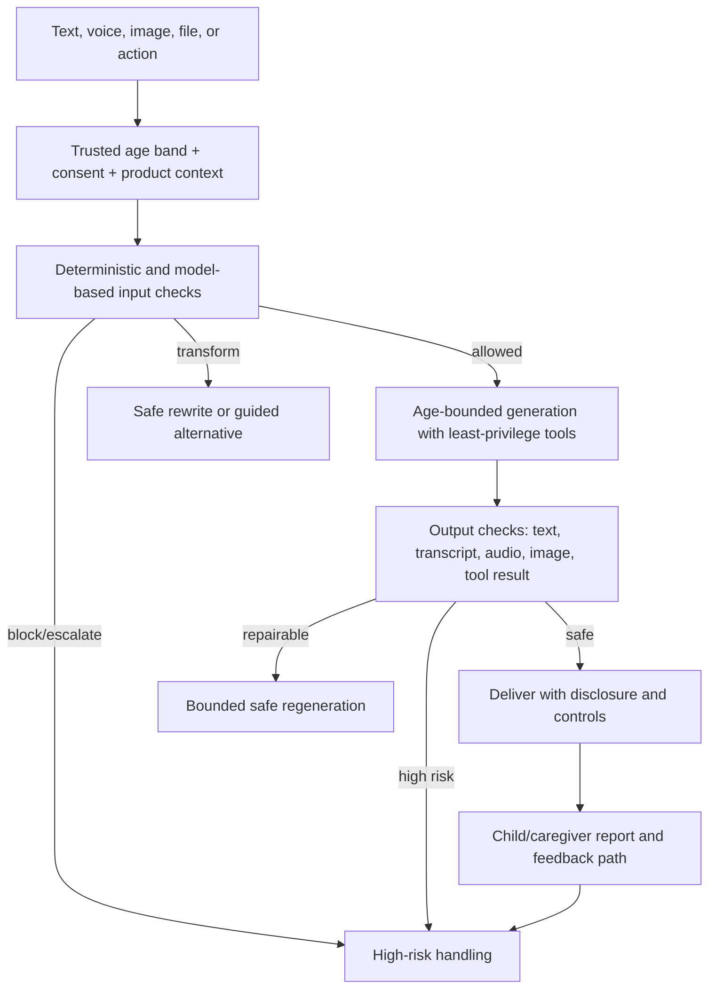
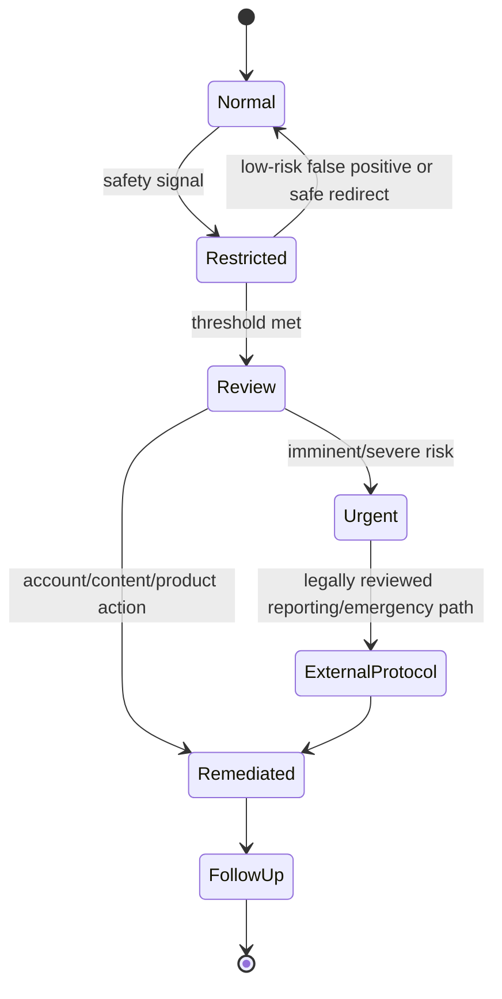

# OpenAI Under-18 API Guidance — Comprehensive Analysis

## Report scope and caution

This report analyzes OpenAI's official [Under 18 API Guidance](https://developers.openai.com/api/docs/guides/safety-checks/under-18-api-guidance), read on July 16, 2026. Because that page explicitly incorporates OpenAI's usage policies and terms, this analysis also checks the then-current official [Usage Policies](https://openai.com/policies/usage-policies/), [OpenAI Services Agreement](https://openai.com/policies/services-agreement/), and [API data controls](https://developers.openai.com/api/docs/guides/your-data) where necessary to explain the guidance's operational consequences.

This is an engineering and product analysis, not legal advice. Requirements depend on the product, users, jurisdictions, contracting entity, applicable age of digital consent, data flows, and the agreement governing the organization's account. CreativeOS should obtain qualified privacy/child-safety counsel before serving minors and should verify current OpenAI policies, contract terms, endpoint eligibility, and regulatory requirements at launch. The cited pages are living documents and can change.

## Executive summary

OpenAI's under-18 guidance says that applications serving minors need safeguards beyond ordinary API integrations. It organizes the expectation into three layers:

1. **Regulatory standards:** the organization must comply with all applicable child-protection, safety, and privacy laws, including COPPA. The page says not to process personal data of children under 13—or the applicable age of digital consent—through OpenAI services without first implementing Zero Data Retention (ZDR).
2. **Safety standards:** the organization must take reasonable steps to keep API-delivered content safe and age-appropriate under the “Keep minors safe” usage policy. The guide lists age-appropriate AI disclosures, content filters, monitoring/reporting and high-risk escalation, and age assurance where required or appropriate.
3. **Best practices:** use heightened care with minor data and interactions, use available safety tools and minor-specific technical safeguards, and use current flagship models with the latest safety protections.

The guidance places responsibility on the API customer. A safe base model, moderation endpoint, or a statement that the product is “for families” does not discharge that responsibility. CreativeOS needs its own child-specific product policy, age/consent design, data map, layered filters, high-risk response process, reporting and escalation operations, audit evidence, and controlled change management.

The contractual picture is also relevant. The Services Agreement snapshot says customers may not allow minors to use OpenAI services without parent or guardian consent, makes the customer responsible for end-user activity, and requires the customer to evaluate output accuracy and appropriateness. Which contract applies must be confirmed for the actual account; this report does not assume that one public agreement overrides an executed order form or negotiated terms.

ZDR is not a request flag an engineer can casually turn on. The data-controls guide says eligible customers require OpenAI approval and additional requirements, and eligibility/behavior varies by endpoint and capability. Under the reviewed snapshot, Responses, Chat Completions, Realtime, moderation, several audio endpoints, and supported GPT Image endpoints are listed as ZDR-eligible, while files, persistent conversations, vector stores, and some other stateful surfaces are not. Features layered onto an eligible endpoint can have their own storage behavior. CreativeOS must map every actual endpoint, tool, file, cache, log, vendor, and internal datastore rather than treating “our OpenAI project has ZDR” as a complete privacy architecture.

The central recommendation is to build CreativeOS as a **minor-aware system from account creation to deletion**, not as an adult product with a moderation call attached. Trusted age band and consent state should select an approved experience profile; the server should minimize and pseudonymize context; input and output safety checks should be age-specific and multimodal; high-risk signals should enter a documented escalation state machine; public sharing and contact features should default to restrictive settings; and every safety control should be evaluated with child-development experts and real adversarial tests.

## What the OpenAI page requires and recommends

The page's language should be read carefully. It combines obligations arising from law, OpenAI policy/terms, examples of reasonable safeguards, and best-practice recommendations.

| Category | OpenAI page position | Practical consequence |
|---|---|---|
| Applicable law | Organizations serving minors must comply with applicable child-protection, safety, and privacy laws, including COPPA | Conduct jurisdiction/use-case legal analysis; document lawful basis, consent, notices, rights, and governance |
| Young-child personal data | Do not process personal data of children under 13 or the applicable digital-consent age without first implementing ZDR | ZDR approval/configuration is a launch gate for any in-scope OpenAI data flow; avoid sending personal data regardless |
| Safe and age-appropriate content | Organizations must take reasonable steps consistent with the “Keep minors safe” policy | Build layered, age-aware controls before and after generation and across text, voice, image, tools, and sharing |
| Disclosures | An example safeguard is age-appropriate explanation of AI and responsible use | Design child-readable, caregiver-readable, and contextual disclosures; do not rely on one Terms page |
| Content filters | An example safeguard is age-appropriate filtering of potentially sensitive content | Use policy classifiers, deterministic rules, prompts, post-generation review, and product restrictions |
| Monitoring/reporting | An example safeguard is monitoring and reporting with high-risk escalation paths | Operate incident queues, user reporting, severity rules, trained reviewers, SLAs, evidence, and emergency procedures |
| Age assurance | Use where legally required or otherwise appropriate | Select proportionate age/consent mechanisms based on risk; do not infer age from sensitive traits via the model |
| Heightened care | Best practice for minor data and interactions | Apply minimization, conservative defaults, stronger access control, short retention, and special incident handling |
| Current safety tools/models | Use OpenAI's relevant safeguards and current flagship models | Maintain a controlled model-update/evaluation process; “latest” does not mean untested automatic rollout |
| Audit/enforcement | OpenAI reserves audit rights; noncompliance can lead to warnings or suspension/termination | Maintain demonstrable controls and current evidence, not only policy documents |

OpenAI says the customer is solely responsible for legal compliance. That statement does not identify every applicable statute or prescribe a complete compliance program. COPPA is named, but a global product may also implicate other national/regional child privacy, online safety, consumer protection, education, biometric/voice, and reporting rules.

## Relationship to OpenAI Usage Policies

The reviewed Usage Policies have a dedicated “Keep minors safe” section. They prohibit using OpenAI services to exploit, endanger, or sexualize anyone under 18 and specifically prohibit:

- child sexual abuse material (including AI-generated material);
- grooming;
- exposing minors to age-inappropriate graphic self-harm, sexual, or violent content;
- promoting unhealthy dieting or exercise behavior to minors;
- shaming or stigmatizing minors' body type or appearance;
- dangerous challenges;
- underage sexual or violent roleplay; and
- underage access to age-restricted goods or activities.

These prohibitions are not an exhaustive description of what CreativeOS should filter. A child-oriented creative product should additionally define age bands and treatment for fear, threats, bullying, hate, harassment, parasocial dependency, manipulation, profanity, substance references, dangerous imitation, personal-data disclosure, location/contact exchange, financial solicitation, copyright/likeness issues, and emotionally intense themes.

The policies also constrain adjacent product behavior. Privacy rules prohibit certain unauthorized handling/profiling of private or sensitive information and some biometric/trait uses. “Empower people” rules prohibit manipulation/exploitation of vulnerabilities and automation of high-stakes decisions without human review. CreativeOS should not use model-derived emotion, maturity, vulnerability, or risk scores to covertly profile a child or make consequential decisions.

### CSAM and child-endangerment response

The Usage Policies say OpenAI reports apparent CSAM and child endangerment to the National Center for Missing and Exploited Children. The API data-controls page also says image/file inputs are scanned for CSAM and that potential matches may be retained for manual review even under ZDR, Modified Abuse Monitoring, or Eyes Off.

CreativeOS needs its own legally reviewed incident procedure. Engineers and ordinary support agents should not freely access, download, forward, or duplicate suspected illegal material. The procedure should specify:

- automated quarantine and access restriction;
- preservation or deletion decisions under counsel/law-enforcement/reporting rules;
- trained, limited reviewers and trauma-aware operations;
- required reports and response timelines by jurisdiction;
- separation between user-visible messaging and internal investigation;
- account/device/session actions;
- evidence and audit-log handling; and
- coordination with OpenAI or other providers where appropriate.

Do not invent reporting obligations in code without legal review, but do not wait for the first incident to define the process.

## Parent or guardian consent and age design

The reviewed OpenAI Services Agreement says customers may not allow minors to use OpenAI services without parent or guardian consent. Confirm the governing agreement and operationalize its requirement together with applicable law.

### Age assurance is a risk decision

The under-18 guide calls for age assurance where required or otherwise appropriate. It does not mandate one universal technique. Possible approaches range from age declaration to verified caregiver flows or specialized assurance providers. Each has different accuracy, inclusiveness, privacy, fraud, and security costs.

CreativeOS should start with a written risk assessment:

- Is the product directed to children, mixed-audience, school-mediated, or general-audience?
- What ages can use it and which capabilities differ by age band?
- Does it permit public sharing, voice, likeness uploads, messaging, purchases, external links, or autonomous agents?
- Which data is collected, inferred, sent to processors, or retained?
- Which jurisdictions are served?
- What harm follows from an adult entering a child area or a child entering an adult area?

Do not ask a language model to infer age from a face, voice, writing style, interests, or emotional behavior. Such inference can be inaccurate, invasive, discriminatory, and potentially inconsistent with OpenAI privacy restrictions and applicable law. Use an explicit, reviewed assurance method and store only the minimum derived result needed by the product—typically a trusted age-band/profile status, not raw identity evidence.

### Consent is a lifecycle

A checkbox is not a complete consent system. A defensible caregiver flow should cover:

- who is consenting and what relationship/authority is asserted;
- the child account or household to which it applies;
- the exact data uses, processors, features, sharing, and retention covered;
- age-appropriate notice for the child and detailed notice for the caregiver;
- verification appropriate to the risk and law;
- timestamp, policy/version, method, jurisdictional basis, and evidence;
- expiration/reconfirmation rules;
- withdrawal and resulting feature/data behavior;
- caregiver access, correction, export, and deletion channels; and
- changes that require renewed notice or consent.

The server—not the browser or model—must enforce consent state before any OpenAI request. If consent is missing, expired, or withdrawn, disable in-scope generation and process deletion/retention actions consistently.

## Zero Data Retention as an engineering gate

### What the guidance says

For children under 13 or the applicable age of digital consent, the under-18 page says personal data should not be processed by OpenAI services until ZDR has been implemented. This should be treated as a release-blocking dependency for in-scope flows, not as a future optimization.

### What ZDR means in the reviewed platform documentation

The data-controls guide distinguishes:

- **abuse-monitoring logs**, which may contain prompts, responses, or derived classifier metadata; and
- **application state**, which some API features store to provide their behavior.

By default, abuse-monitoring logs may be retained up to 30 days, with stated legal/harm-prevention exceptions. Eligible customers can apply for Modified Abuse Monitoring or ZDR. Approval and additional requirements are necessary. ZDR excludes customer content from abuse-monitoring logs in the described manner and changes some endpoint behavior, including treating `store` as false for Responses and Chat Completions.

ZDR is neither universal nor absolute in every circumstance. The guide documents:

- endpoint/capability eligibility differences;
- application-state behavior that can persist independently;
- safety-retention exceptions for severe-risk activity;
- image/file CSAM scanning and possible manual-review retention;
- third-party retention for data sent through external services/MCP;
- feature-specific storage such as audio outputs, prompt caching, background jobs, files, and stateful resources; and
- project-level configuration that may differ from the organization default.

### Endpoint implications for CreativeOS

In the July 16, 2026 snapshot:

| Surface relevant to CreativeOS | ZDR status shown | Important qualification |
|---|---|---|
| Responses | Eligible | `store` forced false under ZDR; tools, caching, audio, background mode, external services, and file/image inputs have additional behavior |
| Chat Completions | Eligible | `store` forced false; audio/caching and inputs have qualifications |
| Realtime | Eligible | Listed with no application-state retention in the table; verify the exact session/features used |
| Moderation | Eligible | Table shows no abuse-monitoring or application-state retention in the snapshot |
| Audio transcription/translation | Eligible | Table shows no default retention; verify current endpoint and inputs |
| Audio speech | Eligible | Abuse-monitoring retention applies by default absent approved controls |
| GPT Image generation/editing | Eligible for listed GPT Image families | Older DALL·E models are excluded; inputs still have CSAM scanning exceptions |
| Files | Not eligible | Files persist until deletion/expiration behavior; avoid using as a minor-data workaround |
| Conversations/items | Not eligible | Persistent application state until deletion; do not assume ZDR project setting removes it |
| Vector stores | Not eligible | Persist until deletion; unsuitable for in-scope personal data unless separately approved/legal |
| Video | Not eligible in the snapshot | Has explicit disk and abuse-monitoring retention behavior |

This table must be rechecked against the live documentation and the organization's actual approved configuration. A feature appearing on an eligible endpoint is not automatically safe for every data type.

### Data-flow inventory

Before launch, build a machine-readable data inventory for each CreativeOS flow:

For every arrow, record data categories, purpose, lawful/consent basis, region, processor/subprocessor, encryption, access roles, retention, deletion mechanism, incident owner, and whether direct identifiers can be removed. ZDR addresses OpenAI-side handling; it does not minimize CreativeOS databases, logs, analytics, crash reports, content-delivery networks, or third-party tools.

### Minimize before transmission

Even with ZDR:

- replace account IDs with rotating or scoped pseudonymous identifiers;
- avoid real names, exact birthdates, addresses, school names, contact details, or precise location in prompts;
- summarize only the relevant story context;
- strip file metadata and hidden content where appropriate;
- avoid sending entire chat histories when a safe summary suffices;
- separate caregiver/administrative data from creative context;
- prohibit secrets and credentials in model context;
- set endpoint storage controls explicitly; and
- avoid persistent OpenAI resources for personal data unless their retention is specifically approved.

Pseudonymization is not anonymization when CreativeOS can reconnect the identifier to the child. It is still a useful security and minimization measure.

## Age-appropriate disclosure and AI literacy

The guide calls for age-appropriate explanation of AI tools and responsible use. This is a product interaction, not just a legal footer.

### Child-facing disclosure should communicate

- the character/helper is AI, not a person;
- it can make mistakes or invent details;
- the child should not share private information;
- generated images/voices/stories may not be real;
- the child can stop, report, or ask a trusted adult for help;
- important, scary, or urgent issues should go to a trusted adult or emergency service, not the story agent; and
- what happens when content is blocked or reviewed, in simple non-alarming language.

Use language and presentation tested for the target age band. Disclosure should recur contextually—for example, before first microphone use, image upload, public sharing, or a major new agent capability—not be buried in onboarding.

### Caregiver-facing disclosure should communicate

- which OpenAI endpoints/models and other processors are involved;
- what content/data is sent and retained;
- the role and limits of automated filters and human review;
- model limitations and foreseeable risks;
- sharing/publication defaults;
- reporting, contact, access, correction, export, and deletion processes;
- consent withdrawal effects; and
- material change notifications.

Avoid claiming that content is guaranteed safe. Explain controls and residual risk accurately.

## Layered content safety architecture

### Safety is an end-to-end pipeline

### Input controls

Check more than the current text string. Relevant context includes age band, interaction mode, recent turns, uploaded media, requested tool action, public/private destination, and whether another person is depicted.

Input controls can combine:

- OpenAI moderation/safety tools where supported;
- deterministic personal-data/contact/location patterns;
- child-specific policy classifiers;
- prompt-injection/tool-abuse detection;
- image/file scanning and metadata validation;
- velocity and repeated-boundary probing signals;
- consent/permission checks for voice, likeness, and uploads; and
- hard product rules for disallowed features or destinations.

A classifier score should feed a documented decision rule. It should not silently profile the child or be logged forever.

### Generation constraints

Model instructions should define the intended age band, tone, prohibited categories, safe redirection patterns, privacy reminders, relationship boundaries, and tool limitations. For live voice, also define interruption behavior and high-risk handoff language.

Use least-privilege tools. A story agent generally should not browse the open web, contact strangers, make purchases, disclose precise location, or publish publicly without a separate trusted workflow and caregiver control.

OpenAI recommends current flagship models because they include newer safety protections. CreativeOS should implement this as a controlled release policy: evaluate candidate model snapshots against child-specific safety and quality suites, canary them, monitor regressions, and retain rollback. Automatically adopting a moving alias without evaluation conflicts with reproducible safety assurance.

### Output controls

Review the final modality, not only intermediate text:

- text for disallowed or developmentally inappropriate content;
- image pixels as well as revised prompts/captions;
- synthesized audio/transcripts for content and identity/likeness issues;
- tool results and retrieved content from external sources;
- structured outputs for domain/safety fields and contradictory values; and
- full assembled stories, where individually safe scenes can combine into an unsafe arc.

For Realtime, a post-response check that occurs after audio is played is too late. Use model instructions, realtime guardrail patterns, constrained tools, short response chunks, server-side monitoring, interruption/cutoff capability, and conservative product scope. The reviewed repositories demonstrate mechanisms, but CreativeOS still must define and evaluate the policy.

### Safe transformations

Not every sensitive theme requires a cold refusal. Age-appropriate design can redirect toward safe creative alternatives—for example, replacing graphic injury with a non-graphic rescue, removing sexualization, or converting a dangerous challenge into an obviously fantastical harmless puzzle. Transformations must preserve the child's legitimate creative intent without normalizing the disallowed behavior.

For high-risk personal disclosures, do not bury the signal inside story generation. Switch to the approved support/escalation response.

## Monitoring, reporting, and high-risk escalation

The guidance explicitly calls for reasonable monitoring/reporting and escalation paths for high-risk interactions. This means having people, procedures, and accountable response times—not just collecting logs.

### Define a risk taxonomy

At minimum, distinguish:

- imminent self-harm or danger;
- child sexual exploitation, grooming, or suspected abuse;
- threats/violence;
- severe bullying/harassment;
- eating-disorder or dangerous-challenge promotion;
- sexual or graphic content involving minors;
- attempts to exchange contact/location information;
- adult impersonation or manipulation;
- compromised account/consent;
- privacy or data exposure;
- unsafe generated output; and
- false-positive/user appeal.

Each category should have severity criteria, automated action, user message, reviewer role, target response time, legal/reporting decision owner, preservation rules, notification path, and closure evidence.

### High-risk state machine

The model must not be the sole decision-maker for contacting authorities, accusing a user, or making high-stakes determinations. Use trained human review where needed and legally reviewed deterministic protocols.

### User reporting

Provide reporting controls that a child can find and understand, plus caregiver channels. Reports should allow users to indicate unsafe AI content, another user's behavior, privacy concerns, or a mistaken block. Acknowledge receipt without promising an outcome the team cannot deliver. Protect reporters from retaliation and minimize report detail exposed to other users.

### Monitoring without surveillance

“Monitoring” does not mean unrestricted human reading of children's creative work. Use data minimization, narrowly scoped automated signals, role-based review, case-triggered access, strong audit logs, short retention, and documented necessity. Publish an accurate explanation of review practices. Assess whether monitoring itself requires consent or creates additional legal obligations.

## Voice, image, and collaborative-story risks

### Voice agents

Voice feels interpersonal and can increase trust, disclosure, and emotional attachment. CreativeOS should:

- identify the voice as AI;
- avoid claiming feelings, consciousness, exclusivity, or a secret relationship;
- never ask the child to hide interactions from caregivers;
- avoid dependency cues such as guilt when the child leaves;
- keep sessions time-bounded with clear stop/mute controls;
- treat transcripts/audio as sensitive data;
- prevent unauthorized voice cloning or confusing impersonation;
- make tools server-authorized; and
- interrupt or end unsafe audio promptly.

### Image generation and editing

- disallow sexualized, exploitative, or age-inappropriate depictions of minors;
- obtain valid permission for reference images and likenesses;
- avoid unnecessary real-child photos; use fictional avatars/assets by default;
- strip metadata and limit retention;
- review generated pixels, not only the prompt;
- prevent deceptive photorealistic impersonation;
- restrict public sharing and downloads by age/profile; and
- handle CSAM signals under the dedicated incident procedure.

### Collaborative storytelling

Story systems accumulate context and can gradually drift beyond a single safe prompt. Validate the evolving canon, scene transitions, character ages/relationships, and full compiled work. Prevent an adult/unknown collaborator from steering a child's private session toward contact, grooming, sexualization, or violence. Public/community features need identity, contact, messaging, moderation, discovery, and reporting controls independent of generation safety.

## Data governance beyond OpenAI

### Data categories to treat with heightened care

- name, username, birthdate/age, school, location, contact information;
- caregiver and household relationships;
- voice recordings, photos, avatars, and likeness data;
- private story text that reveals experiences or emotional state;
- safety classifications, reports, and reviewer notes;
- device, network, behavioral, and usage metadata;
- consent/verification evidence; and
- generated inferences about the child.

Avoid generating or retaining sensitive inferences merely because they might personalize a story. Personalization should use explicit, benign preferences with user/caregiver controls.

### Retention and deletion

Define purpose-limited retention per record type. Creative drafts, moderation events, consent evidence, security logs, and legally preserved incident records need different schedules and access rules. Implement deletion across primary data, media derivatives, search indexes, caches, backups on a defined schedule, analytics, and processors. Test deletion end to end.

When a caregiver withdraws consent, determine which processing stops immediately, how the child experience changes, what data is deleted, and what narrow records must be retained for legal/security reasons. Communicate the outcome accurately.

### Access control and tenant isolation

- derive household/project scope on the server;
- use least-privilege roles for child, caregiver, teacher/operator, support, and safety reviewer;
- require stronger authentication for caregiver settings, export, deletion, and sharing;
- separate safety-case access from ordinary support;
- log administrative access and policy changes;
- protect media with scoped, short-lived URLs; and
- test object-level authorization on every story, asset, transcript, and report.

## Evidence and audit readiness

OpenAI reserves the right to audit compliance and may warn, suspend, or terminate customers for serious or repeated failure. CreativeOS should be able to demonstrate controls through evidence such as:

- current data-flow diagrams and processing inventory;
- applicable-law/contract assessment and owners;
- ZDR approval and project-level configuration evidence;
- endpoint/capability retention review;
- age-assurance and consent specifications;
- child/caregiver notices with version history;
- safety taxonomy and decision tables;
- input/output filter evaluation results by age band and modality;
- red-team plans, findings, fixes, and regression tests;
- model/prompt/schema release records;
- escalation runbooks, training, on-call schedule, and case metrics;
- access reviews and audit logs;
- incident reports and corrective/preventive actions;
- retention/deletion tests; and
- third-party/subprocessor diligence.

Evidence should prove that controls run, not only that a policy document exists. Metrics should be privacy-preserving and reviewed for perverse incentives; optimizing solely for fewer escalations can suppress detection.

## Evaluation and red teaming

### Test populations and age bands

Use child-development, safety, privacy, accessibility, and cultural expertise. Do not expose minors to unsafe untested prototypes as red-team labor. Adults and qualified specialists can simulate age-band language and adversarial patterns; any research involving minors needs appropriate ethical, consent, and safeguarding review.

### Scenario families

- direct and obfuscated requests for sexual, violent, self-harm, substance, or dangerous content;
- fictional framing and roleplay involving underage characters;
- gradual multi-turn escalation;
- grooming/contact/location exchange;
- “keep this secret” and relationship manipulation;
- body image, dieting, exercise, and appearance shame;
- bullying, hate, and identity-targeted content;
- image prompt versus generated-pixel divergence;
- voice interruption and unsafe speech already in flight;
- prompt injection through uploaded/retrieved story content;
- tool calls attempting publication, messaging, purchases, or data access;
- age/consent bypass and account sharing;
- public-sharing discovery and reporting abuse;
- multilingual, slang, misspelling, emoji, and coded language;
- false positives on legitimate educational or therapeutic themes; and
- accessibility paths and low-literacy disclosure comprehension.

### Metrics

- severe unsafe-content exposure rate;
- correct block, transform, and escalation rates;
- time/audio duration until unsafe output cutoff;
- high-risk false-negative rate;
- false-positive and successful-appeal rate;
- privacy leakage and unauthorized reference rate;
- personal-data solicitation rate;
- tool authorization failure rate;
- child/caregiver disclosure comprehension;
- report discoverability and resolution time;
- reviewer agreement and escalation SLA compliance; and
- regression by age band, language, modality, and model version.

Set release-blocking thresholds for severe categories and require explicit risk acceptance for residual issues.

## CreativeOS recommended rollout gates

### Gate 1: product and legal definition

- Define target ages, countries, school/household distribution, and allowed features.
- Confirm governing OpenAI agreement and legal obligations.
- Appoint accountable product, privacy, safety, security, and incident owners.
- Decide whether the product can safely serve each age band at all.

### Gate 2: consent and data architecture

- Implement proportionate age assurance and caregiver consent.
- Secure OpenAI ZDR approval before any in-scope young-child personal-data processing.
- Use a dedicated, verified project/configuration.
- Inventory all endpoints, features, tools, processors, logs, and retention.
- Remove or pseudonymize unnecessary personal data.
- Build access, deletion, export, and consent-withdrawal workflows.

### Gate 3: safety system

- Write an age-banded multimodal policy.
- Implement pre-generation, generation-time, post-generation, sharing, and tool controls.
- Add child/caregiver reporting and high-risk escalation.
- Train reviewers and test incident runbooks.
- Define safe degradation when a classifier/provider is unavailable.

### Gate 4: evaluation

- Run safety, privacy, security, and authorization test suites.
- Red-team multi-turn text, voice, image, structured-output, and collaborative flows.
- Validate notices and controls with accessibility and child-development expertise.
- Test ZDR/configuration and deletion behavior with evidence.
- Establish blocking thresholds and rollback.

### Gate 5: limited launch

- Start with a narrow age range and capability set.
- Disable public sharing, external messaging, purchases, and open-web tools unless independently justified.
- Canary one evaluated model/prompt version.
- Staff monitoring/escalation before traffic arrives.
- Review leading indicators daily and expand only after evidence supports it.

### Gate 6: ongoing governance

- Recheck OpenAI policies, agreements, models, endpoints, and retention controls on a scheduled cadence.
- Re-evaluate every material feature/model/provider change.
- Conduct access and deletion audits.
- Analyze incidents and near misses without retaining unnecessary child content.
- Maintain caregiver/child communication and consent for material changes.

## Failure patterns to avoid

### “The moderation endpoint makes us compliant”

Moderation is one technical control. It does not provide consent, age assurance, disclosure, high-risk operations, data minimization, output review across modalities, legal reporting, or audit evidence.

### “We do not ask for a real name, so no personal data is processed”

Free-form stories, voice, images, location references, identifiers, and interaction metadata can be personal data. Inventory what users actually send and what systems infer.

### “ZDR means no data exists anywhere”

ZDR is an approved OpenAI data-control configuration with endpoint and safety exceptions. CreativeOS and third parties still store data, and some OpenAI features are ineligible or create application state.

### “The newest model can go straight to production”

Newer flagship models may improve safety, but changes can also alter behavior. Evaluate, canary, monitor, and retain rollback while keeping protections current.

### “A child clicked the age box”

Age assurance and verifiable/appropriate caregiver consent depend on risk and law. A self-declaration may be insufficient and is vulnerable to bypass.

### “We can monitor everything just in case”

Overcollection creates privacy and security harm. Use targeted signals, restricted case access, purpose limitation, and short retention.

### “The story is fictional, so safety rules do not apply”

The Usage Policies explicitly cover underage sexual or violent roleplay, and fiction can still expose or normalize harmful content. Age-appropriate creative transformation remains possible within clear boundaries.

### “The AI can decide when to call emergency services”

Emergency/reporting actions are consequential and jurisdiction-sensitive. Use legally reviewed protocols and human involvement rather than autonomous model judgment.

## Practical implementation checklist

### OpenAI account and configuration

- [ ] Confirm the agreement and current policies that govern the production account.
- [ ] Obtain ZDR approval before in-scope young-child personal-data processing.
- [ ] Verify organization and project retention settings.
- [ ] Verify every endpoint, model, tool, and feature for ZDR eligibility and application state.
- [ ] Set `store: false` explicitly where applicable, even when ZDR enforces it.
- [ ] Use current evaluated flagship models and pin/release versions deliberately.
- [ ] Set stable pseudonymous safety identifiers where supported and appropriate.
- [ ] Keep production keys server-side and isolate child-serving projects.

### Identity, age, and consent

- [ ] Define supported age bands and capability matrix.
- [ ] Implement proportionate age assurance without model-based sensitive inference.
- [ ] Obtain and version caregiver consent under the governing requirements.
- [ ] Enforce consent server-side before API calls.
- [ ] Provide child- and caregiver-appropriate notices.
- [ ] Support withdrawal, access, correction, export, and deletion.

### Safety controls

- [ ] Maintain an age-banded, multimodal content policy.
- [ ] Check text, voice/transcripts, images, files, tool calls, and assembled stories.
- [ ] Constrain prompts, tools, external retrieval, sharing, and collaboration.
- [ ] Implement safe transformation, refusal, and high-risk responses.
- [ ] Provide visible reporting and appeal paths.
- [ ] Staff escalation with severity rules, SLAs, and trained reviewers.
- [ ] Maintain a legally reviewed CSAM/child-endangerment procedure.

### Privacy and security

- [ ] Minimize identifiers and story context sent to OpenAI.
- [ ] Map all processors and storage, including logs and third-party tools.
- [ ] Apply least privilege and object-level authorization.
- [ ] Encrypt data and use scoped media access.
- [ ] Define record-specific retention and test deletion.
- [ ] Restrict and audit human access to child content and safety cases.
- [ ] Maintain incident response and breach-notification procedures.

### Evaluation and operations

- [ ] Run child-specific adversarial tests across all supported modalities/languages.
- [ ] Define severe-category release gates and rollback.
- [ ] Test classifier/provider outages and safe degradation.
- [ ] Monitor privacy-preserving safety and operational metrics.
- [ ] Reassess controls on model, prompt, feature, jurisdiction, or policy changes.
- [ ] Keep evidence suitable for internal and OpenAI audit.

## What the guide does not specify

The Under 18 API Guidance is a high-level policy/engineering direction. It does not determine:

- the laws or age threshold applicable to a specific user;
- what exact consent/age-assurance method is sufficient;
- whether a particular CreativeOS data item is personal data;
- which child-safety categories and thresholds fit each age band;
- an emergency, mandatory-reporting, or law-enforcement procedure;
- how to operate human review;
- how to design community/messaging features;
- the full privacy/security architecture of the customer application;
- whether the organization is eligible for ZDR; or
- whether every desired endpoint/tool can be used under ZDR.

These questions require product-specific engineering, policy, safety, privacy, security, and legal decisions.

## Conclusion

OpenAI's under-18 guidance makes child safety a system-level customer responsibility. The minimum credible CreativeOS posture combines verified contract/policy compliance, proportionate age and caregiver-consent controls, ZDR as a gate for relevant young-child personal data, strict minimization, age-appropriate disclosure, layered multimodal filtering, least-privilege product scope, report/escalation operations, and evidence-backed continuous evaluation.

The most important architectural consequence is that age/consent, safety, and retention cannot be bolted onto the generation endpoint. They must shape which features are available, what context can be sent, which tools can run, how outputs are checked, when humans intervene, how data is retained or deleted, and how each release is evaluated. For a child-centered creative system, this governance layer is part of the core product—not ancillary compliance work.

## Primary and supporting official sources

- OpenAI, [Under 18 API Guidance](https://developers.openai.com/api/docs/guides/safety-checks/under-18-api-guidance), accessed July 16, 2026.
- OpenAI, [Usage Policies](https://openai.com/policies/usage-policies/), effective October 29, 2025; accessed July 16, 2026.
- OpenAI, [OpenAI Services Agreement](https://openai.com/policies/services-agreement/), effective January 1, 2026; accessed July 16, 2026.
- OpenAI, [Data controls in the OpenAI platform](https://developers.openai.com/api/docs/guides/your-data), accessed July 16, 2026.
